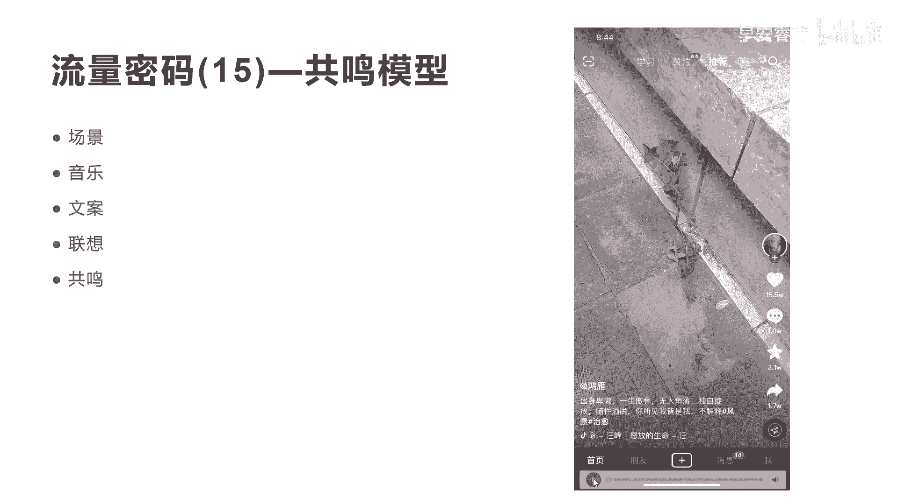
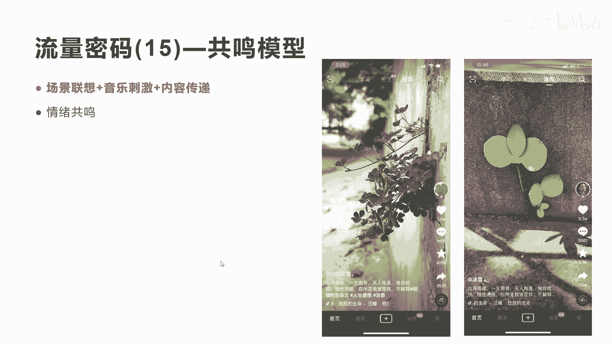
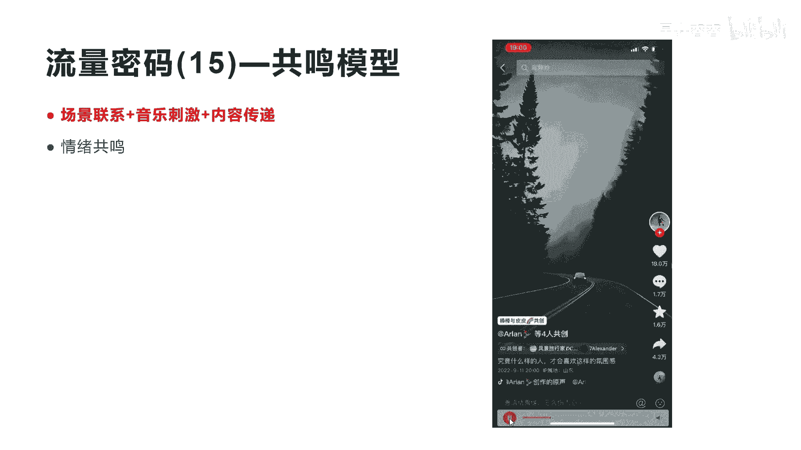
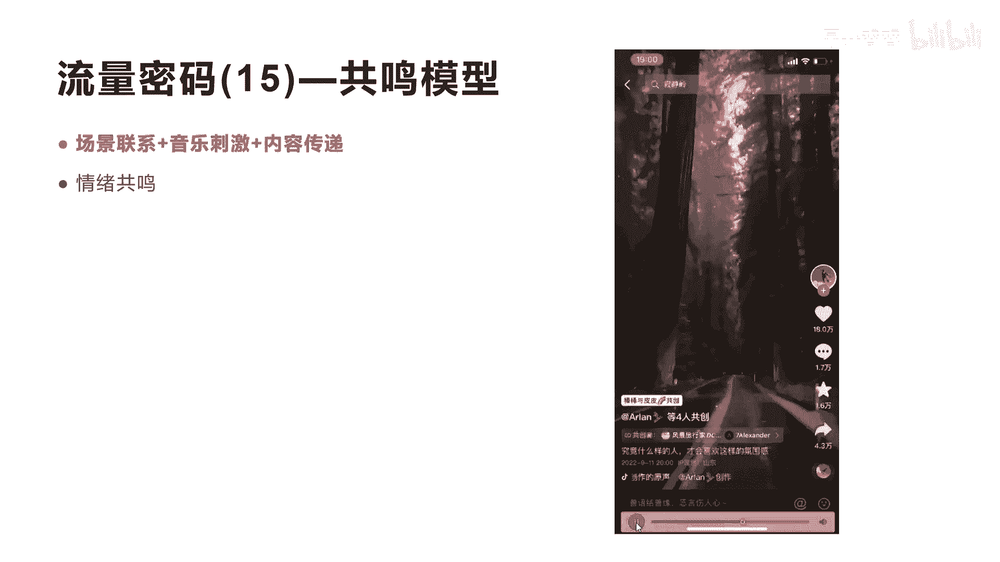
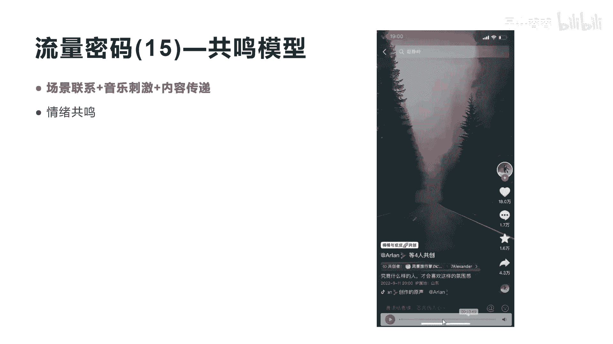

# 042 2023抖音快速起号必修课 - P47：第47节流量密码(15)—共鸣模型-请收藏 - 早安睿睿 - BV1Gn4y1o7rC

好今天我们来讲流量密码15叫共鸣模型，什么是共鸣模型呢，这个名字也是涛哥自己给它命名的啊，呃我们来一个个看案例给你拆解，你就会真正有感觉了啊，这个作品我不知道大家有没有刷到过，可能有很多人没刷到过。

他有15。5万的点赞啊，应该也是破千万的一个流量，但是它中间呢也没有什么很漂亮的，很华丽的明星，也没有很漂亮的色彩和风景，一根破草摆在这个角落里面，那为什么会有一个这样的情况，会让他有这么大流量呢。

他又到底有什么样的魔力呢，好我们先这样子，我们先来看一下这个短视频，没有声音的时候，他是一个什么样的感觉啊，我放给大家听，看到没有，这个是这个视频，就是一个草在那里刮。

如果你在自己的生活中拍一个这样的短视频，发到抖音上面，你觉得他会火吗，肯定不会火是吧，怎么可能有些15。5万的点赞嘛，是不是好，这个时候我们把他的声音打开，我们听一下啊，这个时候是不是感觉不一样了。

是不是诶感觉不一样了吧，有没有有没有感觉，应该是你听到有感觉，就是这个时候如果他是一个画面没有声音，你没有任何感觉，现在加了一个这样的音乐之后，就非常有感觉，这是什么音乐，这是汪峰的怒放的生命啊。

汪峰的一种洗脑神曲啊，叫汪峰的这个怒放的生命，这个歌曲一出来之后，你会整个哇这个视频好像比原来有意思了，但是还没有达到那种很有感觉的味道，是不是还没有它只是音乐好听诶，我也只是感觉到。

好像跟之前没有放声音有一些不同了，但是还是没有那种感觉，没有更加的激起我的共鸣，怎么办，我们再来看一下，我们把这下面的文字展现出来，大家再听一遍这个文字，我们再念一遍啊，出身卑微，一身傲骨。

无人角落独自绽放，随性洒脱，你所见我皆是我不解释好这个内容，这个文案其实是非常有感觉的是吧，再加上我们刚才说的这个画面和音乐，我们一起再来听一遍，你看是什么感觉，好。

这个时候你会发现这就是我们讲的叫共鸣模型，当这个时候你看到这个视频的时候，他有画面感，有文案，有背景音乐，整个三个东西一共振，就让你产生了共鸣，这个共鸣里面有三大核心内容，第一个就是叫做场景联想。

什么叫场景联想，你会发现这个卑微的躲在这个野草的这种场景，是不是让你联想到自己，或者一些内心深处的某种回忆和经历，让你瞬间就感受到哇，原来在现实生活压力下，我也是在不断的在努力，在夹缝中生存。

是不是激发了你的联想共鸣，这是一个非常重要，第二就是我们刚才讲的这个音乐的刺激，这首汪峰的洗脑神曲，怒放的生命，其实直接刺激了观众的大脑，驱动你大脑的回忆能力，是不是。

从而会产生让你产生非常完美的这种情感共鸣，第三点就非常重要，就是这个文字啊，这个文字其实如果他不出现的话，它很难让你联想，所以他文字起到了起到了什么作用，起到了内容传递的作用，他用这种文案的形式。

让你跟你的音乐和和画面产生了共振，淋漓尽致的就把这种情绪传递到你的身上，所以他会把90%的人的这个完播点赞，评论转发的动作集体做完，这个视频不上热门才怪，大家理不理解我讲的意思。

所以你会发现共鸣模型其实就是抖音的底层，上热门的逻辑分为三大块，所有的关于上热门的都分为三大块，只是你会看到中间有时候这个画面不是一个草，他是一个人物表演，是一个口播，或者是一个场景，或者是一个等等。

所以它整个抖音的核心在于三个核心要素，第一个是中间的视频画面，第二个是下面的文字文案，第三个是背景音乐，这三个东西完完全可以起到上热门的核心要素，所以你在拍短视频的时候，你一定要记得。

除了视频的画面感要好，你的文案要跟你的画面感要挂钩，你的背景音乐，要跟你的画面和你的文案进行高度的融合。

这样上热门的可能性就非常，我们来看一下这个共鸣模型啊，实际上它有三个内容所构建，第一个是场景的联想，第二个是音乐的刺激，第三个是内容的传递，就是我刚才讲的这三大内容，这三个内容的构建就产生了共鸣模型。

这就是一个非常赤裸裸的一个，让你上热门的一种共鸣情绪的一种模型，场景联想，你可以通过刚才讲的画面，你也可以自己去拍摄一些这种画面，你也可以创造一些场景，让观众的联想，所以这个地方非常重要。

如果你能把这个场景设计好，那么通过场景跟音乐的配合，再通过内容文案的传递啊，整个短视频就肯定会上热门啊，所以这里也会讲到，就共鸣模型的核心就是情绪的共鸣，所以我们通过这个模型。

我们来看一下另外的案例，你就会明白了，好，这两个作品跟刚才我们看到那朵野草是人，是一模一样，也没有漂亮哪里去是吧，没有漂亮哪里去，但是都火了，一模一样的场景，一模一样的音乐，一模一样的内容。

文案都一样的，只是它的场景不一样，我们来看一下他怎么火的，这里第一个作品是3万的点赞，第二个作品是9。3万的点赞啊，都非常恐怖，我们看一下他们的内容啊，看到没有。

所以你会发现这个跟刚才那个野草有什么区别，也没有什么很多内容，如果你把音乐把文案抹掉，你去看这个视频，看这个画面没有一点感觉，是不是产生共振了，我们再看另外这个啊啊，是不是。

所以你会发现这两个东西其实对于用户来讲，真正的它是一种情绪的共鸣，通过场景构建来引发观众对于真正的联想，对于另外一个事物，另外一个情绪，另外一个这种感觉的一种传递，让他上热门。

所以你们在做任何短视频的时候，这3。1定非常重要，拍短视频一定是拍，短视频是围绕着我们讲的内容去做，而拍抖音更加围绕的是我们讲的，第一个就是他下面有文案的这个内容非常重要，文案跟中间的画面以及背景音乐。

这三个核心关键要素是你上热门的核心好，我们来看一下另外一个作品。

这个也是一样的，他有18万的点赞，你看他拍的是什么东西啊，你会发现这样的也可以达到18万的点赞吗，其实就是我们讲的情绪的共鸣。

好你会发现实际上这种这种呃，这种风景来讲也不是非常漂亮，是不是也就是两个片段不定不停在切换，但是呢他加上了一个音乐的感觉，是不是更加有味道了，是不是有味道，通过音乐的刺激更加有味道。

让你会感觉到另外一种氛围不一样，那最重要是下面讲这句话，究竟什么样的人才会喜欢这样的氛围感，大家理解了吗，就没有这下面这一句话，你就看着刚才这个东西是没有感觉，所以你们在做短视频的时候。

下面这个文案是非常非常重，有时候我跟他讲作品拍的很好，背景音乐也很好，文案写的不好，没有融洽到这个短视频的文案里面去，他也是很难活的，有时候就是一个文案，你的内容拍的更拍得非常low，也拍的非常差。

但是他的文案会起到事半功倍的作用，当然音乐也是一样的，缺一不可，我刚才讲了三个元素，缺一不可，好吧，这就是今天我们讲的叫共鸣模型，共鸣模型的更多的意思，不是让大家去拍这种啊风景，然后配上文案，配上音乐。

更多的是告诉传递大家一个信号，就是整个抖音，整个短视频的这个拍摄过程中，除了我们讲的场景拍摄，更加要注重音乐的刺激，还有就是我们讲的下面文案内容的传递啊，这三频共振会让你的短视频的效果会与众不同。

好吧今天我们就讲到流量密码一失误。

