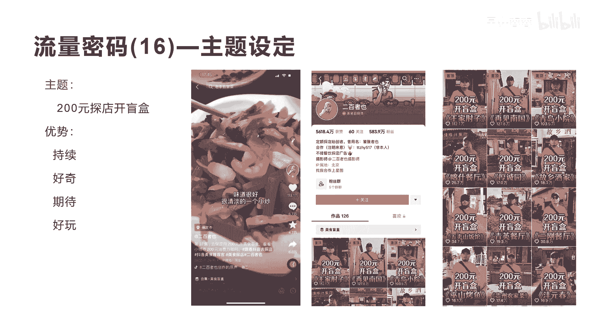

# 042 2023抖音快速起号必修课 - P49：第49节流量密码(16)—主题设定-请收藏 - 早安睿睿 - BV1Gn4y1o7rC

好今天我们来讲流量密码16叫主题设定啊，这个主题设定是什么，也就是我整个这个内容拍摄，都围绕着一个主题来进行拍摄，比如这里我们今天会讲一个案例，叫200元探店开盲盒，这就是一个主题设定啊。

这个主题设定是什么意思呢，就是我花200块钱去探店做一个这样的事情啊，去开一个盲盒，就看200块钱能吃多少东西啊，然后让观众会产生什么样的情绪，你看这个作品达到了112。1万的点赞，6。7万的评论，4。

7万的收藏，6。06万的这个转发啊，为什么这样的一个内容会产生这么大的，我们看一下它的内容啊。

这200块钱吃是什么意思啊，就按2万块钱上哎呀，吃不了，你上坚决的，我能吃得了，200元饭店开盲盒，店家上啥，我吃啥，这是我们来到保定后的第一餐啊，专门挑了一个大点的馆子，在北京开盲盒的时候。

大家都说贵，我们今天啊就要做对比，看看这小城市里面200块钱到底有多大。

能不能开出什么惊喜来吧，哇生意好，好几个人。

两个人有位置吗，两个人是谁呀，大姐啊，你能不能给我配200块钱吃的，给200块钱，你看这个作品其实对于刚开始来讲，也没有很非常牛逼的拍摄能力，也没有很强的这种表演欲望，他其实就是很随机的。

很自然的把他200块钱到店里面，东西的这个过程给拍出来了啊，我们继续看一下啊，这个配200块钱存两，给你上200块钱就存点是吧，好嘞好嘞，给拿下，谢谢呵呵，真敞亮可以吗，谢谢我自己来自己来自己来。

看来今天中午应该是很富裕，是不是先告诉我吃不完，然后配饮料了，如果北京是一线城市，这个保定属于几线城市，五六线，然后这样就对比一下，看看北京的消费跟五六线的城市，消费差距有多大，这个叫什么名啊。

兄弟王家小炒，王家小炒味道很好，很清淡，那个小炒这个我们就不看完了，其实就是在不断的讲这个每一个菜，200块钱到底上了多少菜啊，五道菜六道菜，每个菜怎么介是怎么介绍一下，这个其实就会让很多人有什么。

有持续的看下去的欲望，就是我今天看他今天诶探了一个店，哎，吃的这么好，诶，明天他会探什么店呢，他对整个他的作品，对于粉丝来讲，他有很强的期待感，这会让他的每天的流量，每天拍的短视频。

都有很多人等待着看他的短视频，第二个就是好奇感诶，这个200块钱到底可以吃到五星级酒店的一些，什么样的好吃的呢，所以他这个盲和这个两个字非常非常重要，让更多的人有什么有好奇感。

第三点就是整个这个短视频呢，它会让人觉得很轻松很好玩，不会像你有些团购达人去探店讲的那么刻意，哎这个三品多少钱，那个商品多少钱，是不是，很商业化，而它是一种第三人称的第三角色的方式来探店，来告诉大家。

跟大家一起来看看哦，这些店里面有些什么样的产品，有些什么样的好吃的惊奇的东西，所以就会让更多人期待，跟他进行一起来开盲盒啊，这就是属于一个主题设定，就这个主题设定非常你看他这个主题设定。

我们看到他涨到了583。9万的粉丝啊，就发了126个作品啊，平均一个作品带来50万的粉丝啊，二白折页啊，这个他其实也没有很专业的这种剧情啊，也没有像有些这个大的这个大V1样的，去非常精美的拍摄啊。

都没有非常自然的一个探店的传承，他这个呃每一个探店给他带来的这种呃，所谓的呃经济效益是非常大的，因为他每一次探店，都给当地的这些店铺带来了大量的这个曝光啊，啊，所以你他会成为这种美食探店的一种。

非常好的一种主题摄影的方式，每一个内容100多个作品。

每一个内容都是200块钱开盲盒，基本上每个作品全部是的200块钱开盲盒，就围绕着一个一个这样的主题，把所有的流量给打爆了，当然也有很多人模仿这种，我们并不是说这种200块钱开盲盒，它后续不会带来流量。

我们的意思是说大家可以举一反三，用他这种方式，200元开盲盒的这种主题设定的方式，让观众能持续好奇，期待好玩的这种元素，你也可以去设定一个自己的啊主题设定。

你比如说这个女孩子啊，这个女孩子大家可能都刷到过，叫小鱼海棠啊，这个更牛逼了，1825万的粉，这个粉丝将近接近2000万的粉丝了，大家应该都刷到过，他的主题设定，其实很简单。

就是跟999个很帅的男生拍照，这就是他的一个主题设定，那就会让更多的观众，他会期待哇，你下一个拍的男生是谁呀，他有什么样的特点啊，他到底帅不帅啊，他是在什么地方好不好玩啊，是怎么个拍法啊。

懂了意思吗，好我们来看一下他的视频啊，呢我小姨妈的表妹的一个远房亲戚啊，听说我来三亚了，然后突然跟我说，她02年的儿子特别帅，然后让我去见见见见哎，贱贱这个词有点意思哈哈见见就见见嘛。

怎么来了也得见一趟。

对不对，走哎咱们就是说今天你这身衣好，这回我们看完了啊，你看他这个作品95万的点赞哈，非常吓人，非常像他已经形成一个人物IP了，但是他刚开始做也是从零开始做的啊，从第一个就是设定了一个九十九百。

99个很帅的男生，我要跟他励志进行拍照啊，就从一个一个这样的男生拍到现在，1800多万粉丝啊，非常牛逼，这就是我们讲的主题设定的核心，关键要素有多么重要啊。

多么重要，那么除了这个主题设定，我们还有一些什么样的起出其他主题设定呢，比如啊我给大家举个例，举一些例子，激发一下你们的这个灵感，比如我如何一个月做到1万粉丝，是不是一个主题，有些人说我是一个小白。

我怎么通过一个月可以干到100万粉丝，那也有些人就对你这种主题设定，有一定定的期待感和好奇感啊，他每天会可能会来关注一下，这样其实就可以打开你的播放量，有很多人通过这种方式涨到了1万粉丝啊。

这个第一个第二个，我如何通过21天来减肥，20斤或者减肥减肥50斤是吧啊，类似于这种让观众有期待感，你设定一个目标，设定一个主题，然后让观众每天来看，你是怎么通过相应的方式来减肥，第三个。

比如说我如何让100个人变美对吧，我如何让100个人变有钱，我如何让100个人能拉到结果等等是吧，然后我如何包括第四个，我如何帮30个人直播带货，能赚到钱或者是起号，那理解我这样的意思吗，大家理解了。

这个就是我们讲的主题设定的好处，做一个号，这个号围绕的就是帮助你的主题，其实这个主题设定就有点像我们所原来所说的，这个创作企业一样的，叫一个叫使命感，你做账号的使命是什么，比如说像马云说的使命。

他做阿里巴巴，做淘宝的使命是为了让天下没有难做的生意，让1000万家这个商家能通过呃电商能真正创业，成功，使命愿景价值观是不是通过这些方式也在设定，更多的让观众能让你的创业伙伴们跟着你一起。

为了你这个设定，为了你这个梦想而一起往前走啊，所以主题设定其实非常重要，特别对于当下这个抖音的这个生态来讲，我们更多的要注意自己做垂类的，做更加细分的一些，让自己更加有个性化。

让自己更加区别于其他的账号啊，已形成这样的我们讲的反差啊，怎么去找你自己的反差值，好吧好，那么今天这个一流量密码，146的主题设定就讲完了。

