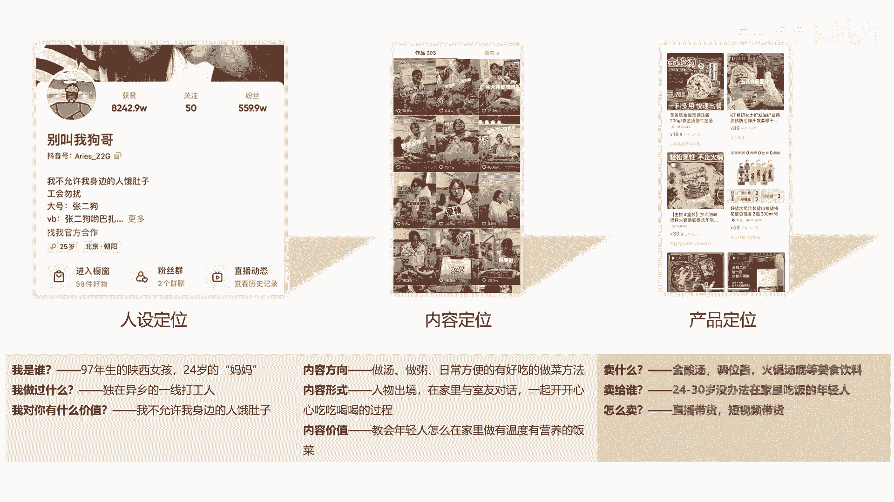
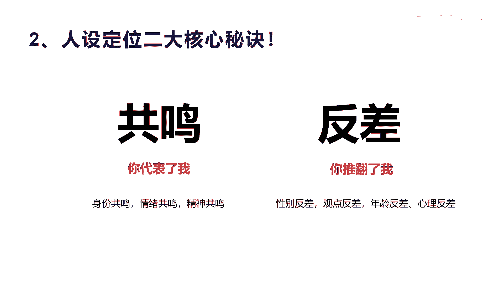
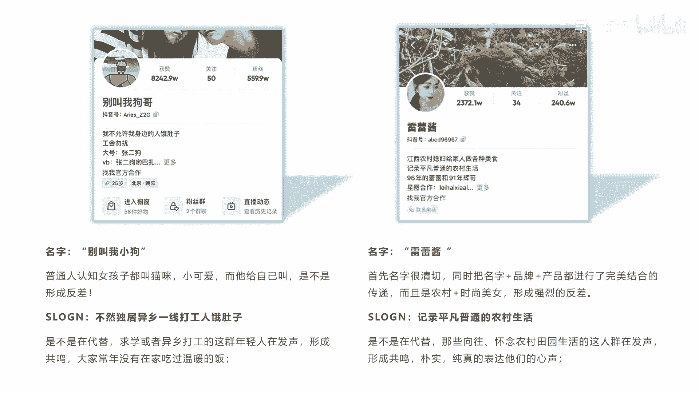

# 042 2023抖音快速起号必修课 - P4：第04节定位的2个核心秘诀-请收藏 - 早安睿睿 - BV1Gn4y1o7rC

那么讲到这里啊，你可能会说哎这个东西怎么去做呢，啊，给大家讲一个人设定位的一个两个核心秘诀啊。

这个图就是讲到人设定位的两大核心秘诀，一个是讲到共鸣，一个讲到反差，那共鸣是什么意思呢，就是哎你代表了我来发声啊，你代表我再再给大家讲清楚这个事情，那么这个共鸣他会有什么共鸣呢，像身份的共鸣。

情绪的共鸣，精神的共鸣是吧，这个三个方面的共鸣，那么反差呢他是说你推翻了我，你推翻了我的认知啊，也就是认知是一致的啊，所以他呈现出来的这个形象，跟我们脑海里的这个形象有有巨大的这个反差。

打破了我固有的认知，那么对你建立了新的这种印象，所以这就是反差，这个反差很多种啊，像性别反差，你是男孩子要做的事情都有女孩子在做是吧，这是性别上面的反差啊，观点的反差，那本来我认为这个涨工资很正常。

为什么不能涨工资呢，观点不一样了，反差不应该涨工资是吧，那年龄反差哎，六十七十岁的老奶奶，她还为什么这么时尚，还追求这个化妆啊，这是一种年龄反差，那么很小的小孩子，他这么小很小，五六岁他就可以干什么。

他就可以表演，他就可以讲，大人的话就让你讲不可思议的话，这是年龄上面的反差，那么心理上的反差是什么呢，心理上的反弹就是我哎本来我很开心的事，我看到这个事很开心，但是诶你会让他让你觉得什么很郁闷。

或者很不开心，心理上面产生一些反差啊等等啊，所以他整个来讲，如果你的人设，包括你的内容和产品，其实都可以围绕着你这两大啊秘诀，来进行创作和设计，这个地方我也给大家总结了一个例子。

就是刚才我们讲的还是给大家来重复一下，他们是怎么通过反差和共鸣来做的，你看这个别叫我小狗，刚才我们讲了，她是20岁的一个小一个年轻妈妈，她为什么叫自己小狗是吧，他并不是说他是个男孩子。

因为小狗大家都听到诶，好像在贬低自己，说自己是男孩子，但是她是一个普通的女孩子，她可以叫猫咪啊，她也不会一定要叫小狗啊对吧，所以她叫小狗的这个虽然小狗的辨识度很高啊，但是他总的来讲它也起到反差的作用啊。

别叫我小狗产生反差的一个情绪上面的是吧，一个反差，那么他的slogan我们看一下，不让独居一乡的一线打工人饿肚子，那是不是代替了他是不是有共鸣，代替了那些都在异乡打工的这群年轻人，在发声是吧，形成共鸣。

大家确实都是常年在外，没有在家吃过这么温暖或这个饭，是不是，所以他产生了这种共鸣啊，整个这个账号的定位他就立体了，就让人深刻了，记下哈这个雷雷酱呢这个东西啊，雷利酱他首先呢他这个名字啊非常亲切。

它实际上是把他的姓名的第一个字姓雷嘛，然后他的品牌啊，雷又又又做什么呢，做这个辅料的啊，美式辅料的一个酱和一个酱，他怎么把名字，品牌和产品三者进行了完整的这种整合，然后传递出去是吧，而且他反差在哪里呢。

啊他会告诉你诶，我是一个农村的时尚美女而形成的反差，首先在农村呢它一般都不会啊，很漂亮，这是大家的一个一个一个认知是吧，或者是一个现象，那我现在就是很漂亮，我很时尚，我跑到农村去了。

形成强烈的反差是吧啊，所以这种反差他需要你自己去悟去找，那么它的SLOGG我们看一下，记录平凡普通农村生活，他是不是在代替那些想怀念，向往田园生活的这群人在发声啊，所以形成了共鸣。

朴实纯真的表达了他们的心声，你在做账号定位，在做自己的账号设置，装修的时候，实际上都是可以去设计的，包括我们讲的后面的内容的创作，更加可以用共鸣和反差这个两个绝杀的秘籍，你掌握之后。

你在不在不断的去做内容创作，在做抖音创意的时候会起到非常大的好处，只是说你有没有真正的抓得住，这种共鸣和反差啊，有很多人说哎我喜欢啊，我很帅，然后我很我我很喜欢工作，他觉得是反差。

但是我觉得啊在所有的这个工作来讲，他是在现当下这种社会里面是就像吃饭一样的，你跟别人讲，我我很喜欢吃饭，是一个反差啊，不对是吧，大家都喜欢吃饭，都都需要工作，他形成不了反差，所以有时候你把反差。

不要把它认为是你认为的一种反差，而是因为，而是要把它认为是这种当下社会和现状中的，一种现状的一种反差的一种啊现象，这才是真正的反差，有时候我还讲了一点，就是极致，有时候也是一种反差，比如说我吃的很饱。

那么我吃的非常饱，我吃得很胀，饱的已经不行了是吧，它是一种极致的饭啊，我狂爱工作，我酷爱工作，我对工作痴狂痴狂到我连女朋友，连家里人我都不愿意接，或者是说我六亲不认等等，你做到这种反差啊。

就就有点啊这个极致的感觉是吧，好我们今天就讲到这个啊定位的一个啊课程。

下一节课我们会讲到一些关于啊怎么去做内容。

