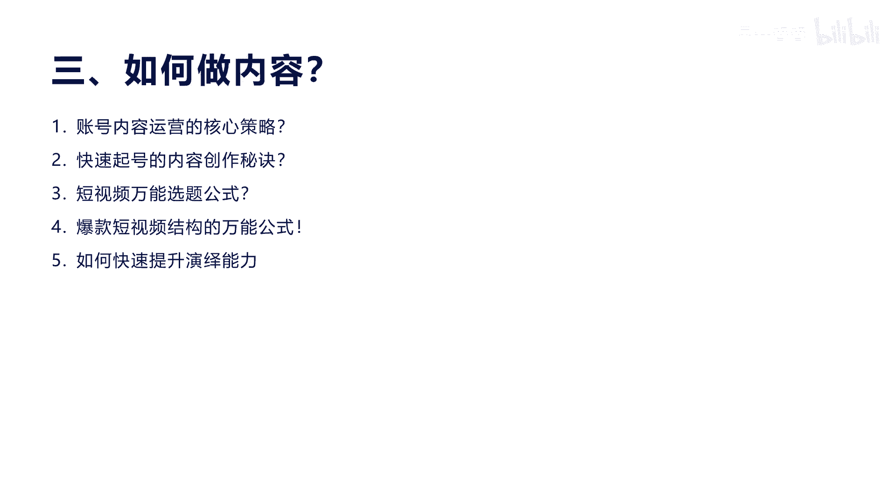
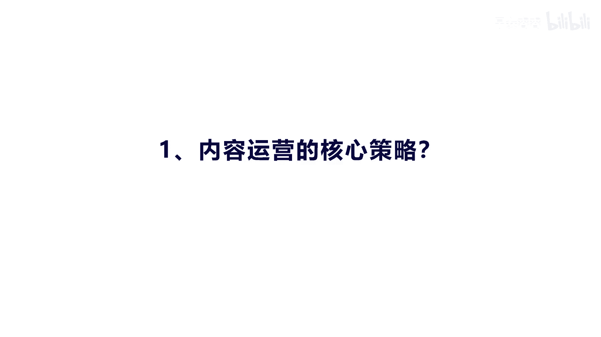
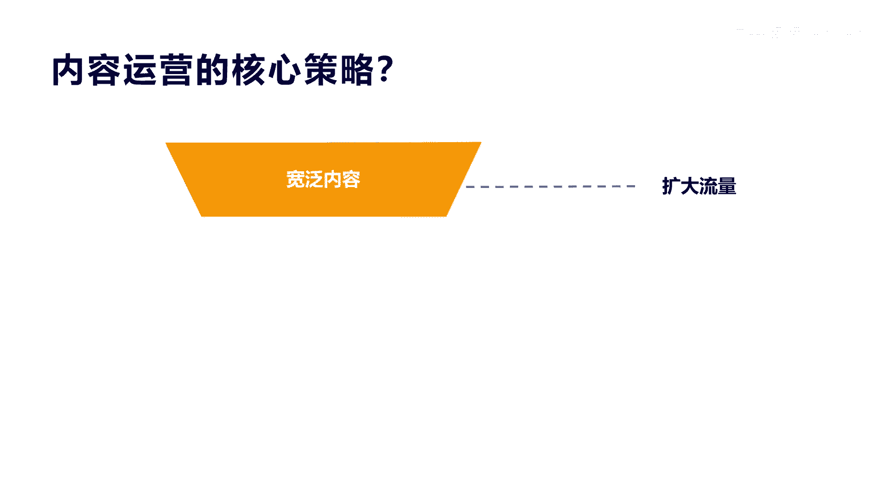
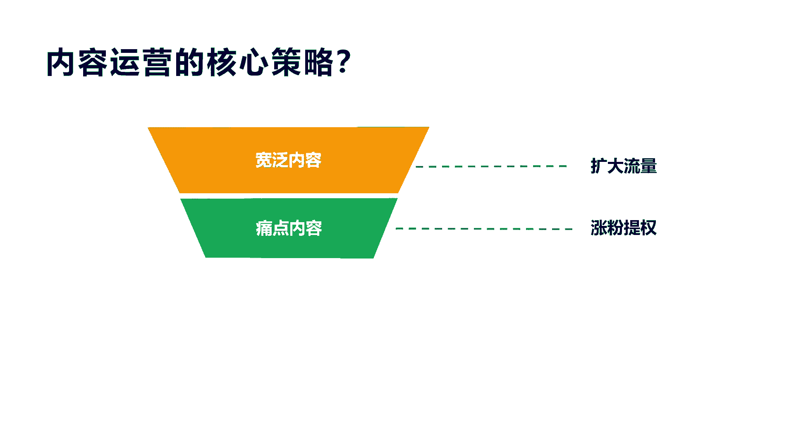
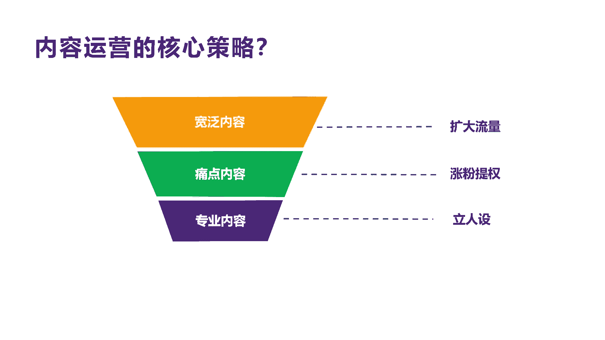
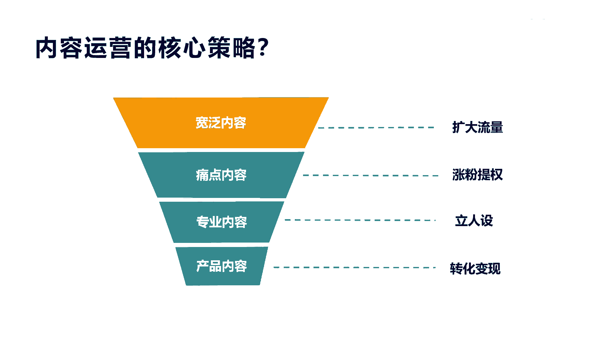
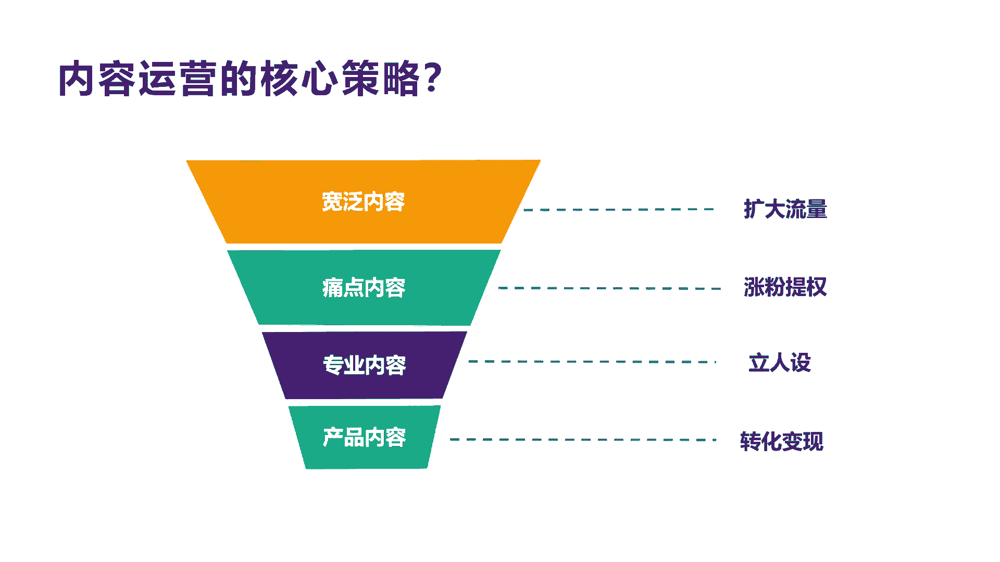

# 042 2023抖音快速起号必修课 - P5：第05节内容运营的核心策略-请收藏 - 早安睿睿 - BV1Gn4y1o7rC

好大家好，今天我们来讲一下如何去做内容啊，因为我们前三节课讲的定位啊。

这节课我们就开始来讲内容，这个内容我们从啊五个方面去来讲，这五个内容分别是，第一个是账号内容的运营的核心啊，这个运营的策略是什么，第二个讲的快速起号的内容创作秘诀，这个非常重要。

这是我的一些总结的一些实战经验，给大家来分享一些创作秘诀，那么第三呢非常有实操性啊，那么第三呢这个短视频万能选题公式，第四呢爆款短视频的结构的万能公式，第五呢就是快速提升演绎能力。

怎么去做好，我们先来看一下第一个啊。

内容运营的核心策略到底是什么呢，呃我们这里有个图啊。

大家可以看一下，最上面这个叫宽泛内容，它是为了扩大流量的。

那么下面它是痛点内容，他是为了要涨粉提权的。

那么第三个叫专业内容，它是用来干什么呢，立人设的。

那么第四个它是有产品内容，它是干什么的，他是来转化变现的，好这四个内容大家发现没有，它是有个漏斗的，它是上面宽下面窄，也就是说你这个内容策略来讲，按照这个比例和策是吧，按照这个比例来进行一个划分啊。

这就是你的策略，而且这四个内容还必须都得有，比如说我们做一些账号啊，做美食的，那么你只讲美食，讲专业内容怎么拍，怎么拍得好看，你觉得他会来很大的流量吗，不会你觉得他的这个流量扩大的了吗，扩大不了。

所以我们在讲某一个账号的时候，你一定要有一个这样的内容，或者说他你都是一个千篇一律的去讲专业，只是讲产品，这个流量会很少，你会发现有很很多这种垂直类的，讲干货的这种它很少的流量是吧啊。

除非要花大量的人力物力去做推广，去做这个视频内容，才可能会有大量的人流流，所以其实我讲宽泛内容，其实就是比如说大众化的这个话题呀，啊比如说你这个人群，他最感兴趣的某一些话题啊。

啊通过这个官方内容把你的流量口子打开，然后通过这个流量口子来露出相应的你的粉丝，这样我们讲的就是通过痛点内容，来解决他问题的对吧，你讲一些问题，讲一些他的痛点，你有这个专业能力的时候。

你在讲专业能力的内容，这个时候诶发现你真的很权威，很牛逼，这个时候我们把人设又立起来了是吧，刚才是涨粉，涨粉完了之后，我们立人设立完讲完专业内容，立完人设之后，后面我们开始讲产品开始变现。

那这些人觉得你专业，你能解决我的痛点是吧，又关注了你，这时候你突然讲到这个产品，我当然就被你所吸引啊，这个时候再进行销售，就达到了整个内容运营的一个啊闭环，所以我们讲这个图啊，大家一定要去记住。

其实在很多这个博主啊，都给大家讲要做这个什么垂类内容啊，每天去发同样的这个视频内容，其实这种方式呢它是很难的起号的，因为你垂直内容的这个垂直度啊，要找到精准粉丝，首先抖音来讲，他要匹配这种他也比较难。

再加上你的内容的这个标签和你内容的这种啊，吸引度太专业太太垂了，很难的去吸引到更多的人来观看啊。

所以我们讲这个策略来讲，大家一定要去注意啊，一定要重视好，那我们就今天讲到这个啊，这节课比较短啊。

