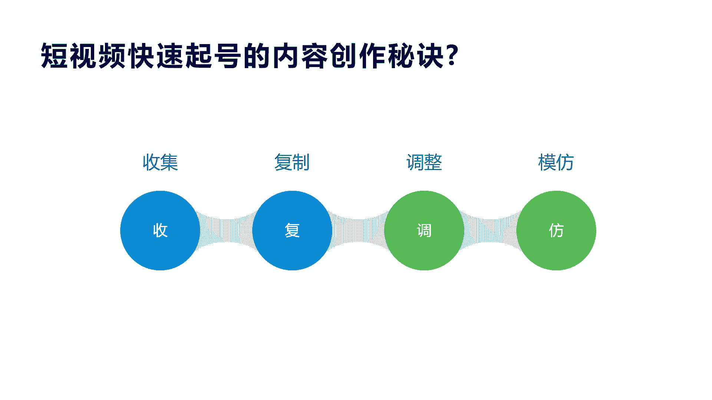
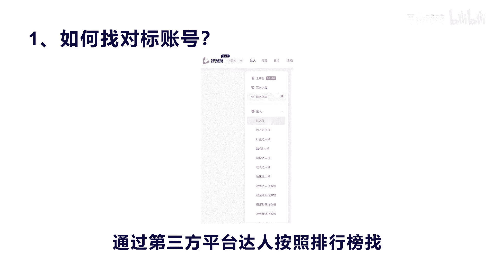
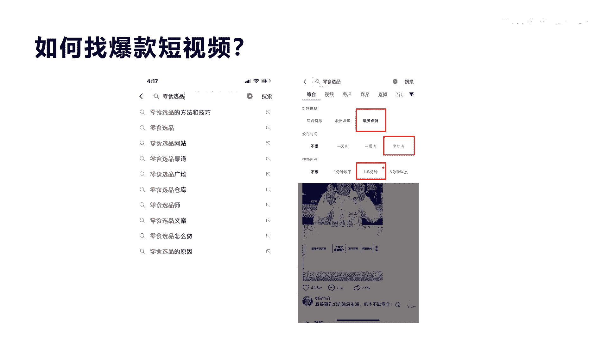
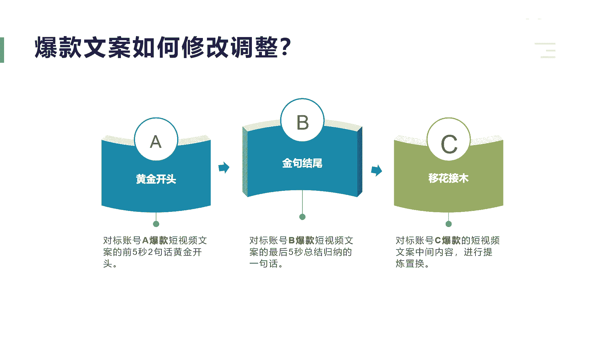
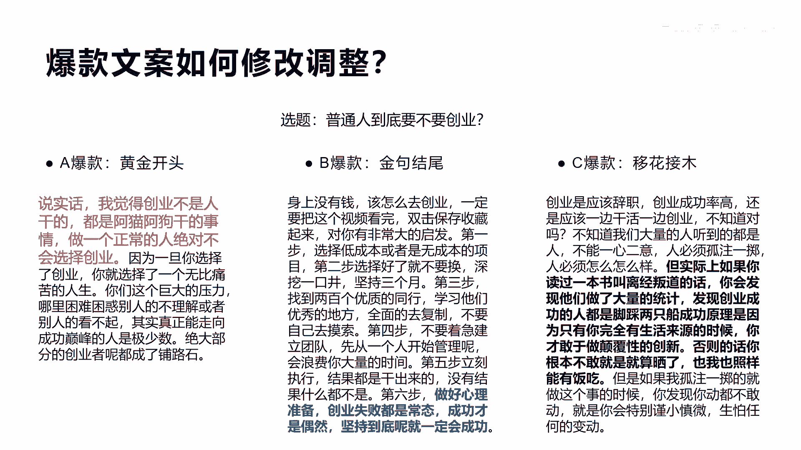
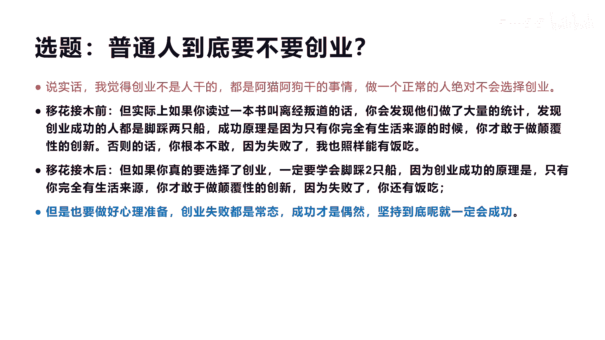
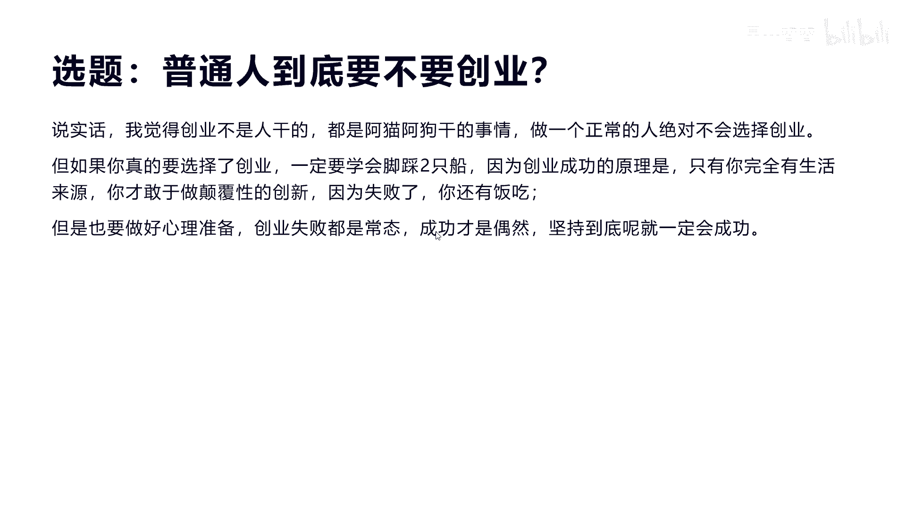
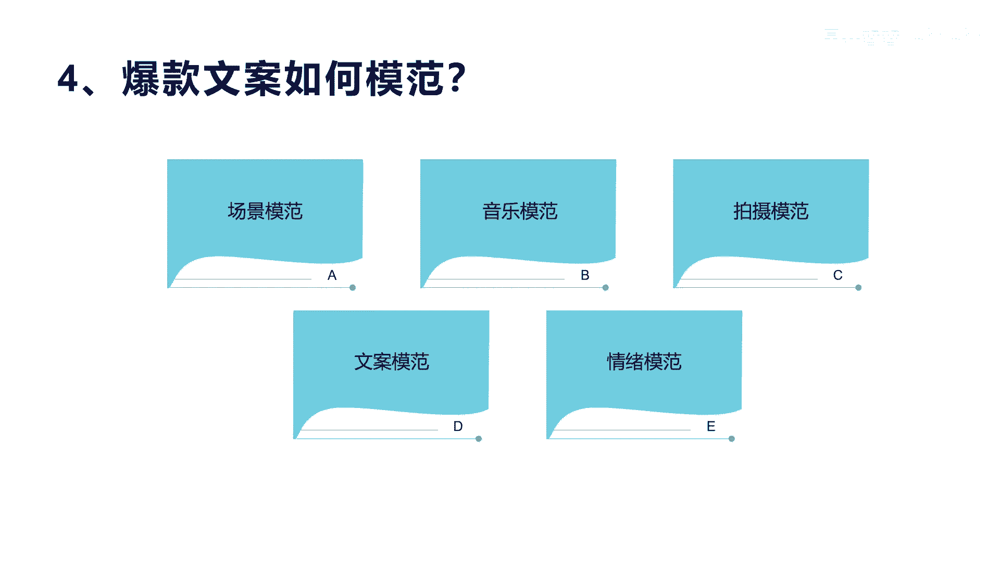
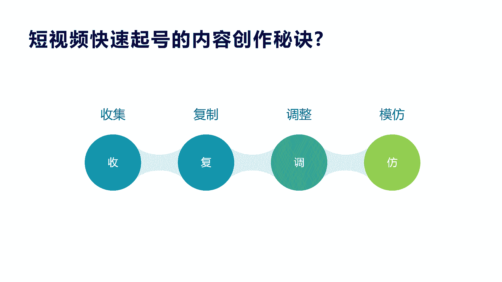

# 042 2023抖音快速起号必修课 - P6：第06节短视频快速起号的内容创作秘诀-请收藏 - 早安睿睿 - BV1Gn4y1o7rC

我们今天来讲第二点，短视频快速起号的内容创作秘诀，这个内容很核心啊，他是我的一些经验独特的总结，希望你对这个课程可以多看几遍，那么这个内容创作的秘诀，我把它分成了四个部分，叫收付条法啊。

这个收复条法的意思就是收集复制调整和模仿，因为什么这样做啊，因为对于很多普通人来讲啊，我们要去做短视频内容或者是做直播啊，都是一样的，都非常非常难，因为你一个新手，你就想做一个爆款，上热门啊。

是非常难的，非常难的，所以你最好的办法是先得感触一下上热门的啊，状态，或者他的这个感觉反感啊，所以模仿是所有你能快速起号的一个，核心的方法，那么模仿你要有好的模仿的这个方法，才可以真正模仿。

而不能去去抄袭，对你去抄袭，去把它复制过来，一模一样，那是不是，所以我们这里讲的一个方法就是先收集再复制，再调整修改，最后我们再进行模仿，我们今天来讲呢先看一下收集。

收集是有方法的，我们看一下他怎么收集的，首先这个收集短视频的这个内容呢，我们从两个方面去收集，第一个是先要找到对标账号诶，这是可以去收集的，你关注一大摞的这种对标的账号哎，这是一个方法。

然后你第二个方法是什么呢，我通过这个对标账号，然后我们通过这个对标账号去找到他们，对标账号里面的什么短视频，爆款短视频是不是我们有很多这个账号，你关注他，你会发现你翻他的这个短视频，有很多的爆款。

那么这个爆款呢你把他收藏的话，是通过他的账号，然后进去关注他，是不是这是一种方式，第二种方式是直接找爆款短视频，有很多网友们说在上面有个抖音，上面有个搜索框，这个我们后面也会讲怎么去找是吧，哎怎么去找。

通过排序，通过搜索关键词还可以找到很多爆款的短视频，然后我们再进行处理啊，这是我们讲收集，那么收集我们有几种方式去找对标账号，这里我讲了一个查码码，这个藏妈妈也好，还是我们讲的还有很多平台啊。

第三方平台我给大家再讲一下，第三方平台，有常妈妈呃，还有斗叉叉，还有一个就是我们讲的这个啊星斗啊，当然还有很多啊，还有飞瓜数据飞瓜啊，这些平台都是这个专业的大数据短视频啊，平台啊。

他们有很多功能是免费的，但有很多功能是要收费的啊，有些会员级别不一样，这里面查妈妈的数据呢，我经常用，原来我是用抖抖查查，但是现在发现查妈妈的这个内容和它的更新度，包括它的这个数据还是比较好的。

比较精准，所以你可以通过查妈妈的官网PC版啊，大家去找，在百度里面去搜，然后找到这个达人，这个达人里面，你可以去通过我们这里框那个红色的，就是带货分类去查找，你也可以通过什么啊。

下面的一些细分品类去找啊，就是达人分类啊，达人信息这些细分的属性去找，可以精准的找到你所对标的啊答案账号了，这是通过第三方平台来找啊，通过分类啊，那么第二个呢你可以通过查妈妈的细分赛道。

你看他每个这种带货的大分类，下面都会有小分类啊，比如说我们原来讲过一个零食是吧，我们可以找到食品饮料下面的这个零食，坚果特产，通过这个二级分类，可以找到一些细分赛道的一些账号，这里有很多我就没有演示了。

那么还有一种方式呢，它是通过这个找到答案之后，它上面会有一排这个按钮，我们可以在场均销售额这里做排序，为什么，因为你要找很牛逼的，而不要模仿，或者是找那种跟你一样的，还没有做起来的账号，是不是。

所以你一定要在它的销售额，这个最高的这个指标去排序，找到最好的或者他的粉丝数的数量总和啊，这些包括他的视频播放量的总和去排序，找到最好的这个领，你这个细分领域最好作为你的对标照。

有很多人说找同类型刚起号的不要，我建议是找已经证明过，已经做起来，这样你去模仿他才会少走一些捷径啊，这是讲的第二个和第三种方法，通过销量，通过一些别的排序的方式好，还有一种就是什么呢，通过哦排行榜。

他这个平台会有什么带货塔拔排行榜，行业排行榜，涨粉排行榜，成长排行榜，区域排行榜啊等等，这种排行榜里面，它可以把你刚才要排序的一些指标，排序给排出来，然后在那里面去找你想要的对标账号。

我觉得这个对标账号，最起码你得要找50个以上啊，对于你这个平台有些呃这个博主啊，在做自己账号的时候，起码得关注啊，几百个这种对标账号啊，这个我觉得太多了，你只要关注那么30~50个，我觉得是最好的啊。

三十五十个是最好的，好这个是讲到怎么去找对标账号。

我们再来看一下啊，那么怎么通过抖音自带的方式，去找到爆款短视频了，那么这里找爆款短视频，我建议就直接可以用抖音的搜索框去找，因为他这里很好啊，他可以把最多的点赞数和发布的时间。

以及他视频的长短进行一个选择排序，这个时候你就会发现诶，我需要做60分60秒啊，我需要做60秒以下的这个视频，那么我应该参考什么样的短视频，你就可以选一分钟以下，而我想找点赞数最多的，我可以点。

我可以选最多点赞数啊，我还想选最近一个月的或者一周的，而不是两年前的，因为两年前的内容，可能早就被人看过或者复制过的N遍了是吧，这个时候已经没什么含义了啊等等，你通过这种筛选方式。

都可以找到你想要的爆款短视频，具体的你可以根据你左边，我们看这个叫临时选品的这种关键词，你去筛选这个关键词的提炼，需要可以看一下下面的这些列表的参考，它里面有像啊，像临时选品怎么做啊，临时选品的原因啊。

他的文案等等啊，你输入两个字，它可以列出很多这种相关的长尾词，你来进行选择，这样更便于精准的找到你的短视频。

好我们再看一下刚才讲的怎么去找啧，找完了收集完了，第二步是什么，收第二步是什么，复制这里复制，我给大家推荐一个就是一个是爱提词，一个是青斗爱提词，那它有个什么好处呢，哎呀我觉得他有好处啊。

但是它整个它里面有一个爆款文案的区域，里面有所有行业的短视频，爆款文案都已经把你变成文案了啊，这是他的一个好处，第二个呢它还可以什么，他可以用语音AI来进行输入文案，这也是我觉得他比较好的啊。

当然青岛也有也有也有很多好处啊，但是我可能习惯于用I提词，包括你可以对自己的台本进行分类，比如说我这个什么类型呢，我建一个分类是吧，哎然后呃比如说我产品性的文案，我就建一个分类。

那这个专业知识的文案是吧，我又建一个台本，或者是说我这个要做一些泛粉的这个内容，我又建一个台本，在台本里面去分类，然后去转换是吧，那么青岛呢他是在在我们的这个呃，也是需要下一个app啊，下一个app啊。

他也有很多这种好的东西啊，它里面可以说很涨粉任务，大家可以在里面去接任务啊，也可以说是什么呢，额你也可以去看它里面的有很多这种提权，就比如说它里面有会有账号的种诊断信息啊，包括怎么怎么进行提词器是吧啊。

包括你账号的估值，那这些小特点啊，当然我们讲的通过这两个工具，主要是目的是什么，是把刚才那个视频，怎么样把它变成文案提取出来，是不是因为刚才我们找到对标账号之后，也找到了短视频，这个爆款短视频。

这是我需要把这种他的爆款视频，怎么样提炼出文案出来，然后我们才可以进行修改，是不是好，那我们来看一下这个爱提词的，怎么去把别人的短视频内容复制下来啊。

我们看一个截图，看一个视频啊，就可以进行转化了，你好同意不怪你知道男人的死去，你看啊这是什么吗，我们看这地方有一个复制链接，看到没有，复制链接的时候呢，点击它会复制成功，复制成功完了之后呢。

我们就直接这里有个内容复制啊，已复制，这个时候我们开始切换到啊IT字上面去，打开i it值之后呢，我们看最上面有个连接状态，转台本，连接转台本之后呢，实际上就可以把刚才复制的地址粘贴到这里。

然后进行提取，这个时候呢啊这篇文章就出来了，然后你点编辑之后呢，我们就可以看到这篇整个内容的文字，而且翻译非常准啊，非常准，然后大家可以在这个上面进行一些调整，你可以把你知道女人的死穴是什么吗。

当然这下面有些东西你可以做一些调整，一模一样的，我觉得还是不太好是吧，你可以做一些自己的文案的内容的，加入到进去也不会有很大问题，好这个就是我们讲的怎么去复制啊。

这个我相信大家应该是看懂了啊，比较简单，所以我们在讲到第三个。

我们看一下啊，看一下这个看别人怎么做的，给大家见识一下啊，这种怎么做爆款的，第一个视频的这个爆款，他做到了4。8万啊，我们看一下啊，你知道男人的死穴是什么吗，你越懂他，他就越温柔，你越关心他。

他就越爱你，你越了解他们不容易啊，他就会拼了命的对你好。

你以为外这个速度有点卡啊，他实际上是讲到我们下面有文案啊，你知道男人的死穴是什么吗，你越懂他，他就越温柔，你越关心他，他就越爱你，你越了解他不容易，他就越拼命的对你好，无一例外是吧。

我们再来看一下，你知道女人的死穴是什么吗，你越懂他，他就越温柔，你越关心他，他就会越爱你，你越理解他的不容易，他就会拼了命的对你好，无一例外好，我们看完了，是不是你发现一个特点。

没有他们两个的文案是一模一样，后面这个他们的点赞数是8万，当然他的时间比较早啊，那么前面这个视频女孩子在讲这个东西呢，其实值有多少呢，他只有他只有2万多啊，他只有2万多的点赞。

那么实际上额他们两个的内容是一样的，无非是换了什么，一个是讲男人，一个是讲女人，男人女人都可以讲，一个是男人在想女人，一个是女人在想男人，你发现了没有啊，这就是特点，如果我是一个男人，我肯定讲女人死学。

我是一个女人，我肯定讲男人死学，但是后面的内容你发现一模一样，一模一样，两个都火了，都火了，这个爆款短视频都火了啊，当然我不是说让大家去这样去抄啊，但是我觉得啊抖音的逻辑在这里，这是他的逻辑，没办法啊。

他防不胜防的，但是我们作为初学者创作者来讲，你可以适当的去做这种尝试，真的啊，这个让你很快的可以打开你的流量口子，等你尝试到这种上热门的感觉之后，你才可能有网感，你懂我意思吗。

就是你得要有开过车的这个经验，你才觉得你才能感受到哦，别人开车的那个感觉就这么回事，你一定要有那种感觉，找到那种上热门感觉之后，你后续怎么去调整你的文案都可以，好吧好。

我们来看一下文案如何做调整，我们既然已经复制了内容啊，我们也进行了这个提取了这个别人的这个内容，那我们怎么去做调整啊，做调整你可以很简单，就在原来提取的上面进行适当的去修改。

就像我们前面那个视频一样的男人换成女人啊，但是我们也可以通过一些方法来做一些，真正的伪原创，我们讲就是啊，就像跟原创一样的短视频内文案内容，那么这个时候你可以用我们说的ABC方法，ABC方法的意思。

就是说，通过账号的A爆款的短视频的前五秒，或者是前三秒的啊，一句话两句话开头，我们叫黄金开头，结合B爆款的短视频的最后五秒的一个总结，京剧的一句话，加上C爆款的啊，中间的内容啊，然后我们进行提炼修改。

这样三个东西三个短视频的内容穿插到一起，其实就变成了一个真正的爆款原创内容啊，我不知道大家听懂没有，A爆款的开头和B爆款的结尾，加上C爆缓的核心中间内容，然后组合啊我们来做一个演示啊。

做一个演示，那我们来给一个案例啊，这个案例我们搞一个选题啊，就是说你现在要定一个选题，我们来做普通人到底要不要创业，普通人到底要不要创业，是一个选题，通过这个选题去找到三个类似于很接近的。

关于普通人要不要创业的爆款文案，那么对于A爆款的爆款文案的黄金开头，比如说说实话，我觉得创业不是人干的，都是阿猫阿狗干的事情，做一个正常的人，绝对不会选择创业，这是他的开头啊。

真正吸引人的一个勾住人的一个话题，问题，一个现象，这是开头黄金开头，那么看B爆款，前面的话我就不列了啊，京剧最后结尾是做好心理准备，创业失败都是常态，成功才是偶然，坚持到底就一定会成功，这是它的结尾。

我们看一下C爆款，C爆款，我们看到中间的内容啊，它上下的内容我们就不看了，这个黑色加粗的部分是说到，就是实际上如果你想创业是吧，你读过一本书叫什么什么，然后你会发现他大量的统计。

发现创业的人必须要脚踏两只船，这才是成功的原理，只有因为，因为只有你完全不会考虑生活来源的时候，你才敢于颠覆性的创新，否则的话你根本不敢做牺牲这个中间的内容，你会发现他讲了一个道理。

就是说你作为创业来讲，一定要有或者让自己什么有两条船有退路啊，让自己生活上面没有没有顾虑是吧。

那么ABC我们看怎么来结合啊，实际上你看一下啊，第一句话的开头我们把它移过来，那么中间内容还有最后一句话的内容，我们也把它移过来，那么中间这个移花接木怎么移花啊，移花接木之前他应该是上面我们讲的这段话。

移花接木后，我们看一下这段话的实际内容，是我把它改成了，但如果你真的选择创业，一定要学会脚踏两只船，因为创业成功的原理，那么你只有你完全有生活来源，你才敢于颠覆性的创新，因为失败了你还有饭吃。

然后呢整个我们再看一下。

改完了是什么样子，我念一遍啊，说实话，我觉得创业不是人干的，但都是阿猫阿狗干的事情，作为一个普正常的人，绝对不会选择创业，如果你真的选择了创业，一定要学会脚踏两只船。

因为创业成功的原理是只有你完全有生活来源，你才敢于做颠覆性的创新，因为失败了你还有饭吃，但是也要做好心理准备，创业失败都是常态，成功才是偶然，坚持到底就一定会成功好，我不知道这个这个实操的内容。

大家看懂没有，就真正的如果你写不出文案，你也不知道怎么去表达，你怎么去做一个非常好的爆款文案呢，很难，是不是，那实际上用这套方法是所有博主和爆款短视频，所惯用的一些方法啊，这是这是讲的核心啊。

当然这种原创不你可以做一些调整，比如说中间刚才这些内容和开头结尾，你也不一定要一模一样，拉别人的，你可以在别人的这个意识上面，你用你的话再把他讲一遍，写一遍，这样就就就达到了真正的原创啊原创。

所以我们在任何学文案的时候，实际上所有的人都是你抄我，我抄你，然后你超我之后，你做调整，我抄你之后，我做调整，做完调整之后，慢慢去升华自己的一些啊内容的素材和感觉，导致后面我可以慢慢自己写啊。

我的很多这个短视频前期也是这么走过来的，后面发现做的多了之后，哎我们自己也可以写啊，因为我本身原来哦我们在做实体的这个，传统PC互联网的时候，我们都写过这些东西啊，所以这个对于这个这个内容的方法来讲。

都是常用的啊，你不要觉得跑意思或者是觉得很野路子啊，这都是常用的一些方法，来对于初学者提炼和做出内容，的一个非常好的一个方法，当然整个你发现没有这个练出来的话，这个话术。

整个这个东西你还是要有一个贯穿的能力，而不是死死死搬硬套的把它组合在一起，而不畅通是吧，你看刚才我们组合的其实读不下来还是很正常。

但有些你你你得做调整，我们今天还讲一个，就是最后讲的模仿前面讲的这个呃收集复制啊，我们再把它进行修改调整，最后我们讲就是模仿模仿讲呢，有些口播的还好一点，有些口播的我们就就需要模仿别人的这个表情，情绪。

包括他的场景我们都可以模仿，包括他的音乐，当然也是这样子，ABC方式吧，你可以看诶，呃有些这个呃爆款短视频的场景很好，我可以模仿啊，用到你的内容里面，但我发现他的情绪表达很好，可以用他的情绪。

也可以用他的音乐是吧，你得收集有这种收集和这种意识啊，包括文案的模仿，表达的模仿，拍摄模仿都可以模仿，而不仅仅是文字上的模仿，所以整个的魔法来讲，都可以用ABC方法来进行组合，最后做出爆款短视频好。

这就是我们讲的温故一下四个方法。

收复调反，收复调法是短视频快速起号内容创作的秘诀，特别对于新手来讲是最好用的啊，最好用的，所以你学到这里的话，我告诉你这个课程是非常有实操价值，非常有价值好，那么我们今天呢就讲到这里。

你也可以去用刚才说的两个app去试一下啊，去快速创造你的内容，原创短视频，我们不倡导，也不建议全部一模一样复制过来或者改两个字，你一定要学会这种方法去做，不然的话，你的后续的文案内容。

是很难自己通过这种方式去提升的，你就会很依赖别人的文案，所以慢慢通过这种方式调整的时候，你可以啊局部调整，然后全文调整懂吗，然后面我们也会讲到底文案自己要去做。

写怎么去做好吧。