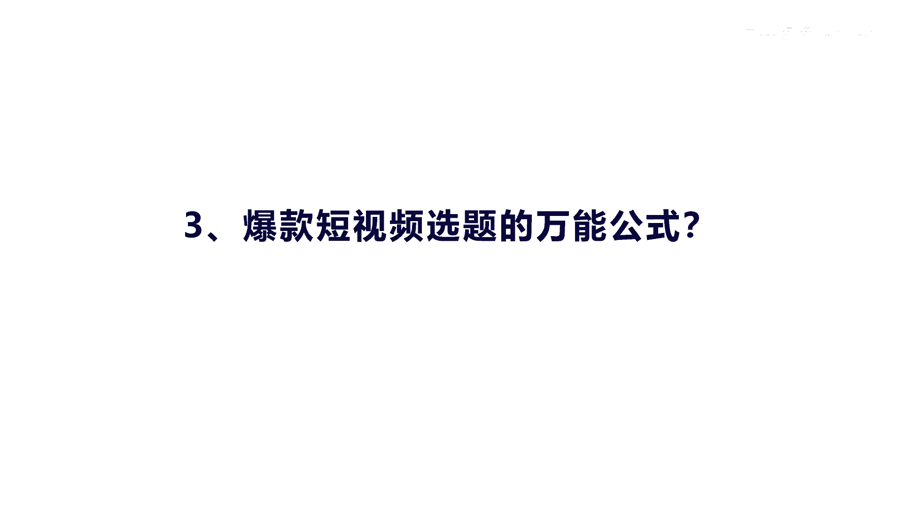
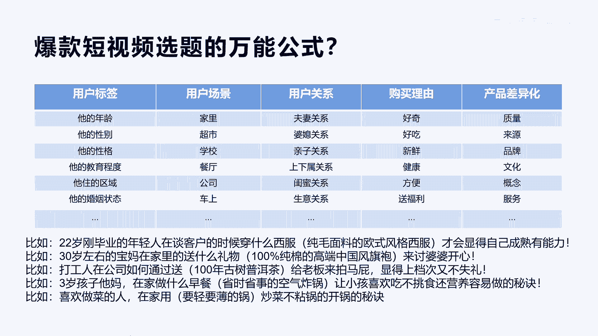

# 042 2023抖音快速起号必修课 - P7：第07节爆款短视频选题的万能公式-请收藏 - 早安睿睿 - BV1Gn4y1o7rC

好我们今天来讲内容的第三大块，叫爆款短视频选题的万能公式啊，这个万能公式呢是我自己通过总结，所有的这些爆款文案，和一些这种做抖音的一些技巧里面。

得出来一个公式，这个公式的具体内容分为五大块，第一个我们讲就是用户的标签，用户的场景和用户关系，以及购买理由和产品差异化，那么整个我们在做内容选题的时候呢，呃会发现通过呃你的赛道。

你的产品以及你的内容方向啊，去批量的去生产内容的时候，不知道去怎么动手，那么这个时候呢你可以通过你的定位完了之后，把你的用户标签给罗列出来，比如说他的年龄，他的性别，他的性格，包括他的教育程度。

他的住的区域，包括我们讲他的婚姻状态等等啊，一个人的标签大概总共有将近700多个，所以他的标签是非常多的，那么你可以罗列最核心的一些标签，第二个场景就是我们讲的在家里还是在超市，还是在学校。

还是在餐饮啊，公司车上等等，这些都有一些场景啊，包括用户关系，你你想表达的是一个夫妻关系的内容，还是婆媳关系的内容，亲子关系还是上下属关系，包括我们讲的是生意关系或者是老板关系是吧，这些关系罗列出来。

还有我们讲最后的购买理由，他到底是因为好吃好奇新鲜，健康方便还是便宜是吧，来购买你的一个理由，最后我们讲产品的差异化，产品差异化主要是从你的产品的，或者你的服务的一个呃跟别人不同的点是哪里。

把它提炼出来，你可以从你的质量来提炼你的来源，比如说我这个茶叶是来自于云南的某一个，西双版纳的什么啊，原产地是吧啊，你的品牌，还有你的文化，你的概念，你的服务，你的等等，关于产品的差异化。

那么通过这个差异化的内容，我们发现进行排列组合之后，可以产生源源不断的悬停，这个时候你就不要害怕去说什么，没有内容啊，这个内容就有大量的内容出来，每一个标签进行组合之后，都会有产生新的内容。

好我们举个例子啊，你比如22岁是年龄吧，22岁刚毕业的年轻人，这是他的标签，是不是，那么在谈客户的时候穿什么西服啊，我们场景是谈客户穿什么西服，是产品，什么西服呢是纯毛的是吧，纯毛面料的欧式风格的西服。

这是不是产品差异化啊，才会干什么呢，它会显得更加成熟有能力啊，这个是整个的一个内容的核心选题是吧，你想做一个年轻人，说白了就是年轻人在谈客户的时候，应该穿什么服装才可以显得更有能力啊。

哦穿纯羊毛的欧式风格西服哦，什么年轻人啊，刚毕业的年轻人是吧，整个这个选题就出来了，而且他打的就是什么，就是这群人的一个痛点是吧，就这个例子我不知道大家应该明白了，我们再看一个啊，30岁左右的宝妈诶。

这是不是她的一个标签在哪里呀，在家里干什么呀，送什么礼物，送什么礼物干什么呀，来讨好婆婆开心，这是不是我们讲的什么关系啊，婆媳关系她在处理婆媳关系的时候，她是有很多痛点，哎我不知道怎么去讨好婆婆啊。

那怎么讨好呢，我们去送送什么礼物啊，哎送百分之百纯棉的，高端的中国风的旗袍，哇，这个旗袍一送过去，婆婆肯定开心，这个选题的内容123教别人怎么去做，是不是啊，这个是个选题，我们再看一个啊。

打工人在公司如何通过送茶叶给老板来拍马屁，显得上档次又不失礼啊，这个意思就是我们普通人打工的时候，总喜欢送点礼给老板嘛，拍拍马屁吧，是不是他这个是在哪里啊，人啊人物标签是什么，打工人在哪里啊，在公司啊。

公司的关系是不是啊，在公司他是什么老板和员工下属的关系，这是一个关系，是不是，然后送什么礼物，送茶叶，100年的古树普洱茶产品差异化是吧，解决什么问题呢，解决上档次还不失礼，拍马屁还拍的很响。

咳不知道大家这样理解的吗，好我们再看一看啊，三岁孩子他妈三岁孩子他妈在家做什么早餐啊，哦他原来是在家里做，省时省事的空气炸锅，产品特点差异化，让小孩喜欢吃，又不挑食，解决什么，解决亲子关系。

是不是解决亲子关系还营养啊，容易做做饭的一个秘诀啊，做美食谁啊，三岁的小孩子他妈这是他的标签，在哪里呀，在家里做什么啊啊做空气炸锅的早餐给谁吃啊，什么关系啊，小孩子喜欢吃，但是又不让他挑食。

解决他的问题是不是哎这样子，你看大家如果有了这个表格，我相信你不管是做任何行业，任何内容选题都迎刃而解，我们最后再看一个啊，喜欢做菜的人是不是一个标签是吧，在哪里呀，在家里是吧。

干什么炒菜不粘锅的开锅秘诀啊，这个有很多人炒菜要开锅的，这个这个大家不知道这个痛点吧，啊所以在家里干什么，要用轻而薄的锅，这是锅的产品差异化，这个整个选题包括内容的股价就出来了啊。

