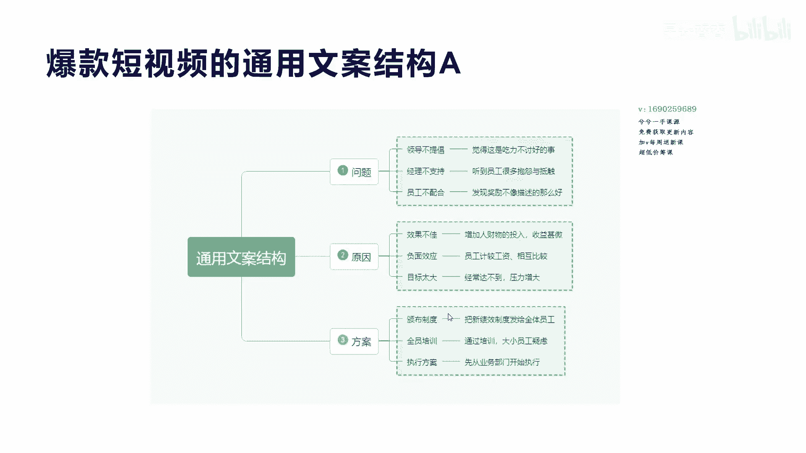
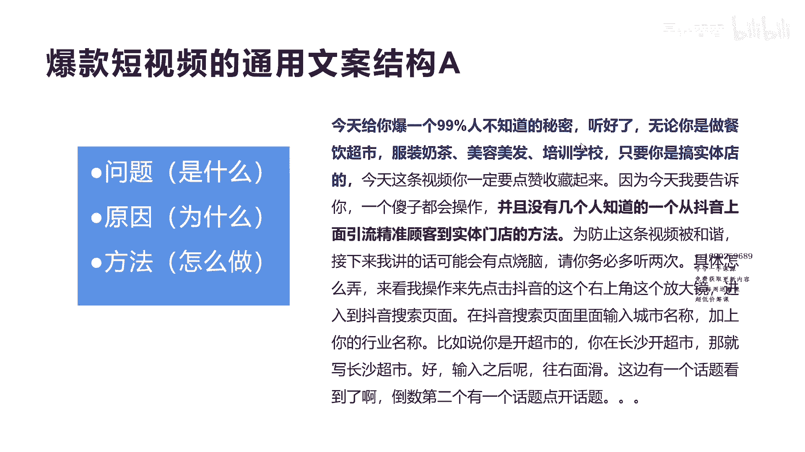
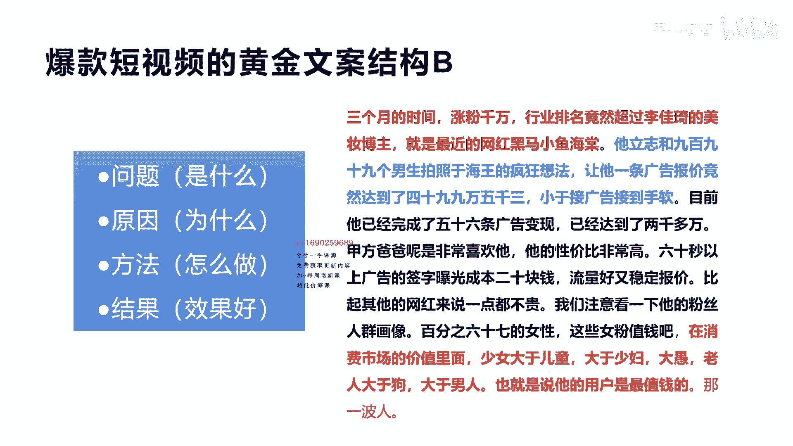
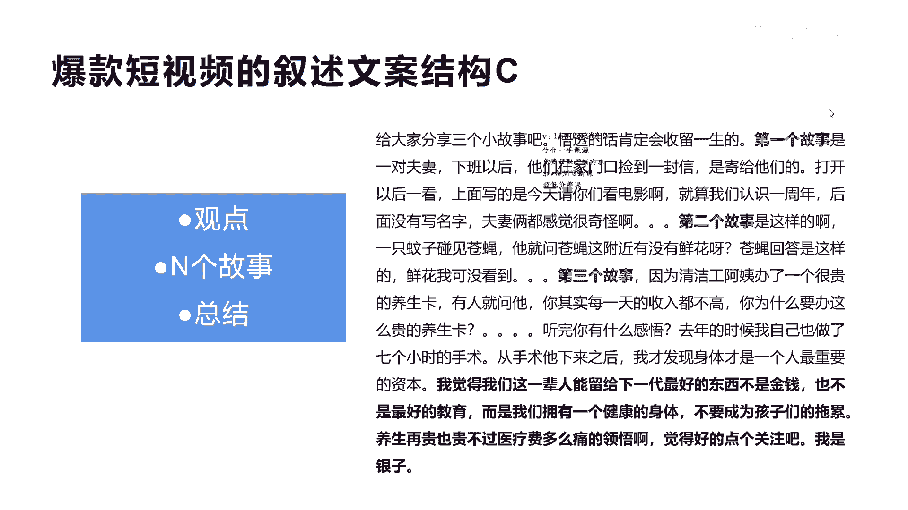
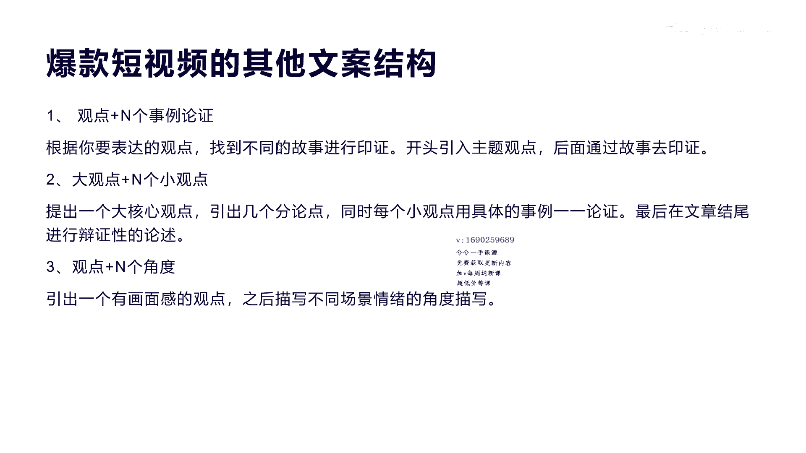

# 042 2023抖音快速起号必修课 - P8：第08节爆款短视频的文案结构-请收藏 - 早安睿睿 - BV1Gn4y1o7rC

好上一节课我们讲了一个呃，怎么去快速选择我们的选题，通过了一个万能公式，那么这一节课我们讲第四节课的，就是爆款短视频的核心文案结构啊，这个文案结构就是讲的，我们怎么去做原创的短视频文案。

这个原创的短视频文案，其实呃所有的文案都是有它的核心结构的啊。

那么我们来看一个啊，通用的一个结构是什么样的，这里有一个思维导图，通用的文案结构是从三个方面来解释，第一个是问题，第二个原因，第三个方案，那么就是通过你的问题，然后找到它的原因。

然后我们通过解决方案也可以说叫三段论是吧，或者是说我们就把它叫做基本的通用框架结构，那么的问题呢我们可以说是啊，比如打个比方啊，有哪些问题，比如说领导不提倡，觉得这是吃力不讨好的事啊，这是一种问题。

提问经理不支持啊，听了员工很多抱怨和抵触，那么有很多问题，员工他又不配合，发现奖励不像描述的那么好啊，这都是问题啊，就是觉得这个吃力不讨好的事情怎么办，这是一个现象问题，那么听到员工很多抱怨和抵触。

这是个现象问题，发现奖励了都不像描述的那么好，但对于员工来讲，它出现的问题，对于员工经理领导，每个角色，每个不同的身份，他会有不同的问题提出来，所以这个时候你提问题的时候。

就要根据不同的人来找到所对的问，那么怎么解决呢，对领导不提倡啊，我们的原因是什么呢，领导不提倡，吃力不讨好的原因是因为效果不佳啊，增加人力财力投入的收益却很很很少，是吧啊甚微。

那么对于经理不支持我们的原因是，因为啊听员工很多抱怨，是因为员工计较工资，然后呢相互比较的原因产生了负面效应对吧，那么呢发现奖励不像描述的那么好，是因为经常你达不到，然后给员工的压力大啊。

目标太大的原因，所以你的问题出来之后，通过你的原因最后怎么办啊，我们来解决方案，觉得这个吃力不讨好的事情，增加人力财力投入的原因，那我们怎么办呢，把新绩效制度发给全体员工，这样的话就就会让吃力不讨好的。

是个问题得到解决是吧，让这个原因，那么第二个呢听到很多员工有抱怨，然后员工计较工资，相互比较，我们可以通过培训大小员工一律对吧啊，来解决，最后我们讲的员工啊，发放这个奖励不像描述的那么好。

经常达不到有压力的原因，那我们可以先从业务部门开始执行是吧，那么整个这就是ABC啊，123的一个解决方案，问题原因方案，这个形成了一个标准的文案结构啊。

标准文案结构我们看一个案例啊，那我们看一个文案，右边这个是文案，我给他加了颜色，第一句话是提问题，今天给你报一个99%，有人不知道的秘密，听好，无论你是做餐饮超市，服装茶店，美容美发学校培训。

只要你是搞实体店的，今天这个视频你一定要点的是他，因为今天我要告诉你一个傻子都会操作的，并且没有几个人好，上面讲的问题是什么啊，你想做实体店是吧，99%不知道的一个秘密，这是一个问题现象是吧。

然后我们给你什么一个原因，因为没有几个人知道从抖音怎么去引流的，实体店方法，所以导致了没有流量是吧，那么方法是什么呢，方法是我给你务必具体怎么弄是吧，你看这方法是接下来我讲的话，可能稍稍脑具体怎么弄呢。

来看我的操作，我的操作呢是先点击抖音的这个，右上角等等等等，123列出来它的方法，所以它整个的结构是问题，原因方法是不是一款爆款文案的结构是吧。

然后我们再看另外一个啊，另外一个是我称为叫黄金文案结构，B黄金文案结构，我们在后面加了一个结果，哎效果很好，一个案例啊，呃就是这个方法用完之后会有什么样的成果，我们看一下啊，第一个问题。

三个月的时间涨粉千万，行业排名竟然超过了李佳琦的美妆博主，就是最近的网红黑马小鱼海棠，小鱼海棠这个涨粉三个月涨粉千万啊，这就是一个现象，一个问题，一个现象，问题和现象一样的啊，要不就是提出来问题。

要不就是一个存在的一个事情，一个现象，那么他的原因是因为他为什么涨粉这么多，原因是因为他励志和99%的狼声，进行拍照的分管想法，这是他因为这个原因，所以他涨粉千万对吧啊，而且他拿到的报价很高。

那他是用怎么做的呢，啊他告诉你他完成了多少，他60秒怎么样流量稳定，它比其他网红怎么样，要注意一下粉丝的画像是吧，他是这样做的，60%的女性都是值钱的，所以她做女性粉丝啊，这个方法所以才涨粉是吧。

那么最后看结果结果就是告诉你，在所有的消费市场里面，少女大于儿童，大于老人，大于狗，大于男人是吧，这就是他总结的一个结构啊，整个这个文案的意思是说，这个小鱼海棠他三个月涨粉了这么多。

他的原因是因为他拍了999个男生，跟他一起进行拍照，方法是因为他的人物画像找的很精准是吧，结果是因为告诉他，正因为他找的精准，所以我们大家都要去怎么找啊，少女要大于男人，这个明白了吗啊这个明白了哈。

好整个这个就是黄金文案的结构，这样的很多啊，大家可以利用这种方式去拆解，任何的文案，都是这种结构，我们再看第三个啊。

就是关于爆款短视频的叙述，叙述文案结构，这个我们称为第三种结构啊，一个观点加上N个故事，加上一个总结啊，我们看一下啊，给大家分享三个小故事是吧，那先就给他讲，悟透的话，肯定会收留一生的啊。

这是给你一个观点很好的一个观点，他说定会收留一生好，他开始讲第一个故事，第一个故事是什么，巴拉巴拉巴拉讲完第二个故事什么，巴拉巴拉讲完第三个故事是什么，又讲完是吧，听完你有什么感悟，开始总结了哈。

去年的时候我自己也做了这个什么什么，然后我觉得我们这一辈子，能给下一代留下最好的东西，不是金钱，也不是最好的教育，而是我们拥有一个健康的身体，不要成为孩子们的拖累，养生再贵也贵，不过医疗费那么多。

痛的领悟，觉得好的可以点个赞，我是影子，那么这个文案你看见没有，非常通俗的，大家去叙述某一个故事，或者讲某一个观点的时候都会这样去做啊，我先讲哎呀，这个东西很好，这个故事这个道理很好，你赶快收留一下。

然后我们讲一个故事，二个故事，三个故事讲完之后，我总结一个道理，整个这个叙事文案就完善啊，明白了，这是一个爆款文案啊。

那我们看最后一个就是其他文案结构，刚才讲的是一个观点加N个这种故事，然后再总结，那么还有就是有向观点加N个实事情的啊，论证就是我讲一个道理，一个观点哎，我把事三个四个这种啊案例拿出来论证。

还有就是我讲一个大的观点，第二种啊讲大的观点，然后用N个小观点啊，那么提出一个大的观点之后，我就啊用很多小观点来论证，最后在结尾啊总结，第三个就是我们讲的也是观点，然后再加上N个角度啊，从父母角度。

孩子角度，从老板角度是吧，从员工角度怎么怎么怎么地去描述一下，这样他的啊文案结构就清楚了，我们为什么要文案结构啊，其实我们小时候我们写作文的时候，其实大家都知道有作文的文和作文结构。

或者说我们在写word的时候都会有讲提纲是吧，你的提纲都不出来，你怎么去把一个啊整体的啊一个文件写好呢，你的提纲都没有，你怎么去写剧本呢，怎么拍成电影呢，是不是啊，你怎么分镜头呢，你要干什么都不知道啊。

是不是，所以整个文案的结构，它是写短视频，文案或者原创短视频的一个核心的开头啊，开头至于里面的啊文字也好，至于里面的剪辑片段也好，那个是属于细节上面的去操作了，好，我们今天就讲了这个关于文案如何啊。

去掌握它的结构啊。

