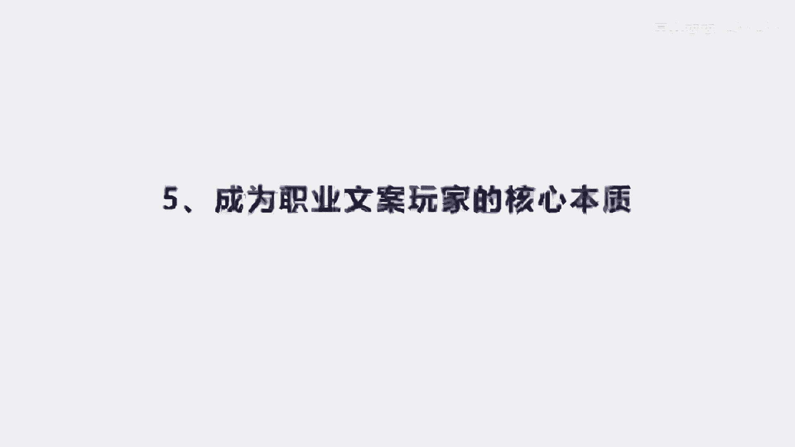
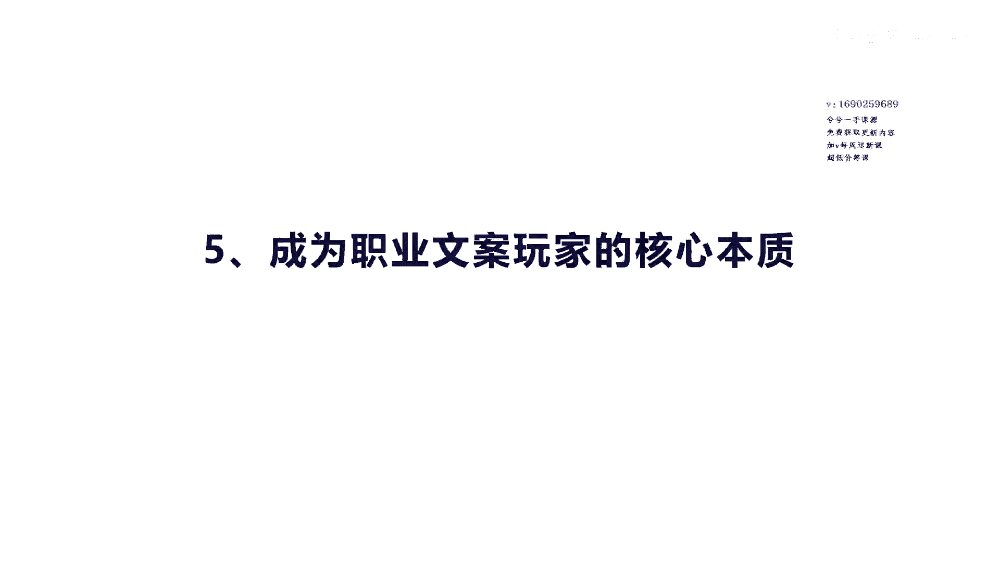
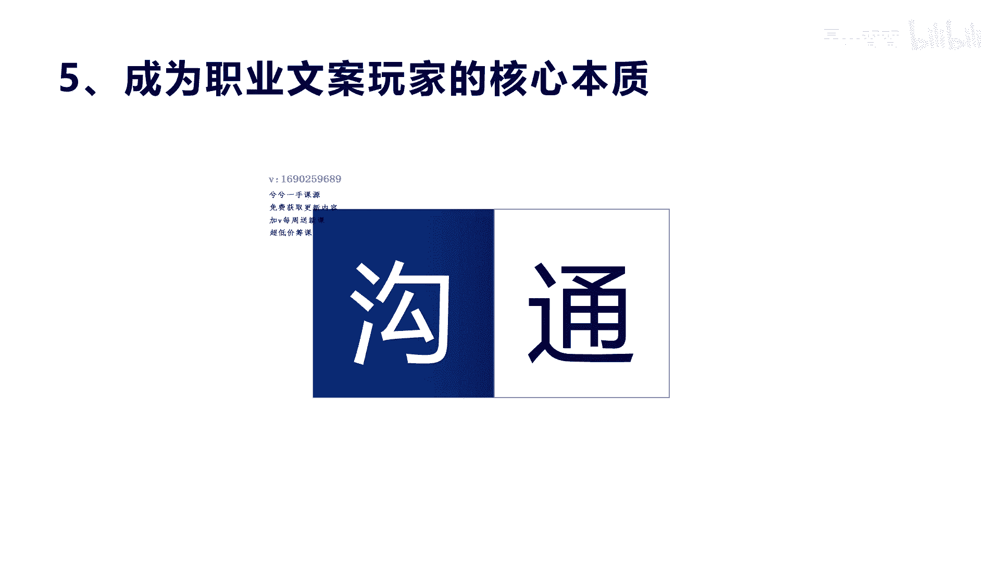
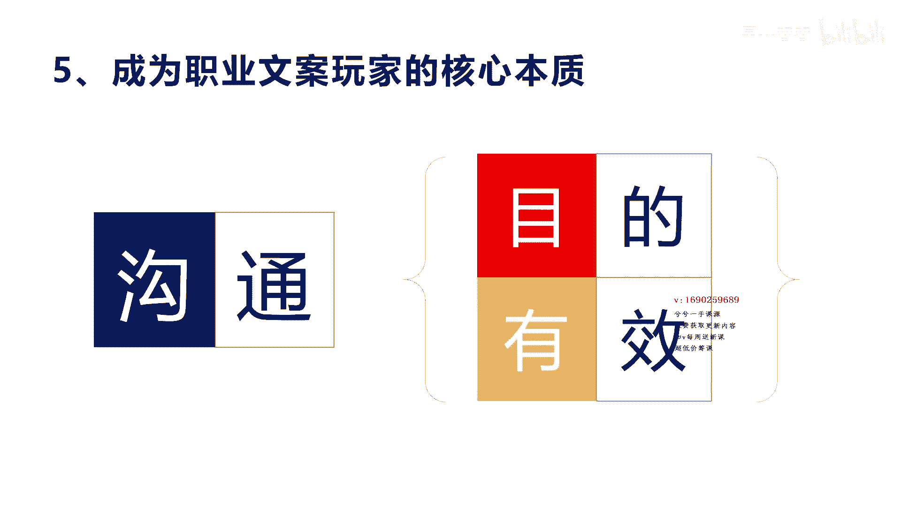

# 042 2023抖音快速起号必修课 - P9：第09节成为职业文案玩家的核心本质-请收藏 - 早安睿睿 - BV1Gn4y1o7rC

好我们讲第五个内容方向，成为职业文案玩家的核心本质，那也就是说你想成为一个文案职业玩家，在游戏上面我们这样去描述一下，所以你在任何的时候，你可以让自己成为一个文案玩家。

应该怎么去做啊，那实际上我们这里讲到文案玩家最核心的本质，是学会沟通啊，有很多人你会发现有个特点啊，就是说我在用别人的文案的时候，我怎么演，我怎么拍，别人就是火火就是不火，是不是啊，这个就是我们讲的。

其实文案写出来是容易，或者说还算可以比较容易让普通人去写，但真正要去去拍摄的时候，你会发现就是活不了，那是因为你没有真正学会去沟通啊，沟通的这个词啊，我们讲的是文案的核心本质，就是这个拍短视频。

他一定是让你去跟对方沟通的这种情景，而不是自己在那里拍啊，自嗨啊，演讲啊怎么怎么的，但也有演讲很很牛逼的，但是他那个演讲一定是跟观众之间的这种互动，演讲还是沟通，所以沟通他是所有的啊职业玩家的最高境界。

或者是他是核心本质，核心本质，他必须得学会用文案做出来的文案，用拍摄沟通的方式，这种感觉去啊去把它演绎出来，所以这里的沟通，我为什么把这个勾字画了个颜色地底色啊，也因为告诉你这个沟通。

实际上在我们做短视频的时候，它实际上就是一个钩子，钩子说明他就是一个什么抓住人心的一个话题，一个问题，一个现象，通过这个问题，通过这个现象，你才可能怎么样去吸引观众。

继续留在你的视频或者直播里面去跟你看下去，才能留住他，那么通呢，其实这个意思就是让大家得听懂，听得懂，听明白，你的文案写出来之后，让很多普通人，老百姓或者是懂这个领域的人都听不懂，你说他怎么看下去。

所以第一个勾我们讲的就是要有钩子，要有话题，要有要有你所引导大家留下来的一个方式，去划出一个主题，通呢就是说你得让观众真正的能听得懂啊，就是口语化啊，什么叫口语化，其实我又又延伸一下口语化。

就是我们讲的真正在写文字文案的时候，你会写啊，你会想我用很华丽的词藻，用很深刻的这个谚语，用很不是的，迟早去把一个文章写得很漂亮，但是呢在真正你跟人沟通的时候，你会发现你用这些文字修饰手法和一些东西。

跟人沟通的时候，讲的那么漂亮，讲的那么那么美，反而会觉得很假，大家听不下去，因为平时我们大家都不是这样说话的，就像你跟别人讲文言文，你说谁愿意听呢，是不是，所以言文你肯定是听不下去啊，虽然你很牛逼。

可以用文言文言来来来讲，但是我听不懂，对不起，我不想看，我不想听是吧，我在日常生活中，我不想听这种词啊，我文字已经受够了，我还要跟你这次受够这个呃，我语音上面和视频上面再给你受一次，很难是吧啊。

所以通就一定要的能通俗口语化的通俗，所以口语化内容怎么去写啊，后面我们也会讲，就是你口语化很简单的方式，就是说你文案写出来之后，你自己去读一遍，你读的时候你就把它作为自己来练来讲。

你会发现有些东西就不是那么回事，你就可以把那个改掉，改成你觉得口说出来比较好的词是吧，哎语气词啊，口语词就这个意思。

我总结就两个，第一个是他的沟通总会有一个目的是吧，你沟通嘛，你跟别人去讲这个短视频，讲内容，你讲产品也好，你讲内容，讲干货也好，讲痛点也好，你会有一个目的，这个目的是什么。

这个目的是告诉别人这个东西有用是吧，或者你想传递给让别人买，是不是，或者是你想告诉他哎，这种方法很有很有什么很有效，你先告诉别人这个东西，这个东西的目的是什么，然后再告诉别人这个东西价值有用有效。

所以整个这个文案呢它核心就围绕着这两点，第一个是目的，沟通是为了什么，然后呢沟通完了之后，你想达到什么，达到有效的结果，这就是沟通，真正要把文案写的好，而不是华丽的辞藻，也不是很漂亮的语句。

而真正是让对方让听众能真正感受到，我明白了啊，我知道你在说什么呢，目的而且我也感受到有效果哦，这个文案才真正有价值。

好吧。