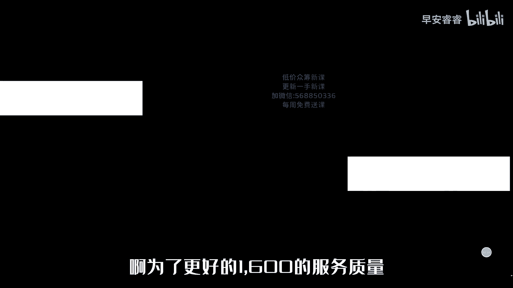

# 045 2023抖音电商0粉起号实操教学 - P1：23-1-10-底层逻辑-请收藏 - 早安睿睿 - BV17E421V75g

进来的不要出去了啊啊我的电脑有点卡，进进来的不要出去了，一定要找一个有本事的地方，不要进进出出你的微信，不要进进出出你的微信啊，等一会儿就开始准备上课了，各位兄弟们，可能稍微有点慢哈。

因为昨天我电脑没弄好啊，不好意思，没关系啊，马上开始啊，马上开始了，8。20了，已经马上开始了，marry菜，菜子过去吧，必定有福，崔明明，进来的不要出去了，我马上开始上课。

一定要找一个不是不要进进出出的微信听课，一定要找一个不是进进出出的微信听课，而且记笔记一定要记笔记，好了吗，好嘞，我现在开始通知一下好不好，我通知一下你1600应该得到的是什么。

我通知一下你1600应该得到的是什么，我先问一下，我的声音有没有让你们听起来不舒服，非常闷闷的感觉，有没有有吗，声音正正常，有没有不舒服的感觉，爆麦啊什么的，我怎么横不过来，我怎么横不过来，你横不过来。

你把手机砸了好，那我就开始上课啊，我就开始上课，然后呢你们一定要听清楚啊，各位兄弟们听清楚，你呢一定要定上闹钟，两天我给你们上一次课，因为我昨天没有上课，所以说我是应该是双号上课，懂不懂。

就是2468十双号，昨天我没有上课，所以说我推迟了一天，那么明天也要有课，每天的8。20上，可我会在群里面发通知群，你不要去屏蔽他，两天上一次课，一个月的微信上的解答，就是我还要给你配个一对一的运营。

到时候，然后呢，每天下午的单号把烟灰缸拿过，每天下午的单号我也会给你们拉，在群里发发一个链接，让你们去听答疑课，你问我答的一个环节，每天下午三点都有啊，然后还有一个呃，你是小白的，听清楚啊。

我再说一遍遍，纯小白，我到时候会分类纯小白呢，超过一个月的，又是我六级的灯牌的，你你好好听课就行了，先不要着急实操好不好，刚好过年先不要着急实操，你是我六级灯牌的，重复听课好吗，重复听课嗯，然后呢。

我现在就开始上课，卡吗，操怎么会卡呢，这电脑不卡啊，那个电脑本来就卡，换电脑，换一台电脑，下一次换一台电脑啊，卡卡吗。

等等等等，非常卡等等，我调整一下啊，卡的一批，卧槽别带节奏，别带节奏，马上马上马上，各位大哥，稍等片刻，不好意思，别带节奏，别带节奏，马上，卧槽还卡吗。

现在还卡吗，性别卡不卡，要是卡的话，我晕死了，我就还卡吗，卧槽，好啊继续啊，两天上一次课，一个月的线上微信解答，这是你1600应该得到的，然后我再给你配个一对一的运营，如果现在卖56万的，听清楚嗯。

现在卖56万的，你也要好好听完好不好，你相信我，你一定要相信我啊，你现在卖56万的，十多万的。

你就当你的小白重新开始好吧，如果一会要直播的。

停播换点停播换点，我这节课一共两个半小时，两个半小时，现在我开始上课，现在我开始上课好吧，各位同学，我现在开始上课啊，老人，你卖不好的就停播就行了啊，停播把我的课程听清楚啊。

我呢我呢我会把你培养成一个运营型的主播，我我会把你培养成一个运行的主播，两天上一次课，听课期间稍微慢一点，前面啊，不好意思啊，我会把你培养成一个运营型的主播和老板，两天我给你们上一次课卡吗。

卧槽这哥们一直在说卡，这哥们，很卡吗，不是卡了几下好，我再讲讲10分钟啊，我再讲10分钟好吧，你们不要进进出出啊，不好意思啊，不好意思啊，来我继续啊，我把你培养成一个运营型的主播和老板。

两天给你们上上一次课，听课期间一定要做笔记，不要进进出出，小白一定要听完完整的一个月，然后你只有听完20天之后，纯小白听清楚啊，完完整整的听完一个月之后，我再给你配上运营，你进步会非常大，成熟的团队。

你相信我好不好，成熟的团队你一定要相信我，你听12天也要听12天，然后下播有回放，但是你要你不听课，只看回放的，你吃不上四个菜，我绝对不割韭菜，然后呢，我希望你耐心，我真的希望你们耐心好不好。

听完我的课大约22。5个小时，然后而且你一定要连续听课，明天的课程也一样，一定要听啊，这抖音分三个板块，一个是人群包，一个人群包，一个是流量来源，一个是你的直播间，一个是你的直播间，一共分三个板块。

我们在起号期间，我听先从零开始，我现在先不说0~1，我们在起号期间，我们只要一种人，一共人群包有1。2亿人，1。2亿人，这样子兄弟们这样子啊，兄弟们，兄弟们这样子啊，兄弟们这样子啊这样子这样子，兄弟们。

这样的，这样子别说话，别说话都别说话，别说话，因为我的设备问题，耽误了你们两天的时间，然后这一批给我记一下啊，这一批的人员多上半个月的课程，这半个月年后多上一个月，多上一个月，多上一个月哈。

因为过年可能还要休息一周左右，好吧好吧兄弟，然后因为年后也有新的课程嗯，增加再增加，然后因为我的原因好吧，然后呢嗯我再给你加一个月，然后关于关于那个嗯，因为年后年后可能嗯嗯年后再说吧好吧，年后再说。

然后我今天就不给你们上了好吧，我今天就不给你上了，然后关于运营老师，我今天不给你们上课了，希望你们理解嗯，我上不下去啊，后续不上吗，上上上，明天我上课一定弄好全部的，明天明天晚上08：20。

各位兄弟们啊，包括一对一的运营，我明天再安排好不好，明天再安排好吗，不卡啊，这个节奏我上不下去的，知道吗，行不行，然后你们第一次，然后你们第一次是还没有上课的啊，还没有上课的，再坚持一天好吧。

再坚持一天吧，不差这么一天了，行不行好吧，等你两天了，可不可以不，行，不行的退钱好吧，不行的，不行的退钱，不停的退钱，我说不可以，可以有用吗，上吧求求你了，我真的不骗你，有节奏，知道吗，资料可以发。

发资料没有用，发资料没有用，兄弟们没有用，我要带着你们去学懂吗，发资料没有用，我要带着你们去学习，知道吗，发资料没有用，我要带着你们去学习，知道吗，兄弟们其实不卡，听清楚你们别带节奏，听清楚啊。

你们别带节奏，你听我说啊，各位听我说，我知道肯定肯定卡的，肯定卡，为什么，要不不可能有这么多人说卡，我从来没有见过这样的节奏行不行，行不行，然后年后我给你延迟一个月就是了呀，对不对啊，延迟一个月好吗。

然后嗯，你们不差这一天嘛，对不对嘛，是不是他在麻烦你，我不是麻痹你啊，不是延迟一个月，课程增加一个月好不好，增加一个月啊，增加医院，明天明天晚上08：20继续上课，先能先安排运营老师吗，不行不行。

你必须听清楚啊，你没有听完课，安排运营老师，你逻辑不通，你明白吗啊，没有听完课程，安排运营，你的逻辑不通不通顺，你会知道吗，明天我继续给你上吧，好不好，我耽误了你的时间，我给你们增加一个月。

给你们增加一个月的听课时间嘛，就这样好不好嗯，运营给你运营，陪跑的运营给你们增加，嗯增加半个月好不好，人工服务好吧，人工服务增加半个月的人工服务说一下，因为过年好吧，因为过年，因为过年一个月吧。

那我也要给我们的运营老师分钱，我给人家增加一个月，那人家我给你，那我也要给人家分钱，为什么何必这样呢，你怎么，好吧，反正我让你们去好好的做起来嘛，行不行啊，你们别带节奏啊，一对一的运营是人工服务。

人工服务，因为到时候要休息，可能休息个四五天，休息个四五天的话，那么我给你再陪上，陪你15天啊，好吗，因为我真的是一对一的运营，我不希望他们他妈的拉个群忽悠，你们知道吗，我到时候会把我的微信告诉你们啊。

该投诉的是去投诉运营给你们服务不好的，听清楚啊，运营给你们服务不好的，你们我到时候给你们个微信，你到时候投诉，我今天先不给你们啊好吗，各位兄弟们，对不起啊，对不起对不起，我今天设备有问题，昨天也是。

我以为弄好了呢，是不是，是是多少对，就是明天我上课啊，明天我上课好不好，明天8。20我给你们上课，等于我就是让你们多等久久等了好吧，然后呢，可以投诉我不可以，我不接受你投诉我好吧，我没事了。

走了去帮着老师听直播间，听清楚再说一遍啊，再说一遍，兄弟们听清楚再说一遍，我说个事啊，再说一遍，我再说一遍。

趁着人多，我再说一遍，我就给你们闲聊个10分钟啊，闲聊个10分钟。

听清楚啊，我再说一遍，听清楚啊，我到时候会给你话术。

我给给你们的话术的框架，你们一定把它捋清楚，到时候你把所有的话术给他搞明白了之后，我不管你卖得再好再好，只要你给我交了钱，只要你给我备注了，没有一个月和半个月的人，工，半个月的人，你跟大婷婷说一下啊。

不管你不管你卖多少钱，听清楚，你卖50万，我都能给你调整啊，你卖50万我都能我的运营都能给你调整，所以你要你，你记住我说的这句话，你既然花了钱，我不会多收你一分钱，除非你来杭州，除非你来杭州啊。

你来我的线下，那线上我不会多收你一分钱啊，不会我不会让你升级升成三千四千五千，我不会升级，那么那么给了钱了，那你就要完完整整的听完我所有所有的课程，每一节课，每一节课记笔记，只要你记了笔记。

认真的去理解了，把所有的话术框架全部搞明白了，兄弟们绝对能改变你2023年的方向，就是自然流量，我不割韭菜，我是最大的自然流量的交付体系，我的交付团队非常牛逼，卡了不要了，出去知道吗，你只要我跟你讲。

我如果连麦的时候，你们晚上你们晚上一定要听我直播，拿出一个学习的态度来，拿出拿出一个学习的态度来，没有任何一个人教你一个方法，就让你扬帆起航，没有任何一个人教你一个方法，你要拿出一个学习态度来。

我拿出我的交付态度来，你拿出我拿出我的交付态度来，你拿出来你的学习态度来，我一定我的团队一定会改变你们的命运，不骗你们兄弟们啊，不骗你们好不好，你们相信我，一定要相信我啊，一定要相信我。

过年期间可能会停个3~4天或者是六天左右，这六天原运营停播停我不停，我会拉语音跟你们去这样去聊我，我我说一下，首先我不会多收你一分钱，对不对，1600就1600，我不可能说你再报个3980。

我再教你怎么着怎么着，除非你来杭州，我的3万9800或者是一个人的3万，然后呢，你拿出一个学习的态度来，我拿出了一个交付态度来，我们每个人学习是双方的，双方双方做的事情，你也要好好做。

我也要我好好交付的情况下，你拿出一个学习态度来，我百分之百的把你教明白，我100%的把你教明白好不好，我到时候慢慢的再给你上课，今天我就不上了，因为真的卡，我的电脑是在迟钝的，我能感觉到我能感觉到啊。

然后明天晚上08：20，各位兄弟们不见不散，明天晚上08：20没有听过我上课的，我希望明天晚上08：20准时来啊，好吧各位，如果你觉得我睡了你两天，我因为我的问题，水两天没有听，没有听过课的。

可以选择退钱，好不好，各位拜拜，各位拜拜轩轩，各位拜拜，你不把我教好，我就是你第二个风景好的啊，拜拜啊，晚上我要播啊，晚上我要播啊，拜拜各位，卧槽，太卡了，把电脑把电脑处理好，然后换那个电脑。

唱首歌再走不唱，唱不了，唱个DER唱，叫我王富贵。

把电脑换了，还是昨天的。

还是昨天的，一定要翻书记笔记，你不听课，搞一个天马长老式的模拟设计方模拟食草，嗯下播后右声音听得到吗，有回音吗，回音大不大，要听听课我讲的，然后再去看回放才可以，一定按照我说的去。

的做成熟的团队听课12天，小白团队听课24天，回音大不大，回音，很好是吧，声音没有问题，是不是声音没问题是吧，没问题，Ok，OK我今天又又有点什么，又差一点上不了课，今天我操先通知前一批，千万小心点。

这个地方不要走人啊，这地方放两个凳子来线，放两个凳子，人群包1。2，一人举报一点一人，流量来源直播间，比如说加好，人群包是吧，人群包没上课呢，没关系，等等啊，等一下啊，稍等片刻啊，等一下我拉一下人。

我这个是，忘了有多久，稍等片刻啊，今天没问题了啊，今天声音什么都没问题了吧，各位兄弟们都没问题了吧，唱什么歌，唱什么歌，OK是吧，OK稍等片刻啊，记笔记啊，找个有本子的，有笔的地方记笔记。

一定要记笔记啊，来一声丞相，不来城墙了，不来城墙了，要好好的把课给你们上完，这两天给你们停了两次课，这期这么多人没有没有，我这是这是一个星期没变的，他那个1000多人是进进出出的，人气人次是人气人次。

同一区1000多人，你猴弟发财了啊，1300人，他是这一周的这一周的进进出出的人，你们进去去，比我直播人都多，有底子的听几天，有底子的听12天听12天啊，有底子的哎呀，有底子的听12天，叮叮嘱呃。

你们一定要完完整整的听完我们的课程，一定要完完整整的听完课程好不好，你们不要偷懒，一定要完完整整听完课程，下播呢有回放，下播也有回放，但是你是这样听课的，我说一下你的听课路线啊，你是这样听课的。

你完完整整的听完就是我人工讲的课，然后你再去反复看回放，然后呢我再给你，我们每一次给你布置的任务，你全部都要完成啊，每一个环节都要完成，你你你你后面起来没有问题的啊，只是起的好与坏呢。

就看你的就是中途实操中碰到的问题，根据运营给你提出来的东西之后，你能不能吸收，知道吗，吸收的有多少，哎稍等片刻啊，20准时上课好不好，20准时上课，这个时候呢你们没有笔的，有本子的嗯，没有没有比本子的。

找一个本和笔字比，然后呃换一个呃，找一个微信，就是说不要进进出出的，老出去回微信，忘了要多久20上课啊，今天没有问题了，今天不会出现任何问题啊，今天不会出现任何问题啊，8。20开始上课。

晚上推荐关注搜索，别忘了有多久难忘，就怕出问题，不怕出问题了，因为我换地方换的，所以说没有提前检查，没有提前检查导致的啊，今天的不要出去了啊，马上开始上课了，2分钟之后开始上课，找个有本子的地方。

有笔的地方记笔记，你听过几次课，这个啊，哦你听过几次这个，真的是你现在拉号有问题没有，那还行是吧，江苏的有吗，操这交开朋友了，2分钟，2分钟之后开始上课，8。20准时开始上课，各位兄弟们，进来了。

不要出去了啊，进来不要出去，期待自己小号纯小白，年前不要起号了，纯纯纯小白或者是偏偏倒倒的，年前不要起号了，就算你已经起号了，偏偏倒倒的，我不建议你用一对一的运营啊，我不建议你暂时用于人工啊。

先不要用啊，你们要有耐心啊，纯小白不要起号，年前啊，纯小白年前不要起号，先听课好不好，过两年之后，所有的快递恢复了以后再说啊，因为线下成都有课吗，线下成都没有课，线下成都没有课，程都没有课。

2分钟之后开始上课了啊，2分钟之后开始上课啊，拉人气，我们不要拉人气，我们不要人气，要人气干什么，不要人气啊，一分钟之后开始上课，马上开始上课啊，杭州有课吗，杭州有课，年后杭州有课，不是纯小白科一起吗。

不是纯小白，哎呀，我建议你们没有起的，先不要起了哈，因为马上过年了，很多快递要停了，太多不确定因素，然后浪费你们的账号，知道吗，浪费你的账号，我是不是很建议你年前再动了，还不如准备好明年，对不对啊。

全部准备好它明年弄个什么呢，来开始上课了，好现在正式开始上课嗯，现在正式开始上课，上课期间任何人我说一下上课上课规矩啊，上课期间任何人不准提问任何问题，因为什么呢，因为我还有。

你过年不回去是吧，过年不回去吗，不会哦，因为我们我会给你两天上一次课，然后呢我还给你配个一对一的运营，对不对，然后每天下午两三点钟还有答疑课，每天下午两点钟到三点钟有答疑课，会有人单独的人跟你对接以后。

你的运营就是他，然后每天让你成长，听清楚啊，听清楚，各位兄弟们，等一下我讲课的时候，下午每两天我是双号上课，也就是明天单号都有人给你做答疑，上课听不懂的各种问题有答疑啊。

所以说上课期间任何人不准问我的问题。

然后现在我正式开始上课，上课期间不准任何人不准提问问题，刚刚开始啊，刚开始上课，然后有回放啊，有回放一定要听完，我人工给你讲的，此时此刻给你讲了之后再去听回放啊，再去听回放，现在正式开始上课。

上课期间一定要记笔记，我把你我们一定要做一个运营型的老板和主播，听清楚，先运营后主播，先运营后，主播一定要记反复记笔记，每节课都要记笔记，嗯一定要听课，明天呃蚂蚱老师上上的课，嗯嗯嗯不是14号。

14号12号了，12号一定要听12号蚂蚱老师上的课，模拟实操一定要听下播有回放，但看回放的吃不上四个菜，要听课，我讲的，然后再去看回放啊，然后成熟的团队听12天，小白团队听24天来，现在正式开始上课。

全程两个半小时，点五小时，OK开始上课了啊，开始上课了，不准说话了，现在任何人不准说话了，各位兄弟们呃，抖音分三个板块，听说抖音分三个板块，一个是人气，一个是人气，人气分三个板块，一个是标签。

一个是标签好，先讲一下人气，抖音的人气，有人群包在看抖音的人，有1。2亿人，看抖音，看直播不算短视频的，在看直播的有1。2亿人，这1。2亿人里面我们只要只有两种人，一种是叉叉，我们不要的人。

一种是我们要的人，我们前期只要一种人，就是正在浏览此类目直播间的人，就是前期你是卖包包的，我们只要一种人啊，我不要任何人去，我们在起号之间，起号期间一定要极度绝对性的精准，只要你做到这一点。

你的账号绝对能起来听清楚，只要你的账号做到这一点，你的账号一定能起来，我们前期只要绝对性的精准，比如说你是卖包包的，你让你的直播间进来的人都是买包包的人，然后抖音的人群包在看你的直播间，他只给你推人。

他只给你推人，通过推荐等各种渠道进入你的直播间，比如说你是卖家纺的直播间，你给我点个饭，我下下课之后吃啊，比如说你是一个卖家纺的直播间，抖音不知道给你推什么样的人，他会通过各种渠道推进你的直播间。

他前天讲过了吗，你还听吗，这个明天有事，你好，你还听吗，你们听吗，好我说一下啊，我说一下兄弟们，我说一下啊，抖音抖音，我第一第一我是真人上课，我可以一个月，我可以一个月给你讲完全不同的不同的内容。

那么如果如果我什么都不懂，但是我是真人上课，我购买全网的课程给你们上课，上一个月屁用没有屁用没有，我三天一个轮回大听老师的课，我的课三天不同的三天不同的内容，反复的让你们去吸收认知。

我让你们每一次得到的内容都是不一样的，每一个内容都是不一样的，我希望你们不要跟我说这种话啊，我再说一遍，我是真人上课，我就算我什么都不懂，我可以买全网的课程给你们上完，每一节课，上他们的课。

但是我没有这样做，听清楚，一定要认认真真的听完，按照我说听完的，做成熟的团队听12天，而且听回放，小白团队24天一定要听回放，而且好不好，对每一次的理解是不一样的，它分三个板块，然后听清楚前面头条。

如果你前面不想要头条流量的，打抖音的官方电话，百度搜索抖音的官方电话，直接给你关掉或者是停播换电，任何流量底下的除了推荐流量，任何的流量都不能高了，然后商城的流量如果多了，起新号期间，新号期间手挂链接。

手挂链接，少挂链接，然后如果你现在是老号，你的商城流量高了，你把你的链说明你的链接权重上来了，你把这个链链接权重链接删了，重新做就行了啊，然后作品删掉，不是不是删掉作品不要去更新了啊。

或者没有用的就删掉了，不需要作品，然后其他不管他，其他的流量都是抖音给你配的假人，然后同城关掉付费，前期不做不卖到五到10万，能不做的尽量不做搜索，不管它关注，不管他，只留下推荐的流量。

前期我们要把你的推荐的流量做到极致，前期我们一定要把你的推荐的自然占比，流量做到极致，然后这里看一下。

各位兄弟们一定要反复听我的课，一定要反复听好不好，一定要反复听好，这个推荐是99%的推荐，推了3300人，我们要把他90的推荐推到3万人，30万人，就是慢慢的做，也就是慢慢的去养成。

通过一天一天的直播，慢慢的去做啊，慢慢的去做，然后我们起起号期间，听说我们是一个家访的直播间，比如说抖音，你在春秋起完全信号的时候，抖音不知道推什么样的人，他会探索学习，探索学习你的直播间。

探索学习你的直播间，给你推什么样的人呢，新注册用户啊，给你推，喜欢看美女的，前面小白的东西要听啊，兄弟们耐心听啊，看美女的，看女装的，看娱乐的，看女包，女鞋加首饰，首饰珠宝文玩茶叶嗯。

百货百货家纺等等等等等等，抖音所有的类目，抖音的类目一共有288种类目，现在已知的类目，它在探索给你推一个他在探索学习你的直播间，反复的推不同的人进来，看一下你能留住什么样的人。

比如说他推一个正在看美女的人，到你直播间，你在卖家访他离开了，然后这个人他会越来推的越少，这种类型的人，他给你推一个看女包的人正在，然后你再卖家访，然后你他离开了，这种人正在看女包的人就给你越推越少。

然后他给你推一个看手势的人到你直播间，你你在卖家访，他又离开了，然后他这种人会慢慢的越少，可以说就是在筛人群，慢慢的像漏斗一样的去漏，漏到绝对的极度精准的人群，然后他给你推一个正在看家访的人到你直播间。

比如说这个人叫侯弟，这个人呢叫侯弟，你呢把他留下了，侯弟你把他留下了，然后他会在你直播间生成第一数据，反包括老号冷启动能返回抖音的人群，包他再去要人，他会刺激抖音的人群，包再去要人。

要一个和猴弟和侯弟卧槽，猴弟看客标签类似的人，通过原始渠道再次的进入你的直播间，和猴弟看客标签类似的人，通过原始渠道再次的进入你的直播间，原始渠道也就是能裂变的，有四个渠道，第一个是推荐的渠道。

第二个是同城，第三个是头条，第四个是付费，听清楚付费前期能不懂的，能能不做的，尽量不要去做好不好，然后头条是可以裂变的，听清楚头条我多说一嘴啊，头条我说了，虽然我的框架一样，但是每次我讲的都不一样啊。

呃头条你是卖农产品的，或者是50家的呃左右的产品的，能吃头条流量的，它非常精准，头条也是可以裂变的，好不好，头条也是可以裂变的，然后同城呢是一样的，同城跟我说的算法也是一样的，也是可以裂变的。

然后推荐我们只要玩自然流量的，只要推荐流量啊，其他的我们都关掉，它不推了，然后我们只要推荐的权重的流量，然后他推一个像猴帝看客标签类似的人，通过推荐，这个时候你的推荐在上涨上涨，因为你没有其他渠道。

你的推荐上涨，然后继续进入你的直播间，又被你停留互动了，还会返回广场去要人，然后这样子又通过推荐，这样子你的推荐的权重会越来越高，抖音是随时探索学习，你的直播间的抖音是随时探索，学习你的直播间的。

如果你在起号或者是问号期间，你违规了，或者是54321成交的数量炸空了，它等于他觉得他就没有探索到你的直播间，他会换一批人群给你，所以说你的账号就犯了，那么我们在学起号期间，一开播给你推一波流。

第一次听课的人回答我，你一个纯纯的新号或者是老号，冷启动，一开播是不是给你推一波这种流量，这个时候，你的直播推荐占比大约都是百分之多少，你的直播推荐占比大约是百分之多少，嗯第一次听课的人回答我好不好。

98回答我一下好吗，我这里不是要你们的互动，我要你们的互动，我又不是要人气，我要你参与好不好，我要你参与正常的，完全正常的账号一定是90以上，对不对，大部分都是95，96，97，98。

那么冷冷启动可能要低一点，那多播两天正常不是不正常的账号呢，多播两天90以上，然后播着播着播着，我们的直播推荐会慢慢的下降，你播两个小时，三个小时以后，你的推荐会降到八十九十以下，对不对，90以下。

比如说90又降到，不管它的话，98，不管它的话又到了88啊，不管他188十七八十八好，这里我们的在线在线260人，我直播间讲过在线260人，你的流量会自动的破到500人到1000人左右，对不对。

如果你的在线同时在线260人，你的流量会自然地跳到500人到1000人在线，这个时候是一个阀门，突然的给你爆开，对不对，突然的给你涨上去，那么推荐也是一样的，推荐也有个阀门，也就是他十个点的阀门。

如果你88的时候，如果你此时此刻的推荐是88，特别是有老账号的，听清楚此时此刻的88的推荐，你一分钟推100人，如果你88L到89，你一分钟是推300人左右进来的直播间，如果你推的是你从89涨到90。

你这个时候可能是2000人在线，2000人的流速不是在线，说错了，2000人的一分钟的进入的速度，他也是一个阀门，我说了，先运营后主播，老主播老运营记住90的推荐，一定会89L90，你看啊。

我们刚开始开播，98的推荐，他给你推流多少人，是不是最多给你推个500人，600人，700人，800人，对不对，是不是啊，98的推荐他给你推个500人，600人，你整个推荐是百分之百。

你最多还有两个点了，对不对，还有啥还剩下两个点就满了，就推满了，就推不了人了，那么所以说抖音要给你一次重生的机会，他要给你这个时候干嘛呢，推假人抖音随时随刻要给你推送假人，老号，老号调推荐的听清楚啊。

你做的比较好的，你现在调推荐的抖音在给你推什么流量，再给你推搜索流量和其他流量和其他流量，然后呢商城流量关注流量，为什么他要给你这个流量增加，他要压你的推荐流量，你如果你的推荐一开播都是98%。

根本就没有劲了，他要让让你的账号的推荐下去下去了以后，然后再通过你的行为，你的话术再上去。

明白吗，比如说这个90的推荐3300。

那么你98的推荐的话，3300和90的推荐3300哪个权重工，肯定是90的推荐3300权重高，为什么你98的推荐已经没有劲了，对不对，这个时候你再想办法把这个推荐给他拉上去，你不用管我的其他占比过高。

你也不用管我的其他的任何占比过高，你只需要拉推荐就行了，推荐拉推荐的最有效的方式就是平均在线人数。

平均在线人数通过流速来的人，那么这个时候如果你的直播间涨到降到百分，降到89%了，88了，你这个时候还安，还会按照你的推以前的方式去直播吗，你还会按照以前的方式去直播吗，成交节奏去直播吗，一定不是了。

你这个时候一定要开始干嘛，开始强憋单骗停留片灯牌，然后骗在线懂吗，一定是拉人气了，为什么我要耐心的把它拉上去，这个时候你的流速是一下就打开了，这个时候一打开就打开了，注意听你把这个打开的同时。

你把这个也打开了，你这账号一下就活了，如果你现在在线只有80人，你不可能打打开这个260人的在线，那么你就骗一个层级，骗一个在线层级就行了，或者是做一个活动，听到了吗，这个没关系，慢慢理解以后。

我再讲的时候，你再慢慢理解，我告诉你这个环节非常非常的重要，听到没有老粉，老粉这个环节非常非常重要，一定要直播的时候反复盯你的直播推荐楼盘，然后开始拉人气啊，各位老粉好，这就是流量怎么来的。

各位这就是流量怎么来的，如果我们抖音不考虑标签的情况下，如果我们不考虑标签的情况下，直接做流量好不好做，第一次听课的人回答我好不好，我们不考虑标签的情况下，直接做流量好不好做，直接做流量。

第一次听课的人回答，我不考虑在线标签，卖东西的话，我们的标签我们的流量好不好做，做过的都知道是非常非常好做，对不对，但是结果是必死必死，听清楚结果是必死，那么如果我们不考虑流量的情况下又必死。

那么我为什么要流量，对不对，我就不能要流量啊，我坚决不要流量，听清楚任何小白偏偏倒倒的PIX字，偏偏倒倒的啊，或者是什么呢，或者是不是很牛逼的人，听清楚不是很牛逼的人，大部分人都不很牛逼啊。

你听清楚一定一定要尽量前期不要流量，尽量越晚越好的，触碰260人在线听清楚，260人的在线是一个阀门，它是一个生死线，你越晚破越好，你七天八天，你七天八天九天破，越晚越好，当然了，这个有些是不可控的。

有些人呢是有些人呢是不小心破的，有些是账号本身权重要高，听清楚啊，各位兄弟们听清楚，他很痛苦很痛苦的，那么你要随时干嘛，D随时在开播之前，随时，随时告诉自己，今天今天会破大流量。

我跟你说现在正在卖56万的，不要着急啊，像我把前面的逻辑捋清楚啊，前面卖卖56万的，随时会破大流量大，在线好，那个这个时候呢你干嘛呢，这个时候你应该干嘛呢，每天提前准备好你的成你的高改低的话术。

高链接改D链接的话术，就是我不骗不忽悠，我就是卖，你看着今天的人气不对，你自己感知，这个只有去感知，你就不要骗了，不要要互动了，直接就卖就停播，卖货把它降下来啊，把它降下来，好所以说我们一定要考虑标签。

任何人都不要提前拿到清楚，任何人都不能提前拿到不应该要的流量，260人在线啊，然后标签一标签我们分为用户标签，听清楚就是你看直播，我每天看直播的时候，你作为一个用户的标签，还分为我们的直播间标签。

直播间标签就是左下角，我们开播的时候进进出出的人，进进出出的人，直播间标签进进出出的人，那个地方的标签还有一个叫用户标签，用户标签就是你从左下角进来，你看客思维也就是认知。

一个人永远赚不到你认知以外的钱，所以说我的任务我就给你反反复复的开认知，各位兄弟们，我再说一遍，我是人工上课，我可以一个月不重复的把循环的去讲抖音，上全网的内容，我哪怕是不懂。

我买过来他们的课程给你们讲都可以，但是你一定要清透我的这三节课好不好，一定要听到我听完我的三节课，好，用户标签分为第一标签，就是你看抖音啊，分为第一标签，你全看的都是美女，大部分推的就是美女。

这是你的用户的看客的第一标签，还有第二标签，还有猜你喜欢，嘶你刷十次，大部分推的是一样的美女，那么你的美女就是你第一标签刷十次，第二多的就是帅哥，那么帅哥就是你的第二标签，还有一些莫名其妙的就是抖音的。

猜你喜欢你在看直播的时候对不对，那么直播间也是也分为低标签，第二标签和猜你喜欢我们，如果你想让你的账号卖的稳定，让你的账号稳定几10万稳定，你必须是随时随刻保证地标签，54321卖十单。

54321卖15单，15单，20单，每一炸每一次成交都极度精准，每一次成交都极度精准，出现这个曲线，然后如果你是这样的啊，第二标签第一炸炸的好，第二炸炸的不好，第三炸炸的又好，第四炸炸的又不好啊。

后面慢慢偏偏倒倒第二标签，然后猜你喜欢就是啊，很久很久出一单，很久很久出两单啊，你想想你现在的账号的情况，我们要让我们的账号完全在第一标签的状态下，抖音是随时学习，随时探索你的直播间。

那么现在我们开播了，我们现在准备开播，我是一个家访的直播间，我是一个家访的直播间，兄弟们，我再耽误2分钟，我再耽误2分钟，我再强调一下好不好，我再耽误2分钟，你们所有人在听课的人。

所有人我希望你们完全相信我好吗，然后呢我希望你们啊不要嫌烦，因为我有我有重复的凡人烦人，我耽误你们2分钟，打断一下啊，因为又一个环节了，你们呢不要嫌烦，因为我有重复的课，对不对，我有重复的课。

你一定要反反复复的重复的听，我相信每一次，因为我这一套课程是得到结论的，嗯我每一次课程你每一次听不同的时期，七你听到的相同的内容，相同的内容你得到的结果是不一样的，你得到的理解是不一样的。

现实中也是现实中也是那么噗，那么是这样的啊，兄弟们就说你当你去实操的时候，你也要回来听，你实操的好也要回来听，实操的不好也要回来听，一定要回来听啊，各位好，来继续，家访，比如说你现在开播了。

这是你的直播间啊，这是你的直播间，你是一个卖家纺的，你是一个卖家纺的，前期听不懂的，没关系啊，没关系，你就能吸收多少，吸收多少啊，好你是卖一个家纺的直播间，你现在开播了。

总有一个人为你会停留而互动和互动，比如说猴弟为你停留，我在你直播间为你停留了，到你直播间，你来一一刷到直播间，你在卖家纺，我到你直播间停停下了，好，我会给你带一个人进来，或者带两个人进来。

或者带三个人进来，不一定啊，不一定，比如说猴弟把谁带进来的呢，比如说猴弟把小小妹带进来了，小小妹带进来了，侯弟呢又把蚂蚱带进来了，猴弟呢又把张三带进来了，然后呢其中小小妹又被你停留互动了。

小小妹还会给你带一个人，带两个人或者带三个人进来，不一定我就不说一个人，两个人，三个人了，我就说一一带一好不好，猴弟把小小妹给带进来了，小小妹呢又被你停留互动了，到你直播间看见卖你套路，她也好。

什么也好啊，又被你停住了，小小妹又把啊哈雷带进来了，哈雷又被你停留互动了，哈雷又带进来一个人或者两个人或者三个人，我就不举三个人的例子了，我就举一个人的例子，又把忘唔呃旺达带进来了。

旺达又被你停留互动了，旺达又带进来了一个两个或者三个，旺达又把晨光带进来了，又把晨光带起来，晨光就是这样一带一一带一一带一，就是这个循环底下那个循环啊，就是看和和又带你和他看看标签类似的人进来。

就这样进来，你的推荐再增加你的流速，慢慢的慢慢的加快啊，慢慢的加快，然后呢，侯弟为什么只能把这三个人带进来，为什么不能把这个哈雷带进来，侯弟不能，为什么不能把旺达带进来呢，是因为侯帝近期。

侯帝近期和小小妹满足了两个条件，哪两个条件呢，第一个是近期，第二个呢是同时啊在一个直播间待过，产生过粘性，那比如说他俩在哪个直播间待过呢，他俩在哪个直播间待过，取决于侯帝，也就是前者和后者的关系。

前者的侯弟的看客的看客思，维的看客的第一标签，比如说猴弟的看客第一标签是家访，那么他俩就在家访的直播间同时呆过，同时呆过，那么你是卖家纺的，她把小妹带进来了，那么没有毛病啊，小小妹又被你停留互动了。

小小妹又把哈雷带进来了，那么小小妹的看客第一标签是什么呢，他俩在哪个直播间同时带过呢，他俩同时在哪个直播间待过，第一次听课的人回答我一下好不好，小小妹又把哈雷带进来了。

小小妹是和侯弟在家纺的直播间同时待过，小小妹和哈雷在哪个直播间同时待过，家访是吧，好不一定不一定你刷到我的时候，你我说了看客思维啊，看客思维你刷到我的时候，你的第一标签是知识分享吗，不一定对不对。

但是最有可能的是家访，但是不一定不一定的话，我们就猜测一个对不对，比如说女包，那么猜一个女包，那么他俩就在女包的直播间同时呆过，那么哈雷呢又被你停留互动了，他把达旺带进来了，那么他就不重要了啊。

最有可能的是女包，对不对，但还有一种可能是其他的，比如说首饰，文玩珠宝，对不对，比如说首饰，那么如果是首饰的话，就在首饰的直播间同时待过，然后达旺又把晨光带进来了，然后他俩呢要看达旺的第一看看标签。

最有可能是首饰啊，由于可能还有其他的男装女装啊，童装如果是童装，就在童装直播间待过，好就这样一带一一带一一带一，流速增长，标签不一定增长，标签不一定精准好不好，标签不一定准。

这样呢你的日这样呢你的流速慢慢的就起来了，然后呢你的后台呢就会出现什么人群画像，抖音就开始出数据呃，卖56万10多万的，不要着急啊，然后就开始出人群数据，人群数据是什么数据呢，就是你的后台的男女画像。

男女画像，男女画像，比如说女性25岁到45岁的女性，然后呢他的占比是90%啊，你的人群画像就出来了。

这里看好这里女性人群画像，女性比例，男群男性比例慢慢的就会出来。

出来以后啊，出来以后，出来以后，25岁到45岁的女性，是不是我们要的精准的用户，前期或者是后期是他滑到我们的直播间，她是不是我们要的用户，25岁到45岁的女性，是不是我们要的用户，各位兄弟们。

第一次听课的人回答，我是不是我们要的用户，是对不对，好好我说我听清楚啊，我的任务听清楚，我的任务是给你们打开你们的认知，让你们不要用自己的认知去看问题，是抖音的看客思维，看客思维就是你作为一个用户。

你作为一个主播，你作为第三者，你认为他是还是不是对不对，OK比如说你是叫晨光，在座的所有人，你的名字叫晨光，你今年你是女性，你今年35岁，你的看客第一标签是童装，你说明你经常在看童装。

你才能生成第一标签，童装的地标签，你刷到一个卖家纺的直播间，你会为他停留和互动或者是购买吗，你是晨光，你35岁的女性，你刷到这个，你会为他停留互动或者购买吗，是不是会的几率比较少了，对不对。

会的几率比较少了，那么所以说人没有用，人没有用，女人也没有用，人群锁定了也没有用，那么前期我们一定要干嘛，前期我们一定要把标签打透人群。

打透人群不一定是男的，不一定是女的，不一定是男的，不一定是女的，也就是说我们直播间的人越多，没有什么用，前期真的越多就越没有留存就越泛，所以前期我们一定要把标签打透人群，打透人群绝对不是男的，不是女的。

人群绝对是正在浏览此类目直播间，喜好行为的用户才是我们最精准的用户，人群一定要打透，他不是男和女啊，人群是正在浏览此类目直播间的用户，才是我们最精准的用户，这种用户不会很多的，前期。

所以说你要人气没有什么用的，等账号大约成长个4~7天，成长速度越稳，账号越不容易死掉，因为第一批的人精准，第二批的人不一定精准，第三批的人开始犯，但你要是用低价，前期你要是上来就用低价，就是亏钱。

就会导致可买可不买的人买，比如说你是卖家纺的好。

你在搞套路，这个晨光是不是也有可有人打会的，看到没有，有可能的，对不对，这个晨光刷到你卖家纺，你把他套路到了草原来，这个家访啊，100多或者是90多，你非得去告诉他，二十九三十九卖给他，他捡便宜。

他肯定买呀，对不对啊，你们要深刻的记住一个数据哈，抖音的罗盘的成交人数啊，决定的是你的标签标签啊。

那么你要是用截个图。

这里你要是用低价的钩子，你要是用低价的钩子链接弹个九块九，抢空了啊，或者是多少啊，就会导致可停留和不可停留的人停留，这些人停留下来之后，你不管他买还是不买，你要他的停留扣一扣二。

加灯牌带来的流量也是泛的，而这些人给你带来的人就越犯，慢慢翻，慢慢就没有留存，账号慢慢就凉了，所有的数据都要看留存，我们一定要正价卖起号小白没有播过的，纯小白根本搞不明白的，禁止套路啊。

禁止跟我直播一样啊，东一下西一下的套路，禁止别单，先建模，模，建模是什么意思，建模就是让你的直播间的左下角进来的人，此时此刻的人进来之后呢，都是买家纺的人。

先把它建好，因为第一批的人和地精准，第二批的人小小妹不一定精准，第三批的人可能就开始犯，不管他是什么人，就开始犯了，慢慢慢慢没有留存，你今天成交的都是侯帝这样的人，那么你账号一定是极度精准。

你慢慢的成交了这些人，那停留了这些人，那么你账号是不是就开始慢慢的量了，一报报流量，报的都是这种人，任何人都接不住，如果一来高流量的时候，来的是这种人，那肯定好结，对不对，同样的主播。

同样的账号肯定好接，所以说我们要慢慢的目的，是让我们来大流量的时候进来的，尽可能的不要把我们的账号拉偏啊，所以说一定要卖，那么我们前期我先说一下账号，我们前期抖音在探索我们的直播间，他在探索。

包括老号冷启动的啊，你本来就不行了，账号他在探索，给我倒点葡萄糖吧，就葡萄糖是吧，我一直难受，他在探索你的直播间，他在探索的时候啊，他不是给你推一个，他东一个一个推一个西一个推一个，他给你推看美女的。

看帅哥了，他探索到流给你推家访的人，你能不能留住啊，你现在开播，老号能启动也好，你能不能快速的，或者是短期内为啥难受，我没吃饭，一天没吃饭，一天都没吃饭，你能不能有点那种，等一下喝口水。

你能不能留住像猴弟这样的人，你一个新号开播啊，你能不能留住像侯帝这样的人，带着家访的看客，第一标签又刷到了你家访的直播间，这么极度匹配能遇见吗，你能不能遇见这样的人，是不是能，但是几率很小。

因为它在探索你推的其他类目的比较多，对不对，他在探索你能，但是几率很小，那么几率小是不是你起号的几率就小，对不对，起号的几率就小，是不是啊，你就容易成交这种人，对不对，你就就你点对点点对点。

你喊他的名字都喊不住，对不对，所以说我们要干嘛呢，前期那么起号就难，型号难，怎么办呢，有几种方式啊，有几种方式，第一种呢就是耗时间，消耗时间，点对点点对点，但这种失败率非常高，失败率非常高，点对点。

然后慢慢的让抖音识别到你的链接，慢慢的，但是这种几率比较小，这是第一种，第二种呢就是第二种呢就是我的方法，我现在包括线下，我在用的方法啊，我线下用的方法，我就是找一些朋友或者自己弄一些账号通过。

然后把这些账号的看客标签弄成，养成家访的标签，看客标签通过直播推荐刷到自己的直播间，做数据做数据啊，通过推荐进来啊，不能通过关注，不能通过其他口头通过推荐进来，然后呢刺激你直播间生成数据返回人群包。

让他刺激人刺激人刺激的什么样的人，取决于他的看客标签，对不对啊，还有一种方式呢，就是啊轻微的啊，100块钱左右的付费去投定向打人，投定向定向达人极度精准，听清楚你投来的定向达人是不是这个人。

你投的定向达人是不是极度精准的，兄弟们，你投来的，他是不是正在浏览此类目直播间的是吗，那么这个人头来了，他会不会买，取决于别人，取决于你这个主播，对不对，取决于你的主播能力对不对。

那么现在我不谈主播能力，我只谈运营，那他投来的和你自己的人，和你或者你的朋友养成的标签，养成的定向达人不是一样的吗，他还他是自己的人，你让他干嘛，他就干嘛，对不对，好我们来刷到自己的直播间去做数据。

做数据做什么数据呢，做第一准点开播，养号准点开播，每天准点开播，第2GMV一场大于一场，做GMV的数据好不好，做GMV的数据，你的营业额的数据一场大于一场，做你的闯关一场大于一场，做你的闯关数据通过啊。

然后做你的开播时长一场大于一场，原来开第一场，开第一场开1。5小时，后面的每一场大0。5多半个小时，多半个小时啊，然后前四天禁止违规，禁止违规，我告诉你前四天一违规一下，让你回到解放前如何不违规。

你不套路就不会有，你不套路就不会有利诱导的频繁互动的违规，然后认真听后面大听老师讲的课，避开所有的违规养号，让你的听清楚，注意听，老粉注意听啊，养号养号是养什么，养直播间的每一次直播。

让你的账号慢慢学习清楚，一定是学习，一定是你的，我们主动进入和抖音的被动认识你学习嗯，然后关于产品清楚产品产品稍微让利，稍微让利，别人卖99的，假设成本69，你卖79，前期还是那句话，养数据。

自己有产品的啊，自有产品的啊，养数据，你在精选联盟上，你可以跟他谈啊，设置佣金，养数据，养什么数据呢，我只为了养数据，我不为了赚钱，我第三天第四天慢慢的开始，为了赚钱，我只为了能赚钱就行了，你拿货69。

听清楚你的成本69，其实对于厂家的话，他可能还有十块钱的利润，对不对啊，你慢慢的先把自己学会它之后，纯小白啊，然后慢慢的去找一个好的后端，不就有利润了吗，后面慢慢的在原始的价格上加价。

然后听清楚绝对性的要求，绝对性的要求，能打单品的绝对先打单品，绝对先打单品好不好，能打单品的绝对先打单品，我再说一遍，任何产品除了尾货和孤品都能打单品，哪怕你是茶叶珠宝建盏，这些都有股都有深度的产品。

一定要先一个单品用尾部流量去过款，那么如果能打一个产品的，一定不要换款，前期一定不要还款，先把这个账号账号打沸腾啊，达到计算，因为单品的驱动器特别低，牛逼啊，然后如果你是做尾货的。

或者是实在没有单品的啊，怎么办呢，前三场一定要把你的直播时长做够，听清楚六小时，尾货的一定要在前三层，把它改明白，他一定要把它改明白，他那么就是用直播时长来拉他，害怕什么，害怕你下播了，明天给你报仇了。

给你爆死了，你还没有标签没有打上呢，知道吗，打孤品的，打孤品的成交，特别是尾货的啊，每场六小时吗，是的，每一场都六小时，前面后面可以缩短，为什么呢，打五尾货的有没有扣个一，打五尾货的或者扣号的有吗。

尾货和括号的有没有程序啊，我能不打尽量不打，不玩这些品好不好，能不玩尽量前期不玩了，我们就后期再玩啊，好我跟你说你们的你们的核心竞争力是什么，你告诉我你的核心竞争力是什么，你的核心竞争力是什么，便宜。

对不对，那么你便宜的话，你的点击转化会高，点击转化会高的话，你的账号特别容易爆流，报流量特别容易爆流量，明白吗，你报流量的时候你没有你大流量来了之后，你没有什么你没有深度的款流量就跑了，因为不精准吗。

也就是说让他快速成长就行了啊，你相信我试一下啊，好OK继续继续继续这第一个问题，第一个问题啊，这个好，然后呢，我们关于接单，关于接单，我们要不要接单，要这个哈雷，这个人叫哈雷的，我把他憋住了。

他要他他会给我推达旺，这个人达旺进来童装，他进你直播间买的几率不大，可能会流失，对你直播间的数据会有影响，这个人我们要不要我们憋不憋，憋他的话他会推泛流量，不憋着的话，他会连流量都没有了，懂吗。

连流量都没有了，前期先不要憋单，慢慢的两场三场以后开始微微憋单，听清楚啊，别单分为一定要知道你的每一场的环节，停播就是点对点啊，平波就是点对点，有人要我就放卖啊，就谈就价格优势不赚钱，对不对。

补贴或者多少多少平波啊停播，然后第二个呢就是we v v鳖，就是轻轻的忽悠啊，忽悠个5分钟，6分钟就给他炸了啊，5V憋单5分钟啊，5分钟左右5分钟，然后啊憋单10分钟左右，强憋10分钟左右。

强憋单15分钟到20分钟左右，或者到40分钟看情况啊，强别单，我们这每一个环节要分清楚啊，前两场一定是平播，然后三场你觉得起流速了，或者是第二场开始起流速了，后面你开始微微的去套路，开始加一点互动。

这样那样这样那样让他去忽悠他啊，挑战一下他的极极限，然后呢大流量来的时候不惯他臭毛病啊，不可能为你一对一服务了，就开始接单了，不惯他臭毛病，以综合数据为主啊，然后急速流量来的时候啊。

就第一波流量开始强憋单，15分钟到20分钟啊，急速流量有极速流量呢一定是15分钟，一定15分钟啊，好然后我要不要要要要别单，按照层级别单，按照层级别单，按照层级别单，我的层级分为这个层级，是我绝对性的。

按照五是我们基地这一两年来实操出来的，绝对性的经验好不好，按照层级别单，0~30人，可以从零个人，十个人憋到30个人啊，接单在线，如果你30个人在线了，你就54321就要放单了，54321就要放单了。

懂吗，做尾货也要憋，听清楚了吗，前期也要去做停留，做那个呃浅层数据的数据，后面V鳖好吧，V别V鳖就是要数据，但是不是5分钟一轮，你是急速过款的，急速怎么来的，你们听不懂的，听清楚啊，听不懂的。

你只需要听就行了，什么叫五四负二，321是放单，你给我听好不好，什么叫54321放单了，你这个问题问的我快死了，我想碰死了草，我说一下啊，各位兄弟们，我们的水平参差不齐，没关系，你真听不懂。

一星期以后你可以找我说，我要求单独给我上课，我也不收你一分钱，我找人给你单独上课都可以好吧，他可能讲的讲的偏偏倒倒我底下的运营，可能讲课啊，讲的偏偏倒倒他或者是我们的同学，我让他单独给你讲都可以好吧。

你先别问你先听行不行，你别问出这么无知的问题来，你说我交了钱就是学的听清楚，我不是教你这个的啊，我不是教你54321，什么叫54321放单的，好吧，好来继续啊，继续继续，你们不懂的，你去听物看直播。

慢慢的你就会了啊，慢慢就会了，好零到这个叫养养乐多的，是谁割的你的韭菜，我请问一下，你把钱是交给谁，谁割的你的韭菜，你咋这么下沉呢，是谁哥的脸，好嘞继续啊继续啊继续啊，兄弟们继续按照层级去接单。

如何按照层级去去去接单呢，啊如何按照层级去接单呢，他可能生气了啊，不管他了，不管他了，生气生气了又小气草好，如何按照层级别单，0~30人是一个层级，也就是在0~30人以内，你可以去忽忽悠悠地去玩。

忽忽悠悠的去玩，可以稍微的忽悠我哥哥是吧，那我就含着泪也要把你嚼完，0~30人，然后30人到60人到80人，1。1点来，然后80人到130~160人，160~180到230，好像掉了个层级。

好像我看0~30，30 36881316161823，然后260以上是一个层级，好吧好吧好，别打字了，别打字了，我们按照一个两个三个四个这四个层级啊，别说话别说话别说话啊，别说话了，别说话了。

然后0~30人一个层级，我去接单，0~30人一个层级，听清楚，在这个时候的时候，你不可能零从零个人直接干到40个人，或者是60个人，不可以不可以不可以要到五个人，十个人的时候诶，我就开始做成交了。

或者是刚开始一个人的时候做成交了，好不好，一个人两个人的时候，有药的时候，你就开始做成交了，然后慢慢的两三天以后哎，你从30个人绝对禁止小白，或者是偏偏倒倒的人，从30个人直接拉到130人。

从30个人直接强骗到或者强，你从30个人直接拉到130人，只有一种可能就是骗，不能这样子做好吧，不能这样子做，一定要慢慢的啊，这个层级待一次成交，待一次成交，比如说我在80人啊的时候。

我开始54321成交，卖卖货，哎，80人能卖七八单或者7~10单，比如说诶你觉得合适，那你下一次再80人再还是7~10单啊，或者是8~10单啊，那么你下面就可以往上拉了。

收回来封单之后可以把他拉到130了，或者开播可以可以忽忽悠悠到130了，或者160了，如果你80人只能卖一单，两单兄弟不要了，降到60人或者30人去不去炸，去炸你，你会炸的更好，降到三。

如果你80人听清楚，老主播清清楚，如果你80人只能炸的不好，不如以前大的好，那么你就要降到降到60人去炸了，或者降到写到60人，或者到30人再炸了，为什么，为什么你们有没有这种情况，我200人。

200人或者是1000人还不如啊，100人成交的数据好，有这种情况吗，我200人还不如100人的数据好有吗，有的打个一，200人还不如100人的成交好行吗，或者1000人还不如200人的成交好好有。

是不是啊，那有就说明一个情况，你已经破层级了，犯了太泛了，那么怎么办呢，你应该调到100人去啊，把那个底玩明白了再扎上去，懂不懂为什么呢，兄弟们，他的逻辑是什么逻辑呢，我给你们看一下他逻辑什么逻辑呢。

稍等片刻，稍等片刻，稍等片刻，稍等片刻，他的逻辑是什么逻辑呢，你们看一下，在线高反馈的数据要求不一样，什么意思啊，诶等等等等一下好。

他的逻辑是这样的，比如说你是卖珠宝的，看到没有珠宝的这个人呢曾经搜索过钻石，或者是看过做视作品或者什么的啊，比如说你是卖珠宝的，你是卖你是卖60~120的珠宝的，他前期30人的时候。

他就给你推这样的珠宝的人，然后呢看客思维哈，然后呢你到60人的时候，他给你推这个人曾经搜索过钻石，曾经看过黄金的，咳咳你再去搜一个，你是卖戒指的，他给你搜扩成项链手镯的，对不对，扩成项链手镯子了啊。

珠宝都给你弄成翡翠的了，慢慢退退退退退退退退退退越来越远了，懂吗，再给你换一个类目，比如说花卉，比如花卉，花卉好不好，花卉好，你是卖花卉的啊，你刚开始呢是卖花卉花卉，比如说你是卖那个什么的，不是花卉。

花卉太大了，比如说你卖绿植，你你是卖绿植的，对不对，你是卖绿植的，那么你卖绿植的呢，你卖绿植，第一轮呢是绿植，你你你卖什么生兰花了，什么兰花了，他给你推兰花了，兰花推完之后呢，你你30人了没有了。

他给你推花卉的啊，花卉的有关花卉的叶片的，再买盆子，对不对，买买买布料的，买室内的买家庭就是有有些人新装的房子，他是不是需要花费，是不是新政好手机，华为这还算精准，在70人，80人好。

如果这个这个叫什么空气净化的，是不是花可以空气净化买净，买空气净化器的可能会买花，一定会买花，对不对，花盆的你也会慢爬，那么你要是好，这个时候都是精准的，80人以内都是精准的。

都与他有相关相相关联的关联的强，然后到后面的弱，对不对，好我们到了弱，你比如说零个人，你拉到80人了，他就弱了80人，然后叫停原装饰好，我们你直接拉到80人以上，我们到了庭园中式了，对不对。

我们到了庭院装饰了，那么我们再看庭院装饰，好我们80以上就开始这样换，停车装饰好石板凳，小灯笼，防水啊，防水呃，植绒看到没有，户外照明，你在装饰吧，户外照明你要卖装饰的，是不是有照明的要买啊，对不对。

但是照明和花可能有点问题了吧，太阳能灯和花扯得有点远了，就这是100人了，可能拉到900人了，不是拉到100人以上了，可能就户外防水了，又对不对，如果你拉到1000人呢，我们又在拉到200人以上呢。

直接跳的话，那可能就是户外防水了，那户外防水更更撑腰，不要了，你卖花对不对，比如说男女就乱了啊，唯品会了，又到了对不对，优品户外防水太阳能围墙灯，对不对，点火器了，又到了，它的成交几率就更小了。

虽然人群是差不多的。

但是还是不一样，越来越慢了，也就是我说的第一批，第二批的人精准，第三批的人不一定精准，所以说一定要慢慢的来好不好，那种人没有用，对不对，那么那种人是这样，那种人都是这样一个一个的带进来的。

一个一个带进来的，但是为什么我们30人不会偏呢，啊它是筛出来的啊，筛出来的慢慢的漏斗漏出来，漏大了就不行了，是不是啊，OK为什么我要去接单呢，我为什么要去接单，听清楚你是如何进入，为什么你要去接单。

你是如何进入我的直播间的，猴弟的直播间的，你是如何进入猴弟的直播间的啊，你是如何进入我直播间的，你就知道为什么我要憋你了，我开播你是不是要憋我，我是不是是不是我要憋你兄弟，我开播的时候是不是我一顿套路。

你们对不对，我12点我12点开播，我为什么要套路，你们半小时听清楚，仔细研究我的套路话术，我专门这是专门教你们的，我的套路话术啊，我讲新规，我天天说讲新规，有个屁的新规，我为什么要。

套路你们听清楚为什么注意听，为什么，好然后这是我的直播间，这是我的直播间，侯弟猴弟，这是你猴弟的直播间，猴弟的直播间，猴弟的直播间有800人，800人在线，我直播间有800人在线，其中张三。

是我的第一看客标签，在我的直播间停留互动好吧，他在我直播间停留互动张三，但是呢一个小时之前或者昨天或者是什么时候，张三，一小时，假设哈一小时之前张三在干嘛，张三在某一个童装童装直播间。

在一个童装直播间和你一起看童装，然后此时此刻的我，你们在其他的直播间看，我又开播了，张三也在我直播间，你这个时候又在看抖音，此时此刻张三被我停留互动了，张三的第一看课标签是知识分享。

他就会又带一个两个进来，近期代购的直播间，比如说女包女童装在童装直播间待过，把你带进来了，他不光带一个，他带了，比如说我的账号权重高，他带了七个人进来，剩下的六个人都是干嘛的，都是买童装的用户。

买童装的用户，他我讲新规跟他毛关系都没有，除非我送童装，明白吗，但是其中有一个你是做童装的商人，你一看一听，我他会讲抖音响行为，你就在我直播间留下了，我直播间就多了一个精准用户，然后其他的就进进出出。

进进出出进进出出进进出出，我就筛我不光筛张三，我还删你一次，我筛我直播间，我又开始删你，我又开始筛你，我又把你塞进来，然后呢我又又开始筛你，我干嘛呢，我拉你的停留，对不对，我开始忽悠你，对不对。

我拉你的停留，我开始忽悠你，对不对，兄弟们好，我又在干嘛呢，我又在忽悠你，我开始这此时此刻我我也我还是不讲，还是憋，你，为什么呢，抖音是随时锁定你的看客行为的，抖音抖音随时改变你的看客看客行为来。

我给你一定要听明白啊，我是随时锁定你的，我你一进来之后，兄弟张三把你带进来，张三负责把你带进来，后面交给我的话术了，我开始锁定你，锁定你干嘛，讲讲新规，讲7分钟的循环话术好，你就听了，对不对。

你就开始听，停停停停停停停，我在套路你套路你套路你套路你，我再听听听听听听好，我没讲，我没讲，我没讲，以后呢，你等了十多分钟了，然后你从我直播间出去了，你出去再划两个直播间划到的是什么。

是不是越来越多的诶，怎么又有一个讲电商呢，是不是奖励相当于做了嗯，这个赛道打开了，对不对，我就改变了你的看客行为，对不对，有没有这样的人，自从你让我锁定了以后，你看到的讲电商的人越来越多了。

你会第一个人，你应该会看到晚晚这些人，对不对，会越来越多了，那么我憋单憋，你的目的是你在我的直播间GGM，你在我的直播间GGM，你没有听，你让我忽悠了，对不对，你下一个直播间在晚晚的直播间。

在晚晚的直播间，诶晚晚在讲内容，这个人讲的挺好的啊，我听听他吧好吧，你原来不是看知识分享的，你哎你再玩玩这看了，当你退出去抖音在滑的时候，你还会滑到我，因为你有看客行为标签了，你还会滑到我。

这个时候我在连麦的话，你就会停留了，知道吗，知道吗，但是你是精准的人了，你也会从他直播间带人进来，把人带到我的直播间，把他的人带进来，这就是我为什么让你憋单，这个人30个人，我就算它不是，它是不精准的。

你锁定了他，让他出去之后看到的是童装的啊，你卖童装的，你锁定它之后看的你卖童装的锁，它把它锁住了之后啊，停留时间越长，他划到的童装的几率越大，他在划到你直播间的时候，他还给你带精准的人进来懂吗。

有可能他滑到别人直播间，别人也是一样，在憋他懂不懂嗯，他给你带来的人就改变了，就变成精准的了，明白了吗，各位兄弟们明白了，我先先讲的是运营课啊，先把逻辑给你们讲明白啊，先把有逻辑给你理解了。

这是第六次才理解过来嗯，一定要反复理解，好不好，反复理解，反复听课，你不同的时间听到的内容是不一样的，好这一节主课我就给你们讲完了，我再换下一节课讲了好吧，换下节课讲了有点难理解，没有关系。

我还会讲好不好，还会讲啊啊你你先按照我说的要求，你能听懂，对不对，你先说的要求听懂了，然后我再把逻辑给你讲明白了，你就相信了，对不对，你就相信我说的了，你就会按照我说的去做了。

为什么我要反复的去讲逻辑呢，我不给你讲方法，听清楚讲方法，你是死的，你跟个傻子一样，按照照说按照去做，那么你是没有脑子的，我要把看客思维给你搞明白，就这四个字啊好吧，先听什么，先听你的弄懂好吧。

然后听不懂的没关系哈，第一有回放，你下去要看回放，第二呢我还会讲，还会用其他方式去讲啊，来继续继续，我们进入下一节课的话题啊，继续啊，你什么时候有老二，明天早上11点钟，哎呀，那今天晚上我播不播了。

你约小雪，到时候一块吃饭，你先播一会儿吧，又不播了，好等一下啊，小白没关系啊，小白你还没到那个境界，到时候会按照我说的去做一些事情，事情做完之后你再回来再听就行了啊，小白没关系的。

老师我习惯性的第一场憋单就会犯吗，是的，是的兄弟，我一听你问的这个话题，像个娘们一样问话题啊，像个像个像个早点睡好，来我说一下，我们既然啊第一种方法就是我们点对点啊，看客思维等于直播间标题号标签吗。

对等于你一个用户啊，直播间播嘛，我我不行，我播一会吧，我想想我想想，各位啊啊啊12：30我不播就不播了，来说一下啊，第一种方式，那么第二种方式一定要能清楚啊，嗯那么我们要节约我们的时间成本好吧。

节约我们的时间成本，找一些朋友帮你，一定要找朋友帮你，小白也好，听清楚啊，一定要让朋友帮你，一定要让朋友帮你，那么我们玩的是0~1的精准流速，自然流量正价起号自然流量一定能稳住账号。

千万不要被付费所误导，千万不要被付费，这样吧，我直播晚上八点钟六点钟我们去泡澡去好吧，五点钟好，千万不要被付费所误导，随时手上有备用直播账号啊，他俩在哪，你快找他俩，跟他俩说一下。

因为抖音不给你犯错误的机会，抖音听清楚啊，等等一下，兄弟们，等一下等一下等一下等一下好，抖音不给你犯错误的机会啊，啊注意听注意听，一天播两个账号，你的目的是锻炼团队，你的自身价值一定要值这个钱，兄弟们。

你在抖音上也好，你在现实生活中也好，你能不能赚到钱，听清楚很核心的一句话啊，你在抖音上也好，你在你在抖音上也好，你在现实生活中也好，你能不能赚到钱，取决于哥们，你是不是那样的。

你自身价值能不能挣到这个钱，兄弟你出门就低头哈腰的操，你就是一个弟弟，是不是，对不对，你出门啊，就这样这样的进来，谁都这样，你就爱欺负，你，跟人有一个刮蹭哎，对不起对不起对不起大哥。

这是你就是挨骂挨骂的那个主，所以说你自身价值要值这个钱，你才能赚到钱，这个很重要，好不好，这个很重要，然后呢团队才是王者，一个人做主播的，你永远卖不了太多钱，1万2万的，那因为你忙不过来。

播十个小时的主播和播100个小时的主播，你的直播能力完全不一样，所以一定要多播账号，这才是核心，主播和团队一定是练出来的，听清楚不是教出来的，是练出来的，我告诉你方法，我教会教会你走，教会你跑。

能走多远，能跑多远，那是你自己的问题，所以说一定要多播账号，但是一定要捋顺了再去播，不要瞎播好不好，各位兄弟们，你们只要你拨了，你能不能拨两个号，你一天你在家，你干两个号，你往死里干，只要你干不死。

你就往死里干，用你爸爸妈妈的身份证全部都去干，好不好好吧，七大姑八爷的一次身份证拿过来，失明了之后反复干，好吧，兄弟们，你纯小白啊啊天天叨叨的用，你就是练就是练啊，我告诉你你自身价值才能值钱。

然后你看我播了多长时间了，我一天播5~6个小时，我一年365天，我至少播300天以上，我今年我今年播了多少天，我今年后台显示我播了331天，好像是兄弟们乘以六小时，六小时，2361千8361千八。

我播了2000个小时，今年今年我播了2000个小时，你才干了多久，你只看到了别人的成功，你没有看到别人的起步，知道吗，那你的起步就是什么，我告诉你多播账号，先按照我的方法啊，按照我的方法多拨账号好吧嗯。

一天播两个号好不好，纯小白练好吗，你反正慢慢的我把运营教明白你，然后主播慢慢的去练就行了，主播不值钱好不好，前期练啊，好继续好，那么所以说呢我们我们呢找托一定要找托儿，为什么你找朋友，你找托。

比如说你找了十个托，比如说你找了十个五个朋友帮你啊，一个朋友帮你两个不是同时帮你找了十个托儿，这十个托儿可以相对不同的账号，你练号的时候，它又是一个新号，对不对，一个托可以在N个号上使用啊。

找托起号的助攻号，十台手机，20个抖音号哦，如果你是一个人的，听清楚一个人的一个人的，那么你找你的三五个朋友帮你怎么帮我，到时候告诉你好吧，你不用着急，一个人的你找人帮你，然后两到三个人的买个几个手机。

加朋友帮你听清楚，我朋友一定要帮你好不好，然后一个团队的一个团队的啊，做公司的，你连这个都不不找你，你该穷，你连这个都不投资啊，该你做不起来，抖音号，20个抖音号，找亲戚朋友员工帮你，然后接验证码。

接到你手机来上来啊，然后自己办点卡申请抖音号就行了，买十台手机在闲鱼上买啊，两三百块钱一台，300块钱一台也就剩一台，300块，十台手机不差钱，20台手机好吧，让朋友帮你也可以啊。

好一台手机同时可以登录两个括号，比如说你的朋友嗯，他可以帮嗯嗯登录两个括号，一台手机对不对，不能超过三个啊，一个卡可以放热点，一个WIFI，你朋友在家里有网吗对吧，他连他连这两个号都没问题啊。

不能超过三个，可以三个，但不能超过三个，这是要求截个图，来这里截个图，截个图，这里好不好，截个图很简单啊，很简单，你只要去做就稍微有点麻烦，但是他建模速度快呀，是不是啊，要下单下播，用一个支付宝呃。

三四个都可以啊，三个问题不大的啊，三个三四个问题不大的啊，好继续继续截个图啊，截个图，兄弟们，这不是核心啊，核心就是起个步，两三场后面的哈，靠这个啊，靠练好不好，一天播两个号可以吗，兄弟们。

一天播两个号好不好，嗯一定要一天播两个号好不好，111天播两个号嘛，你可以呃，小白嘛，你少播点时间嘛，播两三个小时嘛，就这样，你先练嘛，你只要播不到10万，你就一天播干干两个号啊。

然后晚上看我直播好继续呃，把你的时间充分的全部百分之百的用起来，好不好，把你自己啊累死就行了，累死在嗯那个直播间，累死在直播间啊，好进入下一节课，怎么黑屏了，你看你急的那个叫贝贝的，你慌个嘚啊，你慌。

继续继续继续啊，继续继续继续诶，继续啊，好养号养号很简单，养号很简单，就是把自己的账号去对标账号当粉丝的形式，每个直播间加灯牌就可以了，扣一就可以了，点橱窗就可以了，养个两三天，一天养个两三个小时养成。

我只要这一个目的养成，正在浏览此类目直播间的用户，托儿和直播账号都要养，就你卖鞋子，你就一直看鞋子就行了，看看孩子，其实养号开播之前，养号的最大的目的是，日账号的出生时间，你不能申请个账号。

你不能把账号一申请直接开干吧，对不对啊，你连行为都没有，直接就干直播吧，对不对，肯定没有流量，肯定会断流，肯定会那个什么很容易啊，这叫养号，养个七天，对不对，养个三出生个七天，一天养个两三个小时。

对不对啊，这叫养号，养个两三天也可以，但是有风险，但是可以啊，老号老粉成交占比过高的，听清楚啊，老粉成交占比过高的，一定要先打单品好不好，老粉成交占比过高的，连打七天的一个产品，一定能把它打下来。

一定能打下来吧，他做尾货的听清楚啊，你只需要频繁的去要灯牌和快速的，前三天的起步就行了，没有话术就是产品啊，打尾货的成不是老粉成交占比过高的，过个两款三款的啊，找一个单品连打七天，你必下来。

因为你的老粉成交，老粉占比过高，不是一天两天涨上去的，你是十天20天涨上去的，所以说你也要慢慢的打啊，想在抖音上赚到钱，听清楚思维要纠正，先沉淀，多听少问，多思考，想在抖音上赚到钱，沉淀太重要了。

沉淀太重要了，知道吗，沉淀太重要了，没有办法没有办法啊，好口碑分听清楚，有小店的啊，有小店的听清楚所有的发货全部电话追踪好评，所有的，前三天在起号期间有脚垫的全部电话追踪，买一个生活号去打啊。

害怕他不接，对不对，高客单价的产品一定要引流到私域流量，做孤品的首饰，文玩珠宝的，茶叶的孤品的高客单价的，要回购的，听清楚，你不需要人气，你只需要30人，60人在线就行了，但是我要求你听清楚。

我要求你所有的低一点，所有的人只要他在你直播间互动了，你一定要先把他的灯牌要出来，必须要给你，不给我，不卖给你都可以，这第一个第二个这个人只要对这个产品，你觉得这个高客单价的，你觉得你对他感兴趣了。

他对你产品感兴趣了啊，你先用一种方式，你先骗他也好，忽悠他也好，你说哥你先点一下一号链接，你先点一下成交啊，你可以先不付款，然后呢我给你详细的给你看一下细节，或者展示一下细节，当他代付款之后。

你立马后台打电话过去，另外一个人电话上把他成交了啊，让他在直播间下单了，你说你先下单，在你起号期间，你说下单吗，帮个忙，还帮我做个数据，等下退款都可以啊，电话上，先把它成交了，把数据先做了。

今天你的数据没做好，后台多打几个电话，让他去帮你刷单去，他是精准的人，知道吗，不能用你的直播账号打啊，我告诉你，你把这一点吃亏，他做孤僻的好不好好吧，卖高仿的怎么卖，高仿的高仿的，你管你怎么卖。

不一样卖吗，高仿的高仿的不是产品吗，啊不要用你的直播账号打啊，做孤品的，听听有做孤品的吗，高客单价的孤品过品的，高客单价的有吗，包括高客单价的超高客单价的女装，在你的起步阶段，一定要让他去把数据做了啊。

好继续，继续好打电话的好处是什么，收到货之后打电话的好处是什么，第一保证我今天再加一个新内容啊，兄弟们好，不用来，第一保证你的好评率一定比不打强，兄弟们保证你的一样的啊，化妆品一样的。

美妆的赛道建模就行了，保证你的好评率一定比不打强，就算不给你，最起码不会给你差评，因为你是第一时间打过去的，有小店的一定要去做前三天，因为前三天在出口没分之前一掉分，你直接歇菜啊。

长期下来还会增加你的平均停留和你的回购啊，你有这样的专门的部门，我希望你每天都打五六十个电话，长期开播期间，一定要用你的托儿和你的客服去聊天，一定要用你的托儿和你的客服去聊天，为什么刷分聊天的次数啊。

每一个细节做到极致，好不好，每个细节都好好好嗯嗯好好好嗯嗯嗯好，3分钟回复率，保证你自己的账号，回复的最后一句话是我们的客服，别人说谢谢，你要说不客气，或者是发个什么，你不能不管了，要不扣分。

物流口碑分，及时退款，打开飞哥能外包的，一定要外科外包抖音，所有的要求签的合同一定要给签了，然后，客服端口有显示买过的人咨询，买过的人咨询啊，买过的人咨询啊，这个时候迅速的专员把电话给他打过去。

只要这个人买过你的东西，只要他咨询你，他跟你说，如果他跟你说了一句话，各位兄弟们啊，他给你说了一句话，哥你好，你的产品非常好，但是小了一点点，你这个质量很好，但是我买的尺码不对，这个算不算负反馈。

这个算不算负反馈，你的质量很好，但是我买小了，尺码不对，都算负反馈，抖音这一点有点恶心啊，抖音这点有点恶心啊，算啊，知道吧，所以说我们不要让他再这上面去，什么直接电话打过去，因为这个咨询的人并不多。

好不好，然后飞哥飞哥平台做小店的啊，3分钟回复率，飞哥平台能外包的一定去，能外包就外包出去，自己没有的，自己没有客服的，一定外包出去，不要自己回，因为你是早早上的八点钟到11点钟。

你不在直播期间都算知道吧，所以说能外包的抖音第一怎么外包，第一抖音放大镜搜索飞哥外包，第二第二海纳聚创，海纳聚创我的公司，海微信号，海纳聚创，0088找我外包，也可以找我打电话。

这个单独外包抖音上好像是最便宜的，八九百块钱啊，我是1200，但是服务质量肯定是不一样的，你可以去先用他们的，再用我们的用一下好吧，第二呢我不是打广告，我也不是给你们给你们制造焦虑啊。

第二也可以给你打电话好吧，你自己去谈，加这个微信，截个图，不要加啊，先截图啊好吧，然后继续，我不是给你讲这个制造焦虑啊，我不是给你们讲这个制造焦虑，曾经因为负反馈或者是口碑分掉分的账号，掉亮了的。

账号凉了的，扣个一好不好好吧，我不是给你制造焦虑，我说给没有受损，没有被伤害过的人啊，我绝对不是给你制造焦虑，他特别特别特别的重要，后端强则前端强，那么如果你是在精选联盟上的产品。

如果你是带精选联盟的产品，精选联盟产品先选店铺，因为不是你的店铺，但是他的店铺只要一掉分这个分，分三个小分三个小分，它平均分不掉，三个小分掉了，你都会影响，知道吗，所以说你选别人的店铺，你无法左右他。

那么怎么办呢，你要先选品，先选店铺，先选店铺，他的店铺一定要什么，一定要分高选铺，选店铺原则，选店铺原则，第一高分第二，稳定稳定才是更重要的，它分可以不高，4。6，4。7可以不高，但是它不掉。

他在优化中，我跟你讲，没有任何一个店铺分无缘无故的高的，一定是他做了维护的嗯，嘶他做精选联盟一定是在上面投了很多钱的，在上面啊，没有一个店铺无缘无故的分高的，一定是做维护的，所以说一定你选那些啊，4。

95他妈的明天掉成4。8了，后天又涨成4。9了，大后天又掉到4。7了，操你先观察一周选，先观察这几个店铺，一周或者三天3~7天吧，好3~7天看他掉分稳不稳，他稳，你就带他的，他4。84。7，但4。

7的稳，4。8不稳，我就肯定带4。8的和4。7的，对不对啊，一定不就是带精选上的啊，一定要先选店铺，要选稳的店铺，各位兄弟们选稳定的店铺，稳定店铺原则好吧，还有正在做的全品类的啊，正在正在直播的啊。

做的比较好的，听清楚，千万不要轻易的，用不熟悉的店铺的链接，你如果不熟悉这个店铺，你挂上他的链接，你的号还有一种可能妈的从此断流，从此断流，知道吗，从此断流，所以说我们要做电的时候啊，加加链接的时候。

这个电你一定要观察他这个链接谁带着，正常不懂吗，你还加个链接，直接断了，好来继续好，涨粉涨粉怎么去涨粉呢，直播头像啊，直播的账号我说的都是重点啊，废话我就不说了啊，废话你自己啊。

直播账号换成加号加领取头像，等一下我发到群里去，这个图片你把头像换过去，开播之前换过来就行了，那选对标账号，一个人气质量比较高的直播间，发一个红包，涨粉5分钟领取的红包大约两块钱，能找一个粉丝通品。

就是常见的产品，老号冷启动涨得越多越好，新号涨个50~100个，开播之前涨的啊，24小时之内，涨粉的账号绝对比零粉的账号权重要高，但这个头像呢不能新号就直接换好吧，不能信号就直接换啊，然后你开千粉了。

到时候问你的运营怎么开都行啊，问你的运营怎么开，运营会告诉你的啊，开千粉了，不要刷千粉啊，不要强开橱窗，运营会告诉你的，OK好有老号的，起新号的，我本来就有一个老号打尾货的老号，我要起个新号。

我也有老粉，对不对，老号是A新号是BA老号开播，今天开播，B账号开进去，新号到你的老号的直播间，然后老号搞活动，搞福利，别单让他们给新号点关注所有星号，等一下送福利或者免单送啊，关注一下新号。

然后当天开，当天引导当天开播，12点开播，老号给新号涨了20个粉丝下播，你说我马上开播啊，告诉他什么时候开播，当天引导当天开播，加上自己的托，两天必起来，百分之百的起来嗯，有老号的螺旋就行了。

好抖音的核心是什么，听清楚粉丝灯牌才是抖音的核心，只要有粉丝灯牌，你的流量肯定不会断，老号冷启动，用这种方法非常好用，冲锋直加灯牌双屏共振，听清楚啊，在你没有做成交之前，灯牌算一个小的成交。

灯牌比付费都牛逼，你能不能起号，能不能稳号，能不能起来亮，一定是看你要灯牌的话术的钩子的不，既不违规又有力度，就这个话术抖音的成交分为两种，第一种是产品成交，第二种是娱乐成交，对不对，灯牌就是娱乐成交。

但是一定要有了标签后才去忽悠别人，好不好，你不要连标签都没有，你上来就忽悠，按照层级去忽悠啊，按照层级去忽悠灯牌非常非常的重要，非常非常重要，好我们要灯牌的话术是什么，你要灯牌的话是什么，加一个灯牌卡。

一个马甲，点一下小黄星，加入入一个团，赠送一个牌子，任何话术诱导的话术就是不同的话术，表达相同的目的，不同的话术表达相同的目的，扣一打个一说个要清楚，是不是一样的好，你给我加个灯牌，点一下，卡个马甲。

你在频繁在一分钟内加个灯牌，加个灯牌，加个灯牌会不会违规，肯定违规好，现在灯牌和歌舞团还是只能不能要歌舞团啊，千川打的仙粉可以吗，可以可以啊，加个灯牌卡一下小红心啊，入个团，不同的话术表达相同的目的。

兄弟们，你们帮我卡个马甲吧，兄弟们，你只有帮我卡个马甲，我才给你这个给你直接给你送了，这个是不违规的是吧，有这个那个的隔开，一定，在诱导的诱导的期间加上嗯啊这个嗯那个，这个这个文件怎么没带上呢。

这个那个明白吗，诶怎么没带上呢，哎这个文件怎么没带上来，一定在啊里面加上嗯啊，这个那个隔开一定要隔开，话术啊，一定要隔开，一定要学会骗啊，我们要触碰抖音的底线，从失败中找原因，这个话术不能用了。

我们一定要触碰抖音的底线，从失败中找原因，稍等片刻，我怎么来这儿了，稍等片刻，他说特别高，我们要触碰抖音底线，听清楚是这样的，关于违规哈，关于违规，关于违规啊，关于违规，前期千万不要违规，前三场啊。

前三场不要违规，后期要破层级的时候，强憋在的时候，宁愿违规都要破层级，你觉得你可以破层级了，我他妈的宁愿违规，我的破盾机知道吧，但是破了层级以后，一定要告诫自己，缓冲一下。

自己的话术不要沉淀在韩式那种话术要降下来，你的语态语速啊，这个一定要记着啊，关于违规，前期千万不要违规，后期要破层，宁愿违规都要破层级，我宁愿在千人直播间苟活，我都不要在个位数直播间停播，懂不懂。

你上去了，前期上去了就抓住那个机会咬啊，好继续进行下一节课。

最近下节课，啊为了更好的1600的服务质量。

所有的1600的用户全部转移到这个微信，现在不要去加，现在不要去加好不好，现在不要去加，不要去加，为了1600更好的服务，现在不要去加加这个微信，这个微信是我在我一，我每天呢你有什么事。

有什么有什么事情可以跟我说好不好呃，你可以跟我聊天，但是你不要问我，问我问题我不负责，我只给你讲课，我因为我给你配了一对一的运营了好吧，然后呃这个微信干嘛用呢，你也可以说一下你现在的情况。

跟我说一下情况，我可以给你分析一下啊，不不不是关于电商的问题啊，你目前的情况就作为朋友嘛对吧，但你不能帮我当运营，为了更好的1600的服务，所有的1600的用户全部到时候加这个微信，现在不要去加嗯。

我会发到微信群里面去，你们的群里会有会有一个文件里面，什么我打号的视频啊，嗯你的运营啊什么都有啊，这个微信呢是我的微信，你干嘛用的呢，投诉用的，投诉谁呢，投诉我给你安排的运营，他给你吊儿郎当的。

不给你好好复盘，他回复的速度有一句上一句没有下一句的，明白吗，然后他给你嗯啊是的很好嗯不错，他给你搞这些玩意的，你一定要投诉，听清楚，问when必有，有答好不好问，必有结果，答必须有结果。

他跟你含沙射影，让你迷迷糊糊没关系，第一有可能你现在的理解程度不一样，第二有可能你的他没有完全理解你的意思，那你就反复的去确认，但是你不能用不同的方式问同样的问题，好不好，问必有答，答必有果。

然后如果他给你吊儿郎当的嗯啊是很好哎对，就这样，就这样，他给你整这些东西，他不给你一个结果，你就投诉他好不好，对你的实操中没有得到帮助，你就要投诉他投诉的微信，就这个我每天会看两个小时好吧。

那么你不投诉他，活该你自己认的1600啊，我不欠你的，你也不欠我的，你该投诉投诉他，我就扣他，扣他钱都是了，我给你调整，我就会管，如果你投诉了我不管，那就是我的问题，如果他给你服务不好，你又不投诉。

那是你的问题，好吧，你们现在在的运营，他们负不负责任不负责任，你可以再告诉我好不好，各位兄弟们直接点名字在这告诉我，还有运营出现的问题，我可以优化行不行，因为他也要打号啊，因为他也要自己也要打号。

所以说呢可能有的时候呢啊，它有它的服务时间点，他有他的服务的时间段，他有他的服务的时间点，可能和你的时间点不对称的话，你就告诉他约，反正不影响你第二天直播，你每天下播把你的罗盘发给他。

今天碰到的情况发给他，然后你等他给你回复就行了啊，不影响你第二天直播，然后你乱七八糟的问题，每天下午有答疑课，你也不能老是什么是什么，什么是什么，这样是这样，这样是这样，兄弟啊。

你实操中的问题只给你解决好不好，你1600你也不能当爹用，对不对，你也不能都是你老婆嘛，也会烦嘛，我们互相理解一下，好不好好吗，实操的问题啊，关于你实操的问题，我给你配个运营，到时候，然后抖音7号八号。

604778899和抖音电商，这些是用来报名用的啊，报名用的，你不要问他，我看有些人问他呢，哈师傅在吗，这个帮我看一下，我说你有病，是不是，我那天看到了，我直接语音说，兄弟你有病，这客服知道吧。

暂时不实操的，你要搞清楚，因为我的公司呢你给我备注好，因为公司呢我的负责的部门有点多，所以分的比较细好不好，暂时不实操的，你告诉运营，我暂时不实操哦，实操的时候开始计算时间，我呢也不割你的韭菜好不好。

我呢也不割你的韭菜，一般化消食降一般化什么意思，你直接说啊，就是我也不跟你九菜，你实操的那一天，正式实操的那一天开始做，开始给你计算一个月的时间好不好，如果你的实操什么是算实操呢，有些人实操呃。

呃问了20个问题了啊，然后就说啊，我现在才开始实操，当你问第一个问题的时候，开始算实操，当你问第一个实操中的问题的时候，开始算实操好吧，我也不割你的韭菜，你也不要白嫖我好不好，我说了，人工服务。

我会给你详细的服务，拉语音都可以给你啊，哪些问题是3万的，你有问题就给你回答，没有问题，3万不知分，没有问题，3万之分，你有问题他就给你回答啊，然后他该他让你进步就行了，现在说一下运营的问题好不好。

说一下运营的问题，我觉得啊就是说有些人呢有些人是这样的，有些人就是啊，我就是就是就是永远得不到他想要的答案，那没有办法，那没有办法永远得不到你想要的答案，那没有办法，那你故意的内鬼的，我心里有数啊。

没关系，你我接受我接受你的任何投诉好不好，我接受你的任何投诉，我接受你的任何投诉，你说他这样也好那样好啊，给你瞎回答也好，这样也好，那样也好，对不对，我接受你的任何投诉，我觉得这个投诉不对，我也不理你。

我自己有我自己的一个评判和脑子，好吧，我也不知道你是谁，直播间是谁，反正是我，我正儿八经给你什么就行了，可以吗，啊就是那个谁说有个叫啊，明白吗，但是你问的问题是什么，你问的问题是啊，呃小白就先听了。

年后再配嘛，啊你问的问题是老师，我没有流量怎么办，操运营不会给你精准回答的啊，好吧，好话术，现在说一下话术说一下哎，不是说一下那个什么，来说一下这个嗯，还有一个兄弟们，还有一个啊。

还有一个就说抖音呢是一直在学习的，一直在学习的，你们呢，也可以报一下别人的课，你们呢也有之前报过别人的课的，对不对，也有我们其实可以产生对比的啊，可以产生对比的兄弟们知道吧，可以产生对比的啊。

真的可以产生对比，你可以对比一下嗯到底是多少钱，服务什么样子，可以真的可以对比一下，来说一下关于托的问题啊，啊说一下最后一个环节啊，呃你们首先一定要听蚂蚱老师的实操，一定要听蚂蚱老师的实操啊。

我说一下托的问题，还有你们一定要听我的直播，连麦一定要听我的直播，连麦你们问的运营的所有问题都在我的直播间，连麦会呈现都会在我的直播间会呈现，你们一定也要去听一个网络，最多有三个括号。

然后呢直播账号的网络必须独立，不要跟他们混合，不要混合，不要混合啊，你的行为就是官方的大脑，你的屏幕呢就是官方的眼睛，我们拿来的托之后拿五个也好，十个也好，20个也好，不能直接搜索我们的直播账号。

抖音容易看到啊，搜索他的时候，他不管你，当你搜索了之后，又又在直播间做数据的时候，他可能就要干你了，知道吗，你的行为抖音都能有记录的啊，所以说前期啊我们进入前期，我们互不相识，谁都不认识啊。

都是独立单位，先搜索对标账号，比如说你你的朋友，你让你把你的对标账号给他20个，你说你关注一下这个好吧，在他的直播间加灯牌点关注，搜索个四五个，搜索了以后呢，直播账号和托去各个对标账号的直播间。

当粉丝的形式加灯牌点关注就可以了，扣一就可以了，鱼塘不是本意，主要还是模拟实操和后面我给你捋的那个话术，包括好在中间发现了问题，在广场里面滑到，我不管你怎么去养号，我只要一个结果，我要的结果是什么呢。

直播广场推荐刷十次，大约是六次，是你的对标账号就可以了，你买鞋子的，我有六次是买你，你准备卖鞋子，我刷十次，广场啊，六次是买鞋子的就行了，这个鞋子的价格呢和款式呢跟你要极度相匹配，如果你是啊卖运动鞋的。

你去高跟鞋里面去刷刷对标，那肯定不行的，好不好嗯，你是运动鞋的，卖99的，你去刷成299的，肯定也是不行的人啊，什么意思跟狗一样，什么意思啊，王正阳在里面喷人呢，好继续啊继续啊。

别别别别别别在底下吵架啊，就是说你的狗一样，别别别别吵架啊，继续啊，我跟你讲违规是正常的啊，违规是正常的，所有人都违规，我也会出现违规，没有任何人能避免百分之百不违规的啊，这个违规是尽量减少违规啊。

一个基站有限制吗，到时候运营会告诉你的啊，鱼和基站有关系吗，嗯有关系啊，运营会告诉你好吧，能用的一定要用好吧，然后结果是直播网上推荐刷十次，大约有六次是你的对标账号就行了，好明天我要开播了，兄弟们。

明天我要开播了啊，明天我要开播了，明天我要开播了，然后托啊，不管几个托儿，这一天呢一个也好，两个也好，五个也好，你们呢托儿和托和直播账号听清楚，托和直播账号同时进一个直播间进去好吧。

脱盒直播账号同时进一个直播间进去，我说的是有误导的啊，是有误导的，因为有录屏啊，有有拿去卖录屏的，真正的还是靠你的运营说的为主，好吧啊，托听清楚啊，托和直播账号同时搜索一个对标账号。

卖鞋子的进去进去之后呢，啊进去之后你们是不是都在一个直播间了，进去之后停留20分钟，20分钟期间扣一点关注，加灯牌，20分钟之后，我们的直播账号发一个5分钟领取的红包，然后我们的托给我们的直播账号。

点上一到两个关注，一到两个关注好，一到两个关注，一到两个关注，具体怎么做呢，到时候蚂蚱老师会讲实操模拟实操，模拟实操，每一场怎么做，包括话术什么他都会讲嗯，他不是本意啊，我讲一下就行了。

这里啊他不是本意，不重要不重要不重要。

重要的是逻辑啊，他的逻辑是什么逻辑呢，这个这个逻辑什么逻辑呢，这个逻辑是什么逻辑呢，兄弟们，这个逻辑是这样的，之后呢，呃等一下，出现违规停播两天有限制吗，停播两天没有限制。

今天停播两天会好一点，好继续，好托儿，明天我要开播了，做这个行为，然后呢同去呆5~8个直播间，5~8个直播间，一个直播间待20分钟，跟出去认识更多的人，让托和直播账号同时走在一个直播间产生粘性。

然后同时又认识更多的人，他的逻辑是什么呢，我们自己的托儿和这些这些直播间的人，撮合这些直播间的人啊，这个直播间的人啊，所有人啊，你们所有人都会产生粘性，所有人都会产生关系，当我们自己的账号开播的时候。

我们的托儿进入我们直播间的时候啊，我们开播的时候拖再进去的时候，托盒曾经待过直播间的人，就会第一首选推送到你的直播间，明白吗，托就会第一首选推送到你的直播间，他这个逻辑啊明白吗，兄弟们嗯，明白吗。

能用的一定要用啊，反正用的都都会把钱赚到啊，三场直播就就就就开始纯小白，三场直播就开始开始把钱赚回来了，不骗你好，继续继续他这个逻辑好。

继续好。

我不是有一个微信吗，来这里这里截个图，来截个图，有回放啊，等一下啊，截个图，今晚今晚开播，截个图啊，去截个图啊，你们一定要按照我说的去做啊，来继续，我说一下啊，我说一下，稍等片刻，我没吃饭，我喝我难受。

好来我说一下，一会儿我给你一个，有没有要话术的，有没有话术的有吗，有没有话术的，扣个一，卧槽看到没有，兄弟们，兄弟们看到没有，看到好，要画说的清清楚，要画出的，OKOK没有问题，然后呢。

我不管你是做什么的啊，假设你是做女包的啊，随便你做什么的啊，假设你做做女包的啊，我给你一个带货榜单上的女包的话术，给你一个带货礼包的话术啊，带货网上的很牛逼，牛不牛逼，带货榜上的话术牛逼吗。

兄弟们带货榜上的话术牛逼吗，肯定牛逼不牛逼，他不可能上带货榜，对不对，然后给你以后呢，你你做不起来，你回来找我说，老师你给我的话术我做不起来，怎么办好，这哥们还要画树生鲜的操，你还要的挺详细的啊。

给我个牛排的操，你还要挺详细的，OK给你个牛排的啊，我去录个屏给你，我说你按照他的话术去打好吧，小白按照他的话术打，你说我没有做起来啊，没有做起来，我说人家拿着我的这一套，你去我说你去关注一下某某人。

你看看他的话术，他是我的徒弟，他拿着我的话术，拿着我的话术啊，已经每天卖多少钱了，人家怎么可以，你怎么不可以嗯，你要个锤子，这话术没有用啊，话术才有用，听到了吗，树才有用，画没有用，听到了没有，兄弟们。

你还要个牛排的，你还要个几把海鲜的，生鲜的，你要的挺详细的，我发现你兄弟听到了吗，嗯你像个有病一样，兄弟要不你做不起来，明白吗，兄弟们，你去天天话术，要话术，你去带货，榜上全是高级话术。

怎么全是高级话术，那么我们怎么办呢，那话术重不重要，话术极其重要，可是任何人，教你的话说都他妈骗子好吗，都是骗子，明白吗，都是骗子好，然后我怎么怎么办呢，我们要话术逻辑框架。

我们要框架话术抖音是一个公开课啊，都能看到，对不对，一个框架，我给你一个，我给你一个我打号的视频，你按照我打号，我先说一下啊，兄弟们，我先说一下啊，兄弟们，学习是拿出一个学习态度来的，你按照我说的去做。

你百分之百能做起来好吧，百分之百能做起来，然后呢，你把包括做尾货的啊清楚，你把我所有的打视频的话术框架，你先拿一个本子听清楚清楚，你先拿个本子和笔，把这几个话术拿出来，你先把这个话术的名称拉出来。

当你做的不好的时候，我考你话术的时候，你要支支吾吾的啊，你就吃不上四个菜，你把我打号的视频，我到时候会发到群里去啊，给你个视频，你把话术的拉什么叫拉新话术，什么叫痛点话术，什么叫成交话术。

哪句话是有助于成交的，就是关于要成交了，产品介绍对，什么叫价格对比，什么叫价格拆分，你现在是迷茫的，对不对，现在对这个话术的框架迷茫的扣个一迷茫的，扣个一迷茫的，不知道它到底是什么。

叫你不知道什么叫价格对比的，不知道什么叫痛点话术呢，好迷茫，树上你先把这些话术搞得不迷茫，什么叫这些话术，卖衣服的，你出去找别人的直播间，我的话术没有穿搭，话术没有朝你话术啊。

你先把这些话术列出来列出来，好不好，列出来，你先找个比先这样列出来，列出来以后，我给你一个大号的视频，你按照我的号的视频好，拉新话术，我里面有拉新话术，写出来，痛点话术写出来，把我的把我的。

你先把我的一模一样的话术写出来，T套进去，每10分钟每10分钟就能套进去，套进去顺序的没有顺序，没有顺序，先按照我的套进去好吧，80人以上的，60人以上的，嗯套进去60以下，哦你下40人以下也可以啊。

蚂蚱后天给你们讲课，模拟实操12号12号给你们讲啊，妈妈给你讲，然后你在没实操之前，你先把我的话术列出来，特别重要特别重要，先列出来套进去，把所有的画都套进去，然后这是我的一模一样的套进去，兄弟们好吧。

一模一样的套进去，套进去以后，套进去以后，包括成熟的团队也套，你相信我好不好，成熟的团队按照我的做，我告诉你你我100%都能让你，你本来就成熟团队，我你扣我一个点就够了，你先套套的，其中就有奥妙。

好不好，套进去以后把你的产品的话术改了啊，该改的改了，不适合你的，改掉模板也有了啊，顺序按照我的顺序，一比一的，我干了什么，发了发了红包，什么时候发的，我此时此刻的链接以及话说自己去研究啊。

你必须必须要做这件事情，我告诉你，你想卖20万，你想卖10万，你只要，想控住，控制住流量，你必须要去做嗯，曼曼这两天一直在研究嗯，好然后然后注意，成熟的团队语态语速，自己去调整，好吧，你必须必须要做啊。

作业交给谁，作业交给你自己，爱做不做不做，拉倒兄弟们不做，明年打螺丝做了，明年听说做了做多了的啊，特别是成熟的团队，听清楚小白我就不说了，每个人认知不一样啊，成熟的团队明年巅峰时刻不做，明年。

工厂管吃又管住，多久，发视频马上好吗，好等一下我就关了，等一下我就结束了，今天啊等一下我就结束了，结束之前结束之后，你们做的事情是听清楚，第一结束之后一看回放，不要觉得他浪费时间，我说了。

学习是一定要拿出一个学习的态度来，一定一定拿出一个学习态度来，明年的3万什么时候开放，不知道，明年等一下啊，3万9800有啊，学习一定要拿出一个学习的态度来，第一看回放，第二白天看我的话术视频去做。

反反复复的看，一周至少看一次，你成熟了以后好吧，3万是收小白的，都是小白，无所谓啊，听清楚好，年后的，3万9800团队，你是做团队的啊，2~4个人，3万9800，来杭州十天陪跑，我们给你。

我们最好的老师给你打一个号，打一个号，从0~1，1~2，给你走一遍，给你走一遍，可能会可能会包括包括付费啊，可能啊不一定啊，是正月初，18，今年的第一批商家，好吧，夫妻档打什么啊，这是团队哈。

个人我先先先不收啊，个人是在我这呆45天，或者长期留在我这边啊，在杭州，这是商家年后的3万9800的团队，然后利润利润的抽成50%，在这十天期间，这十天期间啊利润的50%的抽成，然后没有产品的听清楚。

没有产品的年后要打我们的产品的。

关注这个号，截图截图，产品对接，产品对接，产品对接，嗯产品对接好。

然后团队不差钱的团队，做团队的老板一定要报我的3万9800，你先按照我说的去做，做之后你看逻辑对不对，一定要按照我们的逻辑去跑，然后一定要报3万9800好吧，亲姐妹有啥亲姐妹有我亲姐妹有我团队的事啊。

好我的课程讲完了，我的课程讲完了，尾货是单号还是过品，尾货货品3万，什么时候收个人的3万，我考虑一下好吧，我看看这一批的3万，然后我交付的进度好吧，我看一下啊，然后我看看商家收的进度。

如果商家我进度好的话，因为个人交付太累了，你知道吧，太累了，然后我商家交付的快，然后商家有自己的稳定的团队，然后我就交付商家4万5是什么，4万5是老夫妻长期待在我这里的嗯，千川课有吗。

我考虑一下有没有付费，听清楚啊，我考虑一下有没有付费，我告诉你们3万9800的团队，今年在杭州，大部分的人都会至少赚回一半的学费去，好不好，至少赚回一半都学不去，或者是全转回去，当时有可能你品有问题吗。

到时候再看吧，好吧，全小白没有问题没有问题啊，多一个人加5000，多一个人加5000，夫妻在我这可以长期待着，慢慢可以长期待着长期在这里组队啊，带我的货就成为我公司的人吗，我的课讲完了啊，我的课讲完了。

各位兄弟们啊，最后五分5分钟我就我就我就那个关了啊，你们就看回放去好吧，红酒可以打吗，可以打可以打，我们不挑产品啊，不挑产品，但是到时候也要看产品啊，到时候关于咨询好吧，咨询关于咨询。

个人的话可以报3万吗，可以啊，个人先去交定金吧，交5000的定金，到时候等通知吧，我看看商家收的怎么样，如果不行的话，我把钱退给你们就啊，你知道我有个业务就行了啊，年后的正月18好吧，在我这学了一个。

我节约你的时间成本啊，我接你的时间成本直接开始啊，好吧，直接开始啊，我们的老师手把手陪你七天，然后给你17~10天，让你完完全全明白啊，3万广州有3万吗，广州现在没有好了，我下了啊，侯弟零零后。

九零后嘛，我是86年的，86年的，十天能学会多少，团队在我这培养十天以后，你们完完全全可以把流量这样的啊，把流量稳住了啊，团队实践之后完完全能稳住了啊，团队时间够了啊，然后回去再慢慢练就行了，嗯好了。

今天课程到此结束了，老号怎么能启动停播3~7天，按照我说的所有的课程去做一样的啊，定制类的类比好好打吗，别人可以打的，我们都可以打啊，别人可以打的产品我们都可以打，师傅控制一下烟，好的好团队，几个人。

两到四个人，今晚播播播播播播播播播播播尾货，团队还是个人尾货，给你两个人能坐牢，今天非运营非运营看微信群，小小白，团队，一样的啊，一样的，我十天给你拉通，拉通了，就时间给你拉通了啊，对杭州哪里。

杭州临平，过年放假吗，我们过年可能放四天假，有可能有可能放四天假，各位兄弟们，但是你要开播的话，我可以让运营不放假给你回复，没有品可以选，没有品带我们没有产品的，带我们的产品啊，好吧，广州的业务停了啊。

有小店的能让我们托管的，一定让我们托管，好不好，过年了，他妈的你要开三倍工资的嘛，对不对，你三倍工资三天就不值那点钱，3分钟回复率，对不对，不用停播放点啊，西瓜8月老师还在吗，8月老师在啊，今天晚上到。

直播间不会搭建，英语教不教，你问他嘛叫，但没有什么哎呀，你连直播间都不会搭建这种问题，去搜索抖音短视频吗，搜索抖音放大镜吗，对不对，直播间搭建你任何的直播间，哎呀，早晚几点上班，萧山开车过去嗯。

我们全天上班的，你过来干嘛呀，广州基地不开了吗，开开明年再说，蚂蚱老师十堂课讲讲鱼嘛，也要讲，也要讲小鱼的，不用小店的确丢过去好，我三个店都在海南去充了，感谢你们的信任啊，听清楚，感谢你们的信任啊。

啊我，学3万9800，过了年之后，我是1500，比以前优化了好多，是的哟，还有好多课程呢，周，3万是自己的团队可以过去吗，比如两个团队是3万9800，个人是3万啊，我饭到了我就下了啊。

哎你们能个人是一个人长期待在我这45天，45天学不会之后还可以留下，留下之后，然后我带你跑两轮，知道吧，然后不用E怎么取，点对点点对点，不用E放轻松，你要用鱼放轻松，你用语一下起来了，你是老粉了。

鱼好很近啊，你们能在我们这石头的，一定在我们这石头啊，一定在我这边，7号啊，不骗你，35万5000对于一个商家来说很轻松啊，很轻松，有没有专门投付费的课程，投付费的课程，我不会在网上交的啊。

我不会在网上交的啊，一交的全部给我列出去了，因为，成都有吗，成都暂停，成都，金鱼是蚂蚱说吗，是的，没有鱼塘很难起步，没有鱼塘容易起偏，兄弟知道吗，那那成熟的团队都无所谓了，就不用鱼了，他妈不成我。

我我跟你说实话吧，我说实话吧啊我说实话吧，我打号我都要用鱼，我可以我也可以不用，但是我还是习惯用语，为什么我也习惯用语快，是线下会交付费吗，我考虑交不交，我考虑我不承诺里面，我考虑交还是不交付费。

线下我考虑我考虑，因为之前我是不交的，3万9800，但是我我交了之后，我我自然流量之后，有些人又要去学付费，多花一份钱，我还不如一起交了，视频号交吗，视频号哎呦，视频号很简单，视频号不行了啊。

不是很好啊，视频号一般般啊，视频号视频号比较简单，学会了我的话术很简单啊，亲兄妹长期留在这45天是4万4万5，只要在一个户口本上，不在一个户口本上，我不认啊，好了我下了，拜拜各位拜拜啊拜拜嗯拜拜。

我下了啊，各位兄弟们啊，拜拜了，拜拜去看回放去吧。

