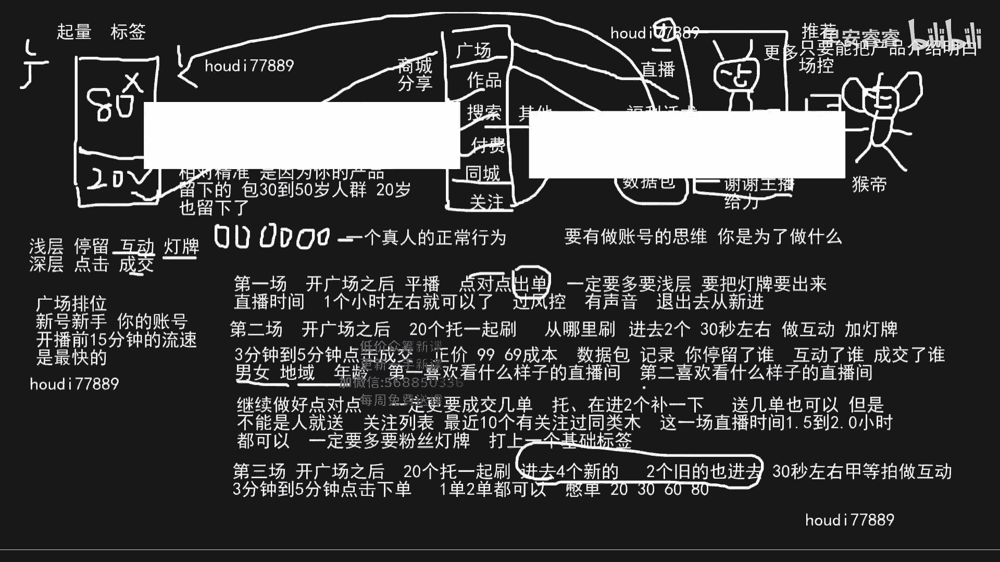
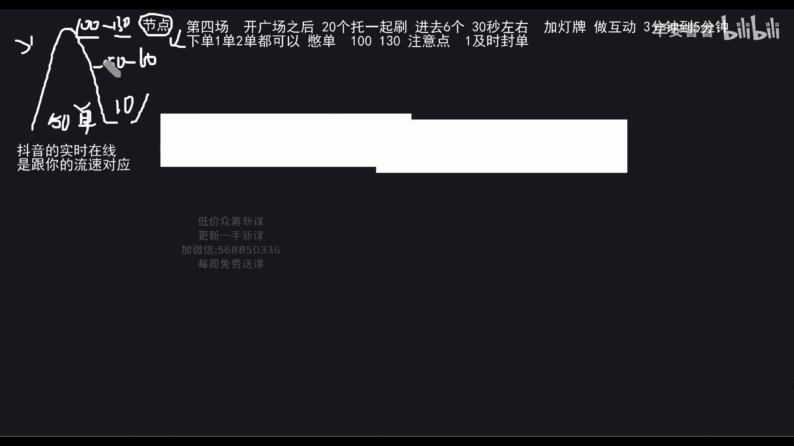
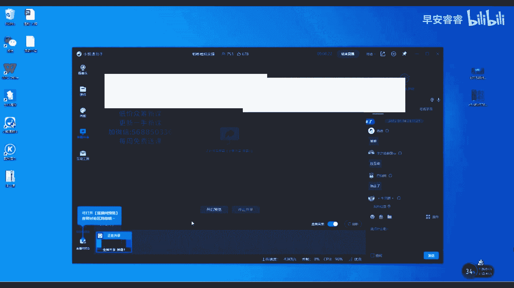
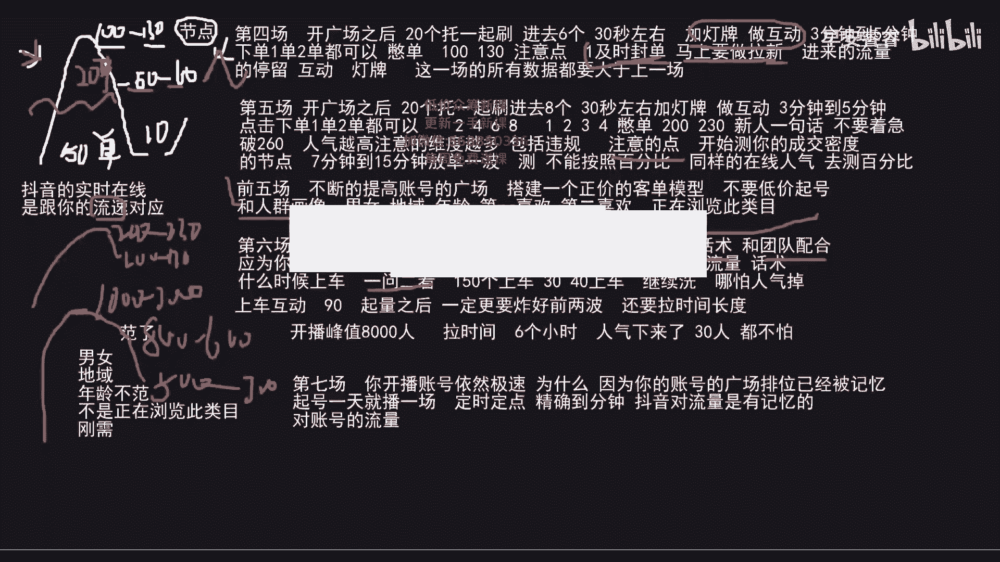
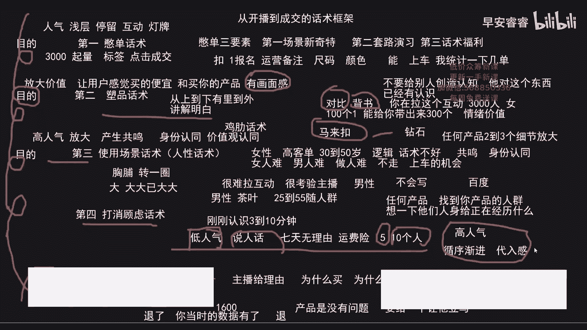
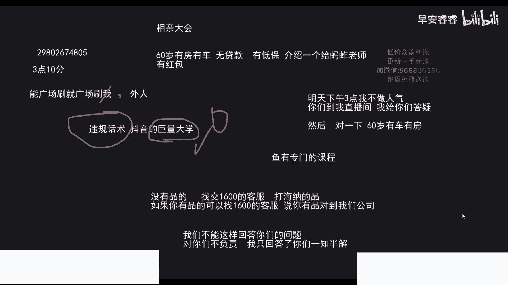

# 045 2023抖音电商0粉起号实操教学 - P2：2023-1-5-蚂蚱模拟实操-请收藏 - 早安睿睿 - BV17E421V75g

我讲一下啊，首先我讲一下，我们玩抖音，有的时候是要去适应平台，因为抖音上很少的粉丝量可以做到很高的人气，很少的粉丝量可以做到很高的人气，有时候我们玩的自然流，但是要玩好自然流，要解决两个问题。

要玩好自然流，第一个是解决其量，和再要解决的问题是标签，记住不管你人气多少，不管你人气高于低，你首先所有的思维都要围绕具体量和标签，这两个逻辑来走好，在这里边可能有很多打过视频，打过付费的。

如果说你把不管是打视频的还是打付费的，你把自然流量玩明白了，你们还是黑屏吗，你们还是黑屏吗，嘿是我画板已经共享了，有的打不是我这样画图，你们能看到吗，有字对，有字就对了啊，有字就对了啊。

有字有字就对了啊，如果说屏幕小的话，你我讲课的时候，你听思维，你把你的手放在手机上，你把它放大好，你把格局打开好，你把你的手，因为现在用的都是智能机，你把手放在屏幕上，你往下我格局一打开。

它就打开了啊好的，我接着讲了啊，我们要玩好抖音，第一个是要解决体量的问题，第二个是要玩好标签的问题，不管你账号在什么阶段，你就要考虑这两个，好好好的好的王重阳，那我们要玩好自然流量。

首先就要解决广场推荐，就说就说大家所谓嘴里说的直播推荐，也就是广场的流量，那在刚开始我们起一个号，在刚开始我们起任何号啊，就是因为我们粉丝量就是零粉零作品，抖音只负责给我们推一种东西，就推人。

他只会给你推人，他不管是老人小孩儿娃娃孩子，因为我们卖的每个品类是有人群的，比如说你卖卫生巾肯定是女性对吗，比如说你卖男鞋，肯定你卖呃，你卖化妆品肯定是女性，比如说你卖男士腰带，有可能是也有女性买。

但是大部分是男性观看，所以说我们首先要解决什么，首先抖音，任何一个正任何一个正常的账号都会用推人，但是他给我们推来的人80我们是没有用的，只有20，只有20叫做相对精准，记住这个哈，20叫做相对精准。

这20相对精准是干什么的，这20相对精准是因为你的产品留下的，他是这个人群跟你这款产品是匹配得上的，比如说你是卖包好，你的这个包的款是30~50岁人群，如果说我们开播说把这个产品送给他。

男性可能这个产品你送给他都不要，但是有可能有20岁的女孩，因为你送给他，他不管款式也留下了，也留下了，那我们就要把这帮人的浅层数据要到浅层，抖音上，有两抖音上有两种数据，第一个是浅层。

浅层就是停留互动灯牌，然后有个深层就是作为我们电商带货来说，有个深层，点击成交啊这两个，所以说这时候我们要把它浅层做好，就说停留后的灯牌都好好，我们首先把这个逻辑弄清楚，这个是我们直播间所谓的流量入口。

就是我们的任何的账号，它组成我们的流量都是百分之百，但是这些流量的架构不一样，广场，作品，搜索，付费，同城，关注，商城分享这些流量组成了我们所有流量入口，如果说在我们刚开始，我们如果说要起好自然流的话。

我们这些流量我们都不要去主动去参与它，好，我们都不要去主动作它，但是如果说啊对，还有个其他，还有个其他在，但是我们在刚开始起号的时候，有可能我们账号的搜索和其他会比较高，记住只要你不是自己去乱操作的。

自己去人为的干预他的，我们都不要去管它，我们只用想方法，或者用方用正确的方式把广场的流量激活，那这是一个直播间，这是一个直播间，这个直播间如果说你作为一个没有结果的。

或者说在抖音上还没有真正站起来的好水印，水印了对，忘了忘了忘了忘了又忘了水印了，等一下我先打个水印啊，嗯我先打个水，如果说我们刚开始，如果我在讲课的时候，如果说你听不懂的话，你先不要着急问问题。

先按照我的逻辑来，因为如果说我在讲的时候，你们一直在问问题，会会弹窗，弹窗的话，我不回答你也不好，我回答你呢，有可能你问的问题我在下面的内容会讲到好，我下面内容会讲到就断节奏哈。

刚开始我们准备好一个直播间，这个直播间我们刚开始找的一个主播，比如说这是我们的主播，这个主播只需要具备一种功能，只要什么，能把产品介绍明白记住，只要能把产品介绍明白就可以了，但是我们找的这个什么主播。

就说我们的场控就是我们的掌控很重要，这个场控是用来干什么的，这个场控是主播的眼睛和主播的什么，和主播的耳朵，因为有的主播如果说你真正直播过的人，你真正直播过的人，你再回来去看你真正直播过的人哈。

你们的主播播完播三个小时，或者你自己是主播，你在播三个小时，四个小时，五个小时的时候，你经过大量的语言输出，你脑子缺氧，你会不会感觉有点，就是有的时候根本就不知道自己在说什么，有这样的情况的，扣个一。

这很正常，因为主播是强输出，说三个小时五个小时话，他非常伤气，他非常生气，你缺脑子缺氧了，他就是你有的时候，根本就不知道自己在说什么了，这个场控是主播的眼睛和主播的耳朵，他是在你走偏的时候把你拉回来的。

就是说当你在直播的方式，你的思维逻辑和你的话术是不对，跑偏的时候，这个场控是给你提醒，给你拉回到现实中，那你知道，所以说场控很重要，这个场控要找一个机灵点的啊，为什么我画咱们的耳朵。

比如说找一个像猴地这么机灵的哈，找一个像猴弟这么机灵的，要思维要好哈，思维要好好，当我们知道了这些之后，我们开始直播，我们准备什么，刚开始我给大家讲过，准备5~10个我们的手机。

然后准备十个或者20个托猴，就说我谢谢你，准备5~10个托，那这个托儿你们在养托的过程中，如果说你还不会养手机的托号，那你这个过程中你首先要解决一个什么问题，你首先要每天的下午单号的3~5点。

你去听一下，群里会给你发链接，腾讯会议的链接，你去听他那儿有课程，但是你们养托的时候，一定要记住一个底层逻辑，其实你们问的问题，老师我能不能，这个能不能那个有很多都是无用的，记住一个底层逻辑。

一个真人的正常行为，你是一个真人的正常行为，我们的养托，那就没有任何问题好，你只要按照流程走，你是一个真人的正常行为就可以了，那做好这些之后，我们现在开始开播，那第一场就是我会讲。

第一场到第七场到底怎么播，第一场开广场之后，什么是开广场，就是你的账号开始给你推流量了，推真人了，哪怕推十个100个，哪怕你的账号起号是100个流量，它都是开广场了，只是有的人的广场推荐低。

有的账号在广场非常高，这个是每个账号跟每个账号都不一样好，那只要给你推真人，他就是一个正常的账号啊，100到200的场关都是正常的啊，300~500也是正常的，1000到2000也是正常的。

那开广场之后给你推真人的时候，第一场评估，点对点出单，如果点对点出不了单的，如果点对点出不了单，一定要多要浅层，浅层是什么，浅层就是把停留互动，至少一定要把灯牌要出来，要把粉丝灯牌要出来好。

你最好能出单，如果你出不了单，你就把点对点灯，粉丝灯牌要出来，看直播时间一个小时左右就可以给风控好，讲完第一场之后，我会告诉你们，我们大家要玩好抖音，首先要有什么，要有做账号的思维，首先要做账号的思维。

你要知道你每一场直播你是为了做什么，你是我讲这个每一场每一天每一天的实操，你要把我的思维逻辑哈，做抖音的思维逻辑弄明白，要有做账号的思维，你是为了这一场直播，我是为了什么，要清楚的明白好，第一场过风控。

但是在这里有个问题，点对点出单，有没有人不知道怎么点对点，点对点是什么意思，点对点怎么出单的，扣个一，第一天其实很好播，我们就是尽量出单，出不了单，没事把灯牌要出来，很好播，场关也不是特别大。

只有两个人啊，何美业，还有西柚林浩，杨宁好，你们三个人不知道，那这样你们三个人不知道点对点，浴火重生也不知道好你们三个人不知道，一会儿这样，我今天给你们三个人开个福利，我一会儿上完课。

如果说你真的不知道的话，我单独来带你们三个，单独来带你们三个，直到至少把你账号做到千人在线，能卖个5万以上，行不行，行的话，打个行，我刚才点到名的三个，还有我好的，还有李波啊，还没没有我呢。

老师你呢刚才没点到名，行好，我现在坐着干什么，行个DER啊，你看老粉都在说了，行个DER啊，还有我看一下，我现在就在做的是点对点，懂吗，对我现在做的就是点对点，我再给你演示如何点对点。

我现在在做的就是点对点，比如说在刚开始我们开播，这个流量是从底下进来的，嗯这个流量这个流量从底下进来的，你就一个个喊名字，一个个喊名字，就说给谁备注单，今天我们是源头工厂做福利，如果你是真人的话。

扣扣小姨，那今天我这个产品是让你去体验的价格，给你们去给你们上车来的，你们稍作停留，我的运营马上多连接好，等把他的浅层要导，比如说你现在要他，你这个话术是要他的互动，然后再要给你点上灯牌。

然后再去往城郊圈转，先让他把你互动带带，我不骂他爷爷，哎，我喊你们爷爷了好不好啊，澎湃你乐哥哈，我喊你爷了，嗯所以说点对点就很好拉，互动就说我给你这个产品是福利价，你是真人的话，扣个一很好拉。

当他把一拉出来之后，我们再要他灯牌再做个转化好，点对点，慢慢来，不要着急，你不要想着第一场就把账号拉起来哈，第一场能不能把账号拉起来，能这个产品第一场能把账号拉起来的，都是很通的。

品通品通品能把账号拉起来，能拉到几千人，上万人都可能好，但是你是新手的话，就严格按照我说的去做，我们慢慢来慢慢来慢慢来，慢慢起的账号会更稳一些啊，你把这个流程走过了之后，你慢慢走过了琉球之后。

你可能后边会一个账号，比如说最多三天就干爆，最多三天就签人，好回归到现在，第一场开广场之后，我们停播点对点的出单，一定要多做浅层，把灯牌要出来，直播时间一个小时左右，过风控就行了，但是一能做成交哈。

能出单，最好是出单哈，来到第二场，第一场过风控很简单，第二场，开广场之后，20个托儿一起刷，20个托儿一起刷，从哪里刷，这个关键20个图从哪里刷，如果你打开你的就是你这个手机打开，因为登录上抖音。

你打开之后，它的左上角是直播这两个字的，就从这里刷，如果说你的版本已经更新了，因为每个人的版本不一样，如果说你的抖音号是减号或者加号的，那你就从右上角有个叫推荐，你从一上来就推荐啊，这个推荐页你就往下。

你就往下刷，他刚开始可能是给你推的作品，但是他一定会给你推到一个带货的直播间，记住一定选择带货的直播间，这个带货的直播间你就点进去，他的右上角有个更多更多，点开之后从里面找到你的同类目啊。

你只要你的图刷好了，都能找到，如果说实在你没有刷透，找到你的上下游产品，找一个直播点进去，开始往下刷，开始往下就是往下刷，大家刷抖音，我不用教了哈，就往下刷，从哪里刷，进去两个进来两个就可以了。

然后在30秒左右，做互动好加灯牌，把30秒左右加灯牌，多互动，然后让你的公屏上出现文字，比如说真便宜，谢谢主播给力，让这种带有福利性的文字帮助你丢人，然后再配合上主播的福利话术啊，配合上主播的福利话术。

然后做再做留存，为什么我们要去这样做留存，因为在刚开始一个新号的时候，我们的我们不是网红，也不是明星，我们一定是用户在我们的产直播间能够抢到啊，福利的好，我们先把它做留存，先把它留住才能成交。

你人都留不住，你谈何成交好二，然后在3分钟到5分钟对利他思维，然后在3分钟5分钟之后点击成交，点击成交，点击成交之后，记住一定要正价，比如说你直播间是99，是正价好，你就拍99，在这里我建议大家哈。

如果说比如说我们找了一个产品，我们抛去所有平台的扣点，抛去物流，抛去所有的费用是69成本，我们尽量利用69的成本起起号啊，你不亏钱也不赚钱，我们起来之后再改成99，我告诉你一样能卖出去好。

但是99以上啊，99以下是一个人群，99以上是一个人群啊，除非你的产品极致性价比，那就不说了啊，我们成本来起号，起号之后再改好，改成正价，但是一定要正价拍啊，当我们正价拍完之后。

我们的直播间会生成一个数据包，这个数据包会记录什么，记录你，你的浅层停留了谁，互动了谁，成就了谁好，你的浅层是记录论，你停留了谁，糊弄了谁，成交了谁，还有你成交的男女地域年龄，男女地域年龄。

还有他们在抖音上的一个最重要的，他在抖音上第一喜欢看什么样子的直播间，第二喜欢看什么样子的直播间，也就是说每个他会记录你对哪些人形成了停留，互动灯牌，哪些人形成了点击转化。

嗯我们每个人背后观看抖音都有一个观看标签，都有观看标签好，当我们生成了这种数据包之后，我们直播间的数据包，会立马按照我们直播间这种数据包好，直播间的数据包立马反馈到抖音的大脑中枢，反馈到广场上。

这个广场会继续反向给我们从广场上推流，为什么会反向从广场上给我们推，按照我们数据包的，因为我们的托儿，就是我们这些托儿是从广场进来的，我们通过广场进来之后，它会从广场上继续扩大我们的广场推荐。

而且是精准的，记住他是不是按照你填写的年龄和性别，如果说你填写一个一个100岁，他是不是要给我们推坟地，他不是按照你填写的男女和，和年龄，他是通过什么呢，它是比如说有些人问，那这个男女比例。

我们的绰号是不是要按照，如果说你能填写就是正常的，按照跟你那个产品相匹配的填写最好，但是他不是按照这个来识别你是男是女，你多大年龄的，而是你的观看习惯，而是你的行为。

还有你其你手机上其他的app上的一些关联app，注册的东西，我这样讲能明白吗，能明白的，扣个一，就说如果说我们的抖音号写个100岁，那他就给我们推坟地吗，他是按照你的观看行为对，好OK了。

所以说我们要让它生成这种数据包之后，所以说我们要养好托儿，来三到5分钟给我们形成标签，好老年人的身份证注册嗯，我说的是托号哈，你说的是直播账号吧，老师大晚上别吓我，好的不吓你哈哈，我接着讲啊，我接着讲。

按照我的逻辑讲啊，生成中数据包广场，给我们推荐更加精准的流量之后，这个时候，继续做好点对点，继续做好点对点，然后这个时候一定要成交几单啊，一定要成交几单，老年人注册直播账号没事哈。

这个时候一定要成交几单，因为我们的账号流量会在前三到5分钟，形成了数据包，他给我们提推的流量是相对精准的，这个时候我一定要成交几单，如果说你作为一个新手，可能第一场直播，第二场直播你有点不适应。

或者说你的话术不成熟，你没有成交怎么办，托儿，再进补一下，如果说你是厂家，你是供应链很强的，送几单也可以，但是，不能示人就送，但是不能是人就送，你在送他的时候，你的场控或者是另外的人一定要拿一个手机。

这个手机就进来了，人这上面给你留下了，你要去看这个人为你留下之后，比如说这个人给你留了20秒，30秒还没走，看什么，看他的关注列表，他的关注列表最近十个有关注过同类目的，你才送，比如说你卖包的。

他有关注过包，你送他啊，或者你可以问，或者你可以问哎，呃这个韩玲啊，你最近有没有看过卖包的直播间呢，有的打个有没有打个有没有我做过统计，我看一下我们这个产品在抖音上好不好卖，是不是个卖，挑一个人带动对。

挑一个不是人的哈，嗯也可以啊，好最近他十个有关注这个类目的，可以送他啊，一定要这样，然后这场直播做好点对点，那继续做好点点这场直播，然后时间1。5到2。0小时，都可以，这个时候我们1。5到2。

0小时都可以，能懂吗，但是要做的一个行为很重要，好记住很重要，一定要多要粉丝灯牌，一定要多要粉丝灯牌好，一定要多要粉丝灯牌，这个粉丝灯牌要到之后，这场1。5，这场打一个基础标签，第二场是打上。

打上一个基础标签，它指你我让你都要粉丝牌，我跟你讲，你就要就行了，有些人你根本要不出来啊，你不要去考虑这个哈，我让你多要就多，要你想多了哈，你感觉给你推1000人，你能要出100个灯牌来吗。

刚开始我们的标签很乱啊，就是你强马扁你1000个人，你都要不出来100个灯牌，你放心啊，你要不偏他，我让你做，你就做就行了啊，好第三场打上一个基础标签之后，第三场你到时候会问我，如果说你们还没有实操的。

你们不用去考虑我要灯牌，怎么会把标签打乱了，你到时候会问我啊，老师为什么我要不出灯牌来，这才是你们要问的问题，而不是说老师我要灯牌要多了，会不会给我张片标签打乱了，你放心啊，你到时候会可能会哭着来问我。

老师我要不出灯牌来直播，太难播了，能够绕出来灯牌，都说明这个人群是跟你的正牌货是匹配的啊，你们能把这个人的灯牌要出来，是因为这个人群跟你的盘货是匹配的，哪怕你福利价给他都是一样的，因为你不是人民币。

为什么要不出灯牌，因为你不是人民币，不是人人都喜欢你嗯，行，要不出来，一会儿我给你，低价成交会吧，低价成交会啊，鹏哥你们现在按照我的逻辑讲啊，来维持下距离，接着我讲了啊，听课啊，听课按照我的逻辑讲。

按照你们的逻辑的话，你们是不是又回到你们自己的思维里了，又回到你们的思维思维列表，现在要按照我的思维来做好，一场一场的听清楚，一场一场的按着我去做啊，又回到那你们按照你的思维，你们是不是做起来了。

那按照我的思维来做好，现在你们不要问好，我讲到哪了，你就听啊，一定要听去带着脑子来听，第三场开广场之后，20个托儿一起刷进去四个，这四个是新的，四个新的，两个旧的也进去，但是这两个旧的只做浅层。

也就只做停留厚度，灯牌不成交，这四个新的一样的，30秒左右加灯牌多互动，然后3分钟到5分钟点击下单，点一下单，然后每个括号下个一单到两单都可以啊，一个托号下个一单到两单都可以，我在下面讲的内容。

比如说第四场，第五场，第六场我在下面讲的拖着进入啊，都是一个逻辑啊，都是这一个逻辑好，下单到一单两单就可以，好我接着讲啊，还有一个在调侃我的，你这一看就是老粉哈，那个点的一看就是老粉，知道我不骂人。

下个一单到两单都可以，这个时候呢我们要憋单，这个时候一定要憋单哈，在这里我告诉大家，如果你选择平波，你选择评估你的账号一定是起不来大流量，好，选择拍单，你不选，你不会，你不接单。

你的账号一定会没有大流量啊，这时候憋单20~30，60~80把人气在线，我说的是实时在线，把人气做到这个节点上，然后做到这个节点上之后，这个时候会有人很多不会憋单，会有很多人不会憋单对吗。

记住抖音的人气是怎么来的，第一个是浅层数据，如果说你只想要人气停留互动灯牌足够了，但是作为我们电商光有人气是不行的，我们一定要做成交来保点击和成交，是保证你后边的流量是否是什么，是否是正在浏览过此类目。

特别对这个包，比如说你是卖包的，他看过在抖音上看过了很多包的直播间，他想买个包，这种人推进来才能更加促进我们更好的成交嗯，点成交，那做浅层别单，因为我们前两场已经打上了，就是停播过风控。

第二场打上一个技术标签开播，我们就要憋人，为什么要憋人，是因为，广场排位对于一个新号，新手洗一个新号，一个新手，你的账号开播开播什么，开播前15分钟的流速是最快的，你开播的前15分钟。

你的就说每分钟进场时是最快的，我们要利用他这个抖音这个节点，就是说因为每个账号特点是，开播前15分钟流速最快，通过他来把停留互动灯牌叫出来，好嗯那为什么我们的账号开播一一，为什么有的账号你开播。

你轻轻的一逼的，就是你会看到很多账号开播，就像那些网红或者有些电商的号，他一开播，他一开播，他噌就上去了1000人，2000人上车，为什么有的账号你就说你怎么播，人气都上不去。

就是因为你的广场排位就是这个啊。

你的广场排位，假设我们的一个账号的广场排位是100，就是我们一个新号，假设你的账号你的开播，你的广场排位是100，你要通过憋单把浅层做好来不断的提高，我们对话广场排位提到80。

比如说我们现在所有人在刷抖音，当我们看到一个直播间吸引到我们了，好我们主动点进去了，看到一个直播间吸引到我们了，就比如说我们刷推荐啊，看到一个直播间吸引到我们点进去了，好点进去之后。

这是我们的一个主动行为，你选择看什么样的直播间是你的一个主动行为，那你再往下滑，你在我要刷广场的时候，你在玩刷广场的时候，你看到的第二个，第三个，第四个直播间，第五个直播间都是抖音，主动给你推送。

你被动地成为了这个直播间的一个过客，也是一个流量，你被动的成为这个原因，这个过客啊，你不管喜不喜欢这个直播间，都会形成这个流量，那假设我们的广场排位是100，别人刷100下抖音。

或者说他按照比例就是说你的广场排位低，他按照比例给你分发人群，就是按照比例给你分发，别人向下刷广场能刷到你多少人，那这样我们的账号肯定是人气少，我们要通过毕业单来把我们的广场排名提上去。

我们提到80自然就多了，我们提到70更多，我们提到60，提到50，提到40，提到30，提到20，提到前十，前五我们的广场就说你开播，你开播的这波流量太高，但是记住我们在第三场的时候，我们不要憋太高。

因为有的品类会容易一下就起爆流量，我们不要憋太高，我们憋到20~30，我们要考虑到账号的标签好，考虑到这样的标签慢起号好，新手小白一定要慢起号B站20~30，这个时候就来到一个问题，不会变的。

这时候会来的，不会变单，记住不会变单的，一定记住憋单三要素，一定记住别单三要素，这个B端的三要素，憋单的三要素，记住啊，憋单的三要素，第一场景的新一册，第二套路演戏，第三话术福利好，第一场景新特。

我们不是网红，我们不是明星，我们的脸是不是在留存的，为什么明星的直播间人都很高，因为他们是网红，他们已经他们已经通过大量的曝光，这些人的脸是在流带什么，这些人的脸是带停留的，这些人是人事代理。

如果说你把你小杨哥，你把小杨哥找到你直播间做一下哈，你直播间人气也能上去，他自带停留，他是他就是说他有了停留之后，他怎么去拉着他的互动，他怎么去要他灯牌，那是下面的事，对不对。

那首先第一个就是他把停留拉住了，那他毕业的三要素就是场景新测套路，演戏和话术，福利好，我们要通过这三点来拉，那拉起来人气之后，我们要考虑什么，就说这个时候我们的直播间比刚开始，比如说我们到了二十三十人。

到了六十八十帧，那有了人气之后，我们要考虑还是考虑什么，这个时候我们已经起亮了，这时候我已经我们一起亮了，这个时候我们就开始起量，这我们起档之后我们要考虑标签了，就是我们要做深层了。

这个时候60~80人的时候，我们比如说我们要我们要上车，我们要做成交之前，我们要上车和要成交之前一定要看互动，看什么互动，看上车一定要看你直播间的互动率，互动率，比如说你在讲禅。

比如说你把这个人气憋起来之后，好，大家给我30秒的时间，我把我的产品简单塑造一下好，他们听你把产品塑造完，塑造完之后，这时候我们要是要上车了，但是我们不能盲目的上车，一定要看互动。

比如说60~80人有3~5个互动，有3~5个上车这种互动唉，我们上车直播间60个姐妹们，刚才我已经把产品介绍的非常清晰了，如果说你们准备好了的话，你们打个上车好，我给让运营给大家精准统计链接，统计库存。

给大家上车了，因为刚才已经拉了他的颜色尺码好，这时候3~5个上车，那上车之后，做好成交，做好第一波成交，我们账号的慢慢慢慢慢慢可能就人气掉下来，人掉下来啊，除非你的主播话术，你不是新手的啊。

你能做到这个时候我们的人气啪啪掉下来，掉下来之后，继续做好点对点，继续做好点对点，那做好点对点的时候，那我们如何判断我们的点对点，是做的好与不好呢，我们的点对点作业的好与不好，是要看你的流量贴地面了。

比如说我们直播间慢慢的剩了五个人，十个人了，或者15个人，20个人，如果说你的流量，你要看你的罗盘，人气我看看在这有没有罗盘，这没有罗盘啊，我看等一下我找个罗盘给你们看看啊，我看看能不能找到罗盘。

找不到啊，这个电脑上没有好，你们听吧，就如果说你看你的抖店罗盘，你的人气趋势，你要看你们的人气趋势，你的人气趋势，如果说一马平川是这样的，一马平川就代表你的点对点做的不对，哪怕你的人气是五个人。

十个人啊，你从五个又拉到了十个啊，你上车之后卖了一单，然后又从十个掉下来五个，然后从五个又拉到十个，如果说一马平川一定是你的点对点话术有问题，如果说你能够拉起来，就是说波段式的，哪怕是小波动。

就代表你的点对点是没问题的哈，你就做好点对点这场直播，这场直播，你的UV，你的签字，你的点击转化，你的直播时间，还有你要的粉丝灯牌都要大于上一场，都要大于上一场啊，好了，大家截个图，我开始讲第四场。

截图哈，321有些做笔记的哈，你们你们如果说能做笔记的，尽量做笔记，做好笔记的时候，有的时候你回来去看的话，你可能理解会更深刻一些啊，好第四场，第四场我把它叫做节点，第四场我把它做的节点节点很重要哈。

刚开始我们要做好的其实更多的是B单点对点，那这个时候第四场这个节点我们做好控流，好玩好抖音，就是怎么去控流，第四场开广场之后，进来六个，然后30秒左右加灯牌图互动，场关要大于上上三秒左右，加速板做互动。

然后还是一样，我们的助攻号三到5分钟，下单啊，一单两单都可以，这个时候要背单，把人气逼到100，到130，如果说你上一场能憋到60~80人的话，你这一场会很轻松的，你会发现你的账号能憋到100~130。

B到100~130，这个时候注意的点，我为什么把它叫做节点，因为有很多的人就在这里是播不好的，比如说，我们把人气拉起来可以退款啊，下播之后退款可以，但是尽量不要退啊，如果说你自己是新手小店的话。

如果说你自己的小店，你可以去用你的绰号刷一下口碑分啊，如果说你只打精选的话，可以下播之后退款是可以的啊，这个时候把人气拉到100~130，很多人都是在这里做不好才导致做不起来牵人。

你只要能把记住我这句话，你只要能把百人做好，你自然你的账号会上千人，自然嗯那百人的时候会有很多，比如说我们的直播方法会怎么样呢，比如说100人了，我们这100人一看啊，主播一看直播间100人了。

就开始马上送完品之后，输完屏之后，321上车之后，三一上车之后，他会他会一直让用户下单，一直让用户下单，一直让用户下单，一直让用户下单，一直让你们赶快拍赶快拍赶快拍。

不好我们的人气掉掉掉掉掉掉掉掉掉掉掉的，只有十个人，调到十六十个人之后，我们出去了50单，只有十个人之后卖了50单，那我们的点击转化做的好不好很好，这个时候那抖音肯定给我们推精准流量。

是不是给我们推精准流量来到我们的直播间，但是我们这个时候我们再想通过十个人，我们再想去把人气拉到拉到60，拉到80人，发现很难拉拉不动，为什么，因为抖音的实时在线是跟你的流速对应，你直播间十个人。

有十个人每分钟进场的人数给你，因为你直播间只有十个人，虽然你点击成交这么多单，给你来了一个什么，给你推的是精准量，它只是精准了，他只是精准了，但不代表你能把人气做起来，你只有十个人。

他的流速他就决定了你憋不到人气，憋不上去，那这个时候呢驻点一定要什么，一及时分担，你要做的及时分担，我有水有水有水，一定要做到及时分担，比如说100个人，321上车上车之后。

我们要在50个人到60个人的时候，我们直接叫枫丹，枫丹就是没有了封单，就是下车，不好意思，没有了，刚才我刚才我说了，给大家准备了30单福利没有了，这个时候你的中控就要把链接下掉，是真没有了，不是假。

没有了，这个时候你从100个人到5~60个人。

你猜我刚才掉线了，我刚才电脑重启了，抬走了，抬走了，不好意思啊，不好意思啊，不好意思啊，我再讲一下这个哈。

稍等稍等回来了，回来回来回来能听到我声音吗，封单开始，刚才就是封单，套路互动，听不懂可以了，是不是啊，可以了可以了，听不到啊，在这里我讲我讲完课后问哈，接着听哈，以为无中生有呢，可以了没有。

刚才电脑直接死机了，好接着讲，在这个时候呢，我们要及时封单卡，是你自己的问题还是零啊，模拟太逼真了，就到节点上了，直接也分担了哈，这个分担了好50~60人，这时候我们会分担，就是马上把小黄车下掉。

没有了没有了没有了的话，但是呢我们成交了20单，就是从100人到五六十人，我们成交了20单，这20个人会因为我们成交了20单，给我们推送，我们二成交20单的精准人群，但是这个时候我们能保证什么。

我们能保证账号的流速快，就说你在五十六十个人，他给你推荐的精准人加上不精准的人，我们能考虑什么，我们能用这个60人，利用他的流速，利用他的这个什么，利用他五六十人给我们带来的更快流速，再往上憋人气。

再往上变声器再下来，我们封单哎，哪怕掉到40~50个人了，再往上憋到60~80人，这个时候我们的账号才能是这种，波段式的流量好，第一个是封单之后马上做什么，封单之后马上，要做拉伸。

封单之后马上就拉新行为啊，就说有没有刚才没有抢到的，没有抢到手办了的，扣个一运营统计一波，我们人多的话，我们再给大家上一波，人少的话，我可能就下播了，今天我的福利放的有点多，马上到拉新，就是新用户。

就是这一时刻，就在你成交完的这一时刻进来的流量的停留，互动灯牌，把他们要出来，我们的直播间才能有更高的人气好，这一场的所有数据都要大于上一场，这场的所有数据都要打一场好，第五场。

只要第四场所有数据大于上五场，第五场开广场之后，20个托儿一起刷进去八个，然后30秒左右加灯牌，做互动，3分钟到5分钟点击下单，好一单两单都可以，但是但是也是一样的，正价哈。

这个时候发现我们的图是2468，我们拖着用是2468，如果说你只有十个图是1234就可以了，第五场，这个时候我们要憋单，这个时候我们要憋单，把人气憋到200到230，好在这里我提醒新手一句话。

不要着急破260，如果说你破260的话，这个人气会直接上千，我为什么让你不破260，因为在抖音上有一个很奇怪的现象，在抖音上有什么现象呢，就说你直播间1500人哈，1200人。

但是这一波的成交有可能不如你在线200人，这一波成交好，有没有遇到过这样情况的，有的打个有，就说明明我们的在线越高，我们的成交会越好，但是我们在线一百一千两百个人，还不如我们在线200个人成交。

播的好会很多人遇到这种问题，或者说那这个时候我们一定在这200到230，不要着急去拉，不要着急去干什么，不要找，这个时候不要去做浅层了啊，不要着急做停留，互动灯牌啊，好好的塑好品，好好好的SP啊。

他你你把封单和拉新做好，但是不要拉爆，你在这个地方稳几天，稳几天，当抖音主动给你破的时候，它相对的话要好一点，相对范围小点，那记住好，人气越高，注意的维度越多，包括，违规包括违规。

那那我们呃上了这个200到230人，还要注意的点是什么，这时候注意点是，比如说你直播间拉到200到230，你要注意的点是一样好，要注意及时分担，比如说调到100人了，130封单好，然后马上黑组到达新。

这个时候要注意的点是开始什么，开始测你的成交密度的节点，开始测你的成交密度节点，比如说大概率啊，大概率是7分钟到15分钟放单，一波好，大概率是万一控制不自己改吧，破怎么破了就破了吗，破了你就试试。

你能不能接住，破了，这个时候你就试试你能不能接住前人，稍等啊，又封单了呵，直播间已经打架了，好这个时候要7分钟到15分钟放单一波，那什么样的产品，什么样的产品我们7分钟放7分钟，8分钟，9分钟。

10分钟，什么样的产品我们15分钟，16分钟，17分钟，18分钟，20分钟呢尽量的是低客单，7分钟，8分钟，9分钟，10分钟好，高客单15分钟，10分钟，10分钟，18分钟，19分钟，20分钟都可以。

但是你要测测什么呢，测你在这一个节点上什么时候放太好，但是测的时候不能按照百分比，什么是百分比，什么是百分比，大家都知道我们测的时候，不能说我100人放50单，不能说我100人放50单。

我1000人放五五，我100人放50单，我1000人就要放500单，不能这样测，是按照同样的在线人气去测，比如说我这个产品我同时是100人在线，我7分钟放单，我成交了20单，我8分钟放单。

我成交了30单，好，你在100人的时候一定就用这套话术，好，用这个时间点，或者说你这8分钟，你中间的话术到底强调了哪里，你去测测出一个最好的哈，测出一个最好的，那测出一个最好的之后，我刚才在开课之前。

我讲过一句话叫玩抖音，我们要做账号的思维，首先我们要清晰的知道我们在做什么，我们怎么做，我现在告诉了你们怎么做，你们要清楚的把逻辑对上，我现在告诉大家怎么做，你要清楚知道。

然后我们在做的时候注意的点是什么，我们为什么要这样做，我告诉大家怎么做，你要知道为什么，因为你不知道为什么的话，你就做不好，我要把为什么给你解释清楚啊，我们前五场，我们前五场都是为了什么。

不断的提高账号的广场排位，就说我们通过这前五场我们慢慢慢慢做，我们开播，你发现你的账号一开播流量就给你的就是猛，一开播，进的人就是多呼呼的跟你进，我们不断的提高账号的排位，搭建一个正价的客单模型。

抖音上一定有客单模型，不要低价起号，一定不要低价旗号啊，不要加搭建一个正常的客单模型和人群，画像好，男女比例，地域年龄，他的对位上，第一喜欢什么，第二喜欢看什么，也就是说正在浏览此类目好。

也就是说正在浏览此类目的人群，我们前五场只要把这个打好，又来到了节点，第六场生死局，在这里有没有提前报流量，就说我账号开播了两天三天，我突然千人了，1000人，2000人，3000人在线了。

把我账号给暴凉了的有吗，有提前报账号，把账号报凉了的，第五场，第六场来到生死局，为什么这个时候我们有的时候就是我们账号啊，我是讲的逻辑哈，这时候我们轻轻一别单，第五场余烬吗，这不是进八个吗，进八个吗。

这个时候我们轻易预约单，是不是要1000人，3000人都可能起得来，甚至是1万人都起得来，第五场轻轻一憋，咱直播间1000人，3000人，是第六场生死局，轻轻别担心，这个时候开始什么。

考验你的主播话术和团队配合，这个时候开始考验你的主播，为什么，因为你的饭流量，来了，因为你的范围要来了，好我们通过这一场我们把人气，比如说第六场好，你把前面只要你前五场搭建好，比如说我们播起来之后。

我们把直播间坐到了1000人，3000人，我们的流量开始犯了，但是你只要把前五场按照这个，按照这个搭建好啊，不断的提高账号的广场范围，搭建好客单模型和人群画像，我们的流量虽然泛，但是。

我们的男我们的男女比例，就是我们抖音给我们推的男女比例，地域年龄不犯，那这些人是什么人呢，这人是什么人呢，这些人不是正在浏览此类目，他们不是刚需，他们不是刚需，他们不是刚需。

但是这些人是不是你的潜在用户，是他是按照你这个账号之前停留互动灯牌，点击转化的人群画像和客单模型给你，按照这些人的在抖音上的行为，他是感觉这个用户他是用猜你喜欢猜，这些用户喜欢给你推到你的直播间。

记住他们不是刚需，那就需要你的主播的强化术，和团队配合来做浅层和深层来做简单的事能好，这个时候记住我们当直播间一单，岂料，直播间一单，岂料，我们慢慢比如说我们在速品的时候人气会掉啊，很正常啊。

比如说我们的拉到1000人，3000人，我们速品的时候掉到800~600很正常，一旦起量的时候一定要干什么，一定要做一个行为，注意的点，一定要洗流量，一定要洗流量，什么是吸流量，洗流量用什么洗，用话术。

其实要用话术，一会我会给你们讲话术，这时候一定要洗出掉，喜欢用话术洗，那还是一个问题，什么时候上车，你不能凭感觉，特别人气高的时候，你更不能凭感觉，因为人气低，你炸空了无所谓，人气高了，你一旦炸好。

炸空了，炸不好，特别影响你的账号，特别影响的账号，那什么时候上车呢，上车之前什么时候上车，一定要做一个行为叫一问二看，直播间800个姐妹们，刚才已经把产品介绍飞行进去了，如果说你准备好的话，打个上车。

一个萝卜一个坑，运营精准统计下，马上给大家安排链接，比如说800~600人，有150个上车，放心大胆的炸，如果180人只有30个，40个上车，你直播间800人呢，你这才多少百分比啊，你根本就不能上车。

这个时候你就说你不能上车，你弄死都不能上车，你听话术听的都快想吐了吧，王正阳还没听够，这时候你一定不能上车，这时候你要干什么，这时候你要，但是同学你一定要继续洗，哪怕人气掉，哪怕人气掉。

哪怕你再继续继续用话术洗的时候，你不上车，掉到了500，到300人，你再去做这个一问二，看你再去做这个一位，看你会发现什么，你的上车互动，这时候你发现你的上涨互动上来了，上到了90个。

哪怕你500人在线，300人在线，你上传互动上了90个上车了，这个时候你在500人到300人，这一波成交比你800人到600人这波好，但是你的直播间依然起亮，起亮之后一定要炸好，前两包还要干什么。

还要拉拉时间长度，一定要炸好，前两边还要拉时间长度啊，然后呢，比如说你开播啊，比如说你这个账号开播峰值就是在线实时在线，人气八千八千人好，你拉时长，你炸好了，前两波你拉时长拉时间，你拉了六个小时。

你的主播播不动了，没劲了，主播播着播着嗓子都嗓子都没声音了啊，六个小时了，嗓子都没声音了，刚开始那你这六个小时之后，你慢慢你的人气下来了，高客单一样哈，多高的客单，这时候你的人气下来了。

人气到了在线30人，人气到了在线30人都不怕，为什么不怕，因为在第七场的时候，你开播账号依然有激素，1000多的客单也是一样的啊，但是你不要着急去破260，你更不要着急去破260，横拍你乐哥啊。

你更不要着急破200就行了啊，你为什么要拉到没人的时候下播了，你开播的账号依然有几组，为什么，因为你的账号的广场，广场排位已经被记忆，你账号的广场排位已经被记忆啊，你开播依然有激素，为什么。

因为你的账号开播，广场排位进背景好，你通过不断的去优化开播，记住起号，一天就播一场，起号的时候一天就播一场啊，定时定点精确到分钟，为什么，因为抖音对流量是有记忆的，对账号的流量，好就这句话，你通过你。

不断的你把分担和拉新的节奏节好，和你的话出去优化，慢慢的慢慢的你的直播间会出现这种流量好大，截个图大截个图来，321，我问一下哈，有没有说有没有说第一次，有没有说第一次听我讲这个课会特别懵的。

就说你听听完之后，你脑子里没有画面的扣个，一是听的比较模模糊糊，不要不懂装懂哈，第一次听的大胆的，能听懂，我说一下哈，我听了30遍也懵，那你你实操一下吧，很清晰了好，为什么有的人听着清晰，有的人听不懂。

是因为有的人你还没有实操，如果说你没有实操的，你一定要多听多听多听啊，或者说你在实操的路上要反复听反复听反复听，那所有第一次听课的，或者说前两次听课的，你还是比较懵的，你别着急，你别着急。

然后你听了三遍到五遍，甚至十遍到八遍的，你越听越清晰的，扣个三，你听了三遍到五遍，越听越清晰的，扣个三啊，三遍到五遍甚至十遍八遍了，谁如果是越听越清晰，或者是听着实操都已经非常好了的，但是他不扣三好。

他明天直播推荐V0好，明天主播拉稀跑肚哈，播着播着要上厕所了，阳痿哈哈哈哈哈嗯fine，第一遍能听懂，第一遍就能听懂，是不是老师，我第二次听懂也有画面，但实操没自信干成这样，但是要这个实操哈。

就说如何用得出来真坏，所以说第一次听课的比较懵的，你不用慌啊，多听，反正是一个月的课程，不扣13的，你拿着阳痿，卧槽时间都变长了，好第一次听课的你不要慌，为什么多，为什么有的人听懂了，用的不是特别好。

因为任何事情都要有一套理论基础做架构，把理论做架构，然后实操是检验真理的唯一标准，是不是，但是这个实操是需要过程的，因为有的东西你听懂了，用不好，用不出来，你听都用不出来，那我再说一次。

一个播了2000个小时的主播，和一个播了200个小时的主播，肯定是不一样的，一个播了2000个小时的主播，跟播了两个小时主播怎么可能一样，为什么有的人第一次就能听懂，因为他在实操，蚂蚱讲的实在点。

为什么有的人为什么有的人他第一次就能听懂，为什么有的人听听不懂，因为你们的理论还你们的架构还没有清晰，你先把理论弄好了，然后再用实操去检验，那你用不出来，用不出来，多听课，反复练习，反复练习，反复练习。

反复练习吗哈做好笔记，反复练习，抖音没那么难，我说真话哈，我跟大家说真话，我玩抖音真的没那么难，但是如果说你想赚多少的问题啊，赚更多肯定要去团队，更多的人肯定有更好的动力啊，是不是啊。

如果说你像夫妻两口子啊，一年100，一年100跟玩一样，说真的，抖音上一年100万，一天赚3000吗，你电商带货来说跟玩一样，你一个产品我这样给你算哈，你一个产品20%的利润啊，你卖2万块钱啊。

刨去退货率，刨去什么，你卖2万块钱，抖音上一个账号，一个通品卖2万，跟玩一样，因为你玩不起来，他来了，你来了就能玩起来的哈，鱼多少有要求吗，10~20啊，没有条件的准备十条，有条件的准备20条啊。

抖音还能玩多久，你不需要这个不是这个你不是，你不要去考虑抖音还能玩多久，没有抖音，还有声音，你需要的是怎么把直播带货这个东西理解透，没有抖音还有声音的，是不是，区别不大，太干了是吧，不用鱼也可以啊。

不用鱼也可以，不用鱼呢，新手我建议对C是啥，嗨C是啥，没有抖音，还有视频号，没有视频号，还有小红书，没有小红书，还有快手，你要把直播这套逻辑弄懂，你别感觉你不需要去判断抖音怎么样。

我们不需要去判断抖音怎么样，你只需要把直播做好，抖音，你怎么不直播了，我休息了一下，我最近休息一下，快过年了，不是阳了吗，阳了之后公司很多事，然后我只有一个人播，一个人播，选择首播，选择首播哈。

女讲不讲安卓和苹果鱼都可以啊，只要是这个只要是这个手机没问题就可以啊，没那么条件养那么多鱼，那就养个三五条，没有鱼怎么办，没有鱼就做好点对点啊，上课的三个小洋人，我也阳了，你赶紧直播吧，你们想我直播吗。

那我直播的时候你们不好好珍惜，我现在我不直播了啊，昨天听鱼的感觉，你们可以反馈一下哈，这套逻辑用了两年不过时，付费起号我讲的是自然流，你再给我讲付费，你这不是抬杠吗，可以来回切换啊，可以来回鱼。

可以来回切换，急急死了，与怎么解决基站和同城问题呃，不用去解决哈，基站问题你可以去基站问，我不讲鱼了吧，在这因为鱼有专门千川研究出来吗，不行你要先把自然流量玩好了，我才能告诉你千川怎么打。

付款尽量不要用同一个微信啊，我在这里不讲鱼了吧，鱼的话有专门的老师讲啊，有专门的老师讲哈，下午三点钟左右哈，老师您专门讲鱼吧，你这大材小用了哈，继续好，下面我会给大家讲话术啊，我告诉你，0~1靠什么。

0~1靠你的玩法好，你有一个正确的玩法就行了，0~1你按照我说的去做好，你只要坚持，我告诉你必做的起来，我说的是必做的起来好，0~1这个玩法你只要坚持，你必做的起来好，需要正常玩法，1~10。

1~10需要什么，1~10需要好的产品和，主播话术，你直播间同时在线1000人，3000人的时候，就是你在抖音上吃四菜一汤，满汉全席的时候，但是你想要控住1000人到3000人。

就是主播话术和供应链和品，每个品都有它的天花板好，每个品都有它的天花板，所以说你们选品，如果说你没有品的，你们可以去找一下呃，你交1600的客服好，要快速做起来。

那就welcome to hangzhou啊，如果是自己闷头干的，干的实在干不通的，就welcome to杭州哈，好下面我讲一下主播话术啊，大家截个图，截个图呢，我允许我哈，此时此刻，现在立刻马上。

大家请允许我上个厕所，喝水，喝的有点多，我给你们放首音乐，你们听完音乐我应该就回来了，只能各种叫卖嗯，六点我上个厕所，马上啊，我给你们放个音乐，你们听一下啊，清一下脑子，清一下脑子。

我放一首我非常喜欢听的啊，我放一首我非常喜欢听的，这是一首简单的歌，没有什么，过了年，什么时候就跟人过年再说，我正阳过了年，你是老粉了，等通知吧，我去撒泡尿哈，马上回来给你们讲话术啊，憋不住了。

全部集体放水好不好，大家集体放过水啊，不要把肾憋坏了，报告我也想去同意啊，集体上个厕所，马上回来给你点关注，谁能看透我的眼睛，让我们都不再神秘，我要记住你的亮点，像鱼记住水的拥抱，像云在天空中停靠。

夜晚的来到，你不会忘了阳光的温暖，我要温暖，你给了天想，你忘了还能回答，放下所有梦和烦恼，却放不下回忆，我心中，多么可笑的心事，只剩我还在坚持，谁能看透我的眼睛，让我能够不再想你，记住你的样子。

像鱼记住水的拥抱，想念在天空中停靠夜晚的辣条，你不会忘了阳光的温暖，我要忘了你这种情，像鱼忘了海的味道，放下所有梦和烦恼，却放不下回忆的心头，只剩自己就好，微风轻轻吹着你散开的发，忍不住想对你说心里话。

多少次鼓起勇气，话又难开口，想想你的耳朵总是低着头，多希望天边换下一只手，永远灿烂，别落下你浅笑的脸，微闭的双眼，我陷入了深深的迷恋，有没有最纯真的童话，你就是我快乐的源头，为你伤心，为你忧愁。

终究是我最想要的丫头，有没有最幸福的生活，你就是我甜蜜的拥有，为你祈祷，为你倒流，你就是我最想要的丫头，微风轻轻吹着，你松开了发，忍不住想对你说，心里的话，多少次鼓起勇气，话又难开口，想想你的温柔。

总是低着头，多希望天边放下一只手，永远灿烂，别落下你浅笑的脸，微闭的双眼，我陷入了深深的变，有没有最纯真的童话，你就是哈喽哈喽，大家好，你这么久，厕所远啊，厕所远，厕所远，你看我喜欢的歌哈。

还是比较其实还是比较好听的啊，有故事哈，这是下课了，暂停暂停暂停上个厕所啊，妙low喜欢的比较low，是不是没有木桶，没有桶啊，厕所比较远啊，好开始讲话术吧，哈你们公司多大呀，嗯1万来平方。

1万来平方歌有点伤感，好行，开始讲课啊，开始讲哎，从开播，我开始讲的话，话术很重要，所以说我们的主播三天脱稿是必备啊，三天三天脱不了稿的，三天脱不了稿的主播，男的请自行解决好。

三天脱不了稿的男男性请自行解决，女性啊，可以交给马老师啊，可以交给马老师，马老师专处理意难大症，话术很重要，首先我们要了解每个平台，每个平台不一样，首先比如说抖音是什么呢，抖音是兴趣电商啊。

如果说我们起号这阶段，我们在起号的阶段，当我们直播间起量会F会犯，那这个泛流量它又不是特别泛，只要你搭好模型，它也不是特别泛，它是按照你直播间的人群画像给你推的，那你犯的时候就要靠强化数。

那强化数据成交，那主播是什么，主播是什么，主播是销售，销售一定有一套，不管你笑什么，不管你销售什么，销售都一定你要把销售做好，一定要有一套自己的话术框架，我不知道现在在这里面有多少做过销售的。

做过会销的，做过微，做过微商的，做微商，做过会销，做过汽车销售的，做过房产销售的，你们有过话术框架吗，有的打个有，在这里我不知道大家以前做过什么东西啊，卖太阳的客做传销，做全做传销的，更有话术框架对吗。

电销算电销也算呢，也有话术框架呀，电话销售资金盘，资金盘，那必须的，那必须是不是因为它画出框架，对大家肯定是有一套话术，皇家的电信诈骗，电信电信诈骗都有一套话术框架，做过传销，传销也有话术，皇家。

所以说我们既然是销售，那销售一定要画出框架，那这个话术框架是什么，就说我们要玩好抖音这个话术框架是什么，是一套符合抖音推流逻辑的话术框架，和符合抖音成交的化妆架，因为我们在玩抖音这个平台。

玩的不是别的平台，是不是它的，它的难点在这，比如说那我比比如说带货榜上，带货榜上，比如说我们带货榜上话术强不强，那带货榜上的不说他强不强都不弱，带货榜上的话术，老师话术的基础是什么，话术的基础是逻辑。

你只有清晰了，你才能说出来，你的逻辑是对的，你才能说出这个话，然后是语言语态，这是基础这个基础，那抖音上的话术强不强，他不管他强到什么样的程度，但是他都不弱，那这样如果说在抖音的带货榜上有你这种类目。

我把他这个话术给你，你还是做不起来，那是为什么，如果说你这个类目，你再打这个类目，我把他这套话术完完整整的给你，还是做不起来，为什么，前面我讲了实操，你如果听懂了，就是说或者说你还是没有他做的好。

你只看到他从头到尾的念对，没有自己的话术逻辑，你不知道他什么，你不知道他说这个话的背后目的，他在这，你看似他说的这个话，但是他背后的目的，说这话的背后的目的是什么，这个是什么，是靠逻辑支撑的。

是靠你的逻辑支撑的，它是随时变动的，在刚开始抽第七根了，我抽了第七根了吗，反正我烟瘾有点大哈，我上课随时变动的，那需要干什么呢，那需要，你要先懂逻辑，然后新手先理出来框架，老手听逻辑。

等你从新手变成老手之后，然后你再自己临场加，自己，临时发挥主比例说过这句话最好的一个笑点，卓别学我最好的那个笑点，就是自己都不知道自己失误的那一次，比如说刚才刚才巧不巧，我刚好讲到，即使分担。

我刚好讲到即时分担，我的电脑就断了，是不是大家都说分了分了分了，我没有，我抽的是软玉溪，我抽我抽的是软玉溪，廖先生，我喜欢抽软玉溪，我不喜欢抽华的，不喜欢这娃子没劲儿啊，那这个时候我开始讲，从开播到。

从开播到成交的话术框架，给妈上上劲儿，哎呀软玉溪到处都有啊，不用带，是不是从开播到成交的化石框架，那我们从开播第一逼单话术，你要知道你再去写这个话术的时候，就要知道背后的目的是什么，第二，竖屏话术目的。

第三，使用场景，其实使用场景我更喜欢叫它人性话术，第四，第五，对有目的的话说，就是说我们所有人我们播抖音，一定要知道这句话背后的目的是干什么，这句话背后的目的是为了拉停留，这句话背后的目的是为了拉互动。

这句话背后的目的是要灯牌，是不是我们在讲逼单话术的时候，我就说了，我们的目的是逼单话术，我们要的人气，对不对，我们B站话术是要把用户的浅层做了，就是他的停留互动灯牌，那你要去想用住。

记住我说的停留互动灯牌，它是一个逻辑的，为什么停留，为什么互动灯牌，那停留第一位互动，第二位再要灯牌，你要让用户一步一步的给你去做什么，给你去做一些数据，好用户一步一步，那你要想做人气，我刚才说了。

憋单三要素，第一场景信息课，第二套路演戏，第三话术福利好，我们的话术福利基本上都是，比如说新店开业第一天啊，新号起号，为了做个数据啊，为了上个带货榜，为了冲一下销售额，有没有新进来的，新进来的。

扣个一运营精准统计一下你在用要用户的什么，你用福利，新店开业做福利，为了做数据，充个带火榜，为了这些我们做福利，我们用的福利是不是福利一定要一直强调，然后扣一报名是不是互动出来了。

那今天我是新店开业第一天，我是为了涨个粉儿来的，大家没有给我点关注的，点个关注，帮我卡个马甲以后呢，我这个账号不到1万粉丝不赚钱，我到了1万粉丝，我在卖货，今天就是送的价格去体验一下我们家的产品。

如果好，给我们做个品宣，做个回头客，是不是话术一定要围绕福利来说，然后拉完停留之后，让他扣一报名是不是最简单的运营备注，这个都千篇一律，很简单，扣一报名运营备注啊，你们把尺码打一遍，颜色打一遍。

是不是啊，能不能介绍几个做，能不能做个品宣，能的打个能好，那就准备好了的话，打个上车，我统计一下几单，我为什么要统计这几单，我为什么要统计这几单，因为我如果敞开库存的话。

这个价格会有很多同行以前拍过很多单，因为你们不了解产品的价格，但是我的同行了解，是不是你们可能到手了，才能知道我这个产品的质量，是跟这个价格是可能超出这个价格的，但是在直播间你只能看到你体验不到。

但是我的同行他可能会一下下我30单，50单甚至100单，他可能在我这边进货，那糊弄牌，今天拍的，今天拍单的人，或者是感觉我这个直播间不是那么多套路，喜欢我这个主播的，你们给我点个关注，卡个灯牌。

拍过单的，我给你们做好售后服务，拍过单的我给你做好更好的售后服务，你能够更好地方便的找到我，那没有拍单的，你可能虽然这个产品你不喜欢，可能我下一个产品你喜欢，是不是啊。

这就是最基本的一个用场景拉住留存套路，演戏拉留存，我们的话术基本上就这几个，围绕这几个点来做好，假设我们通过账号不断的搭建，拉起来了3000人，那人气一高，我们要考虑什么。

人气拉起来之后也代表我们体量了啊，哪怕没有3000人，哪怕只有1000人，哪怕只有500人，我们只要亮起来之后，我们要考虑标签，标签是什么，点击成交，标签是点击成交，那我们叫素品。

我们这个产品我可以这样说吗，用户不懂产品，这样我给你讲，但在现在在这里对鞋的这个产品，我我可以这样再更详细，对女鞋特别懂得这个人扣个一，对女鞋哈，对女鞋有深刻了解的，就说你是厂家，你可能做了10年。

15年，做了5年，对女性有深刻了解，好只有一个人，那我问一下米兰小众女鞋，那你懂羽绒服吗，你为什么对这个产品了解，是因为你是厂家或者做了很多年，那你懂羽绒服吗，你懂的，打个懂不懂，打个不懂。

它的材质它的用料，它的材质成本，嗯对呀，你懂鞋，但是你都不懂什么，你你你懂鞋，你都不懂羽绒服啊，你不可能只穿双鞋上街吧，呵呵虽然我可能喜欢想看，不穿就穿双鞋上街，但是可能很多人不会，所以说用户不懂产品。

呵呵你非常懂鞋，但是你不懂羽绒服，你懂羽绒服，那你懂，那你懂，比如说嗯那你懂零食吗，你懂零食，你懂珠宝归玩吗，我们自己就说你懂鞋，但是你其他的都不懂，所以说这个产品到底好与不好。

眼睛看眼睛看就是直播间的大件对吗，眼睛看就是我们的场景，我们的产品在直播间直观的体现，另外一个就是你怎么说，另外一个就没有，那这个素品话术就是说要放大价值，是不是让用户感觉买的便宜，除了用眼睛看。

用耳朵听的是我们的话术，放大价值，让用户感觉买的便宜和，和买你的产品，你在作品的时候有画面感，有画面感，听听你讲课，尿笑尿笑出适合加点黄段子，不打瞌睡，我太讲这些了，有些女生是反感的哈，男生都喜。

男生都是老色批啊，到这个年龄啊，创业的老色批女女生会反感啊，点到为止哈，那放大价值，让用户感觉买的便宜和买你的产品很有画面感，你说就穿鞋，画面感很强，女生也喜欢，所以说我们在竖屏的时候。

你像很多刚开始呃谁更大，我比他大一岁，我85年，他86年我们大一岁嗯，在我们作品的时候，那我们的塑品话术很多，刚开始是哪里大，自己想象啊，素皮的时候，刚开始我们很多的团队是拿到一个产品。

基本上唉从上到下，由里到外，记住我们玩抖音并不只能讲解明白啊，我们在竖屏的时候，我们不能够只是把产品讲解明白，如果说你只是讲解明白，就说哎这个是呃孟加拉小牛皮啊，三层固特异功力大底。

我们就没有达到这个目的，我们就没有达到这个目的，其实我们要做好放大价值感，是对比，是背书啊，如果有的是什么跟什么对比，是我今天双11的价格，是这个是我去年双11的价格，这个价格今天是我做品牌的价格。

今天的力度你们看出来多大了，对比这是某宝上的价格，这是我在直播间卖的价格，背书是你这个产品的证明啊，比如说某东的价格对不对，背书是你的产品价格，这个是我们的啊，比如说纯牛皮怎么怎么样，这是我们证书好。

这样的话是让用户是在放大我们的价值感，放大价值，我们价值感之后，我们如何让用户有画面，就说你在竖屏的时候，让如何让用户有画面直播，嗯嗯如何让用户有画面，比如说直播间3000个姐妹，今天我来到抖音上。

主播身上穿着这款衣服，你先不要考虑价格，你先看他的款式，如果款式适合您，您留下这个衣服有四颗扣子，这个扣子叫做马来扣，这个扣子有说头叫做马来扣，但是可能很多人没有听说过马来扣，听到马来扣的扣个一。

没有听说过的扣个二，这个扣子是我们老师傅专门跑美国，每一颗都是精挑细选，记住每一颗它的造价是每一颗15块钱，为什么要15，因为这个马来扣的硬度，记住是硬度，大家都知道钻石硬，它的硬度只比钻石弱0。01。

所以说它造价非常贵，15块钱，今天四个扣子60米一会我开出的价格，可能大家平时连这个价格，这件衣服的整体价，四个扣子你都买不回去，今天就做个福利，你们有福了，宝贝们，什么是高货。

可能在座的直播间姐妹们都穿过高货，穿过高货的扣个一家里有千元品质的衣服，扣个一记住你在拉这个互动的时候，你直播间3000人，如果说你把模型搭建好，女性直播间，有千元品质衣服的姐妹们扣个一。

你只要公屏有100个扣一，能给你带出来300个，你知道为什么你这句话会给你带出来，100个互动，能给你带出来300个吗，因为，情绪价值哇，你看好，他家里有1000块钱的衣服，我也有。

是不是我要证明一下我自己，我也扣个一，那家里没有千元品质的衣服呢，大家都有，我好像不扣一个不合适啊，感觉我没有，我也要扣个一，那你互动拉的好不好，既然我看到了我直播间，大家都是穿过高货的，高货是什么。

高货是什么，高货是拉不出互动该怎么办，冬天手冷都不愿意扣字，拉不出来互动，还是话术不够哈，还是话术不够，有没有手冷的不愿意打字的，扣个一，你没有拉到他的共鸣啊，是不是你手冷不愿意扣字。

那你手冷不愿意扣字的扣个一，是不是你没有拉到他的共鸣，你没拉到痛点，我们在情绪价值，既然大家大家大家，既然直播间的姐妹们都是穿过高货，高货就是细节，大家看一下我们的袖口，我们的袖口是做的双排走线。

而且高知高密可能姐妹们，你们上滑500个直播间，下滑500个直播间，你们都听过，很多人都在给你们讲高知高敏，我今天给你们讲一下怎么做到高知高密，普通的线维度是0。1，我们用的是蚕丝线。

它的韧性是普通线的十倍，它的维度是0。01，也就是说十根普通的十十根蚕丝线，它的维度才能做到一根普通线，所以说他能做到高知高密双排走线，给你们看一下细节，大家看好这个细节，我再给大家看一下内衬。

我们内衬是什么样的工艺，把公屏打上，又换了套路来活动，所以说当我们去对比的时候，我们对比的是什么，我们的背书怎么亮，然后我们如何塑塑造产品，让用户有画面感，就说一句话叫不要普及，不要去给别人创造。

认知不要去给别人创造认知，我们在对有画如何有画面感，他，我们用的是马来扣，一个大家，大家都没有听到过的名字，比如说固特异工艺，是不是，比如说啊我前两天才知道亚克力，有人知道亚克力是什么的吗。

不知道亚克力是什么的，扣个，不知道的扣个二，我前一段时间才知道亚克力就是塑料啊，他不说塑料啊，他说亚克力是不是你说塑料，你说塑料就这个价值就感觉很拉，你说亚克力就感觉你这个感觉就出来了。

所以说我们在说这个产品的时候，我们先来点老百姓听不懂的，是不是我们先来点老百姓听不懂的，然后再跟什么呢，再跟他，已经对这个东西已经有认识，有认知的产品做下对比，他这个画面感就来了懂吗。

比如说我刚才我说只穿这双鞋，有些人有画面，那是因为你经历过，不管是你自己做过的行为，有可能你看过别人做过这个行为，对不对啊，刚才那个有画面，那个我说你只穿双鞋，只穿双鞋上街啊，我想但是有可能你不干。

你好好想想，是不是这样的，为什么你有画面，因为你可能自己做过，或者说你看别人只穿了双鞋，大哥你口味挺重啊啊，所以说如何让它有画面感，大家都在想画面，还想画面，所以说我们要什么。

他已经对这个产品有认知的好不好，我们用这个来放大价值，用这个什么让它有画面感，塑造产品这个东西你到100个直播间，除非你这个产品的亮点确实很多，要不然你的作品话术多了没有用，叫做激励话术。

因为用户是不懂产品，但不是傻，记住哈用户他是不懂产品，他不是傻，你拿起一个产品，呱啦呱啦呱啦呱啦呱啦呱啦，讲10分钟，你直播间能有人找我，除非你这个产品特别顶特别特别顶，那这个激励话术就是嘛。

我们要把产品讲到点上就好，不要是输的任何产品，找到两到三个细节放大好就行了，两到三个细节放大就行了，然后来到了使用场景，来到了使用场景，哎我我在这里问一句哈，直播间的女性，你们再买一个产品。

比如说你们想买双鞋，你们今天在买这个鞋的时候，你们会不会脑子里有画面，我买这双鞋配什么样的衣服，有的打个有女性哈，说真实的没有就打个没有，就是我在买这双鞋的时候，我会不会自己脑补。

就是我这个鞋我搭配什么样的衣服，有是不是啊，你看有很多的直播间都在塑造产品上说废话好，有一个人说没有，但大概率是有的，那有些人直播间是说废话，他在他在比如说这个产品的运用场景上，哎大家可以搭个牛仔裤。

可以搭个风衣都好看，绝绝子，那这句话其实作品上是不是废话，你看任何人在买这个产品的时候，他已经想好这个产品我是怎么去搭配，我怎么去带它，不用你去讲，你讲这些是废话，你只需要去把这几个细节来放在它。

就说你这个产品的价值和，让用户感觉买的便宜和产品的画面感，卡的话是你的问题，可能是即使我100斤，即使我150斤，我但是能想出自己穿的100斤的效果，所以说在作品上哈，我们做到这几点就够了啊。

但是我把它叫做激励话术，因为很很多的产品我们都不是独一无二的对吗，我们在卖做的卖的很多产品都不是独一无二的，那我们达到我们达到我们的效果就好了，不要我，我说话卡吗，不卡吧不卡，打个不卡。

让他知道是自己卡，是你自己的问题，好你你调换一下设备，好，调一下设备，如果说我公屏上全是卡的话，就是我的问题，如果说只有一两个人卡，你们去调整一下自己的设备啊，好在这个话术上。

我们把这个话术叫做激励话术，我们不能在这上面浪费时间，我们不能在这上面浪费时间啊，不能在这上面浪费太多的时间，因为你会浪费流量，好浪费流量，那如果说高人气，一定要在这上面放大，一定要在这上面放大。

这是人性话术上放大，人性话术是产生共鸣是吗，身份认同和价值观认同，比如说女性高客单呃，30~5岁吧，有35，直播间3000个姐妹，今天我来到抖音上，第三天，为什么我直播间人这么多。

因为玩抖音我有两种人的钱不赚，第一种是给我点了关注卡灯牌的，为什么，因为你们将来会是我的衣食，父母会陪伴我一直走下去，你们会见证我今天3000人，明天3万人，后天30万人，还有一种人钱我不赚，就是宝妈。

直播间真的是宝妈的扣扣三哇，这么多宝妈，我为什么不赚宝妈的钱，因为我也是个宝妈，姐妹们，宝妈太难了，宝妈记住这句话，我20岁的时候，曾经有个大姐跟我说过，女人对自己好一点，但是当时我不理解他的意思。

或者说我只理解了字面的意思，今天我后悔了，记住姐妹们，如果今天女人不对自己好一点，可能你存的钱都不是你的，我不是在给大家制造焦虑，而是我是深刻体会，我现在就是一个单身宝妈，我们可能把好的给了娃娃。

把好的青春给了老公，围着柴米油盐转，很多人都忘记了自己，哪怕这一时刻这一时这一刻你来到我的直播间，以前你是围着柴米圆转的，今天对自己好一点，而且今天我是放福利，大家看一下现在的我。

我以前真的不知道打扮自己，大家看一下现在的我，我现在找的男朋友比我小八岁，每天回家，我的男朋友给我拖好地，做好饭，给我洗好衣服，还要给我带娃，为什么男人傻吗，男人不傻，男人是什么动物，男人是视觉动物。

认可我这句话的姐妹们扣个一，因为我现在跟我的老公出去炸街，走在路上，十个男人八个男人都会回头，你说我的老公想不想，因为它是动物，它天生的，她也想，媳妇都是别人的好，这帮臭老爷们，对不对，姑娘们，他不敢。

我们要做到让男人不敢，因为他知道他惦记别人的时候，我可能有更多人惦记，今天我说了，不赚大钱，我光空口白牙的说，没有见证，今天就是主播身上看的穿着，这个没有看错，专柜四位数，今天一会儿看我给你开的价格。

说单身宝妈不是在诅咒自己，姐妹啊，牛毅然，你不是在诅咒自己，你是在诅咒你老公，直播间狗直播间都喊爸爸了，是不是是我跟你讲嗯，在这里有知道七天到的吧，你知道签签到吧，直播间天天喊爸喊妈，直播间的爹妈团。

人家一天赚几百万上千万，你不要考虑直播间的东西，人家人家在直播间爹喊妈，跪着都可以，我跪着给你可以，人家赚一两百万，你知道人家线下人家妈大佬到哪去不受人尊重，我是我是说的真话，我在直播间也喊过爸。

我在直播间也喊过爸爸，他喊个骂老师，我说亲爹，我都说自己是狗，对你在线上我们在没有能力，我说的是思维逻辑，记住我们在线上，我们达不到站着能把钱站着赚了的，我们先跪着把钱赚了，是不是你跪着把钱赚了。

你才能站着把钱赚了，马少爷，你是我爷哥，你是我爷乐爷哈，直播越来越没底线，就越赚钱，对你一定要突破自己的逻辑哈，如果说如果说你感觉这说这样的话不好，那你就换一套话术，我只是给你说的逻辑。

你要把我的逻辑听懂啊，对我只是说的逻辑哈，如果说你感觉这套话术不好，你把你把逻辑弄懂，你把逻辑弄懂哈，你把逻辑弄懂，但这一定会引起他们的共鸣，他一定会引起他的身份认同，因为我告诉你，你说女人男。

你只要敢坚持的拍女人，男女人好难，女人12345678点都难，你如果说天天拍男人难，你说男人好难，男人12345678就是难，也难，叶楠懂吗，王正阳王爷爷，我给给你磕一个，为什么，因为总体来说是做人难。

不管是男人女人都难，都有难的点，但是你只要说女人难共鸣，男人男也共鸣，是不是哪有不难的吗，哪有活着一帆风顺的嘛，不可能你要活得一帆风顺，那好把逻辑听懂啊，不会违规，我告诉你不会违规啊。

当我们跟用户产生共鸣，他慢慢听慢慢听，他能干什么，不走他不走，给了你什么，你前面送完品，你共鸣之后，他给了你上车的机会，为什么很多人他是卖不动产品或者高人气，因为你记住有很多的直播间做起人气。

他是不给你上船的机会，他还没听你讲，他走了，你至少让他给你一个上车这个环节的机会，好上车的环境，几个机会，他给你上车的机会，你再把用这两个环节来去成交，他它其实是一环扣一环啊，其实一环扣一环。

其实一环扣一环，一环扣一环的来，我一上车，如果人气高的时候，同行根本就看都不看他们啊，人气高同行看都不看他好抖，音上有一种人群很难拉互动，抖音上有一种人群很难拉互动，很考验主播，很考验主播，男性。

他不会互动，他就看你开的价格，他可能点关注都比女性点的少一点，抖音上很难拉互动，就是男性朋友在这里有没有打男性的产品的，发现这个点的，拉黑他开小号来，有没有发现茶叶这个点的，男性产品很难花拉互动的有吗。

查个主播哭了难不难，养乐多拉男性的互动难不难，养乐多茶叶啊，林你们难费劲卖男爵士的男人的互动很难拉，那男的话是因为嗯男性你不能通身份认同啊，你不能给他讲人情世故，他被骗的太多了哈，男的出去。

我不是说女性不被骗，因为在创业这条路上啊，是我因为比如说你们在创业这条路上，很多的男性被骗的太多了，是真的黄段子一拉就拉互动，那你找个大胸脯啊，你找个大胸脯，你找个大胸脯，大胸脯啊。

你他还让你转一圈来啊，你不用拉他互动，那主播转一圈哈哈，你找个大胸脯啊，你找个大胸脯往那一站啊，他主播还转一圈，主播你转一转，主播你往后靠一靠啊，他主动发，他主动打字，主播你往后靠一靠，我看不清楚大啊。

他还会打一个大的啊，更调皮的还会打个大大一大大，大大一大大，是不是他不是男拉互动，但是我们文明看球啊，对还有文明看球的，他不是男人拿拿互动，所以说我们要卖产品的时候，我要卖产品的时候。

并不是什么人互动难拉，而是我们的话术不够，比如说这个，比如这个直播间，3000个创业的老板和老板娘们，今天你们来到我的直播间，并不是缘分，是因为你们刚好想在抖音上买点茶叶，而我刚好能为您节省点钱。

我想今天我原来是想卖茶叶的，我人气很高，但是今天我不想卖了，为什么，因为有很多同行来黑我，大家知道大环境大环境不好，我今天这个价格确实有点低，但是我不是触碰同框的蛋糕，我希望同行互相学习，我如果不难。

我不会在这上面去这个价格来卖的，因为我今天亏钱，我想问一下，直播间有多少正在创业和已经在创业的，或者创业成功的人，扣个一，我想请教一下大家，创业我选择在抖音直播，我也是在创业的，创业重点有哪些。

我看到大家在公屏上打的重点，坚持努力啊，跟对人做对事，男怕入错行，女怕嫁错郎，入错行，我感觉大家说的都对，我感觉大家说的都不对，我感觉创业需要一个好的身体，除了一个好的身体。

大家都理解是不是身体是革命的本钱，但是我说的是除了一个好的身体，还有一个好的心态，我是我说一下什么是心态，我是八零后苦过来的那一段人，直播间有八零后吗，扣个三，我是八零后，苦过那段人。

我从小没有选择父母，让我做什么做什么，今天我选择创业并不是为了自己，我相信在直播间里，很多选择创业的人并不是为了自己，我选择创业是让我的娃娃有选择选择，今天吃什么，选择今天喝什么，选择上什么样的学校。

要接触什么样的人群，我创业是为了个媳妇儿，人生的幸福感是对比，你们认可这句话吗，我的在我的媳妇看，别人能买个5万到8万的包，他也能够买一个5万8万的包，他就幸福，我是让他幸福。

我创业是为了我的父母将来生病躺在医院，不因为我卡上没有那串数字而焦虑，所以说创业的人都是有责任的，大家把责任两个字打在公屏上，今天我说不卖，你查，我说我卖你个心态，直播间，3000个。

创业和正在创业的路上的老板和老板娘买，你们有没有跟我一样，曾经哪怕有一次我说完这句话的时候，你们认可我哈，扣个一先不要扣啊，先不要打字，曾经有没有一次你们生活有点扛不住了，压力给你压满了。

你曾经有一次开车回到家的地下停车场，你不会选择第一时间回家，而是放上一首音乐，点上一支烟，把所有的负面情绪消耗完，然后再回家，不想把你身上的所有负面情绪带给你的家人，带给你的老婆。

有的时候你还在强颜欢笑，让他们看不出来你今天很累，有的扣个一，今天我说了，我创业不是为了自己，今天大家既然都是创业人，我说我今天就卖你个心态，我今天就卖那个心态，这款茶分为三个步骤去做三个步骤。

123这三个步骤你泡好，但是你们要答应我一个要求，能的答个能，你们先不要考虑我什么要求，你们感觉对我认可，对创业的人认可的，咋可能，今天我说了，创业是有责任的，我今天让你自私一回，你们答应我的。

一定要自己和不跟任何人分享这款茶，不管是在家里还是在办公室，自己泡好，给自己10分钟的时间喝第一口茶，想象一下你想去还没有去过的地方，因为世界这么大，你总有想去没去过的地方，你感觉刚才有一个人在卖茶叶。

刚才有一个人在卖茶叶，你感觉我这的，我这儿的话术能够拉出他们的互动吗，能的，哪个能拉满了，刚才有一个卖茶叶的是谁，能做个哄睡主播吧，所以说话术很重要，并不是这个人群难拉，而是我们没有抓到他的某个点。

没有抓到他某个点位，所以说在我们写话术的时候，我爸肯定买一大堆，对，因为我们在就是这个东西，我们在写话术的时候，比如说你可能听完我讲的，他没喝过蚂蚱炸，就说，画面感有了画面感有，所以说当我们哈。

呵呵是不是一下就凉了，你一下就把公屏打在牛逼上，一下就违规了，一会儿一下就可能违规，有没有话术，我现在就是在给你讲的话术，明天你好，其实话术你们可能听我讲的很好啊，语言语态的基本功也很好。

然后逻辑也很强，但是到你们自己了，用不出来好，有可能会违规啊，不是百分之百哈，呃我我教大家怎么写，不会写，对这个问题是不会写，就说你听着很受用，但是你不会写，你听着很受用，但是你不会写，那怎么去做呢。

任何产品，任何产品我们在高人气的时候记住，只有把这段话术哈，只有把人性话术用好了的，直播间人气他不怎么掉，第一个是他不怎么掉，第二个是他有人设，他有亲人，设了好任何产品，找到你产品的人群。

想一下他们人生正在，你的这个产品的人群正在，经历什么，他们在经历人生哪个阶段，因为，有句话叫不养儿不知父母恩，是不是我们没有处在那个阶段，我们永远不会站在父母的角度上考虑问题，我们永远不会你会。

但是考虑的不会那么深刻，你会考虑父母很难养我们讲，但是我们永远不会那么深刻，所以说任何产品找到你的产品的人群，想一下他们人生正在经历什么，如果还是写不出来，如果有的人文化水平不够啊，今天我送你俩字儿。

一个字值800，你教这1600啊，听着听着一个月的课程，我们的运营给你一个月的服务啊，送你俩字一个月，一个字值800啊，不要找我退钱了啊，一个是摆，一个是do，一个是百度啊。

百度一下就说我们这些人群他们在经历什么，然后想一下就说那些话术啊，那些话术是有画面感的哈，那话术是没有，我们去优化一下好，当我们把人气拉起来，我们把产品已经达到位置，我们把人性话术拉满了。

那这个时候我们开始打消他的顾虑了，因为用户要掏钱了，因为用户要掏钱了对吗，用户要掏钱了就要干什么，他还是有顾虑的，因为他要考虑买这个东西好不好，这东西是不是你像你说的这么好，因为我们并不是面对面。

有可能他是大部分是什么，它是刚刚认识你，因为我们要把自然流量做好的话，因为我们刚讲的太好退钱，因为我们的直播间要把自然流量多好很多，是刚刚认识你的，三到10分钟，刚刚认识就说我们之前说的再好。

因为他们刚刚认识我们三到10分钟，他还是有什么有顾虑，我们要去打掉他的顾虑，打消他的顾虑，低人气，我们打消他的故事，低人气我怎么去讲，高人气的低人气，说人话，打消顾虑的时候，低人气说人话，打消顾虑。

大部分是七天无理由运费险，是不是好打消顾虑，第一人就说人话很多的直播间，特别是新手，有的新手直播间五个人十个人啊，很多的新手直播间，五个人十个人在播的时，直播间准备好了，下方小黄车一号链接。

秒拍不付几遍，手快有手慢无，这个产品放心大胆去买啊，还有两单，还有一单啊，拍照回来给我打，拍照回来给我打，拍照证明我的活动真实有效，姐妹们好，大哥低人气的时候，你说点人话啊，你干啥呢，别说了。

我脸红哈哈哈，这第一人气的时候，麻烦你说点人话好不好啊，你起什么范儿啊啊好熟悉啊，第一人气的时候说人话，这几个姐姐今天我这个太尴尬了，第一人气的说人话，比如说你的十个人，你的十个人有五个人跟你互动了。

点一下他的名字诶，7月姐，吴斌哥，花，曼城姐，然后你们几个人如果真心喜欢的话，你们扣个一，我说的是真心喜欢啊，因为我在直播间说的天花乱坠，你只能看到，就说你只能看到的款式，你并不知道它的用料。

如果说你喜欢的话，你喜欢它的款式的话，你可以给我一个机会，我单独给你上个链接嗯，这个产品大家啊三个人喜欢，那这样我就给大家上三单呃，因为这个同款的，因为材质和有的偷工减料会不一样，它的价格是不一样的。

今天我给你们上，你只要喜欢它的款式，你就大胆去拍，你拍回家之后你先穿七天啊，你到手就穿，如果说你感觉这个东西不值这个钱，没没关系，你退给我好，弄坏了，弄花了是算我的，这是我的一个态度啊，我到抖音上。

我就是赚个回头粉的，我直播间也不要高人气，如果可以的话，你真心喜欢的话，你打个上车，运营准备一下，我让运营准备精准，给你准备链接，别人不要拍哈，别人拍您别怪我不给你发货，记住低人气的时候可以这样说。

高人气的时候不能这样发货，好的，7月嗯，给7月准备一个专属链接啊，给那个廖先生给这个专属链接，给杨宁准备开车，这样好没有打上车的，希望大家不要去拍，谢谢啊，因为后台精准统计一下啊，那这样我就准备三单。

我准备三单，你们拍了的话，回来马上告诉我一声，我就把链接吓到了，但是但是啊，你们如果说要你亲朋好友看到这个产品的时候，你一定不要说99买的，一定说299买的，因为我今天可能卖99。

可能明天我直播间卖299，你让他99来，他以为你骗他啊，拍好了行，那运营7月拍好了，那谢谢7月啊，7月你放心去买就行了，你放心，你相信我，你相信我一定是不会买回去吃亏的，因为我做的回头客到手了。

你穿的好多，回来购买一下我的产品啊，我拍好了，七拍好，是不是，还有一个没拍好的，是不是啊，有一个人拍了两单，有一个人拍了两单，好了啊，六星人就好了，行了没有了没有了没有了呃，运营把车下掉啊。

不要让其他人拍了这个价格，我谢谢你们啊，我谢谢7月姐，我谢谢廖先生，你们今天对我的认可一定是我的动力，你们到手就知道我的货好了，好好的，吴斌哥也拍了，给吴斌哥备注一下啊，都给他们安排一下。

快点发吧哈没了没了没有了，是不说人话即可发货，就是低人气的时候说人话啊，说人话你别起范儿，你别起范儿，别起主播范儿，高人气怎么办，高人气是什么，是高人气一定要循序渐进，高人气的时候一定要循序渐进。

代入感，1000人，2000人，几百人好，200人，300人，500人，1000人，2000人，3000人，5000人，1万人，高人气的时候又30人不算啊，30人还是说人话啊，还是说人话循序渐进。

高人见直播间3000个姐妹们，今天我说的口吐莲花，说的口吐白沫，我可能专柜四位数，今天我一字开头准备好，我刚才说看我开的价格，那你们准备好你们的手速，哎我看公屏上有个人打贵，姐妹们。

就是你们最直观用眼睛看我身上穿这款衣服，贵的打个贵的不贵，打个不贵，一字开头小三位数，有打贵的，有打不贵的，感谢那些打不贵的姐姐们，你们的在直播间对我的这一份信任，是支持你们都看着我成长，你们真实。

我也真实运营，把刚才的链接再往下调30块钱，我让大家在我的直播间，你对我的信任，我给你的是真金白银的反馈，我看到有很多人也打过字，你可能是第一次来到我的直播间，你们是因为我直播间的气氛好。

或者说你们第一眼喜欢这款衣服，你们真心喜欢这款的款式的，打个喜欢，我希望我一会开出价格，你们是因为喜欢而拍，而不是因为我价格而拍，为什么，只要你喜欢，一会儿我上车，3000人，只有200单。

你看多久能拍完，你只要喜欢秒拍他好，因为今天，我的这个价格明天可能不会有，你可能不信啊，你可能不信，一会儿看，今天只要你喜欢开出小黄车直拍，因为在我的直播间无忧购物，今天我在直播间说的口吐莲花。

都不如你在身上去体验一下他，你既然喜欢这款，派过去川崎天跟我的姐夫去炸街，跟隔壁老王哥去炸街，如果说你的体验感不好，我家姐夫体验感不好，没关系，退回来运费险也有，姐妹们，你们要思考一个问题。

我的直播间人气这么高，每天我卖5000单，8000单甚至1万单，我为什么要做七天无理由运费险，因为我对我家产品的自信，如果大家我发出去货，你们体验期间都给我退回来了，废话不多说，喜欢立马拍他。

321下方小黄车一号链接，上车能不能开蚂蚱VIP，你可以开个VIP，开个VIP给你单独备注一下啊，下方小车一号链接直接拍看吧，循序渐进，所以这话术怎么说很重要啊，这话术怎么说很重要很重要很重要。

低人气的时候怎么说，高人气怎么说啊，又来到了B端话术，B单话术，下午讲的要链接，这个时候一定要逼单，一定要逼单，一定要逼单哈，这个时候一定要去逼单啊，这个逼单话术首先要中控配合。

比如说你刚才讲了只有200单，比如刚才讲了只有200单，中控配合下方小人一号链接，只有200单，你们拍到的回来打个拍到了，如果需要加急的话，告诉一声妹妹，好，妹妹给你安排一下，这中文配合200单。

还有70单，今天在我直播间的姐妹都是懂货的，还有70单，你们可以点一下消防小黄车去看一下，再骗一下点击量，再骗一下点击量懂吗，再骗一下点击，让他点进去去看，还有30单，姐妹们，你们都是懂货的好。

这时候呢主播给理由，给什么理由，我还打不打不出字来了，姐妹们，你们是懂货的，今天如果手慢，没有拍到的，姐妹们，明天在我的直播间，不要带我的节奏，因为我说真话，福利不是天天有，如果说明天还是这个价格。

我是狗，明天就要涨到4500，明天涨到4500，这是B单，有没有因为这句话而被逼单成功的，就说哪怕你是我跟你讲啊，哪怕嗯我首先问一下你们，不管是第一次听课的也好，还是听过几次课的好。

你们感觉这1600花的值吗，值得打个折，我不是在拉你们互动，你们真实的感受啊，就说这1600，我是通过这学一些东西，不值你就打个不值哈，就说1600的课程也好，我们的服务也好，好谢谢大家哈，谢谢大家。

我1600就这样来的好，那我问一下，你不管这个产品再怎么值，你不管这个产品就是我们卖产品吧，我们课程也是产品吗，我就是被涨价4500B来的好，大家先不要打字了，那我问一下有没有因为明天4500要涨价。

被逼单的扣个一，就说你知道你刚开始你明明知道这个产品好，你需要给别人给你一个理由的，你看B单重不重要，就说你产品大家都感觉值，这个产品是没问题的，是要给个理由，要给一个理由，让他立马下单的理由对吗。

他可能今天不拍，明天来拍，但是你要想每一场保证制造数据越多越好对吗，买了之后没涨价，那1600你拍完第二天我又没有涨到4500啊，咋办，是不是，他就算退了，他就算当时冲动了，你把他逼单成功。

他退了你当时的数据有了你当时的成交，因为你你当时的成交有了他给你反向退的领取，他退了都不怕他，它保证了你下一波的流量，懂了吗，他保证你下一边的流量哈，肚子痛，你们要你们要认认真去听课。

总有不退等于不退的啊，你要保证当下的数据，用当下的数据支撑你后面的流量精准也好，人气也好，如果说这堂课刚开始你会听的是懵懵又懂懂的，你一定要多听两次，一定要多听两节，而且而且而且尽量的去听。

我真人跟你讲啊，听真人的去给你讲哈，真人的去跟你讲啊，呃没有回家信息，我回下信息，我喝口水啊喝口水，60岁有低保啊，在这里呢大家截个图哈，截个图，这个图在这里呢，这个课程啊最重要的一个环节来了啊。

这个课程最重要的一个环节来了啊，最重要的环节来了什么相亲大会啊，最重要的环节相亲大会啊，如果你身边有60岁有房，有车无贷款啊，有低保的啊，介绍一下给马老师啊，啊有红包啊有红包，骂老师不想努力了。

骂着老师不想努力了，想啃个老，想找个妈妈嗯，五保户五保户可以啊，先吃个低保啊，课程的内容完了课程的内容完了，对有销售烟花的证，课程的内容完了，然后呢嗯如果说着急休息休息一下，我可以陪你们聊一会儿。

接下来选美时间，现在能活到60岁都不容易，社会压力太大了，是不是我阿姨父亲的邀请啊，叔叔啊，这位刘丹叔叔你好啊，我一会把我的身高体重三围发给您啊，什么时候能开回放。

我可能下播了之后有过一会儿就生成回放了，聊啥我陪你们聊一会儿是聊抖音，聊啥，聊感情啊，聊感情啊，还是聊大小啊，肯定聊抖音呢，有什么不懂的问一下，不要问鱼的事啊，呃用八同行话术，用，八通话术用什么用。

用什么，没有截到图，群里有截到图的，刷一下，不钓鱼了哈，鱼有专门的课程啊，鱼有专门的课程，我就不聊鱼了，聊聊，罗盘罗盘我我不想讲罗盘，我讲罗盘容易把你们讲懵逼呀，行了，开播吃违规了，开播吃违规了。

要看他有流量，没有开播就吃违规，尽量去拉下市场啊，老师成交了，成交了，播的时候退款有影响，拨下拨了退下拨了退款吗哈下播了退款，新闻涨到1000粉，能不能用千川涨粉呃，用千川千川不要长直播间投作品啊。

投作品可以啊，骂黑粉要有1000人在线放单，拉满还剩200人，再过赔100人，剩下30人拉不起来，是因为单品捐款吗，是需要，1000L代谢，你先考虑一下话术问题，养乐多哈，新粉涨粉咋弄啊，太难了。

去去去去交朋友的直播间去找也可以啊，违规话术好，违规话术，如果说你们害怕话术违规去抖音的巨量大学，如果说你感觉你怕你划水果去抖音的话，术的巨大，大学好，它有违规词，你用这个右上角的放大镜去搜这四个字。

好就出来就业大学从在这里面找过个话术，当你写完按照我说的，写完话术去弄啊，老师别跳，我没有跳，你问题是问题问多了，3W的课程是什么，3W课程是待了45天，好个人是呆，个人是呆45天。

然后有运营带你打俩号，千川你投千川投直播间的话会打成付费标签哈，每天直播螺旋元宝，每天的直播时长一天比一天高，1000多的客单价不能放九块九啊，澎湃你乐哥，1000多的客单价不能放的，我的一个形象号。

6000粉丝，关于产品，但不能产生，这不用于起号，有课吗，这套逻辑，这套逻辑不用于一样有一样一样可以好，一样可以，我正好还没还没咋说话，就开播就违规了，那就是因为你开播有违规词，一放怎么办。

尽量再从今天开始不要放啊，从今天开始不要放，哪怕卖不动，卖不动，用鱼补，开播引流线下无所谓啊，引流线下，你卖这个东西，你有证没有证的话，违规不是违规了，违法了，啊我操，你们的问题太多了，什么叫开广场。

就是说开直播间，有人开始进人就开广场不行，你们的问题太多了，你们这样刷屏，没有供应链，没有供应链，没有品的，没有品的找交1600的客服啊，打海纳，打我们公司的品，如果说你有品的，可以打，如果是有品的。

可以打，可以打什么可以打嗯，可以找1600的客服啊，说牛品兑到我们公司啊，新手起号做资产品成功率不是不高，做新手起号做滋补啊，不好不高哈，前两场要灯牌，可不用福利品拉，但是可能会不经意影响吗。

福利品是什么品，但是一定是同品啊，你是拿苦，你是拿，你是卖裤子，用裤子的福利品拿，看了朋友圈没问问他，主动问他，主动问他加了加老师，加了不懂，同城号我们有专门的同乘客啊，但同乘客还没开。

同城我们跑的很好，同城的流量很大，什么品有机会爆炸哈，一年赚1000万啊，啊，可以，你可以试试在抖音上卖卖，先送你，而且应该是你在开播一场到两场之后，先送你个银手镯啊，再送你个免费旅游30天。

新号新号开播，第八场大部分零在下有违规，停了半个月，正好能用吗，不行你们这样问我不，我不能这么回答，你那天，为什么不能这样回答，对你们不负责，我只回答了你们一知半解，那这样我原来准备年前不开播了。

明天我给你们单独开个播，好不好，我这样回答你们的问题，一知半解，要不然明天明天下午三点，我不做人气，我不做人气，你们到我直播间，我给你们答疑，然后我跟你们连麦问你们各种问题，然后嗯我们对个暗号。

我因为我在直播间不可能对所有人都真诚，然后给他很多很多的那种去时间好不好，给他很多的时间，那对一下暗号，好不好，连麦那个号找60岁，有车有房，只穿一双鞋，啊连麦单号啊，连上你的麦。

如果说你今天确实有问题的，然后你就60岁有稍微玩，我就知道你是1600的，你的问题我就会更详细的解答一下，行不行，可以啊，我看看我明天用哪个号播，我看看明天我看看明天我用个，我看看明天用哪个号不。

明天用这个抖音号吧，明天用这个抖音号不2929，026026298026，74805，好我不做人体啊，3-10份吗，好吧，下午03：10分呃，你们能从广场上刷，能广场刷到我，我保一下账号，你们别这样搜。

把我账号搜死了，你们尽量不要从关注进和同你们尽量广场刷，能广场刷，就广场刷，我，好广场刷不到的，从关注进好不好，刚开始进行大会好，明天下午3。10分，我不做人气啊，就跟你们连连到外人呢，我要连到外人呢。

连到外人我也不会说60岁有车有房啊，你就上车，你连麦的时候，你就说60岁有车有房，我说好，知道了哈，然后他不说这个东西好，他不说这个东西，然后我就简单明简单的回复他，如果说你说这个东西。

我就知道你是要600了，然后今天我就好好跟你去答，我会慢慢的给你答，哪怕你特别白的啊，老师你还挺帅的，我还是挺帅的，你把这个挺字拿走，你是没见过我真人啊，66行行行，那今天就到这吧。

因为我这样去回答你们，对你们不负责任，因为我回答的就是大家问题太多，因为大家的问题太多，大家问太多，我就是一个字一个字给你蹦，其实太一只回答你们一知半解，我现在不回答问题了啊，那今天课程就到这。

感谢大家，感谢大家，感谢大家，聊别的呗，明天下午见吧，明天下午见哈，明天下午见好，明天下午见行，谢谢大家啊，大家早点休息，早点休息好，谢谢大家，谢谢大家，谢谢大家，祝大家有个好梦，梦到我哈哈。

辛苦了辛苦了辛苦了辛苦了辛苦了，休息了休息了啊，明天下午03：10分了，暗号别忘了，60岁。

有车有房啊。