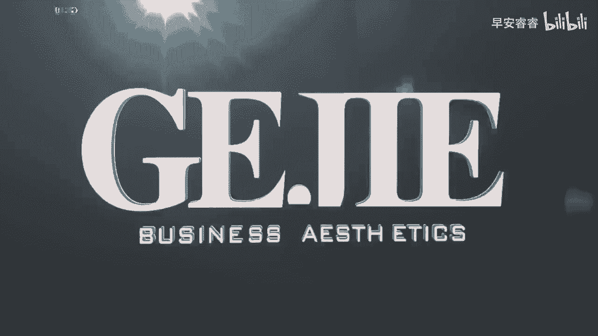

# 045 服装行业流量爆发营，从0-1抖音快速起号解决实体流量问题！ - P10：10 - 10.服装店经营方法 .mp4- - 早安睿睿 - BV1Kf421R7NA

在做账号之前呢，服装账号有三种非常精准的变现方式，你一定要去选择最适合你自己的一种，因为只有你定下来你的变现模式，你才会知道你这个账号，它要做成一个什么样的账号，它的内容要导向于什么方向的内容。

那么这三个精准的服装人可以去变现的途径，分别是哪三个呢，第一个就是直接用小黄车的短视频带货，你应该有去见过这种账号，比如说一些大众款呐，T恤啊，或者是背心啊，或者是内搭，他会说哎你看这个圆领。

真的是在这个夏天你一定要买的一件T恤，然后你就会发现它下面会有一个小黄车，你点进那个小黄车直接就可以购买了，其实像现在这种短视频带货的一个变现模式，在服装行业我们所见到的是越来越多了，那么这种变现模式。

它适合用于一些什么样的产品呢，首先第一个大部分更多的是标品会更适合，什么叫标品，标品指的就是它不太挑人，它比较能够被标准化，比如说像一个打底的内衣，像一个简约的T恤衫，像一件普普通通的衬衫。

它没有太多因人而异的个性化，比如说它的颜色啊不会有太多，一般它可能一个短视频带货就是一个颜色，然后他的领型也就是单独的，不会说有什么V领，圆领U心领，它不会有这种，然后的话它的款式会比较大众。

不会说过于紧身，很挑人，也不会说过于宽松，可能很多人都穿不了，就是标品是趋向于在我们服装里面说的，那些偏基础款的大众款的啊，这一类属于标品，且它的尺寸的SKU有很大的可选性，比如说从S码直到叉叉L码。

像这种他就非常适合啊，用这种短视频带货的模式去做，如果我们去用短视频带货的话，那它的整个内容属性，基本他就偏向于像我们看到的，围绕产品来进行的这个概念，其实非常符合现在的平台的一个趋向的导向。

就是去做精品电商，就是让你在你众多的产品里面，去筛选出一个额下单率高的，性价比高的客单没有那么高，适合更多的大众的爆品出来，进而针对于精准的人群给你进行推流，这个是第一种变现模式。

就是通过短视频直接挂小黄车去进行变现，那么第二种模式呢就是直播带货的模式，那直播带货你前期做的所有的短视频，其实都是为了后期把它引进到直播间里面，进而通过直播的一个展示，来进行产品的一个成交。

那如果说我们就是专门要通过直播带货，去进行变现的话，前期我们去规划的视频的内容拍什么样的内容，拍多长，一天要发多少条，以及我们在这个里面，它呈现出来的场景是什么样子的。

我们就都会跟我们透期的直播间的搭建，来进行一个匹配，这是第二种变现方式，就是所有的短视频，都是为了引流到直播间进行成交，那么第三种变现方式呢，就是通过短视频进而把流量从线上引导到线下，来到店进行成交。

这种模式呢，占到现在我们服装实体人去做短视频，我估计90%的同学，都可能希望进行这种模式的一个变现，也就是说大家现在更多的思维，更多的一个目标，是希望通过线上的一个内容输出。

进而把我们的线下门店的流量给它丰富起来，那如果说我们要达到的目的是，把人从线上拉到线下来，那么他的所有的内容就只围绕一个点，那这一个点它是什么呢，基本上就是你要给客户，一个非常明确的到店理由。

比如说我为什么刷到这个视频以后，我要到你店里去买东西，比如说哎现在如果你刷到一个视频，他上面说哇，哦杭州最宝藏的韩系高性价比的女装店，非逛不可，交通便利，当然大，你看他其实所有都在说一件事情。

把风格锁定掉，对不对，给你一个非常强的理由，比如说上下五层哇，平均价格就200到500元之间，实在是太友好了，里面没有小姐姐跟着你购物，非常的舒服，你会发现它一切都是围绕着让你到这个店里来。

他的视频内容的方向的目的是达到引导到店，发现了吗，这三种变现的方向其实都不一样，它直接就决定了我们的内容属性是不一样的，OK思考一下，到底哪一种才是你的账号想要去达到的。

