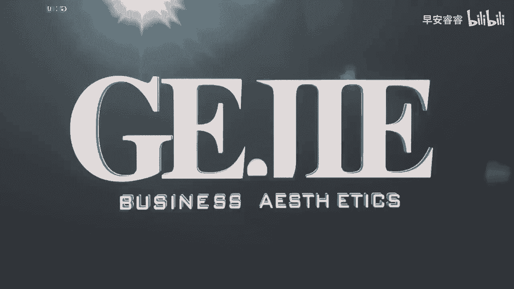
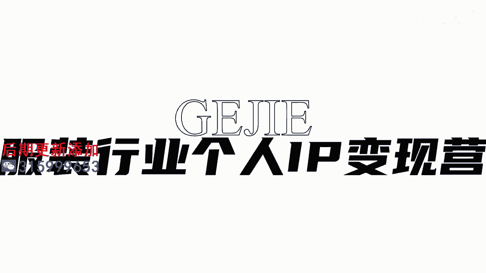

# 045 服装行业流量爆发营，从0-1抖音快速起号解决实体流量问题！ - P11：11 - 11节，了解账号定位公式 .mp4- - 早安睿睿 - BV1Kf421R7NA

接下来这节课，给大家解决一个账号的灵魂的问题，也是我们做账号最核心的一个问题，就是我的账号定位到底要怎么做呢，在我们这么多的学员里面，几乎每一个同学都问过我关于账号定位的问题。

那么今天呢我就给大家一套非常简单的公式，你只要照着我这个公式，一条一条的通过手写的方式，把我们思考的这个问题写下来，你就能够找到一个非常适合你自己的一个定位，那么这个公式呢就是我们说的账号定位四问。

这四问是哪四个呢，第一个是我是谁，第二个是我的客户是谁，第三个是我为我的客户解决什么问题，第四个是为什么是我好，我们一个一个来解答，首先第一个就是我是谁，我是谁，我是线下10年的实体服装店主对吗。

或者说我是经过美学专业学习的，拥有15年韩国女装经验的一个形象设计师，所以你是谁，其实我们听这一节课的，大部分同学都有一个共同的后端，就是我们是服装店主，但是我也想给大家一个思路。

不要总是把自己定义成为一个店主，因为你要知道你的这个身份，其实他是面向于C端，面向于更多的大众的，你可以给自己一个更高维的身份，比如说形象设计师，形象改造师，甚至你可以说女性什么魔术手，类似于这种。

对不对，或者说是穿搭小能手等等，这一类就是关于我是谁这个问题，我们当然每一个人我们都是服装店主，但我们到底如何去定义自己，刚才我给了大家两个思路啊，一个思路是往这种专业方向去做定义。

比如说我们说的形象设计师啊，穿搭师啊，搭配师啊，对不对，往专业方向去走，还有一个就刚刚我说的，通过你的技能去在一些形容词上，做一些记忆点来解决我是谁的问题，那么第二个就是我的客户是谁。

这个特别特别的重要，我需要大家呢现在拿一张纸，把在我的客户是谁这一栏，详细地写下你的客户画像，那首先第一个我们要去明确一下，我们客户的一个性别，比如说我的客户是男性，客户是男装吗，还是说是女性。

客户是女装吗，还是说是童装，对不对，所以第一个我们要把客户的性别给他拎出来，然后第二个我们一定要去确认客户，相对精准的一个年龄阶段，你想一下这18岁和25岁，女孩喜欢看的内容。

跟这个35岁到五五十岁的中年的女性，她喜欢看的内容肯定是不一样的，对不对，所以的话不要说啊，老师我家电18岁的也能买，60岁也能买，如果你家电是这么一个情况，你第一个问题就已经出在你的货品定位上。

因为这个世界上你不可能赚到所有人的生意，一定有你的核心客群，所以我们在这里面说的是和新客群，也就是说他是你的AB类大客户，这些人是哪些人，我们需要去把他的一个核心的年龄阶段，给他写下来，那么第三个就是。

我们还需要细化到我的客户的职业是什么，比如说我的客户是医生，我的客户是教师，我的客户是大学生啊，或者说不一定是职业，也可以是一些标签，比如说我的客户是喜欢蹦迪的，那些穿的很火辣的小姐姐。

或者我的客户是需要去上班的，那些有通勤的，简约大方的服装需求的这些职场女性等等，你要把你所能够想得到的，关于你的客户的整个标签细化地梳理下来，梳理得越细，你这个账号定位就会做得越精准。

OK那么第三个很重要的来了，你的价值在哪里，也就是说我要为我的客户解决的是什么问题，举个例子啊，我们看到有一些账号啊，比如说微胖穿搭，那你就知道这个账号它解决的是微胖的问题，如果他说是小个子穿搭。

那你就知道他解决的是小个子的问题，那我问你，你为你的客户解决什么问题，比如说有一些人他特别擅长做韩国女装，那是不是我们可以去把这个部分去拎上来，比如说拥有15年的韩国女装的，一个代购的经验啊。

特别会打造甜美，什么样什么样的一个小姐姐对吗，或者甜美是你可以去为你客户解决的问题，所以你到底为客户解决什么问题，比如说我为这个38~4，45岁之间的女性去解决洋气，显年轻但得体优雅的形象方案。

这个也有可能是你的一个定位，所以你去思考一下，你能够去为你的客户解决什么问题，这是我们讲定位的第三个部分，那么第四问就是为什么是我这个很重要了，比如说诶微胖穿搭有300个账号，小个子穿搭有500个账号。

那为什么是你呢，在这里面我们需要去提炼一下，我们去做账号的核心优势，每一个人做账号的核心优势都是不一样的，比如说有一些人他做账号的核心优势是颜值，那可能他的更多的呈现，都是在颜值部分的一个呈现。

有一些人他的优势可能是在身材，那他可能更多的呈现是在身材上的呈现，有一些人他的核心优势是气质，可能他会通过一些具体的场景去呈现出来，比如说有一些店主他很知性，对不对。

那我们可能就会设一个偏知性的一个场景，让他在那个知性的场景里面，去呈现他的一个穿搭风格，那也有人可能他的核心优势是他的专业，比如说我们有非常多的学员，他跟我去学习过这个专业的形象美学的课程。

经过了我们一阶的基础，二阶的深造，三阶的一个国际的一个高级形象，注册管理师的一个认证，那他身上的这种专业优势会非常强，那他就会突出他的专业，他可以给客户去做皮肤的测试，可以给客户去做风格的诊断。

可以给客户去做身形的优化，妆容的设计，这个发型的设计，一站式的去解决我们客户的专业问题，你会发现有很多会搭的服装店主，但是很少有很专业的服装店主，专业到你进到我的店铺里。

我是可以去为我的客户提供这种色布测试啊，风格诊断呐，身形诊断呐，对不对，好给他100页的PPT，告诉他他的形象方案是什么，我们这一类的学员，可能他更多的优势就是在专业优势上，就会比别人明显突出了一个。

为什么我要去选择你，而不是去选择他的一个核心的理由，当然也有人，可能他的一个差异点是在一些审美化的呈现，比如说他可以把封面做的特别的美，然后他可以把这个视频剪辑的特别的有氛围感，甚至有人他是音乐的优势。

比如说他对乐感非常的擅长，他出来的这个音乐就很能够抓人的情绪和节奏，等等啊，所以各位你一定要在做账号的前期，先要去想一下，到底在你身上有哪些优势是属于你去做账号，你拥有而别人没有拥有的东西。

要想明白这个点啊，这个就是我们讲的定位四问，第一问我是谁，第二问我的客户是谁，第三问我为我的客户解决什么问题。

