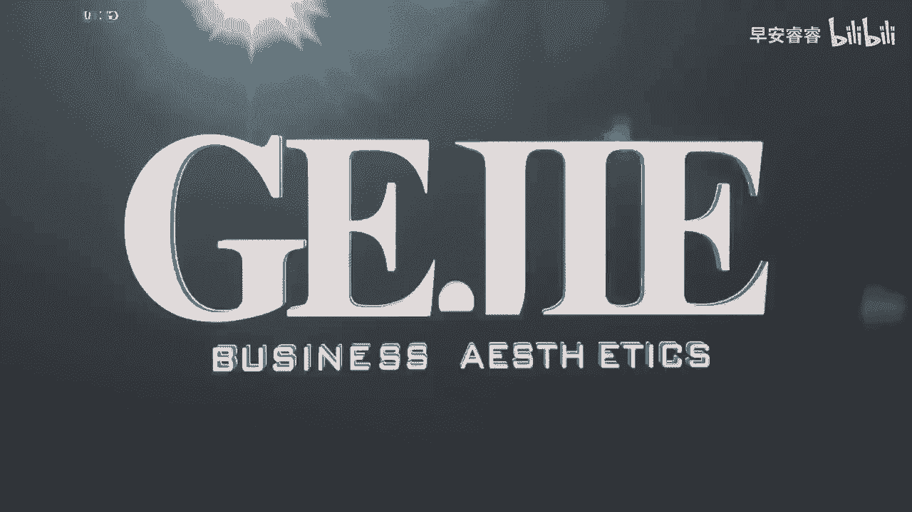

# 045 服装行业流量爆发营，从0-1抖音快速起号解决实体流量问题！ - P12：12 - 12节.公域账号搭建 .mp4- - 早安睿睿 - BV1Kf421R7NA

讲完了我们的账号定位了以后呢，我们就开始进入到我们的起号，真正的一个实操流程了，那么接下来的四节课呢全部都是实操的部分，你一定要一步一步的去记下来，在我们去做好一个账号的定位以后。

我们就开始来进行下一步就是整体的账号搭建，在账号搭建里面一共有五个核心的板块，其实有很多同学啊，他到现在整个账号的搭建都是非常潦草的，甚至他的脑海里面完全没有，账号搭建的概念和理念。

直接我给他录了一个视频，就开始往上丢，也不去做定位，也不去做检测，也不去思考我到底做这些视频，最终是要达到什么样的一个目的，OK那么今天我们就详细给大家来介绍一下。

到底一个完整的账号搭建五部曲应该怎么去走，第一个选择一张非常能够匹配到你风格的头像，第二个选择一个要达到你目的地的账号背景图，可以跟着我们的这个图片的一个示范案例去看，就是我们的账号上面横向那个背景啊。

那个就是我们说的背景图，它其实是可以给你达到很好的一个，转化和变现的作用的，那么第三个呢，就是要去选择写好我们的个人简介，个人简介是别人在看了你的短视频后，进入到你的主页。

对你去形成第一印象最核心的一个部分，所以这个地方是需要你好好去编辑的，然后第四个呢，就是做好你的整个账号的封面的一个搭建，其实有很多同学他是不去做封面设计的，如果你不去做封面设计的话。

你的整个账号看起来的质感，其实要低很多很多的，那么最后一个呢就是昵称，选择一个适合于你的昵称，那么在这节课里面我先给大家解决昵称的问题，然后我们接下来每一个部分，刚才我提到的账号搭建的每一个部分。

都会有单独的课程，来教大家怎么去把它给落地下来，好，首先我们来看一下哦，什么样是一个在公寓上好的昵称呢，第一点它一定要易于传播，也就是说他一定要能够被读出来，我们有非常多的实体店主啊，他的那个英文名啊。

或者他的那个中文字啊，要么那个英文名根本就念不出来，要么就是他那个中文字啊极其的拗口，或者说那个字非常的生僻，搞得人根本就读不了，那像这种他没有办法读出来，没有办法。

朗朗上口的这种昵称是我们绝对不要去起的好，然后第二个呢，昵称最好要能够具有一定的识别度和记忆度，你比如说都市轻奢女装，像这种名字，他就丝毫都没有记忆度，如果你是以这个名字来在公寓上存在的话。

哪怕别人关注了你，他第二次想找你的时候，根本都想不起来，你有没有试过那种某一个博主的名字，由于非常的不好记，你明明关注了他，然后你在你的关注列表里面，却怎么都想不起他到底叫什么。

这个就是因为他的这个名字是没有识别度，或者没有记忆度的好，那么第三个呢，就是我们一定要去选择那些，能够匹配于我们风格的一个店铺，那么最后一个呢就是我们一定要去注意，你的昵称，一定要能够匹配上你的风格。

比如说你是去做这种非常成熟型的职场女性的，结果你的这个名字叫做honey这么的甜美，那么你就会发现你跟你的整个内容的匹配定位，它其实就差很远了对吗，那我们来看一下我们在这边列举的这个账号。

他的这个案例账号叫做时髦精坤营，这个账号，我是建议所有的服装人，是一定要去关注一下的啊，我们在后期也会拿这个账号的很多的方面，来给大家去拆解它的一个账号搭建，那你看他的名字叫时髦京昆怡，这就决定了什么。

第一你知道他是干什么的，对不对，第二个它叫做坤宜一意味着什么，他的客户群体是比较年轻还是比较成熟呢，一定是有一定成熟的女性对吧，不会是那种18岁的那种小女孩，所以你看我们起的这个名字的定位。

她可能要跟我们的风格做匹配，如果你卖的是年轻的衣服，你也可以叫什么什么小姐姐，对不对，好最后一点，你起的名字最好要既有人名又有行业属性，举一个例子啊，比如说像林丽什么什么什么女装创始人，对不对。

那这样子你就会发现我在这个名字里面，首先第一个我知道你叫什么，我至少能够跟你在视频里面来进行一个互动，对不对，那我们有一些服装人，他的这个账号是完全没有个人名字的，比如说他叫做可言优雅女性服装。

那别人怎么叫你呢，是不是你这个名字，你是一个店铺的名字，你不是一个具体的人名啊，我们要知道一个短视频要跟别人产生交互，一定是要有沟通和交流感的，所以的话一个好的名字的名称的模板，我们已经给到大家了。

人名加上你的店铺名或者是人名，加上你的这个定位名，第二个模板是人名加上你的一个职业身份名称，也可以，比如说丽丽私人形象定制师，哎你看私人形象定制师，他是一种职业对吗。

OK那像这样子既能够知道你是干什么的，又能知道你叫什么，这是比较好的一个模板，好关于你的昵称，看一下。

