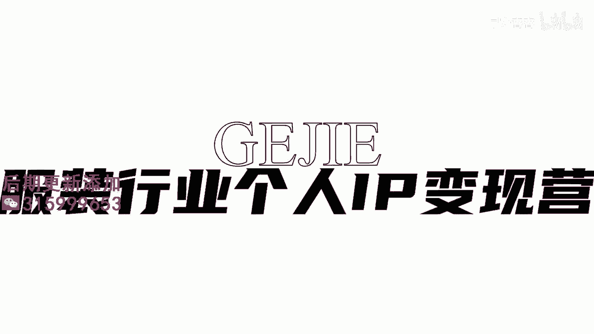

# 045 服装行业流量爆发营，从0-1抖音快速起号解决实体流量问题！ - P13：13 - 13节.头像如何选择 .mp4- - 早安睿睿 - BV1Kf421R7NA

我们短视频的头像在做账号搭建的时候，是一个非常重要的部分，这是别人第一眼就去记住你的样子，而且你会发现当我们去刷账号的时候，你如果要去看一下这个人，你是必须要点进他的主页，才能看到他的一些背景图啊。

他的一些这个封面呐，对不对，可是你哪怕不用点开它，你也是能够在圆圆的那个小标里面，看到他的头像的，所以头像是非常非常重要的，账号搭建的部分，那么我看到很多服装人，那个头像取得非常的潦草。

要么就是随便把自己家的那个门头拍的乌漆嘛，黑的往上丢，要么还有一些人呢，他选一些什么欧美街拍明星放上去一看，这就不是你本人嘛，对吧好，所以我们来看一下，如果一个好的公寓的账号。

你想让别人通过头像一眼就把你给记住的话，有这四个方法和标准，第一个一定要注意你头像的一个尺寸，头像的尺寸你注意了，它是个圆形的对吗，所以你的那个尺寸一定要去匹配于，我们官方规定的一个尺寸啊。

不要你搞得非常的古怪，过大了或者过小了啊，那么第二个的话就是取景，取景说的是什么呢，说的就是头像，你想一下我要看到的应该是你的脸对吗，但是有很多人他用全身照当头像，本来那个头像在手机上就占那么小小的。

一个比例，你再搞一全身照，谁能看得到你长什么样子啊对吗，我们一定是记不住你的，所以在取景上面，大家只取两种景，一种是大头照，就是只呈现你的面部的，第二种呢就是半身，顶多到半身，绝对不能取全身照。

全身照是非常不适用于当头像的，不仅是公寓，私域也是一样的，你自己的微信也不要找全身照来当头像，还是我说的大头照和半身照，如果说是放在公寓的话，其实我蛮建议大家去选择自拍的，自拍的那个尺寸。

非常的符合头像的一个取景好，第三个就是你的头像的风格，举一个例子啊，风格的话，比如说你在什么样的场景拍，你是白天还是晚上的，你是什么颜色的一个背景都可以称之为是风格，如果你自己做的是那种哎优雅的。

轻熟的女装对吗，那你的这个头像的风格，给人的感觉应该是淡雅的，而不是艳丽的，如果说你做的是那些甜美可爱的韩妆，那你这个头像给人的感觉应该是清新的舒服的，而不是非常辣的，非常火的那种对吗啊。

所以在我们选取这个头像上面，我们还是尽量要靠近我们的服装风格，这样子更快的能够跟我们的变现匹配起来，那还有一个点我想提醒大家的就是，大家尽量不要去使用过于暗的那种头像。

比如说你在晚上在一个乌漆嘛黑的街边，拍的一个头像，隐隐约约的有一点点路灯，那个看起来质感是非常low的，所以大家如果要去选，我还是尽量选大家在光线充足的一些情况下，拍出来的这些照片。

他整个给人的感觉会更加的舒适好，最后一个就是一定要有真实感，给人觉得这是一个人什么意思，我发现我们服装人会有很多人，他可能会去拿一些明星或者是模特，或者是街拍图或者是秀场图，你自己觉得非常的高大上。

对不对，但是你会发现哦，抖音它是一个个人和个人之间的交集平台，你就会发现抖音的那些几百万的大V，没有一家是公司的，全部都是个人，所以他非常需要有这种人和人之间的，一个距离感，就是我看到这个账号的时候。

我是关联到一个人的，我不是关联到一个T台模特，也不是关联到一个明星，所以我建议大家最好还是用自己的头像，用自己的脸去当这个账号的头像，会一下子快速的去拉近你跟观众的一个距离感。

以上就是我们说的如何去挑出一个好的头像，那接下来呢我要教一下大家，真正有技巧的事情了，就是你如何能够拍出一场有质感的头像呢。

