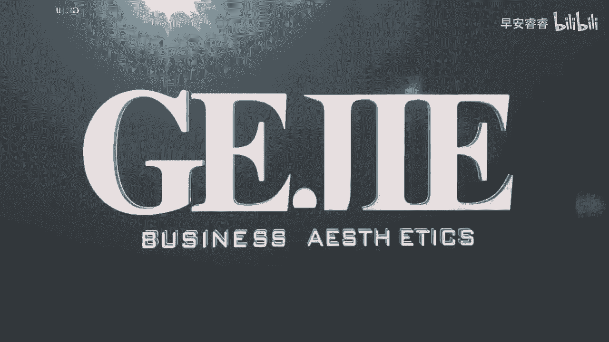
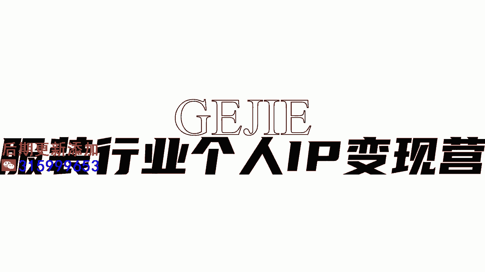

# 045 服装行业流量爆发营，从0-1抖音快速起号解决实体流量问题！ - P14：14 - 14节.如何拍有质感头像 .mp4- - 早安睿睿 - BV1Kf421R7NA

咱们服装人呐，作为这个时尚界人士，你是真的真的非常需要一张好看的头像的图片，不管是你用在一些公寓上选做头像，还是思域的朋友圈，还是说你有时候需要运用到一些邀请函呐，或者是一些海报图啊。

或者你要去做一些直播预告啊，你都需要一张能够快速被别人记住，并且让别人感叹说哇好美哦，你很需要这么一张头像照，但是我发现啊，99%的服装人都没有这么一张，让人能够印象深刻，并且适用于在多个场合的。

稍带正视且惊艳的这么一张照片，所以今天呢小老师呢也来把自己这个10年，专业的模特的一个拍摄经验告诉给你，说你如何能够拍出一张非常适合你，而且还非常漂亮的照片好，首先第一个啊。

我们这种图片一定是要去找专业摄影师拍的，你说我随便找一个姐姐弟弟哥哥妹妹，它其实是没有办法达到，我们在质感上的一个要求的，所以第一个点就是你一定要去找专业摄影师拍，然后第二个的话就是。

我们可以在小红书上面搜索个人写真，然后你先在里面去找一些，你自己觉得匹配你的风格，确认风格是我们去拍一组照片，或者我们去拍一个头像的第一步，因为其实咱们服装人呐虽然对服装非常的熟悉。

但是对这种平面视觉的整体成，现在我发现，大家其实在这个领域是相对比较陌生的，如果靠你自己凭空想象出一个拍摄风格来，其实非常难的，所以大家可以呢去通过平台去找一下，别人拍出来的，然后你先去看一下这个风格。

你觉得跟你比较接近对吧，比如说来大家看一下我的这一张照片，你看一下我的这个照片诶，他一下子其实跟我的整个职业对不对，和我的风格马上就能够匹配出来，你看我因为是穿着一个小香风嘛，然后带了很多串项链。

然后把头发非常利落干练的扎起来，因为那个是我一个导师形象的一个呈现，我肯定更多给人的感觉是优雅的，简洁的，高级的，那我的整个背景的色调都是暗色调，但它整个色彩是一个基础的色系，且它的用光是非常均匀的。

那像这种场景，他就会给人一种很高级的视觉感受，那我们再来看另外一张图片，是我们隔界另外一位老师叫娜娜老师，因为他的整个风格是给人一种如沐春风，非常的清新大方，温柔笃定，你就会发现他的这一张形象图里面。

就能够呈现出他整个人和背景怎么样，有一种非常清新的一个结合，把她的整个这种女性化的，这种柔美的波浪的头发给展示出来，这个就是他去敲定的风格，那你自己要去选取一个什么样的风格呢。

这个部分你就要自己在小红书上多找多看，收藏起来，把这些你认为你是可以去拍的风格给收藏起来，那么在这里，风格其实是我们最最最核心要敲定的，我们去拍一组图像的第一个思维，所以呢我也给大家去列举了几张。

就是我觉得可以借鉴给大家的风格，来我们跟着镜头来看一下啊，比如说首先第一个你看像谭松韵的这一张，他的整个背景是红色为背景的，所以他有一种浓烈复古的感觉，然后他前面穿的是这种比较黑色的衣服。

然后戴了一个非常闪亮的一个项链，他整个的照片传递出来的风格是偏华丽风格的，如果说你做的是那种比较漂亮的女孩，但是她的整个风格又偏华丽和复古一点，那你去拍这种红黑的风格应该还是比较适合的。

那我们再来看第二个女明星，他是这个把头发梳成一个蜈蚣辫，对不对，然后整体风格非常的清新，给人一种又文艺又少女，然后又带一点点甜美的感觉，你看还捧着一束花对吗好，所以你看这种风格它可能非常适用于一些年龄。

再低龄一点，然后整体的衣服的调性，偏文艺感或少女感一些的，那第三个，我们看到的就是这个在海边的一个女孩子对吗，她整体非常有那种氛围感，所以一般如果去拍这种风格的话，那他选的这个场景是一个外景嘛对吧。

它呈现出来是一个更偏自然，然后从服装上的一个匹配来说，可能他的这个风格是像文艺型会多一些好，那么再接下来我们看到啊，这个女孩她躺在这个椅子上对吧，然后做出一个伸懒腰的动作，他整个风格是非常柔和的。

那像这种的话，可能就比较适合一些做棉麻系的这些店主，你去拍这种衣服，你去拍这种风格，能够跟你的客户群快速的匹配到一起，那最后一个我们来看一下这个娜扎啊，他拍的是一个艳丽的这种黑色的风格。

然后有一个像是这种舞台光打在她的这个脸上，那他这种风格，它呈现出来的就是一个给人很明艳很美，所以一般拍这个风格的，可能你的受众本身就是美女裙居多，比如说像一些名媛风啊，白富美风啊，你就可以挑这种类型的。

作为你去拍一套造型的一个思路，那我们第一个先确认风格啊，确认完风格以后，我们就开始确认场景，场景的话，如果是头像的话，我们可能大多数都是用素色的背景，但是这个背景你就要去看它的整个色调。

能不能跟你去匹配，或者说你也可以选一些外景，从耐看度上来说啊，我认为外景的耐看度是更高的，而且我认为外景哦更适合放在公寓上面，公寓嘛就是我们说的抖音啊，小红书啊，对不对。

因为这些平台它有一种需要快速的跟客户建立，亲和力的一个属性，所以的话你反倒是越像一个，更靠近于我们现实生活中看到的，这种真实的场景，可能会越有优势，但如果我们这个头像是放在私域里面做IP。

比如说放在我们的朋友圈当头像的话，那你其实反倒可以考虑，刚才我们看到这种棚内的场景，因为它会有一种脱离于生活，但是高于生活的美感，这就会让那些跟你平时接触的客户，有一种仰望你的感觉。

因为公寓和私域它的属性是不一样的，公寓要一个更亲近的IP，私欲呢是要在现实生活中，但是要比现实生活中再高一截的IP，所以他们要的场景可能也会不一样，那么第三个的话就是定造型，你是披头发的还是扎头发的。

你是这个卷发还是直发，你都可以去根据你的风格来进行一个匹配，最后最后一点，请千万要记得带着你的案例去跟摄影师沟通，就是你是不能去凭空说唉，我要一个什么样的感觉，而是说把你看到的这些案例给他存起来。

然后跟你的摄影师进行提前的一个沟通，并且你甚至可以模仿他们的一些动作，一些什么手部动作啊，因为可能有一些服装人，也不是特别的会去呈现自己的一个肢体语言，这些都是可以通过你准备好的这个图片。

来进行现场的一个模拟的，OK好了，那么通过这四点，我相信你一定可以拍出一张经验。