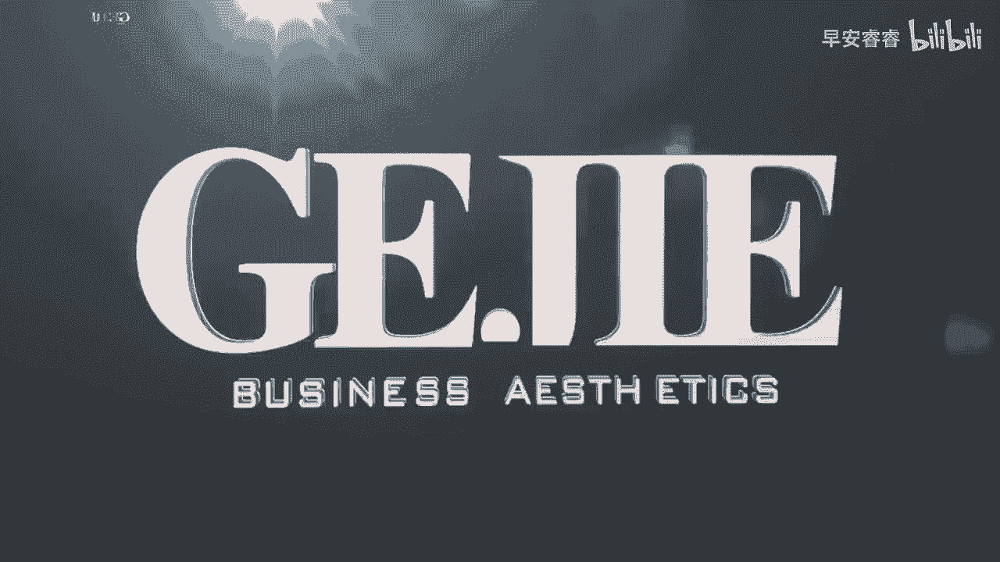

# 045 服装行业流量爆发营，从0-1抖音快速起号解决实体流量问题！ - P15：15 - 15节.背景图如何选择 .mp4- - 早安睿睿 - BV1Kf421R7NA

一个非常好的主页搭建，一定有不能或缺的重要的部分，就是我们顶上的头图，那很多人其实都是错过了，这么好的一个展示机会的，你可以去试想一下，这个头图，就是我们实体门店给你的那一块门头啊，对不对。

怎么可能会有人连门头都不设计，他都开业了呢，你想想我们现在有多少服装人，他的账号里面就是没有一个好好的门头的，你把这事儿放在你店里的一个实体店来想，觉得说啊，不可能，我不可连门头都不设计，我就开业。

但实际上你会发现你在抖音上，你就是这么做的，你就是没有一个非常好的门头去展示给别人，说我这里是一个什么样的店，你可以在这里获得什么对吗，那么首先第一个我们来看一下，要选择一个好的一个头图的话。

有三个方向去思考，第一个方向就是我们在这个头图上面，去展示我们的一个店铺的实力，比如说有一些店铺它装修得非常的精美，它的可能整个外观拍起来就非常的漂亮，那我们就可以专门去拍一张这种尺寸合适的。

一个店铺的外观图，把它当成是头图，当然也有人他是非常擅长做陈列的，对不对，陈列的不就是横向的一杆一杆嘛，那我们也可以去把我们店铺里面，陈列得非常漂亮的，而且很能够去展示我们店铺的货品风格的。

一杆陈列给它拍下来，然后把它用作店铺的一个展示，当然也有一些人呢，可能现在很多的服装店主，由于装修都非常的内卷，对不对，有一些在店铺里面布置的非常好看的，一些美好的角落，也可以把它拍下来。

作为你店铺的一个呈现，甚至如果说你是连锁店店比较多的，你的那种团队的一个展示，团队照，横向的这种都可以拿来当你的一个头图展示，那么所以第一个思路，就是展示咱们的店铺的实力。

第二个思路呢可以展示你的个人价值，举一个例子啊，在我们的头图上面写带你变美变瘦，对不对，这个是不是你来关注我的一个价值啊，对吗啊，或者写，帮助100名普通女性走上肤白貌美的道路对吧。

就是你能够把你的价值展示在上面，比如说专门解决中国女性梨形身材问题，你看这个是不是也是你的一个价值的展示，这个价值的展示，其实我们当时在账号的定位篇，我们就去思考过了，到底我为我的客户解决什么问题。

而你解决的这个问题，就是可以通过我们头图的部分，来进行一个呈现的，那么第三个这个头图还可以是一个非常好的，引导转化的一个方式，你经常会看到有人在头图上面写，关注我可获得什么什么，对不对。

比如说关注我可获得普通人变美的捷径，对就是这种引导关注的动作，甚至啊有一些可能比较小的，不易被发现的一些引流动作，比如说隐藏着一些号啊什么之类的，也会有人放在头图里面，但是这个目前为止没有非常精确。

说一定可做还是不可做，要看你有没有被平台看到，如果说你还是一个小号，你只有个万把的粉丝，几千的粉丝，那他也不会去抓你的，但如果你一旦粉丝量起来了，那你这种在头图里面去藏有引流转化的，这种账号的。

可能就会被封禁或限流啊，所以这个部分大家要要去看一下阶段啊，总体来说它有一定的风险，但是引导关注一定是没有问题的，好，所以你看这三个方向，是我们去挑选一张合适的头图，可以去思考的方向。

OK那么有朋友就说了，哎老师可是我不会选头图呀，我也不会设计头图呀，那么下一节课，我们又要给大家一些非常非常实操性的方法了，教大家怎么通过一些手机app的工具。

