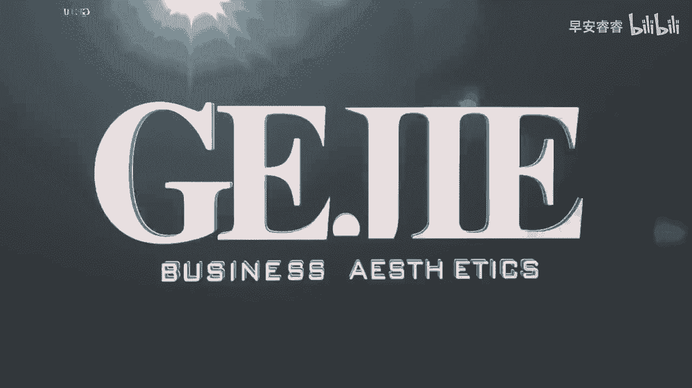

# 045 服装行业流量爆发营，从0-1抖音快速起号解决实体流量问题！ - P17：17 - 17节.短视频封面设计 .mp4- - 早安睿睿 - BV1Kf421R7NA

这节课来教大家在账号搭建里面，非常容易被大家忽略，可是它却非常重要的一个设计，这个设计呢直接会关联到你的视频的连带播放，举个例子，如果我对你这个视频非常的感兴趣，我看完你这个视频以后。

我想说哇这个人真的好美好棒，好有趣，好想再看看他有没有一些其他的视频，于是这个时候呢我们就会跳出视频本身，进入到你的主页里面，这个时候我们就会去通过封面来确定，哪一个视频是我感兴趣的对吗。

但是我们来看一下，有非常多的服装人，他的封面嗯，就长这样，你看乱七八糟，就是有很多的服装人他在做短视频的时候，他不会去进行一个封面的设计对，进而他直接用这个视频自动抓取出来的，第一个页面来当封面。

这就导致了它整个页面给人感觉是非常混乱的，哪怕我喜欢你这个视频，我都很难再点进去看你第二第三第四的视频，因为你的观感实在是太差了，那我们再来看一下经过我们去设计过的封面，大家来看一下。

比如说我的好几个账号，你看我们的每一个封面，在主页上呈现出来都是非常的简洁明了的，Ok，那么接下来我就要给大家三个，去设计封面的思维，第一个就是封面的统一性，就是当你去定好一个封面的模板了以后。

你就不要老是改它，你不要发一个视频，改一个，发一个视频改一个，对不对，颜色五颜六色的，不要这样子，而是要在相对长的一个时间内，在相对长的一个屏幕范围内，保持封面的一个统一性。

这种统一性会让你的整个主页给人感觉，非常的高级，而且能够让人家清晰明了的去选择，他想要去看的一个视频的内容好，所以第一个在相对固定的时间里面，去保持一个相对统一的封面调性，我不是说你这辈子都不能改了啊。

而是说相对固定，比如说我们半个月或者甚至一个星期也可以，我就用这个封面，只是说在上面换不同的字而已，对吗好，那么第二个就是要跟我们的一个主题性，进行一个匹配，就是我们其实每录一个视频都有它独立的内容。

对不对，比如说这个视频，它的内容是客户对你的一个反馈，这个视频它的内容可能是一个形象改造，那我从主页上，我必须要通过你非常清晰的一个主题，进而选择我要点进去看什么，所以大家去做封面的时候，一定要注意。

你这个封面相对来说，它跟字体的一个对比度是比较高的，比如说如果你用黑色来做底，那你可以用白色的字，你不要说我用米色做底，我又用白色的字，那这样子的话，我们根本就看不清楚，你这个封面上面表达的一个主题。

这就本末倒置了，没有达到封面应该达到的一个结果，封面就应该让人家简洁明了的，在没有点进去之前，就知道你这个视频想要去说什么内容好，第三个就是要跟你的个人风格进行匹配，还是我们说的货品是什么风格。

尽量我们在封面上呈现出来的，也是这个风格对吗，那也有很多人他会去拿头像来当封面啊，也可以的，拿一些半身照呀，啊，拿一些你在外面外拍出来非常好看的这种照片，当封面没有问题，我们只需要在上面去写不同的字。

然后你要保证这个封面，他的整个风格跟你的货品风格是比较契合的，如果能够做到这三点统一，主题突出且风格匹配。

