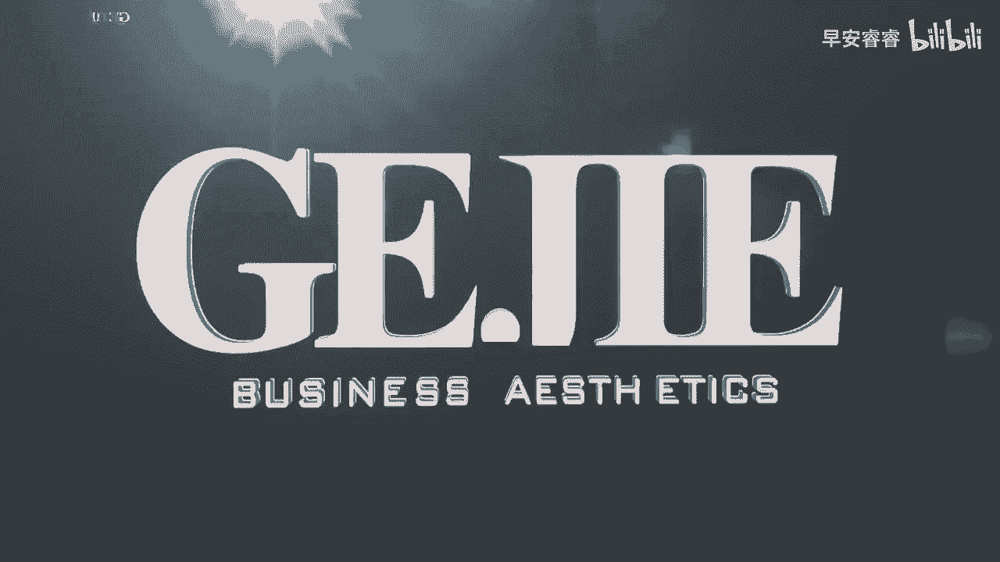

# 045 服装行业流量爆发营，从0-1抖音快速起号解决实体流量问题！ - P18：18 - 18节.短视频简介如何描述 .mp4- - 早安睿睿 - BV1Kf421R7NA

好，那么我们今天就来到了，账号搭建的最后一个步骤了，写一个让别人眼前一亮，记忆深刻的简介，你会发现啊，在我们整个账号的上半部分的搭建里面，简介它占的篇幅是最多的，但是各位这个简介却是在我们所有账号里面。

最最难做的一个部分，这也是大部分人都会潦草几句去写的，比如说什么开了一家温暖的小店，想要遇见同样什么同频的你这一类的，像这种简介的话，在茫茫的公寓里面，根本连看都不会被别人多看一眼，所以服装人啊。

咱们的这个账号要搭建好啊，简介可是重中之重啊，那么接下来呢我给大家几个去做简介的方式，这个方式叫做1+1加一，什么意思呢，就是你如果有我提出来的以上的三个一，就能够组合成一个非常好的简介。

那么第一个一是呢身份，你可以给自己一个身份，比如说什么什么品牌的主理人啊，或者说什么什么什么形象设计师都可以，这个就是你的身份，所以你先给自己去定义一下身份，身份不一定只有一种啊。

也有人他可能是三个小孩的宝妈，这个她也是一种身份啊，这个你看她就是你的身份身份里面不用受局限，可以尽量发挥你的脑洞，当你的身份写的越特别，很有可能你这个简介越容易被别人记住，那么第二个一呢是经历啊。

比如说服装设计专业毕业，你看这就是属于你自己非常独特的一个经历，比如说看过100场高端时装秀，诶这个也是属于你的经历，甚至你可以说走过1000个不同的买手店，这些都叫做经历好。

或者有人他有一些留学经历啊，啊他可能有一些比较特别的经历，甚至你说我登过什么什么珠穆朗玛峰这种，他都可以作为经历，当然跟我们的专业越相关啊，你这个经历可能就会越容易被客户，精准地匹配到。

他对你的一个价值需求好，那么还有一个一是什么专业背书，可以成为你的经历，比如说像我的美学的同学，他拿到了ACC认证的，国际专业的高级形象管理师，那他这个其实就是一个专业的认证，对不对。

这种也是非常非常适合放在你的简介里面，并且一眼就能够让别人，快速的让你和其他的服装店主区分开来的，那还有一些一呢可以写年限，比如说18年服装人，或者搞定过1万名女性的解决方案，形象解决方案啊。

那你也可以去写你的实力实例，比如说有人说哪某某城市十佳品牌连锁店对吧，100个员工，你看这种可能都属于你的实力方面，那么最后一个呢这个一也可以是你的价值，比如说我能解决所有的A型身材的问题对吧。

唉我能够解决小个子女生的问题，我能够解决职场女性的问题，我能够解决约会的问题等等啊，那这些都是你的价值，你就会发现从刚我说的身份经历，专业背书年限，实力价值，我一共给大家列了六个点，对不对。

但是你不需要把这六个点全部都写下来，你只需要在这六个点里面去挑出三个，你比较有优势的地方，有些人可能他的优势是在专业上，有些人的优势可能是在精力上有限的优势，可能是在它的价值上面。

你把三个给他串起来就OK了，就你这个简介千万不要写太长了，我们见过有一些服装人类简介点那个展开，下面还有一大排，根本就没有人看，所以简洁是很好的，所以的话大家在六个里面只需要挑三个出来。

变成你的一个简历，最好他要能够具备一定的，你的个人的一个识别度，这就是一个非常好的简介介绍了，OK赶紧把笔动起来，把简介写起来，如果说你需要去修改简介，你不确定自己写的好还是不好，你就把它写完了以后。

丢到我们的班级社群里面，会有顾问老师和同学们积极的去帮你，去修改你的一个简介。