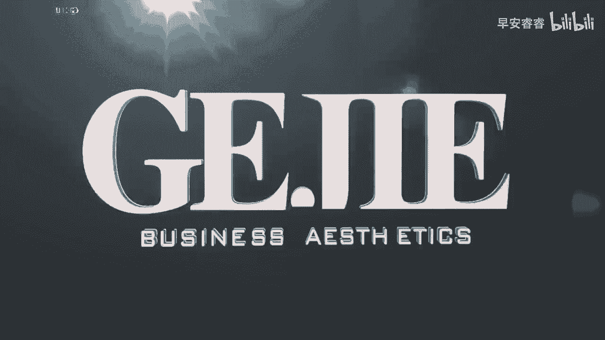

# 045 服装行业流量爆发营，从0-1抖音快速起号解决实体流量问题！ - P1：1 - 1.打造个人IP .mp4- - 早安睿睿 - BV1Kf421R7NA

Hello，各位同学大家好，我是隔界商业美学的创始人逍遥老师，那么非常欢迎大家来到我们服装行业，个人IP流量变现营这门课呢，主要就是为了针对现在在线下，需要去经营实体门店的这些服装人。

为了解决你的流量问题而设置的，那么一个服装人，为什么我们服装实体店那么缺流量，却始终很少有人能够在抖音这个平台上，真正的去把短视频做好，真正的去利用这么大的一个七个亿的日活量，去利用这么一个app。

可以从社会的顶层有钱人，直到我们的中产阶级，而我们服装人，却鲜少有人能够在这个平台上做好呢，如果说你真的想要去利用抖音这个平台，用一些比较轻松和正确的方法，去做好你的流量的话，这节课你一定要去听完。

因为这堂课实际上是我们隔界商业美学，在操盘了我们上千个学员的实战的账号的案例，然后总结到我们在线下，上万块钱的大课里面的精华内容，把最容易落地，最好用最前沿的方法集合在一起的这么一堂课。

那么这一堂课我们一共有十大板块，这十大板块你相信我，它可以让你在做号这条路上少走3年的弯路，首先我们的第一大板块呢，就是让你正确的去认知到流量的一个思维，在这里面我们会教你，第一服装人起号的基本原则。

比如说会有很多人问我说，老师我这号还能用吗，老师你看我这号上什么内容都有，我这个号老是只有两三百的一个播放量，我的号是不是已经废掉了呢，这些其实都属于起号的一个基本规则，然后第二个部分。

我们呢会带你去做起号账号的一个搭建，一个好的账号搭建，那它就能够大大的去提升你的，从短视频转到你的主页的一个吸粉率，以及能够让你把你的客户从喜欢这条短视频，进而引流到你的店铺里，所以第二个部分呢。

我们即将从每一个细节上，教你如何做一个服装人账号的账号搭建，第三个部分呢，我们会教你去做一个极其有技术含量，但是很多泛的运营都不懂的东西，就是服装人的账号定位，服装实体人去做账号啊。

他的属性其实跟你去起一个直播间，跟你去做一个穿搭博主，他的底层逻辑是非常不一样的，如果说你今天去跟一些饭的运营去学习，泛的机构去学习，他教给你的那个东西并没有错，但是它却不能像我们这么专门的一个课程。

就是针对服装实体人，且我们所有的逻辑，所有的方法全部都来自于我们的学员，经过验证以后好用的一个方法，所以呢我们会在这堂课上给你去解决，到底一个服装实体人，他的账号的定位要怎么做，它的优势在哪里。

它的劣势在哪里，我们作为一个传统的实体人，搬到了线上以后，我们又该如何去展现我们的优势，进而能够跟那些年轻漂亮，有颜值，有身材的那些穿搭博主去进行流量的一个抢夺，且达到变现的目的好。

那我们课程的第四个模块呢，就是教你如何，在建立完一个账号的定位和搭建以后，你能够让平台给你去推送精准的客群，这一步是非常非常重要和关键的，我们即将给到你七个方法，让你能够在抖音平台上。

准确地去找到你想要的客户，不管他的年龄，地域喜好和标签，都能够让你匹配到，最有可能达到变现目的的账号，因为我想每一个人他来听这一堂课，作为一个服装实体人，大概率你并不是想成为一个网红。

也不是想成为一个明星，也不是想成为一个段子手，你其实更重要的是希望这个账号用来做变现，对不对，变现就等于精准人群，所以这个部分是我们课程的第四个板块，那么课程的第五个板块，我们即将手把手地教你去做。

你的账号的内容定位，我碰到过非常多的学员，当他们在咨询我账号的问题的时候，90%的人都问了相同的问题，老师我这号我到底要拍什么呀，是的，你拍了什么就决定了你有什么样的人群，有什么样的流量。

能不能够去做变现，所以的话第五个板块，我即将给到大家非常实用的工具和方法，教你去做一个服装实体人的精准的内容定位，让你听完这堂课以后，就不会每天想啊，我今天拍什么，我明天拍什么。

你一定会知道什么样的内容，会匹配什么样的结果，且你会知道如何去找到你的店铺，最有优势性的内容，课程的第六个板块，是教大家怎么去做服装人的爆款选题，服装人其实因为他的受众和话题是相对垂直的。

你没有办法像饭的账号那样子，我今天蹭一个热点，明天蹭一个热点，因为你会发现蹭热点不管蹭上了还是没蹭上，都没有用，甚至可以这么说，蹭上了更惨，为什么，因为你会吸引来一大堆错误的流量。

进而呢导致你的内容的流失率非常的高，让抖音爸爸断定，你这个账号并不是一个被别人喜欢的账号，你的内容并不能够把人留下来，进而我们就能够看得出来，符合服装人的爆款选题，必定是要具备我们自己这个行业的属性的。

那么我即将会给到大家非常具体的方法，教你如何能够去做一个爆掉的一个选题，并且能够匹配我们的行业，不至于让流量进来了以后再进行流失，课程的第七个板块呢，是专门针对于服装的实体门店的店铺，IP的一个内容。

其实有非常多的人，他的店铺装修是很不错的，他的店铺是具有自我的一个特色的，并且他的这个店铺在线下，他其实就是一个生意还不错的店铺，但是搬到了线上以后，他根本没有找到一个合理的好的方式。

去呈现它的一个店铺优势，我们甚至有那种装修得非常好，花了很多钱去打造心思，或者说在本地是非常具有特色的一个店铺，但是给它搬到网上了以后，没有找到好的内容形式去做呈现。

我会非常直接的告诉你到底门店要拍什么内容，课程的第八个板块，直接进入到非常实用的技巧层面，就是我要教给大家破播放的可抄作业的模板，大家有没有发现，其实你的视频辛辛苦苦的去录啊剪啊，搞了他个两三个小时。

但是最后你发现你的播放量始终都是停留在，三百五百，偶尔能够破个千，甚至现在有一些人的号已经做到了，每一个视频的播放量只有100多，那这就已经是一个非常差的一个恶性循环了。

所以不要去想着说我一来就上什么热门，我一来学习老师，我就希望我一条视频，我就能够给我带来什么啊，5100万的一个变现，可以说大部分的人其实都还卡在了第一层，就是如何能够把我们的播放量的池子，先给它扩大。

那么这个其实它是有专门的一个技巧的，对于我们的服装行业来说，去做破播放的这个模板，我都帮大家通过我们学员的一个陪跑的案例，一个一个的给他拎出来了，给到大家一些可以直接听完了以后，我就照着这个案例去拍。

拍完了以后，我的流量池就能够明显上升的一些模板，这是我们内容里面非常精华的部分，放在我们课程的第八个板块，那么我们课程的第九和第十个板块，那就太实用了，可以说任何的小白抓到手上就能够去用的。

全部都是落地的方法和工具，我发现啊咱们服装实体人，尤其是年龄层次稍微大一点的哦，他尤其的不会去使用一些效率型的互联网工具，举一个例子，像抖音配备的官方的一个剪辑工具，剪映，以及非常适用于服装人。

去呈现我们的面部和身材的工具，美图秀秀和在当下，让你做图做海报都非常简单的，比如说像醒图啊，黄油相机等等，这一系列能够让你的效率更高效，让你的美感迅速提升了这些工具，我们大部分的服装实体人。

甚至连他的一些具体的用法，或者说有人连app都没有下到手机里，那么你看啊，在我们的这堂课里面，我们看全部都是实用型的，手把手教你怎么做剪映的，连你如何切画面，怎么样配音乐，怎么样调字幕。

怎么样调滤镜和光线，全部都帮你考虑好了，全部都手把手的教你做，然后我们还要教你一些最常规的拍摄，在你的门店里面用的最多的，比如说怎么拍好看，我的橱窗怎么拍好看，我的模特怎么拍好看，我的面料怎么拍好看。

我的陈列挂杆，而这些都是只有垂直在服装行业的机构，他才会去教你的东西，所以我们总结一下，这是一门打开你的正确的流量认知，且教会你非常先进和落地的方法，最后还要教你熟练去操作的工具的一门课。

虽然这门课才这么便宜，区区几百块钱，但是这68节课却凝聚了，你想要去从一个小白做号小白短视频小白，进而晋升到一个能够去做出，打败99%的服装同行的短视频号，必备的一门课好，那么以上呢是我给大家去介绍。

我们这个变现营的一个十大内容模块，这十大内容模块呢就涵盖了68节的课程，大家在目录里面都可以看得到，但是我想跟大家说，最棒的是我们这个课程它是配有社群的陪跑的，这个可是非常非常高价值的一个东西。

那我们即将进行七天的社群陪跑的一个运营，那么在这个社群陪跑运营里面，我们会有老师在班级里面，针对于你的账号给你去看你的一个搭建，你的内容，你的节奏，你的音乐有没有去做好，你碰到任何的问题。

都可以积极的在社群里面，跟我们的同学和导师来进行沟通交流，并且我本人会不定时地空降到社群里面，去亲自回答你的问题，所以的话在我们购买完课程以后，一定要记得去联系我们的客服，添加我们的班主任。

加入我们的班级群，并且在班级群里面，我还会给大家去整理一份，非常好用的BGM的服装，人很适合的背景音乐，而且还会给到大家1000条，非常适合女性的鸡汤的抓人情绪的文案，你要知道。

这些在你的短视频里可都是非常珍贵的工具，并且在我们课程中提到的所有关于展示型的，我们的视频的案例，你都可以在社群里面去找我们的顾问老师去要，所以千万不要忘了，这是一个既有授课，又有陪跑。

又有社群陪伴的课程，一定要去的去添加我们的老师，那么接下来。