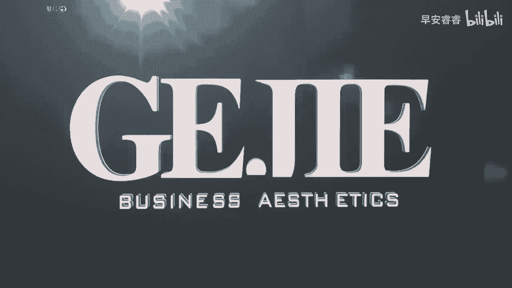

# 045 服装行业流量爆发营，从0-1抖音快速起号解决实体流量问题！ - P20：20 - 20节.推送法则一 .mp4- - 早安睿睿 - BV1Kf421R7NA

精准打标签的第一个方法就是前十条统一法，什么意思，就是当我们的内容在发前十条的时候，你一定要选择统一的内容，比如说如果你拍的方向是形象改造的，你就在这十条都拍形象改造。

如果说你拍的是围绕店铺IP作为核心展现的，那你就不要先去拍你的老公，不要拍你的孩子，不要去拍你去旅行，你就不要去做这种相对泛的一个内容，而是说核心都是围绕着你的店铺，比如说我拍店铺内的客户。

我拍店铺内的氛围，我拍店铺的橱窗，我拍店铺的陈列等等，就是我们需要在前十条，找到相对统一的一个人群标签，让别人让抖音平台看到，我们到底这个账号想要做什么，需要什么样的人群，会做什么样的一个内容。

所以这就是为什么之前我们在课程一开始就说，你要去看你以前那些乱七八糟的，你要想办法把它给隐藏起来，因为如果他还在那里的话，抖音是没有办法识别出，你具体到底想要一个什么样的内容的，这也就是我跟大家说。

做号啊，你要做好准备，有很多人他是这样子的，我今天录一条，我就发一条啊，明天再录，我再发，这个其实并不是一个有规划性的做号方法，大家应该是我要把前十条内容，我都给他已经录好，剪好了，然后我每天发一条。

连续发十天，那么在十天以后呢，平台就识别到了你到底想要什么样的一个用户，进而给你推过来的流量会越来越倾向于标准，所以大家要记住，打标的第一个动作，就是前十条的内容趋向于统一，拍个人，咱们就是拍个人。

拍穿搭，咱们就是拍穿搭，拍店铺就是拍店铺，不要东来一个旅游，西来一个美食，这样子都会搞乱抖音，对你的一个内容属性标签的打标的过程好。

