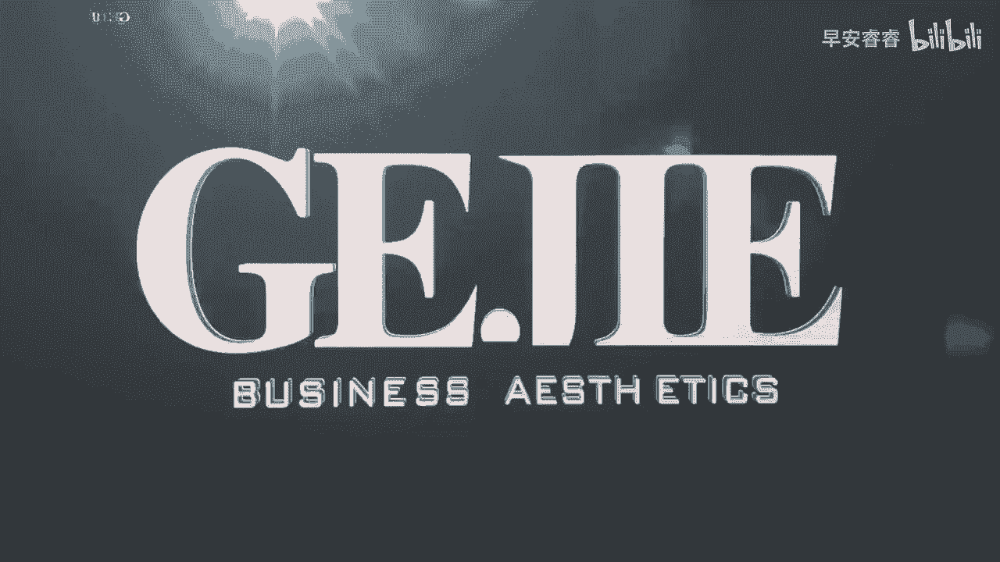

# 045 服装行业流量爆发营，从0-1抖音快速起号解决实体流量问题！ - P21：21 - 21节.推送法则二 .mp4- - 早安睿睿 - BV1Kf421R7NA

第二个给你的内容打上精准标签的动作呢，就是话题的添加，话题的添加呢，就是指你们看在我们的看到的视频页面，下方有一个井号键，在这个井号键背后呢，它其实就是一个添加话题的内容，在这个内容里面。

我们可以去搜索跟我们服装相近的一些类目，比如说搜一下穿搭的话题，比如说穿搭日记呀，哎穿搭VLOG呀，穿搭攻略呀，这些都是可以添加的，当然我们还可以细分到我们的类目，比如说你发的这一个穿搭。

它是连衣裙的嘛，你可以在井号键后面去搜索一下连衣裙，然后你看一下连衣裙，它关联出一些什么样的热词，然后去添加这些热词，当然我们还可以去做一个，其他人都不太去知道的东西，就是去添加我们的客户标签。

比如说你是洛阳的对吧，那你去搜索洛阳女孩，或者说洛阳妈妈，如果你的客户更多的是一些宝妈的属性的话，这时候我们就会回到去思考我们的客户标签，比如说洛阳大学生，洛阳教师等等，你可以把你的客户的一个标签。

添加进我们的话题里面，它也能够让抖音对你整个内容想要的一个，客户群体的属性进行一个更加精准的判断，当然我建议大家啊，在我们如果有一些实体店主，核心想做的是这个同城的一个流量。

我比较建议大家在话题里面去找一些同城，然后能够跟你搭得上边的，当然你不要去搞洛阳美食啊，那跟你一点边都搭不上，对不对，你要去想一下，在我们的客户的兴趣画像里面，有哪一些可以重叠起来的。

如果说你的这个客户她都是宝妈，那可能烘培也是可以跟他关联起来的，烘培的这人群可能也是你的人群，鲜花的这部分人群可能也是你的人群，但你去搞美食啊钓鱼，那这完全一定就不是你的人群了，对不对好。

所以我们在达标这个地方，第一个可以关联我们的行业，比如说服装，比如说穿搭关键词，第二个可以关联我们的内幕，比如说防晒衣，比如说连衣裙，第三个可以去关联我们的人群的特征标签，第四个就是重点推荐大家去关联。

你本地的同城的一些话题，如果说你是想做同城流量的啊，当然如果你说我要做的是全国直播流量，那么这个呃，你就可以不用去选择同城的一个区域流量好。

