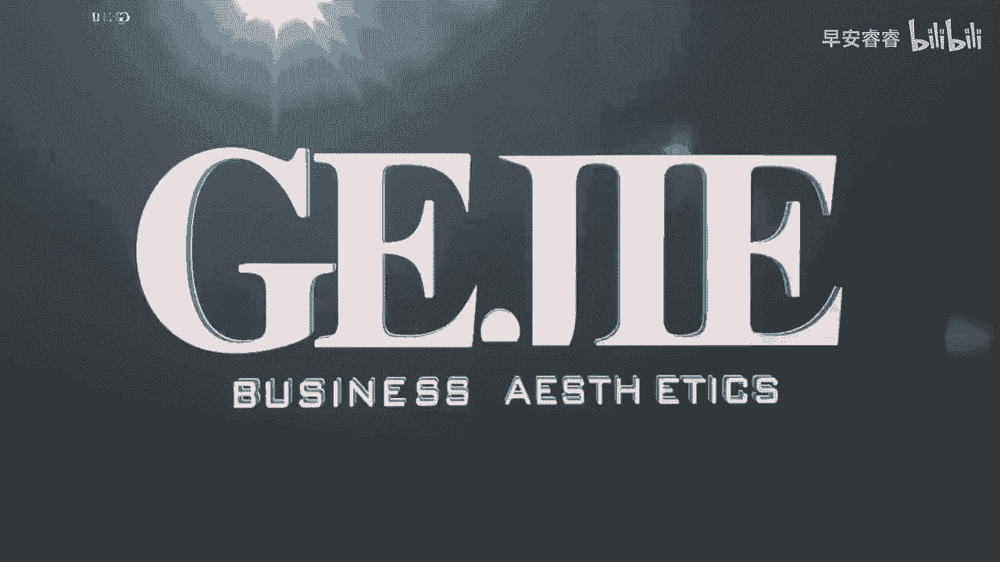
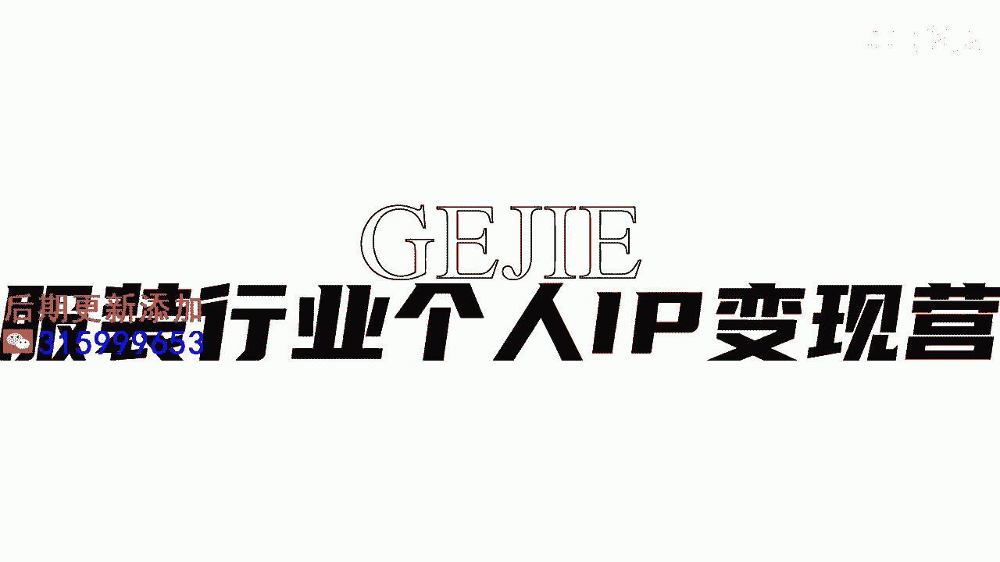

# 045 服装行业流量爆发营，从0-1抖音快速起号解决实体流量问题！ - P23：23 - 23节.推送法则四 .mp4- - 早安睿睿 - BV1Kf421R7NA

那么接下来是打标签的第四种方式，这种方式呢其实跟上一种方式它有一点点趋同，它的底层逻辑呢基本上是一样的，但是呢这种方式的范围可能会更加的广，人群可能会更加的多，那就是通过同城。

但是异业的人群来给我们的账号来打上标签，来，我们试想一下，我们的客户同时也是谁的客户呢，是不是他同时也是母婴店的客户，他同时也是美容院的客户，他同时也是美甲店的客户，他同时也是瑜伽垫的客户。

SPA对不对等等，反正你去试想一下，只要是你的客户，他会关联到的生活方式，那这种店家可就太多了是吗，那我们优先会去选择跟美相关的行业，比如说美容，皮肤管理，减肥啊，塑形啊，还有刚刚我们说到的美甲对吧。

至少这几类，它一定是跟我们的人群非常的趋同的，那你就可以去搜，比如说杭州美甲，你看一下哪些美甲店，它的热度特别的高，然后的话尤其是如果他的距离离你更近一点，就更好了，然后你这个时候因为你是一个服装店嘛。

你就完完全全大大方方的，可以去跟他下面的评论来进行互动啊，回复啊，点赞呢完全没有问题的啊，所以的话我们这个方法其实比上一个方法，范围更加的广，但是人群其实是一样精准的。

那当然你要去找一些跟你同等价位的了啊，你不要你自己卖的是一个三五千的服装，然后你去找那种39块钱的美甲店去做，点赞的话，那你来的人群肯定也是不标准的，所以我们再去做异业的一些账号的打标的时候。

要去看一下这个账号本身的定位和属性，跟我们的品牌定位属性越相近，可能我们去跟他的客户发生关联，他达标上的一个精准度就会越高。

