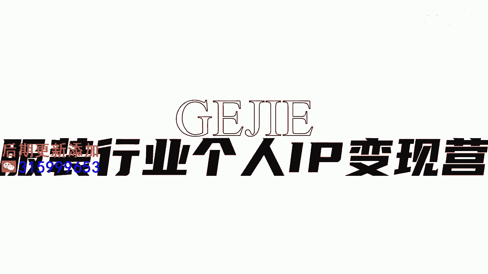

# 045 服装行业流量爆发营，从0-1抖音快速起号解决实体流量问题！ - P24：24 - 24节.推送法则五 .mp4- - 早安睿睿 - BV1Kf421R7NA

内容精准打标的第五种方式，就是利用文案本身来添加内容的标签，举一个例子啊，很多人呢他其实在文案这一块会用一些鸡汤啊，或者用一些无关紧要的文字，但是你不知道，文案区里面的文本。

是可以快速的去帮你打上标签的，举个例子啊，我们的文案如果就写生活很美，女人很美，那你这个文案，其实它没有办法帮你去做任何的一个人群标签，但如果你这个文案写一个35岁的女人，如何穿得又精致又得体。

但却并不是很贵，诶这个时候它就识别到了，首先35岁对吗，精致对吧，穿搭这些词它就怎么样啊，抓取到了，所以大家在我们去做文案的编辑里面，大家可以大量的去把我们人群的这种本身的特，质给它给精细掉。

比如说一个两岁孩子的妈妈，如何从邋遢变得精致得体，当你把这些列出来，或者说适合40岁的女人减龄的六种穿搭方式，你把你其实放在标题上的一个内容，同时去放到你的文案里面去，越把你的客户群细化得越清晰。

反倒系统越能够从这里面去抓取出，精准的这种内容来给你匹配人群。