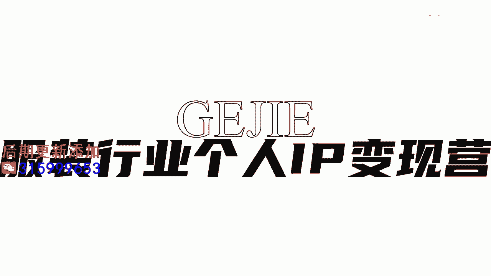

# 045 服装行业流量爆发营，从0-1抖音快速起号解决实体流量问题！ - P28：28 - 28节.铁粉机制解析 .mp4- - 早安睿睿 - BV1Kf421R7NA

这堂课呢我们来跟大家来解析内容推送机制的，第二个你必须要了解的机制，这个机制呢其实是在2022年，抖音对整个平台做内容优化，非常重要的一个动作，这个机制叫做铁粉机制，铁粉机制是什么意思呢。

我们在上一节课上不是会跟大家说，抖音会一点一点的给你流量，对不对，先给你个100的到500的对吧，再来网上去推送，那么这个机制的重要调整，就是以前抖音给到的那些先前的流量，它更多的都是属于随机流量。

也就意味着一旦你的标签精准了以后，他可能随机在25岁到45岁的，一个人群里面，女性里面可能会去给你去做推送，但是一旦现在用铁粉技师了以后，他给你推送的第一波流量，会优先比例去推送你的粉丝。

也就意味着以前他的这个随机推送啊，我们会有可能被推送到很多陌生人的手机上，会被很多陌生的流量看到，进而呢这些陌生的人，他可能以前是没有刷到过等等，他可能会觉得哎我们这个内容挺新鲜的。

比如说你拍啊这个素人改造对不对，他会觉得说哇这个素人改造做的还蛮新鲜的，但是如果我们现在试想一下，这个被推送的人，如果他是你的铁粉，他跟你是经常发生点赞互动评论的，他在看你的这种。

已经看过了20个或者30个的，这种形象改造的视频的时候，他就会有一种疲倦，对不对，他就没有那个新鲜度了，很有可能这个时候他就看不下去了，因为他会觉得说哎呀，反正都是拍这种改造对吗。

他不如第一次会看到的人有那么的新鲜，所以他的点赞也好，评论也好，转发也好，他的那个动力不会有陌生的流量那么的足，这就是最近为什么我们有大量的学员，在做账号的时候都发现哇，好像今年的抖音更难做了。

核心其实就是，因为这个铁粉机制在发挥非常大的一个作用，因为这个机制会导致了，我们对于内容上有两个非常重要的变化，第一个叫做快速的内容迭代，也就意味着，如果说你每天都拍走单，每天都拍氛围。

每天都是拍改造的话，你的客户，你的铁粉会对你这一类内容，逐渐的去失去新鲜度，进而不会再给你去进行四个投票，点赞啊，评论啊，完播啊，可能他都做不到啊，所以我们在铁粉机制下面。

第一个在我们的内容形式上要进行定常迭代，比如说像我们自己的这个账号，以前我们经常都是坐在棚里面拍就可以了，后来我们尝试去到山上拍，河边拍外景拍，坐着拍，站着拍，走着拍，对话式去拍，加入剧情等等。

这些动作，其实都是为了去丰富我们内容的一个多元性，快速的去进行内容的一个迭代和更新好，那么铁粉机制对我们的内容产生的，第二个影响呢，就是去虫性，什么叫去虫性呢，你以前会经常发现哦，一模一样的文案。

一模一样的内容，有很多账号很多博主在拍，你甚至都分不清到底这个原创他是从哪里来的，但是在铁粉机制推崇了以后，它自然而然的就去掉了很多重复性的内容，你想想看嘛，如果说这个内容你以前拍过了。

比如说今天我们来教大家，女人穿衣的五个等级好，你以前发现诶这个内容挺有流量的，你给他拍第二次，第三次，以前这一套啊在抖音是行得通的，这就导致了你以前会看到同一个文案，有大量的博主在拍。

但是现在这套就行不通了，因为它一旦有重合度高的一个内容，第一你很容易被抖音判定为是抄袭，然后第二你的铁粉，如果他反复看到有重复的话题性出现，他其实会马上就把它给划走，这就导致了那些重合性高的内容。

已经没有流量了，所以的话铁粉机制是你必须要去了解的。