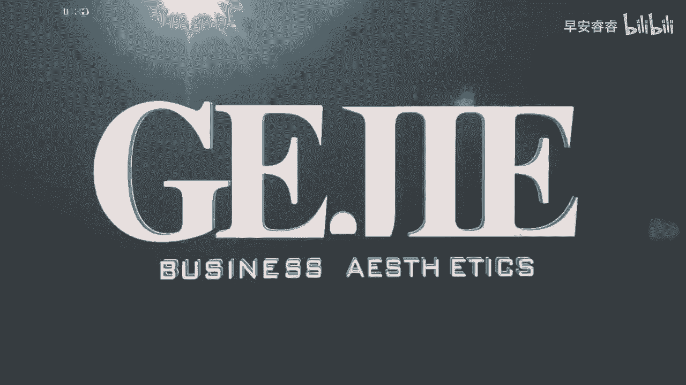
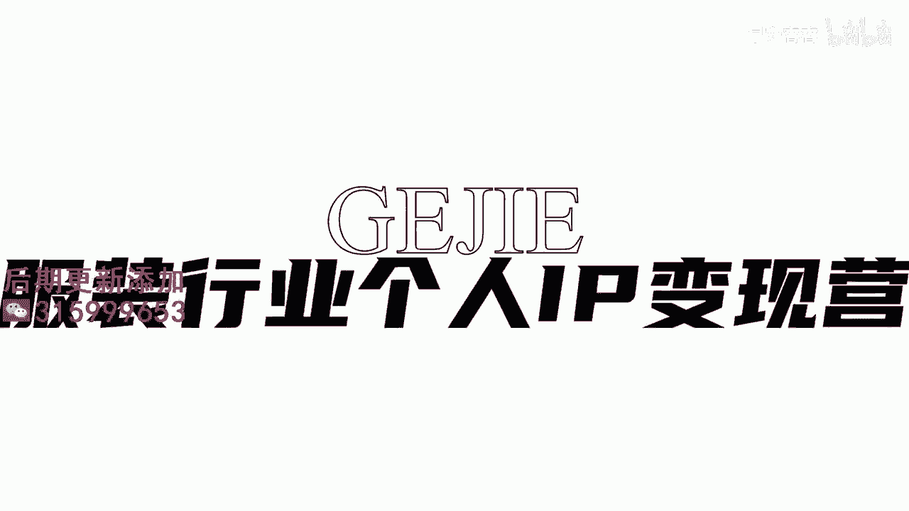
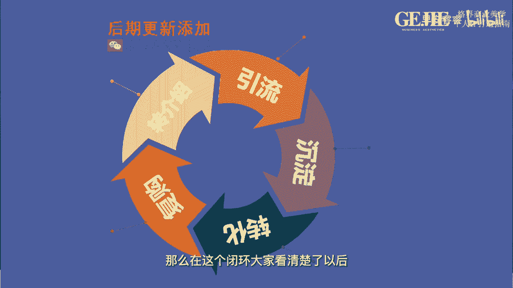

# 045 服装行业流量爆发营，从0-1抖音快速起号解决实体流量问题！ - P2：2 - 2服装人运营思维 .mp4- - 早安睿睿 - BV1Kf421R7NA

好各位服装人，同学们，今天呢在我们的课程一开始，我们整个课程因为都是围绕着流量来进行的，所以呢我要给大家讲一个服装实体人自己，形成的一个这个独特的行业的一个流量闭环，那么这个闭环呢一共分为五步来。

我们来看一下我们这一章的PPT，在我们的这个PPT里面，我们可以清晰的看到这个流量闭环，它的第一步就是引流，那么在引流之后呢，我们要做的是流量的一个沉淀，在沉淀之后呢，我们才进入到流量的转化。

转换之后呢，我们要通过我们的客户的流量运营，达到客户的多次复购，进而由客户高复购和高满意度的情况下，让客户再给我们，从私域里面再进行裂变的转介绍，而这个转介绍即将流到新的池子里面。

那么在这个闭环大家看清楚了以后。

我们来分析一下为什么你的流量不行，先说第一环就是引流，引流的话大家去思考一下，其实我们有两个引流的途径，第一个就是线上做引流，也就是在我们今天大家在这堂课程里面，最最想要去学习的就是。

如何能够在一个对的平台上建立一个好的号，进而这号能够帮助到我们线下，实体店的一个流量的运营，那么这个就属于线上引流，这种线上引流，大多数是实现在比较垂直和匹，配于我们的服装人的平台上的。

比如说像抖音或者小红书，那还有一种引流呢叫做线下引流，你就会发现线下引流啊，它核心看几个地方，第一先看你的商圈，你选到了一个有流量的商圈和没有流量的商圈，情况全然不一样。

你选到了一个风格跟你的匹配的商圈，和不匹配的商圈不一样，选到了一个消费力，能够购买得起你的衣服和购买不起你的衣服的，都不一样，那么线下的引流，第一个先看你商圈的一个定位的适配度，你的店铺选的这个商圈。

跟你的定位适配度越匹配，你的流量就越容易被引进，那么第二个在做好定位以后，我们在线下的门店的视觉的呈现，也是引流的一把好手，比如说你的门店的装修，门店的陈列，门店的橱窗。

这些都决定了有多少人要走进你的线下门店里，那么这款我们看到的就是线上和线下的引流，那么当然在这堂课上，我们核心给大家解决的是线上引流的问题，也就是在公寓上做好一个账号，那么在公益上做好账号了以后。

我在抖音上我看到了你认识了你喜欢你，想跟你去买东西，进而这个时候我很有可能就怎么样啊，沉淀到你的私欲里面去，那么在私域里面，很多人会发现我从抖音上来到私域的客户，为什么他就不能直接去进行成交呢。

因为在这里呀缺一部非常非常重要的东西，叫做运营流量的沉淀的步骤，这个步骤它一定是一个过程，那么什么样的方法，和在什么样的一个平台和载体上去做沉淀，这件事情呢，90%的客户沉淀靠的是你的朋友圈啊，没错。

朋友圈是去做客户沉淀最好的一个载体，因为客户进入到私语后，你不能说我单个单个的对他进行营销，我每天给他发消息，客户一定会对你产生大量的厌烦，感，觉得你就是给我发广告，对不对，所以你就会发现。

朋友圈他起到了一个很好的作用，我发出来我并不是特意发给你看的，但实际上我又在非常深入的去影响你，这就是我们为什么一定要去做好，服装人的朋友圈，因为当你从流量，不管公寓里面挖了再多的人进来。

比如说我今天一个视频，我给他引流了40~50个人，但是进入到我的私域以后，如果我们不好好的去经营，我们的私域的内容的话，这些人他会变成流失性流量，而不是我们想要的沉淀型流量。

所以流量的第二个环是沉淀这一环，沉淀这一款就是要做好朋友圈，记住了啊，那么第三个经过了沉淀期以后，这些人就会变成你的追随者，当他成为你的追随者以后，他才有可能为你付费，那么这个时候我们就进入到了转化。

转化的话，我们有两种转化方式，一种是叫做一对一的转化，一种叫做一对多的转化，一对一的转化，既有可能是通过在微信上，他跟你一对一私聊的时候，直接给你转钱，也有可能是通过你把它引导到你的门店以后。

你在线下给他进行一对一的一个服务，但各位还有一种从流量上，我更想去提醒大家，一定要去做好的一个流量的转化工具，就是你的社群，因为社群是可以去帮你做到，一对多的一个转化的，我记得我们有这个学员。

跟我们一起去做这个社群的一个爆品啊，这个是我们在线下课程的一个内容，做社群的一个爆品，然后的话我们的学员里面有做一个单品，然后成交7000多件的，有做一个单品成交2000多件的，大部分的同学。

尤其是那种哪怕是只有一个零售店，他的铺面可能也只有50平左右，他也能够做到一个单品，直接成交200到400个客户，所以你就会发现转化这件事情上，一对一当然也是非常好的一个方式，但从流量的效率上。

我们更希望大家同步能够去学会用社群的经营，去经营你的客户流量，进而实现一对多的爆款转化，OK那么到了转化以后，你跟你的客户就开始建立起信任感了，你就会发现任何一个客户，他必须要跟你有第一次。

第一次的成交是极其重要的，当第一次的成交我们打破了以后，我们就开始进入到下一个阶段，叫做复购阶段，如何能够运用多次的巧妙的引流，把它多次的让它静电，让它增加跟我们的一个粘性，让他信任我们。

这个时候就是你的IP做的有多深的时候，IP做得越好，这个店铺的复购率就会越高，每一个店主啊，你们自己去自查一下，如果说你的店铺的复购率是比较低的，一定是你IP没有做好的。

OK那么你只有给客户进行了好的服务，好的价值，好的IP的影响，做好复购率，他对你是满意的时候，才有可能到下一步，而这一步对我们服装人的流量来说，是非常非常重要的，就是客户的转介绍，好客户的转介绍。

也是需要从营销流量的层面去进行设计的，从转介绍这一块再去做流量的一个突破，让它同步进入到我们的新的池子里面，再进行一轮，我们说从引流到沉淀到转化到复购，再到转介绍的一个完整的闭环。

O如果你的店铺有流量问题，我相信一定是有的，如果没有，你不会来听我这堂课，对不对，你思考一下刚刚我说的这几个点，引流核心在于线上有没有做好公寓的账号，线下有没有做好定位和你的视觉呈现好，自己去自查一下。

然后第二个沉淀，沉淀核心就在于你有没有经营好你的朋友圈，那么第三个转化转化，一对一的转化核心在于你的货品和你的服务，一对多的转化核心在于社群自己去看一下，给自己的社群，给自己一对一的服务打多少分好。

然后第四个复购好，复购是需要设计的，复购是需要深度IP力的一个影响，所以复购的底层逻辑其实就是客户年度，OK思考一下客户年度有没有做好，最后转介绍，转介绍他是一个营销动作，他必须要在这里面达到三方受益。

我们作为店家要授予客户，作为介绍人要受益，被介绍人也要受益，三方受益才能够实现转介绍，OK把这个闭环好好的想清楚，下一节课我们就真正开始。

