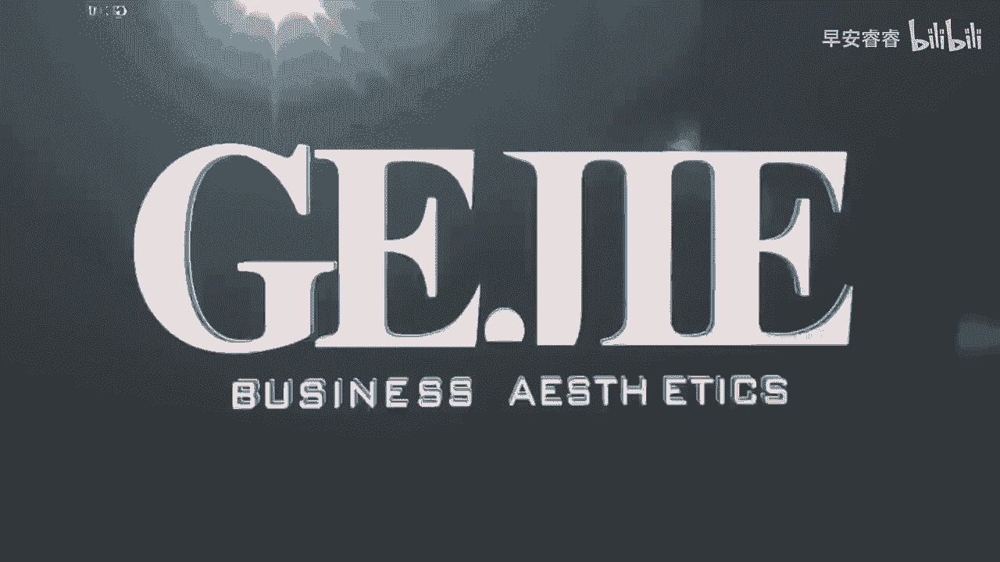

# 045 服装行业流量爆发营，从0-1抖音快速起号解决实体流量问题！ - P30：30 - 30课 .mp4- - 早安睿睿 - BV1Kf421R7NA

好那么今天这堂课呢我觉得就到了咱们服装人，尤其是实体服装人非常非常期待的一堂课了，那就是咱们作为这些线下的传统商家，我们可能最大的优势不一定是在语言表达，不一定是在身材颜值。

更多的优势可能是放在线下去做呈现的，我们最大的核心区别就是我们跟电商啊，跟直播呀，跟一些小的一些啊个人微商发货呀，不同的是，我们是有实打实的门店的，我们是有真正在为客户去提供，专业的价值和服务的。

我们是有非常良好的体验感的对吗，那么今天呢我会分为四堂课，来给大家逐个的拆解明白，我最推荐给大家的四种，适合服装实体店铺呈现在网络上的视频内容，首先呢第一种视频内容。

这个内容是一个典型的转化变现的一个内容，这个内容只有一个目的，就是要让看到这条视频的人非常的心动，对你的店铺有向往，想要去到你的店铺进行购物，所以他的一个目的就是非常的直接引流到店来，我给大家举个例子。

如果今天正好在12点钟，你饿了的时候，你打开手机，然后抖音给你推送了一个餐厅的视频，然后这个餐厅的老板娘说，哇我们家每天都排队，排了这么多人，我们家限量的那个口水鸡啊，每天就100份，抢都抢不够。

然后这个时候正好旁边就有一个人说，哎老板娘，我的那个口水鸡好了没呀，你去试想一下，当你看到了这条视频，正巧你又有吃饭的一个需求，然后你又看到下面那个定位，它离你的距离大概是800米。

这个时候你会有一个什么念头呢，我要不要过去试一下这家餐厅，对不对，就像是我们有时候刷抖音，刷着刷着他给你推送了一个哇哦啊，咱们什么什么城市最新的网红咖啡厅哇，在这里拍出来的女孩子个个都是韩系小姐姐。

就你当你看到这种咖啡厅的时候，你想的是什么，你想的就是哎看一下远不远，要不要改天去打个卡对吗，所以你就会发现，像这种对店铺的内容进行展示的，这个部分的内容，所以你就会发现。

像这种引导出了一个非常热烈的氛围，让你看到有很多人都在做同样的事情，是这个时候我们会激发客户的一个从众心理，从众心理在消费上，尤其是在实体的线下消费上，是一个非常非常重要的一个消费心理。

你会看到那些非常冷清的店铺，它会越来越冷清，而那些热闹的店铺想去的人就会越来越多，大家都会倾向于去生意更好的店铺，所以各位大家作为实体店，第一个要去呈现的就是我们的现场氛围，那现场氛围他怎么去呈现呢。

来我们给大家直接看一个案例视频，你对着这个案例视频去做，其实你就能够达到同样的效果，姐妹们没事的时候还是多出来逛逛，实体买不买没关系，是不是不要紧，你可以摸一摸面料，看一看品质。

顺便可以提升一下自己搭配的眼光，不然经常刷直播认知。

真的会变成100元就可以买到全世界哦，好大家看过案例视频了，我来给大家拆解一下这个视频你要怎么拍啊，首先我们看到从第一帧的时候，我们看到它整个先录的是一个大体氛围，有非常多的人在那边选对吧。

你我们肉眼上我看一下子就看到了六个人，且他是聚集在一个角落的，这个时候就会给客户一个直接的感受，就是他们家人很多很热闹，很多人喜欢他们家，潜意识就去激发客户对于这个店铺的从众心理。

那么他的第二幕我看一下啊，就到了他这个呃，老板娘在收费的这个收银台面前，然后手上拿了一叠现金，其实你看哦，呃现在大家其实用现金是用的不多的，所以当你看到这一点现金的时候。

其实你心里是稍微有一点点受到刺激和波动的，这意味着什么，他们家的生意非常的好对吧，然后再接下来我们会看到他拍的动作，是老板娘不断的在叠衣服，然后放到口袋里，在他叠完衣服了以后呢。

你会发现他旁边有三个非常大的购物袋，它不是那种小小的啊，你我们平时什么装一件T恤的那种，塑料型的袋子，它是一个什么大的那种，像我们去买奢侈品一样，会给到你一个这种长方形的，面积比较宽的一个购物袋。

对不对，然后你会发现哦，有人三个袋子一块拎走了，那对于客户来说，他看到的是什么，第一你们家生意很好，对吧啊，别人一买就是买很多件，那么他联想到的也应该是，这个店的可选性应该还是非常多的。

在这里面还有一个很重要的东西，是老板娘亲自在收银台那边去做收银，那么首先第一个老板娘的气质，她的穿搭和她的笑容都在呈现，第一他的笑容在呈现他的服务态度，对不对，然后她的穿搭再呈现他的品味和风格对吗。

然后他去做打包的这些动作，同样有一种很亲近的感觉，会让你觉得说哎我到了这家店以后，应该也是一个很舒服的一个消费体验的，OK你看这三个分镜，从第一进，用整个大得多的人来创造一个热闹的氛围。

再到第二季开始用钱来刺激你，告诉你我们家生意是非常好的对吧，到第三季给你看我自己的一个穿搭，我的形象气质，让你看到我身上的风格是否有匹配于你对吧，然后在这里面同时去呈现个人的这种啊情绪力，就是热情啊。

开放愉悦包容，最后让你看到我们家的客户，都是可以三大袋子买这么多，拎回去，暗示你说在这个店铺里面，它的可选性是非常高的，你看这种视频，它就是会有，刚刚我说的火爆型的餐饮的视频的感觉。

会有那种很多小姐姐去打卡，咖啡厅的那种同样的刺激，他的目的就是把人引流到店，大家注意了，拍这个类型的视频时长不要过长，基本上大家放在8~12秒之间，然后的话同一个镜头里面不要停留太久。

你比如说哎我去录它打包，我给他录20秒打包，这个不行的啊，因为这样客户的视觉会疲倦，对不对，好，所以大家要去注意时长，注意配音，注意你的美感和音调，最后你有一个非常好看的形象呈现，那就再加分不过了。

