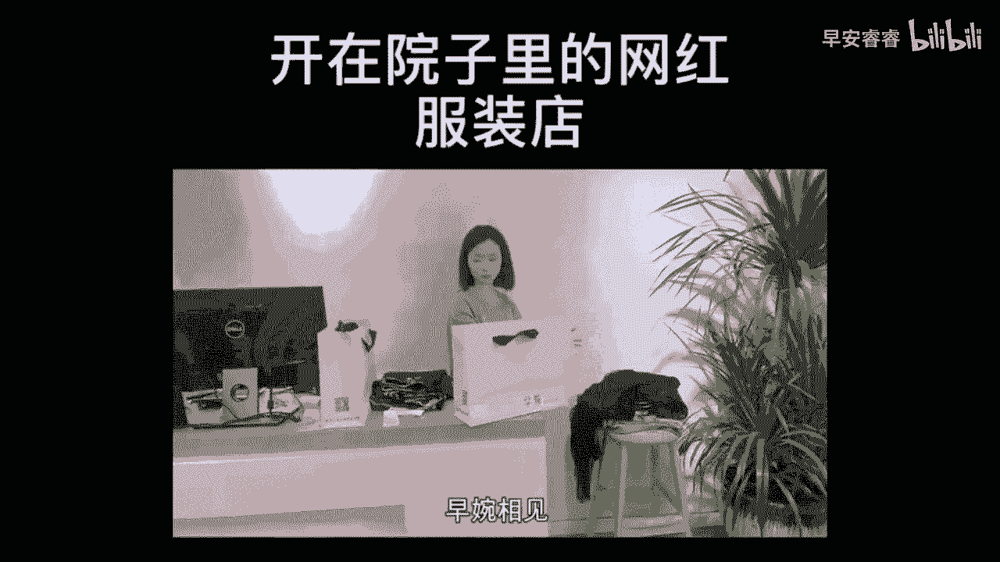

# 045 服装行业流量爆发营，从0-1抖音快速起号解决实体流量问题！ - P31：31 - 31.0 .mp4- - 早安睿睿 - BV1Kf421R7NA

这节课给大家去拆解服装实体店必须要去录的，第二个内容的模式就是店铺的展示啊，我们其实在上一节课就说了，我们对于其他的博主来说，对于那些网红来说，对于高颜值高身材的来说。

我们不一定是在自身的条件上比他们更好，但我们很有可能是在我们线下的一个门店的，体验，和我们线下门店的设计比他条件更好对吧，其实我知道在我的学院里面有大量的服装店主，现在对审美。

对店铺体验感的要求是非常非常高的，我们有大量的学员花了很多的钱去打造，比如说一栋别墅或者一个呃非常好看的买手店，或者一个很有心死去设计的一些门头，甚至是有一些人的店铺会有这种前院或者后院。

这些相对于在线上的那些电商来说，这是我们无法替代的一个优势，所以的话我们去展示在店铺里面，某一个非常好看的角落，或者某一个设计，也是我们很有优势的地方，那么如果说你的店铺也有一些特别之处。

我指的特别不一定是地段特别好，也不一定是特别宏大，也不一定说特别高大上，只要它有特别的地方，你都可以把它拎出来来，我们切一个案例给大家来看一下，我把服装店开在城市的角落，很多人都觉得不可思议。

开这么偏僻，怎么会有生意呢，但实际是我这个院子经营不到一个月，生意还挺好，很多同行都私信我，问我是怎么做到的，其实我这里大部分来的客人，刚开始不会是因为买衣服特地来的。

很多客人就是觉得我们这个院子很漂亮，想过来看看拍拍照什么的，因为我们家的衣服性价比很高，品质款式各方面都还不错，客户几乎都没有空手而归，而且我们这还免费提供一些有趣的拍摄道具，供客户拍照打卡。

客户都很喜欢，也愿意带闺蜜一起来玩，玩着玩着也就把生意做了，我是小贝，早晚相见。

好的刚才大家看过这个案例以后，我们就会发现这个案例，他的这个服装店特别在于它，它是一个开在院子里的服装店啊，虽然他说是网红服装店对吗，但是你试想一下，刚刚开始的时候，人流量不大的时候，没关系。

你也是可以给自己去冠这个名号的，所以我觉得这个服装店主，他是一个营销思维非常强的店主啊，那么像这种他的特别之处是在比如说院子里面，那你也可以说一个开在楼上的服装工作室对吗。

那你也可以说一个开在小巷子里很偏僻，但却络绎不绝，有人过来打卡的服装店，那么你就会发现他在这里面，他是从一个观看视角，从进门带着你一起走进去，然后绕一圈他的院子，他在这里面核心会去讲解一些什么东西呢。

就是你在我的这个场所里面，会得到一些什么样的体验，比如说他有去突出说啊，你在这里我们会有一些打卡道具，对不对，诶，你在这里可以买到性价比高，但是品质却不会打折的衣服对吧，你在这里可以坐下来喝一壶茶。

你在这里我会给你递上一杯冰咖啡等等，这一类的，你就会发现他把他的场景所能够匹配到的，一种体验感给它结合起来，然后呈现在视频里面，那么这个部分大家就可以去思考一下，你的店铺有没有某一些角落小吧台呀。

或者一个别有用心的小玄关的设计啊，或者是一个小院子的设计啊，但凡是那些稍微有一些特别的，通过你的一些拍摄手法，通过我们后期的一些剪辑对吗，通过找人来进行一个场景体验感的一个展现。

也是可以把人吸引到你的店铺里的，当然各位不仅仅是说，一定要对我们的装修有要求，有一些人他比较擅长陈列对吧，那你也可以去拍你的这个陈列的一个杆子，把色系做的特别好看，或者把呃模特的造型做的特别好看。

那有些人他很擅长橱窗对吧，当然你也可以去拍你的橱窗，比如说有故事的橱窗，有主题的橱窗，对不对，你要去发挥你的一个眼睛，发觉美在于哪里，在你的店铺来说，是这个角落美，还是那个橱窗美，还是这个陈列美。

还是那个楼梯美，还是那个院子美对吧，这些都可以成为我们区分于其他的这种博主啊，电商啊，直播间啊，属于我们实体店铺非常有特色的一个内容，这就是我们要说的实体店要拍的。

