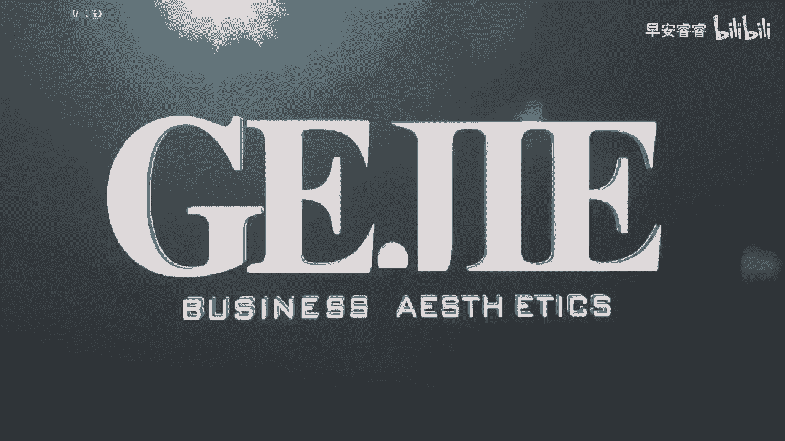
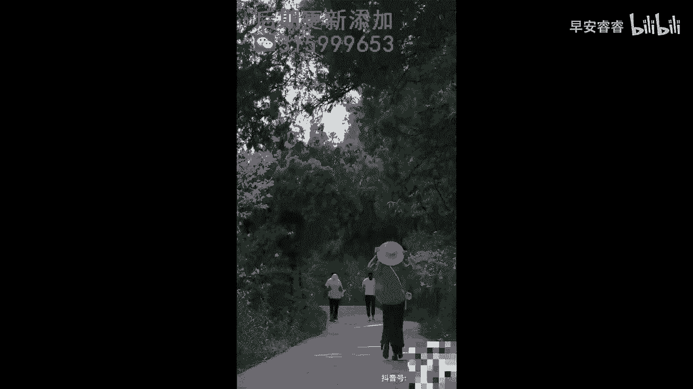

# 045 服装行业流量爆发营，从0-1抖音快速起号解决实体流量问题！ - P32：32 - 32.0 .mp4- - 早安睿睿 - BV1Kf421R7NA

那么接下来这节课呢给大家来看一下，服装实体门店，你要去拍的第三个内容，这个内容呢是你能够去引导到你，非常精准的人群，最重要的一个对标，那就是去展示你的货品，那货品其实对于我们的客户来说。

是他来到你这个店里最核心的理由，所以他一定要能够在你这个号里看到，你到底是卖个什么风格的，比如说她是个辣妹风格的，结果你是卖棉麻的，那没有用对吧，她来了也没有用，而且她也不会来，那如果说他是职场诉求的。

你卖的都是那些甜美的，可能他也不会来，所以的话，如果我们想要能够从线上引导到精准的客群，来到我们的线下的话，一定要去非常好的去展示我们的货品风格，尤其是我们的核心风格，OK那么接下来各位。

我想给大家去看两个货品展示的案例，这两个货品展示的案例，是我目前比较推荐大家去做的，来我们先来看案例，他不及的脸像天粉色着我，她洗过的发像心中火焰好的，这是我们第一个案例。

来我们继续再来看一下第二个案例，哪有哪里，南北南一游。

大家发现了吗，这两个案例啊，它的场景首先第一个都是在户外的真实场景，户外的真实场景有一个非常好的结果，就是能够让客户直接匹配到他的日常生活中的，真实诉求，你们看这两个视频都是在一个女孩。

在一个非常好看的树林和一条道路上对吗，然后穿着非常文艺的衣服，很轻松，很休闲的在奔跑，这就会让我们直接联想起我们在周末放松出去，贴近大自然，比如说去露营啊对吧，跟朋友在外面出去逛一逛公园呐。

这些场景会直接跟他的生活诉求给匹配起来，那么我们有非常多的店主，现在非常喜欢在呃服装店里面对着镜子，就开始换一套又一套一套又一套的衣服，那这个非常的省力，我也知道效率可能相对会高一些。

但是像这种还局限在服装店铺内，长期场景没有变换，而且没有切合到我们客户的一个受众诉求的，这种真实场景的视频内容的话，其实现在对于客户来说，他已经没有吸引力了，所以你虽然这么做了，他看到你家的衣服了。

但是相对于刚刚我们看到的这两个视频来说，它的整个吸引力是降很多的，所以我第一个是鼓励大家，要走到你这个衣服所匹配到的真实场景去拍，如果说你做的是更多偏职场装，那我就鼓励你到一些咖啡厅啊，CBD楼下呀。

或者说一些办公楼的大厅啊，在什么电梯摁这个电梯啊，就是你要把场景跟你的服装具体给贴合起来哦，如果说你是去做那种约会场景的对吗，那你就要有下午茶的场景啊，你可以去找一些这种呃网红的酒店呐，啊。

他们的这种下午茶场景，来匹配你的一个服装场景，所以第一个我们现在去做产品的展示，要看场景的匹配度，然后第二个大家有没有发现这两个产品，它的整个展现的模式是可复制化的。

这一点对于我们长期做输出有非常大的帮助，那其实有很多的服装店主呢，他要么就是太懒了，懒得他都不愿意走出去好好拍一个视频，那他要么就是太勤快了，他今天拍个咖啡厅，一套拍个咖啡厅，对不对。

第二套跑到公园里去，第三道跑到天台上去，这个时候就会造成一个什么呢，就是客户对于你的风格的识别度，其实相对来说会有点低，你看像这两个视频，它的场景算是不同的路，不同的一个呃户外。

但它其实核心都是以绿植啊，以等同的风风格作为趋同性的，那如果说你的衣服就是适合咖啡厅的，你可以换不同的咖啡厅，但是你不要说哎我今天在咖啡厅，明天又在办公楼里，那这样子客户其实他有点察觉不出来。

你们家到底是去做什么风格的，我们说定位不仅仅是呈现在货品，呈现在店铺里面，客户看到的一个统一性，他其实在茫茫的一个公寓里面，更要去让客户一眼就知道，你们家到底最擅长做什么风格。

所以我建议大家在拍摄的时候，尽量统一性高一点，而且统一性高，同样也会给你带来一个好处，就是你的效率应该是也比较高的，OK好，那么针对于我们今天的内容总结一下，就是第一不要在服装店里对着镜子做产品展示。

而是要找真实场景做，第二尽量以统一的和谐的，高效率的产出来进行产品的一个展示，让客户快速的去记住，你好，这是我们啊服装实体店要去拍的第三种内容啦，好，那么下一节课，我就要给大家讲一个非常非常重要的内容。

