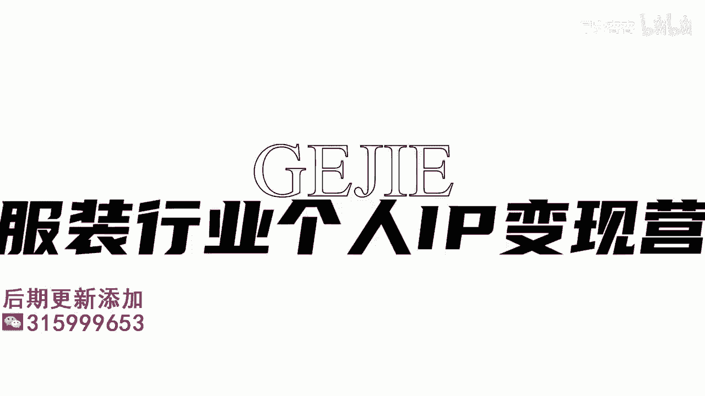
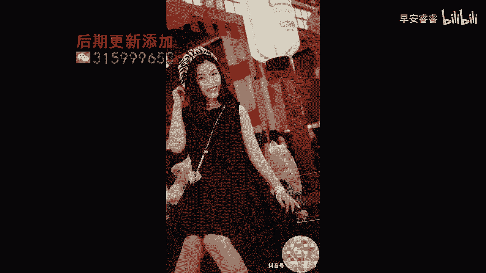

# 045 服装行业流量爆发营，从0-1抖音快速起号解决实体流量问题！ - P33：33 - 33课 .mp4- - 早安睿睿 - BV1Kf421R7NA

这节课呢给大家来拆解一下，在我们服装实体店里面，你一定能够去做，而且你必须要去做的一个内容，那就是形象改造类的内容，形象改造类的内容，我们帮学员应该做出了很多个这样子的账号了。

这些账号都是可以产出高价值的，它不仅是可以让客户看到这个视频了以后，直接到你的店里来，他甚至啊可以让你的客户，直接冲着改造来给你付费啊，当然这就是你的商业模式的啦，如果说你的商业模式设计的。

是用这个改造来进行引流，进而到店铺里面通过产品来变现的话，也是OK的啊，尤其是如果在前期，专业还没有那么那么深的时候，你可能不太有自信，针对于你的服务来进行收费对吧。

但是啊如果你对自己的专业是比较有自信的，比如说像我们很多同学啊，他们都是学习过我们专业的一个形象美学的，是懂得非常专业的形象测试的方法的，那么它就是很多人会直接针对于收费啊。

服务的收费再进行后期的产品转化，如果说产品的购买达到一定的级别，比如说我们有一个同学，他的改造收费刚刚开始的时候是收98块啊，然后如果你买够500块的衣服了以后，他就这98就不算了。

相当于说直接抵扣掉了，但是后来他的整个收费逐渐向上涨，他下的收费是980多好，如果你来到店铺里面，你购买的这个东西是在5000块钱以上的，那他可能就会把这笔服务费给你免掉，或者说你购买到一千两千三千。

每一个等级的时候，他可能会给到你的服务费里面进行一个折扣，OK那这种就是属于说我们可以在服务和产品，双向去进行收费，你去试想一下，900多的一个服务费，从净利润来说，你大概要去卖到三千四千块钱的衣服。

OK所以的话你看形象改造，它带来的一个想象空间其实是比较大的，而且形象改造的内容的价值，相对于刚刚我们前三种啊，不管是店铺的一个氛围还是店铺的一个展示，还是说啊我们上一场讲的那个产品的一个内容。

它其实都没有，形象改造给人带来的这个价值感高好，所以形象改造大家是一定要做的，那么怎么样是一个形象改造，比较好的一个视频呈现呢，这个视频一定是有过程啊，有情绪，有诉求，最后有强烈对比的。

那么来我们给大家来看一个形象改造，我认为它在拍摄上呈现的还是比较完整的，来给大家看一下案例，因为我想变得更可爱一点，然后更少女一点，你不化妆的话，你过去她可能不不会怎么理你啊，你化完妆之后。

她可能就工作上更配合你处理一点事情，这是今天来改造的，NANA在工地做资料员，平时不爱化妆，适合鲜亮的有存在感的颜色啊，蓝啊绿啊，然后紫色啊可以往那种森系少女去走，那么也可以往就是稍微甜酷一点去走。

因为你的肤色的原因就可以很高级，看改造效果暴晒，我不是故意偷听到你们的对白，好像他也不是很在意我的存在，无非给我外挂一个前任的招牌。

好的看完了这个案例呢以后呢，由于这个案例啊，他的这个拍摄跟我们之前说的三种拍摄的，整个复杂度要高很多，但是各位形象改造的拍摄，是你作为一个服装店主，你一定要吃下来的，如果说你不会拍的话。

那么你在这里面你就非常非常难去拿到一个，好的结果了，那接下来呢我会用123456唉，我会去用六节课来给大家逐一的去拆解，出一个非常非常完整，一定是超越于现在你看到的这个案例。

所能够呈现出来的形象改造的具体拍摄手法好。