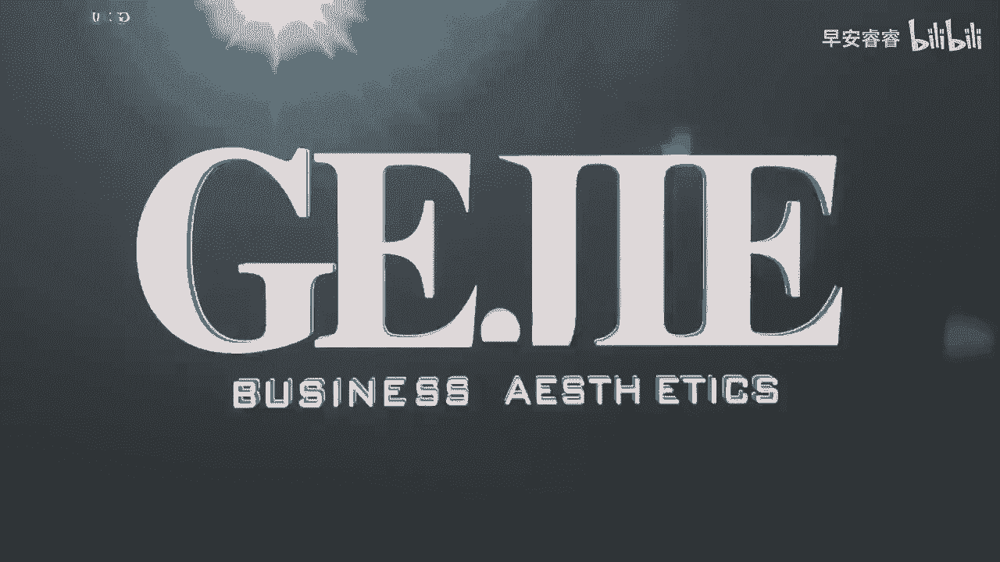
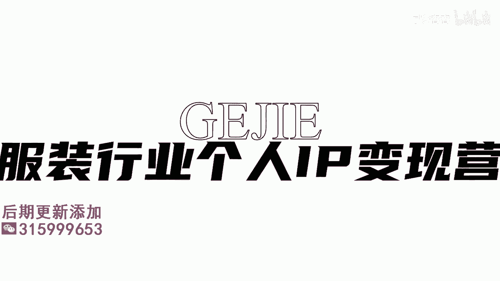

# 045 服装行业流量爆发营，从0-1抖音快速起号解决实体流量问题！ - P34：34 - 34.0 .mp4- - 早安睿睿 - BV1Kf421R7NA

想要去做好一个形象改造的视频呢，其实是有非常多的细节需要去把控的，我看到我们有很多的学员，在它没有一个完整的架构，去做好一个视频设计的时候，出来的那个效果啊，是很难达到要去抓取客户。

并且让你的客户要到门店来找你，同样去做相同的事情的，那么今天呢我就会分为六节课程，逐一的把你如何去做好一条形象视频的改造，把每一个细节都拆解教大家，其实啊我给大家教的这么一个逻辑和系统。

并不仅仅是用在形象改造上面，甚至可以这么说，所有但凡是有过程的，有经过的，你想要丰满的把它表达出来的，故事性的视频，都可以通过这个思维去做，你们看形象改造，首先第一个我们要把它设想成为一个事件。

那么之前我们教大家的几种呈现模式，其实它的整个的内容是相对扁平的，它没有什么高低起伏跌宕，对不对，你就会发现不管是拍氛围还是拍我们的店铺，还是拍我们的产品，它其实是一个相对比较平的一个呈现。

但是形象改造它自身是一个事件，那既然是一个事件，它就会有过程对吗，OK来我给大家两个形象改造的大的底层逻辑，第一个就是你可以按照主题性去做改造，什么叫按主题来做改造呢。

意思就是说比如说我给自己设定一个主题啊，像我们看到的那个小鱼海棠对吧，要找100个帅哥，你看这就是主题嘛，那你也可以给自己设一个主题，我要改100个宝妈，或者我要改100位教师，我要改100位医生。

对不对，好或者我要改100个35岁的女性，那这些都是主题性的形象改造，如果说我们以主题性作为形象改造的话，实际上我们整个账号的规划基本都出来了，也就是意味着这100个改造的过程。

其实就支撑起了我们这个账号的内容的设定，这种方式也有很多人在用，那么如果我们按主题的话，它的连续性会比较强啊，我今天看了你这个视频，比如说这是我改造的第36个30岁的宝妈。

那她就会知道说哦哦我还有多少个可以看，那可以在结尾说好了，期待我们的第37位宝妈的华丽改造吧，那这样她就会知道哦，我要时刻关注你这个账号，我要继续去看你接下来会去做什么。

那当然你也可以发起节日性主题对吧，比如说我要在情人节来之前改造20位，我们本地的什么样，什么样的女孩或什么样什么样的女人，这种都是属于主题性的改造，那么第二种比较常用的，可能也比较适用于我们实体店主。

因为我们毕竟不是一个全职去做博主，不是全职做自媒体的，我们可能客户的一个素材也没有那么的多，我们团队也好，精力也好，可能投入在线上没有那么多的，大家可以用第二种方式就是故事型的拍摄。

那么我接下来会核心的针对于故事型，如何去做拍摄，给大家来做拆解啊，首先第一个，我们想要去做好一个形象改造的视频，要做的就是先把详细的脚本先给他写出来，那有很多人他为什么录视频。

它的整个节奏感是非常的混乱的，或者说他没有达到说，我们希望在某一个节点上要去抓取的，客户的一个情绪，其实就是因为他没有提前去做脚本的一个设定，脚本设定你也可以把它理解成为是一个编导。

再写一个具体的这个故事，那么在我们这个故事里面呢，我给大家直接用图片来拆解一下，这个故事必须要包含的四个阶段，第一个阶段就是客户诉求的一个阶段，来我们看一下现在图片上我们打出来的，关于我们上一个啊。

视频里面给大家截图出来的一些啊，细节的每一帧，你看像这边他说啊，然后我想要更少女一点，看到没有，这个时候其实就是客户在提她的诉求了对吗，那如果说进来的是一个宝妈，她可能跟你提的诉求是。

我想要在下个星期的呃，家长会上做那个让我的孩子觉得最骄傲的妈妈，那你看可能每一个客户，他是带着不同的一个诉求来的对吗，所以我们第一步可以先去记录一些客户诉求，比如说一个客户大大冲到你店里说。

哎那个什么什么啊，姐姐什么姐，你要帮我来做这个事情呀，我下个星期要去参加我侄女的婚宴，我可不能给她丢脸，我可是娘家人呐等等这一类，这是我们可以第一个先去表达客户的诉求好，那么第二个过程来我们看一下啊。

现在我们看到的是他在用色布对吗，来进行一个色彩的测试，并且他旁边会有讲解，对不对啊，这是进行色彩测试好，那么这个部分，其实它是一个专业价值的一个突出的部分，如果说你的改造视频里面是带有专业手法的。

那么你这个视频才有可能导向于付费，且才有可能导向于客户被你引流到店哦，我们可以这么去试想一下，在这一条街，或者说在这个城市会搭配的服装，店主一定是非常多的，但是懂专业的服装店主一定是少数。

所以各位我们要能够明白，服务这个东西不是说它比多比少，而是比差异化呃，去每一家服装店，我都认为这个店主是有可能给我搭的好的，但是不一定每一个服装店都能给我做色彩测试，对吗。

所以你看它是记录下了它差异化的一个，服务内容的色彩的测试，然后再接下来风格的测试，然后再接下来怎么样啊，呃给她化妆对吧，在造型上去做一个改变，那么其实在我们的专业的形象改造里面。

还有一个很重要的部分是进行身形的一个测试，色彩风格身形是穿搭的三大板块，那么穿搭的完整的形象，美学的五大板块是色彩风格身形，然后到场景，最后到搭配啊，搭配指的就是一个整体的一个进阶，从色彩也好。

配饰也好啊，我们去使用到的一些搭配的手法也好，它是一个进阶的过程啊，所以你看他这里面有一个过程的记录，而且你会发现他做完色彩测试了以后啊，她可能稍微有一点点不同了。

哎开始化妆了以后又跟之前有一点点不同了，然后洗头吹头发了以后，又跟之前有一点点不同了，他的这个不同，是属于在一个层层递进的关系里面的，那么客户就会通过视频一步一步的看到，这个人慢慢的在改变。

那么这就是我们的第三步，那第四步呢就是去打造，改造前和改造后的一个强烈对比，来我们看一下啊，我们给大家截了图啊，你看他其实专门设计了一个啊，就是这个女孩，对不对，在啊屏幕面前把手这样子运了一下镜。

就是挥一挥对吗，他这边写来看看改造效果吧，后面的话他就是再用手怎么样，来接着那个动作哇，一下子就变了一个人对吗，你就会发现哦，他跟之前差别还是比较大的啊，当然在这个人物改造里面。

我认为其实他的用色和风格都没有特别匹配，这个女生啊，那我觉得我们一定是有很多同学是可以比，这个改造的前后效果是做得好更多的，但我们来总结一下啊，就是我们想要去做好一个形象改造的。

第一步是先去做脚本的设定，脚本的设定里面分为四个阶段，第一阶段表达客户诉求，第二阶段记录过程，第三阶段层层递进，展示客户被改造人的一个变化，然后第四步突出改造的前后对比，OK当你把脚本给设定好了以后。

我们即将进入到我们下一个课程。

