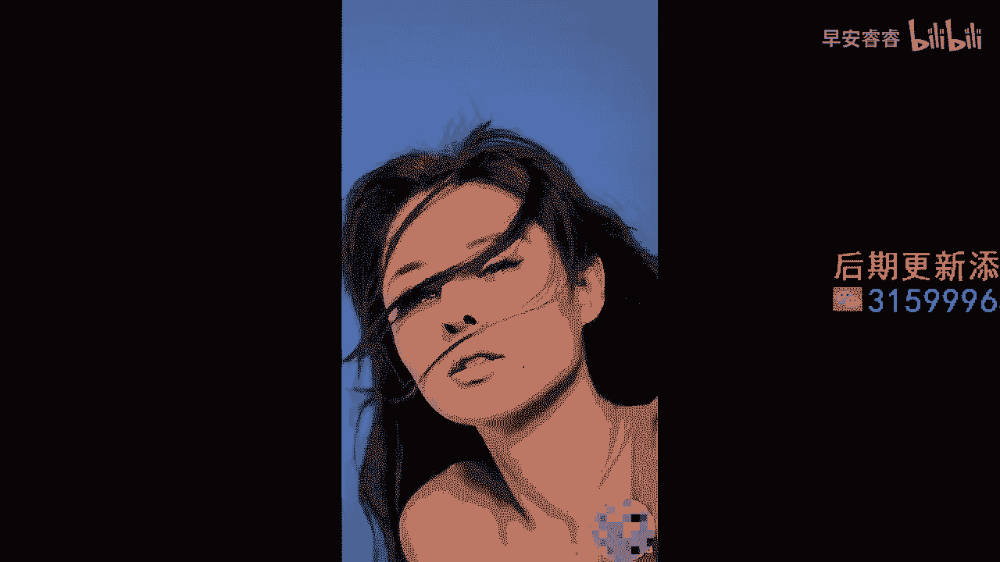

# 045 服装行业流量爆发营，从0-1抖音快速起号解决实体流量问题！ - P35：35 - 35课0.1 .mp4- - 早安睿睿 - BV1Kf421R7NA

上一节课呢，我们教大家如何根据一个故事的发展阶段，通过一个又一个的阶段来进行脚本的设计，那么当我们把脚本从我们去进行的四个阶段，落到我们的形象改造视频里面以后呢，我们第二步就需要通过分镜去实现。

分阶段的脚本的一个呈现，那其实如果大家没有去经过一些短视频拍摄的，专业的训练的话，是不知道分镜是什么意思的，分镜其实它指的就是我们再去设置的时候，把镜头分为一个一个的镜头，有计划有规划的去进行录制。

而不是我们有非常多的同学们在录之前啊，根本就不知道自己要录什么，也不知道说哪个部分是需要录的，这就会导致你在后期你会发现，可能有一些镜头你落下来了，可能有一些非常重要的部分，你没有去录制。

又或者有一些需要大镜头去呈现的，或者需要远镜头去呈现的，或者需要从左到右通过运镜去呈现的部分，你都没有记得去把它给录下来啊，那么就举一个例子啊，像我们在上一个视频里面，我去看啊。

我们其实发现从头到尾都没有看到，形象设计师本人，对不对，他本人就没有出镜，那么对于我们来说，因为我们要打的是个人IP呀，我们是需要被看见的，我们这个人应该是在前面的，你看相对于上一个视频来说。

他就漏了一个关于改造者的一个镜头，但它会有很多被改造者的镜头，对吗O所以你就要明白，在我们拍摄之前，一些比较重要的画面，是需要通过分镜的策划来进行，单个的镜头的录制，这样子的话你才不会漏下来。

那么接下来呢我们来给大家看一段素材，这是一个啊叫做门书的一个博主，那他其实做的这个虽然不是形象改造，他做的是摄影，但要知道啊改造类其实往鼻祖上去推啊，就是摄影和美发行业，因为他们非常擅长去做这种。

前后类型的一个对比，这就导致了，其实我们现在有非常多的一些形象改造啊，变装啊都是去参考这两个行业的，那么门书的话，就是属于在啊摄影的这个行业里面去做改造，前后对比做得非常好的一个博主。

那我给大家去找了一个，他的点赞量非常高的一个视频，大家先看这个视频，看完了以后呢，我来给大家猜一下，他这个视频的分镜设计，有哪些是值得我们去学习的，南宋没素，我来找你拍照了，本来是要跟男朋友一起的。

那你男朋友呢分手啦，Oh baby，I don't understand it，Could you make it hard for me。

Could you make it it hard for me，Could you make it all me。

好的，我们看完这个视频了以后，你就能看出来了，这是一个女孩子来找文叔拍照，本来呢说好是要跟男朋友一起拍的，结果她失恋了，对不对，所以她其实好像看起来很快乐，很强颜欢笑的样子。

实际上在他的内心的那个情绪是反面的，他其实非常悲伤的对吗，那么我们就来看一下他的这个故事，首先她有几个层级，第一个一个女孩兴高采烈地来找她拍照，这是第一个层级对吧，那么呃门叔在面对这个事情的时候。

其实是有一点点冷漠的，对不对，那后来他就一不小心漏嘴了，说啊本来是要跟男朋友拍的，然后旁边有个角色说，那现在男朋友呢她就说失恋啦，然后你就会发现她她她扭头就就跑掉了对吗，然后门叔就其实知道。

他内心其实应该是非常悲伤的，把书合起来就开始给他去拍，后面直接切进来的就是一个对比了，对不对，好，OK那我们在这里面我们来拆解一下它的分镜来，首先啊我们现在上第一个分镜。

你会看到她有一个女孩奔跑而来的这个过程，他的这个过程，你看他一边喊着萌叔萌叔，我看我们这个截图对吧，她这个分镜就是设计好的，就是我要去设计一个女孩，从远跑到近的这个镜头，那你在拍的时候，你才会知道说哦。

我要去拍这么一个镜头啊，所以你看这是他去设计的第一个分镜，那么在他跑向的同时，我们会看到第二个分镜来，我们看这张截图，第二个分镜是从上到下去拍门，书，门书本来是在看书，对不对。

然后的话他看到这女孩跑过来以后，她就怎么样抬头来看她哦，这就是第二个分镜，所以第二个分镜是我们要去看对面的这个人，他的反应是怎么样的对吧，然后我们再来看像第三个分镜，他说完那句话，失恋啦，分手啦。

然后她就转过头，然后你就会发现她那个头发，她设计了一个就是转头的这个分镜，我们看到他这个头发整个是飘扬起来的，那么这个飘扬起来的分镜就意味着我不回头了，对不对，我要离开这段回忆了。

所以你就会发现他这个分镜是设在这个点，如果没有这个很经典的回头的话，那么这个视频他其实要表达的东西就不够完整，因为他在这里，她就意味着一个女孩要离开，前一段回忆的那个决心了，对吗好。

所以你看这个扭头的这个分镜，其实是这个细节分镜啊，是他特意去设计的，在这里面我们尤其尤其提醒一下大家，在我们去做形象改造的里面，大家真的可以去抓一些细节分镜，细节分镜我们会在下一节里面来告诉他说。

你为什么去需要做细节分镜，她是跟故事的情绪有很大很大关系的，OK那么我们再来看下一个分镜，就是当这个女孩她扭过头了以后，我们就开始看到他，这个分镜是为了跟后面变装的那个分镜，给他结合起来的。

因为他后面就是变装，拍照了以后，他的整个分镜的画面是化好妆了以后，头发是飞起来，然后眼睛非常非常的悲伤，流着眼泪对吗，所以它在前面设计了一个，能够跟后面连接起来的分镜，就像我们看到的上一个视频。

那个女孩用手换过来，她是一样的，那么她这个分镜是通过头发的一个飞扬，就是你这一秒看到的还是一个素颜的，没有经过变装，没有经过摄影的女孩的头发的飞扬，然后下一个特效一接进来，它同样是在同一个姿势下面。

头发飞扬起来，这个时候他的整个对比就已经衔接上了，OK你看这种就是我们去设计分镜以后，能够让我们在上一个故事情节，和下一个故事情节里面进行更好的一个衔接，能够让我们去观察到诶。

来来的这个人和对应的这个人，他们两个分别在当下呈现出一个，什么样的反应啊，所以这个其实就是分镜设计啊，我们需要用分镜设计，去承接我们上一步的脚本的阶段，每一个阶段他从大的镜头还是小的镜头。

远的镜头还是这个近的镜头，是固定的镜头还是晃动的镜头，这些都是在分镜镜头里面已经给他设计好的，OK那这就是我们教大家做形象改造的，第二个核心的方式，就是去确定好你的分镜镜头。

那么接下来我们就要进入到下一个方法。