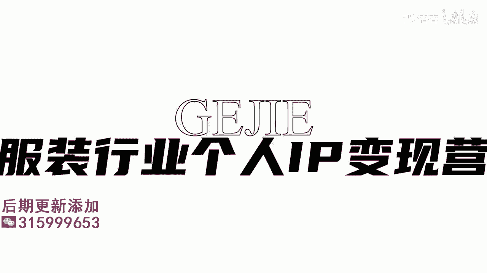
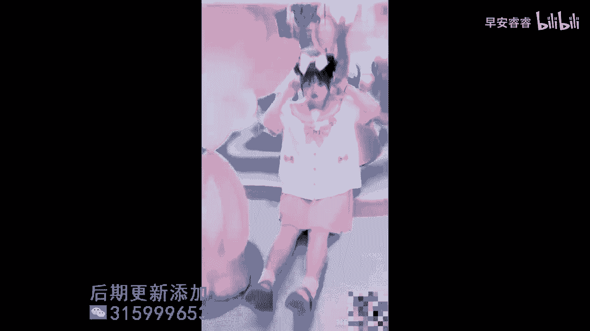

# 045 服装行业流量爆发营，从0-1抖音快速起号解决实体流量问题！ - P36：36 - 36课0.1 .mp4- - 早安睿睿 - BV1Kf421R7NA

这节课呢教大家来设计形象改造，视频里面的旁白或者第三方，或者第一方的一个语言角色，我们都知道在一个视频里面，不可能没有人开口说话，对不对，那开口说话的这个人也不可能只有客户对吧，那我们作为店主呢。

我给大家两种语言方式的表达推荐，第一种呢就是通过第三方的一个旁白，来表达你想要去表达的东西，来，我先给大家看第一个视频的素材，刚搬到杭州没多久，就认识了一个新朋友，但是她说我从来都没化过妆，也嘿嘿。

而我刚好是个中性风美妆博主，就等着被我改造吧，修个眉毛再简单点，用水擦个脸，我朋友说他分不清化妆品怎么用，觉得这个东西太麻烦了，那我就让他看看，变成大帅比是什么，我还给他搭配了衣服，还有项链。

戒指和耳环，看看改造之后的成果如何吧，Put that on that beat no，好的我们看完第一个视频的素材以后，我们就会发现这个女孩她帮她朋友进行改造，但是他所有的语言表达。

都是去通过机器音去呈现出来的，也就意味着说他其实是通过加字幕，然后在剪辑里面找一个合适的声音来表达，对不对，那这种方式呢它的好处在于什么，第一个就是它可以在这个语言表达上，带来比较丰富的一个情感。

你看哦，在我们简易里面，你是有非常多种声音可以选的，可以选男音，可以选女音，可以选这种东北音，可以选这种可爱的音，对不对，那对于有一些就是店主，可能他觉得唉我自己讲话不是特别的利索。

而不是特别的擅长于语言表达的话，我们就可以借助这种把你内心想要讲的这个话，你对于这个人的一个设定，哎你比如说哎我判断它出来呢，他应该是什么什么风格的，什么什么，那你就有点类似于像当做是第三方向。

给这个观众去解答一下啊，就比如说我现在去改造一个人，我在跟观众解答，但我用的不是我自己的声音，我用的是屏幕，然后让别人读出来，对吧啊，就比如说他的发型是比较适合这种八字刘海的，那我通过别人去讲出来。

实际上我的这个视角是一个第三方视角，是我改它，然后我对着你讲啊，对不对啊，我改我旁边的这位同学，但是我是对着大家去讲，我是怎么去改造它的，这种是属于旁白的一个语言，那比较适合那些不是很擅长开口语言表达。

或者说你觉得你自己的声音，不能够去表达那个情绪，那像这种的话呃，偏年轻类的饰品会用的更多一点，比如说你的受众，他的年龄层是在35岁以下的，但如果说你的受众，他的年龄层次在35岁以上。

反倒我觉得我比较推荐大家用第二种，就是真人发声的，来我们来看一下第二个素材，今天我约了一个特别的粉丝帮她改造，她的喜欢里都是JK，今天我们就来给她画一个JK少女妆，走有点小紧张，Hello，我是小玉吗。

哦没想到你们真的会来，真的没有想到你会来，我还给你准备了一份礼物，猜猜是什么，我这我能穿得下吗，当然你比我想象中更可爱诶，没事的，已经来，空气都80个假粉，你脸上泛红没严重，不是遗传的。

我妈妈脸上也是这个样子，那像你这种情况，可以用这种绿色的隔离或者是遮瑕去综合一下，脸这么大可能要用掉你很多粉底液，这点粉底液姐还是买得起的，为什么我平时画了眼影，眼睛还是这么小呀。

像你这样单眼皮或者是肿眼泡的女孩子，可以选那种硬梗睫毛贴好睫毛之后再画眼影，眼睛就会大很多，天哪我的眼睛从来没有这么大过，以后也可以这样画啊，那你平时又穿出这种，那太胖了，没有我穿的下巴。

而且我也不敢穿出，谁规定只能瘦女孩才能穿JK啊，你穿肯定很好穿，爱拉长耳朵，提高警觉，神经细胞全面戒备好。

第二个素材里面，我们看到这是一个化妆师的一个改造过程对吧，但是这个化妆师呢，他整个他是所有的语言表达，都是通过他自己的嘴巴去讲出来的，而且他的这个语言表达里面，是有多方的一个角色的交叉的。

然后他既可以直接面对镜头说来，我今天要去改我的一个粉丝，他喜欢的是什么什么，然后等他见到了人了以后，比如就像我们我们见到了客户以后，我们又可以跟客户来进行口语的一个表达，那么这第二种表达方式呢。

它会对我们自己要去说话的这个人，他的语言表达的表情啊，自然度啊，可能会要求比较高，有一定的表演成分，然后有比较流畅的语言表达能力，但是大家注意了，同时这也是我比较建议大家用的一种方式。

因为这种方式更能够去呈现个人IP，因为这个话是从你嘴巴里面说出来的，我们直接关联出来的，就是嗯这个人他有改造的一个能力，如果说我们是通过第三方的一个语言说出来，通过机器人说出来的话。

你的个人IP的说服力是没有那么强的，所以大家如果在可以自然的面对镜头，可以去呈现出你的一个思想和情绪的时候，我还是更建议大家用第二种方法，是，用真人自己的声音去表达，你改造时候的一个想法。

既可以直接对镜头说，也可以去跟你的客户来进行沟通和交流，Ok，那么这个就是我们去跟大家去拆解的，第三个部分，语言表达的部分如何进行设计，那么接下来呢我来跟大家拆解第四个部分。

而这第四个部分也是所有的视频里面，最重要的一个部分。