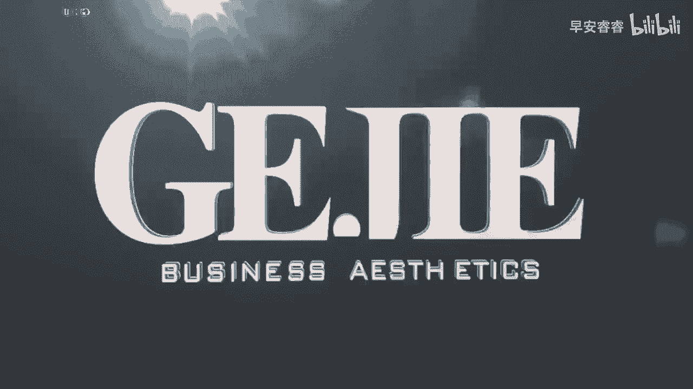
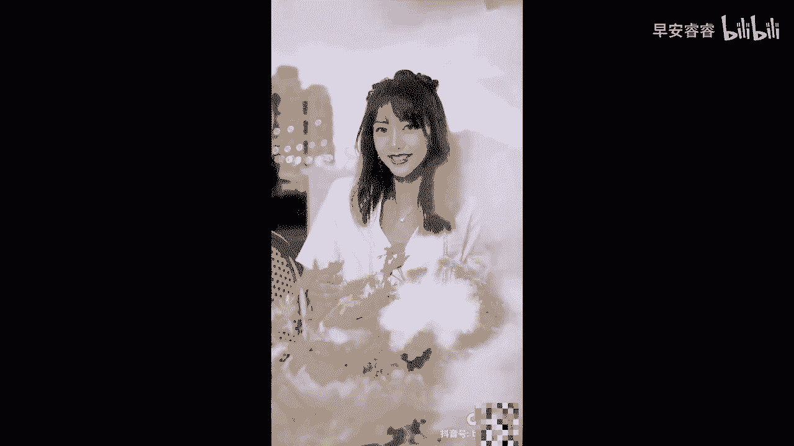

# 045 服装行业流量爆发营，从0-1抖音快速起号解决实体流量问题！ - P37：37 - 37课0.1 .mp4- - 早安睿睿 - BV1Kf421R7NA

情绪啊是短视频，尤其是抖音这个平台最喜欢的东西，你有没有试过那种看抖音，突然看到那种热泪盈眶，或者看抖音的某一个视频，笑得肚子都给笑疼了对吧，你就会发现在抖音上，但凡是那些点赞率非常高的。

都是极其能够引起你情绪的视频，比如说有一些视频让你一看了就非常的气愤，想骂人，有一些情绪让你一看就非常的感动，想流泪，有一些情绪让你一看就非常的搞笑，对不对好，但凡是能够抓人情绪的视频都是好视频。

那么在我们去做的形象改造的这个视频里面，完全可以去植入多种情绪，因为你去试想一下，每一个想要被你形象改造的人的底层，其实都是情感诉求，一个宝妈想被你改造，可能是因为他找不到自己了，他迷茫了，他不自信了。

对不对，所以他需要的是那种被鼓励的温暖的情绪，那你看我们上一个看到了萌叔的那个女孩，失恋的那个视频，对不对，那她里面的情绪有悲伤，有心疼，但是也有疗愈对吗，所以你就会发现任何一个视频。

只要他能够带入情绪啊，这个视频就能够再加200分，OK那么接下来我来大家来看另外一个改造视频，你们看一下在这个视频里面，能不能快速的就看到情绪小姐姐，这是她还是要发给男朋友吗，你谁啊，关你什么事。

不要拍，我们是做形象改造的，想要改造，我为什么要改造啊，先不要拍，给你看一下我们的视频呗，我去你现在是带妆吗，脱妆有点厉害哦，因为我是属于干皮那种，就是化完妆都会有浮粉起皮的那些，卸了妆，你这很干呢。

先给你用爽肤水把角质软化一下，顺便补补水就慢一些嗯，这个要敷多久呀，敷5分钟就好了，是每天都敷吗，还是说出现了肝的情况下才敷呢，你觉得皮肤比较干，上妆之前的时候就可以用来敷啦，现在这部分就很好化了。

把你的名字写进心里，在我有限的生命里好好抱紧，不妙的夜里，我时刻在想你，你是否能听清清醒，如此深刻的情绪，我是否该逃离，才不至于彻底好的。

从刚才这个视频里面，我们看到了这是一个什么样的故事啊，这是一个经过设定，哎我看到一个女孩正在自拍，然后我问她说，小姐姐，你是不是在拍给男朋友看呀，要不要我们给你做一下形象改造，你看这个时候这个小姐姐。

她的首先整个设定是一个暴躁，小姐姐的一个设定，他在他的主题封面其实就写有了，那么她是如何去呈现这个女孩，她是暴躁的呢，我们来看一下这个截图，你看第一张，当他一问问题了以后，这女孩就说你谁啊啊。

这个时候你已经感受到这个女生，她是有一点点不爽的，对不对，然后他就接下来他就指着说哎你不要拍，你不要拍，对不对啊，然后他就说关你什么事啊，我为什么需要改造啊啊这个时候你就会发现哦。

他通过人物去进行了一些情绪上的设定，就像我们看到的那个失恋的小姐姐一样对吧，她也是有情绪设定的，所以如果我们再去给客户去做改造的时候，带入一定的情绪设定，你这个视频就能够加分很多诶。

你比如说同样是一个中年妇女，她来到你们店直接说哎你帮我改造一下吧，如果我们在前面给他去设定一个情绪呢，她如果非常非常失落的走过你的店铺，然后你叫了他一下，你说哎罗姐今天怎么这么不开心啊，然后他抬头望你。

然后他就说哎上次送我儿子去学校，他都不让我靠近校门啊，这个时候你就发现哎，当你去设定了这个情绪了以后，配合上我们的一个呃脚本，对不对，配合上我们的分镜去抓他的那种，眼睛的那种失落感去抓他。

比如说搓着衣角的那种悔恨那种懊恼感，你马上就能够把情绪抓过来，然后如果说我们把情绪再对回到我们自己，那你就说那你交给我，我一定要让你把，让他把你给接到所有的同学面前，然后你把A把他拉到你的店铺里来。

他说不用了不用了不用了，没关系的，你说不行不行不行，这事你必须交给我诶，这个时候你呈现出了一个非常热心，非常乐于助人，而且很善良的这么一个形象对吧，那你的这个情绪也出来了对吧，然后从我们去给他去做。

就是改造的过程中，比如说给她做色布测试的时候，你跟他说哎呀罗姐啊，其实你非常适合用这种亮一点的，她说啊不行，我这么老了，年纪这么大，我不合适穿这种，这都是小姑娘穿的，她那种不自信的情绪出来，对不对。

然后你再鼓励她，怎么会呢，你才35岁，你怎么能说自己老了，对不对，咱们女人30以后才一朵花呢，就你那种温暖的情绪再带进去，所以就是我们其实可以，在视频的一个改造的过程中，从每一处的对话里面。

从一些情节的设定里面，为整个视频去加入到我们的情绪，当这个情绪越饱满的时候，客户就越想要看，因为只有情绪才是真正能够抓人的，再到后面我们给她化了妆以后对吧，她开始看到自己很漂亮的样子。

好像眼睛开始一点一点开始闪光了，然后再到你打电话给他儿子说，你说你过来，你妈妈在这，你过来把她接回去诶，等他儿子过来的时候，整个眼睛放光，哇，妈妈你好美，把这句话说出来的时候。

她那个妈妈的那个热泪盈眶的那个细节出来，那个分镜出来啊，你看这个，其实他就是一个情绪非常饱满的一个改造视频，而我们现在看到在整个所有人去做啊，在整个所有服装人去做的，这种形象改造的视频里面。

其实是非常少有这种情绪很饱满的，更多的都是极其机械化，很快很快很快很快，那这种很快的东西其实看个一两次是可以的，但后面了，如果你想让客户长期的去看你的改造视频的话。

你必然是有不同的故事和不同的情绪在里面，所以大家要去做一个形象改造的视频，一定要学会去设定故事。