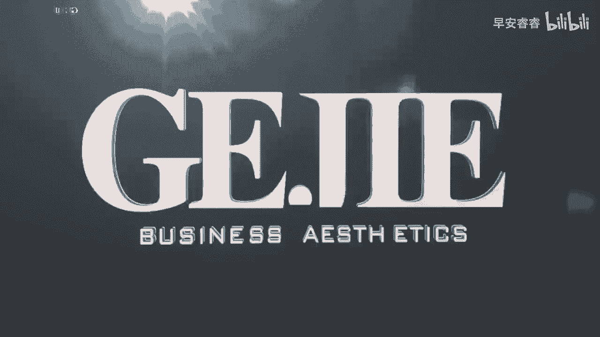
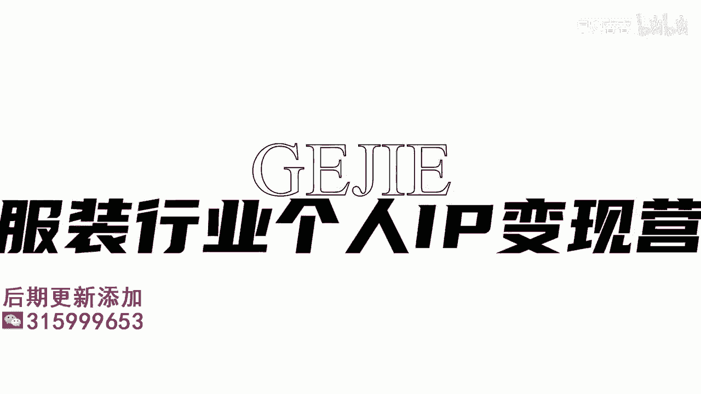
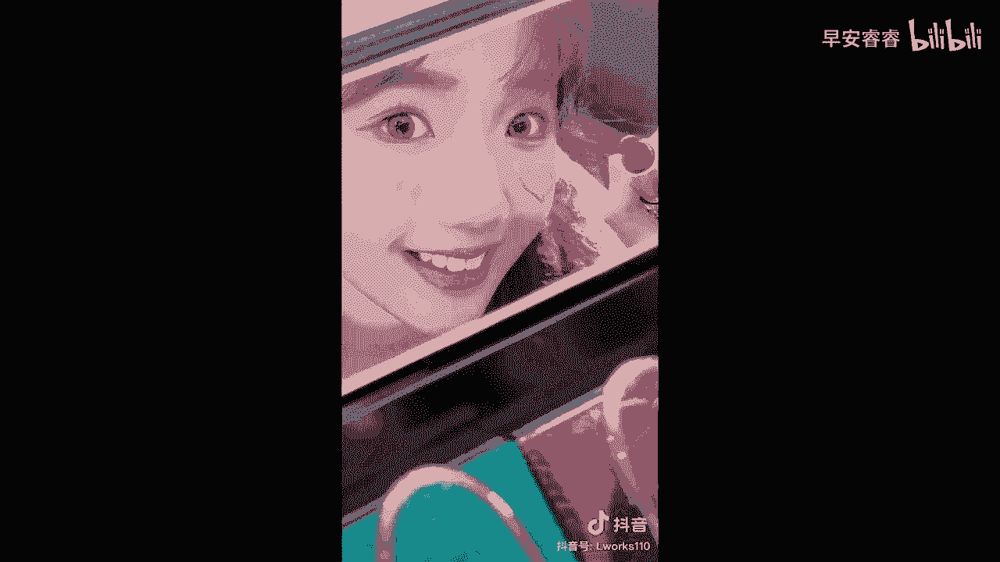

# 045 服装行业流量爆发营，从0-1抖音快速起号解决实体流量问题！ - P38：38 - 38课0.1 .mp4- - 早安睿睿 - BV1Kf421R7NA

好那在我们上一节课讲完了，如何去丰富一个视频的情绪，让他整个画面变得饱满，让他整个吸引力变得更强了以后，我们在做形象改造，最重要的是结果的呈现，对不对，那么在结果呈现这一步，一定要去突出强烈的对比感。

那么这个对比到底怎么样去实现呢，我看到我们有非常多的学员啊，也看到有很多这种呃去做形象改造，但是它整个前后啊，完全没有达到一个强烈的对比，如果说你前后没有达到强烈对比，你这个视频还不如不做。

你不做之前呢，别人还对你有期待，你做了以后，别人看哎怎么改前和改后是差不多的，别人对你就更没有期待了对吗，所以形象改造它是一个非常注重结果的事情，大家一定要强烈的去呈现对比感，那么在对比上面。

我们有四个方法来教到大家，更好的去呈现改造前和改造后的一个对比，那这四个方法呢，第一个就是可以去做场景的优化，什么叫场景优化呢，就是说可能在改造之前，他是在你的店铺里的。

那它的整个场景呢可能是一些化妆镜啊，或者是一些普通的一个啊店铺的杆子啊，他整个场景相对来说是比较呃简单的啊，没有很华丽的这种感觉的，那我们在前和后，我们可以去通过一些啊剪辑上的一个对比。

把他的场景转移到下一个，比较适当的场景里面去啊，比如说我们把他带到咖啡厅里去拍，带到一个呃酒店里面去拍，带到呃街上走那种街景去拍，就说我们要找到一个更好的场景去拍，那我看到有很多人。

他的改造前和后都是在他的服装店里，所以当你那个场景不到位的时候，你这个前后的冲击感一定是弱的，大家要知道，在做视频的对比改造上，你的夸张是一定要稍微有一点的，你不能太过于真实了，对吧好。

所以第一个就是场景的一个升级好，那么第二个的话是运用到我们的一个剪辑方法，叫做转场啊，转场其实它是一种过渡，它是一种比如说从之前的样子过渡到之后，从之前的情绪过渡到之后的一个情绪，那具体什么是转场呢。

来我们给大家切一个案例来看一下，没事没事，我想要拍男友视角的照片，那你男朋友呢没有，拍男友视角的照片，首先得会哄女孩子开心啊，你代表会生气伤心，先破极逛街吧，这件衣服好看吗，我们可以把腿伸出来。

显得腿长一些，哎这个包包好时尚啊，我们可以把手举高，摆个时尚一点的pose吗，文叔这个色号是不是很性感，我们可以抬起头，性感的画口红，好好了拍好了，学会了这些春季新品真的很上镜啊对啊。

喜欢的话还可以到现金店逛逛，银泰M365会员还有折上九折呢，或者上喵街app搜索银泰星选新品间货，美妆好物应有尽有，哎我看看照片，我先去买单，But you will stay。

No one joy your，大call me，Goes on the day way。

好的，以上是我们刚才给大家看到的，第二个方式就是转场啊，转场把这个同样的镜头本来是定格在这儿的，迅速地切到下一个镜头上，它也是可以快速的去突出前后的一个对比的，那第三个方式呢。

就是用音乐的卡点来强调对比的一个激烈感，比如说我在这之前用的那个音乐的情绪，它相对是比较低的，然后一旦进入到对比以后，我们整个音乐的情绪就要拉起来，因为你想一下抖音，抖音，它之所以有一个音字。

音乐可谓是我们在一个视频里面，能够拉高灵魂的一个核心点，所以大家一定要去找一些，能够用在这个形象改造上，非常匹配当下那个环境的音乐，把那个音乐的情绪再从改造前和改造后，迅速的切换过去。

这个时候就能够快速的去增强，客户对于一个感官上的一个感受好，因为大家要知道我们说无感无感，对不对，听觉也是一个非常重要的感官好，那么第四个的话就是合理的去运用滤镜啊，在我们的剪映的这个软件里面。

是有大量的滤镜可用的，那所以在我们改造前和改造后呢，你可以去选择一个比较适合这个客户的滤镜，给他通过视觉上的一个前后对比，比如说像刚才我们举例的那个罗姐对吧，她想当一个让孩子骄傲的妈妈。

那如果说我们在孩子见到他的那一刻，我们在滤镜上给他一个特别阳光的滤镜，特别明媚的滤镜，去匹配他那种让人眼前一亮的感觉，那么这个时候你的前后对比也就会更加的明显，好我们总结一下如何能够更好地去突出形象。

改造以后的前后对比，第一个就是换场景啊，第二个就是利用转场去过渡我们的对比和情绪，第三个就是利用音乐来做心情，情绪上的卡点，拉近我们前后对比的一个冲击感，第四个就是增加合适的一个滤镜，在匹配的场景之下。

让所有的氛围通过滤镜加倍地呈现出来好，那么我们接下来一堂课，就是我们去做形象改造的最后一个方式了。