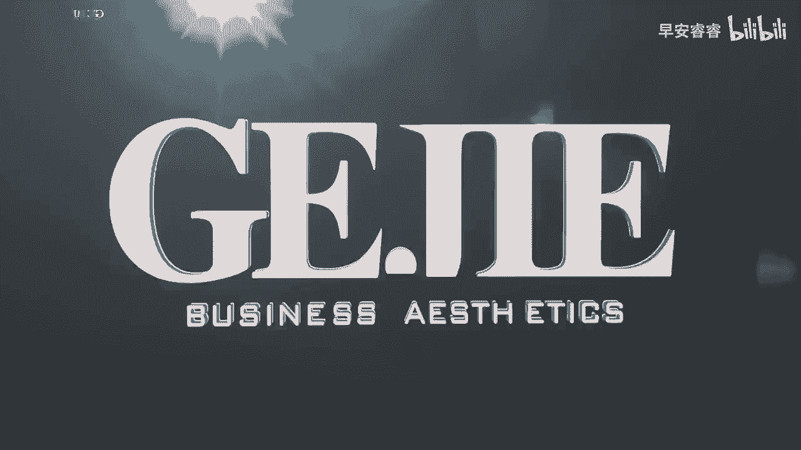
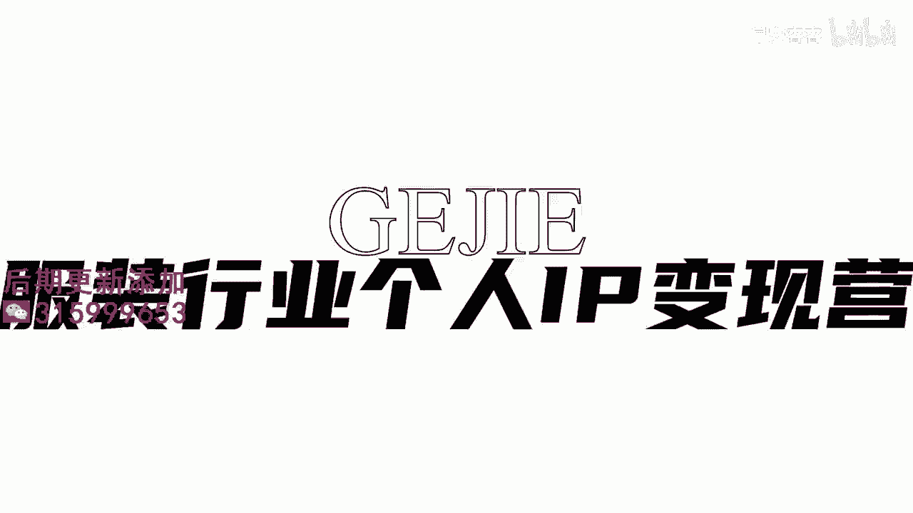

# 045 服装行业流量爆发营，从0-1抖音快速起号解决实体流量问题！ - P40：40 - 40.做什么可以引流到店 .mp4- - 早安睿睿 - BV1Kf421R7NA

这节课呢其实我是核心想要去跟大家去做一个，内容和目的上的确认，因为其实每一个人呐，他要去做账号的目的都是不一样的，但是我们最怕的是什么，我见过有非常多的服装人，他做账号的目的是极其不清晰的。

他不知道我为什么要去做这个账号，如果说你连做账号的目的都不清晰的话，你必然是不能够达到你的结果的对吗，你说你今天直接开车就上路，而你到底要到哪，你都不确定，你说你什么时候他是个终点呢。

那所以我就想跟大家说啊，作为服装实体人，你一定要明白，我这个号他是要达到一个什么样的目的的，那就有人说了，哎老师这不是很简单吗，就是为了达到赚钱嘛，赚钱他在抖音这个平台上是分很多种方式的，举一个例子啊。

你做一个账号很有可能给你带来的是流量，但是它不一定给你带来的是变现，你会发现有大量的这种剧情号，段子号有上千万的粉丝，突然他就不更了，那他为什么不更新了呢，就是因为他只有流量没有变现。

其实我们也有一些服装人偶然发的一些视频，你会发现其实还是有一些流量的，但是这些流量呢跟你的变现，可能是一点关系都没有的，比如说一些长得比较漂亮的服装人，他可能是对着那个音乐卡点去跳舞的，身材又特别的好。

对不对，然后的话滤镜用的特别的美，你就发现你吸引了一堆的男粉，流量是不低的，下面全都是夸你的，后来你发现没一个人来是跟你买衣服的，那我们之前还有一个学员，他在没有去跟我们学习。

没有去做好这个内容定位的时候，他是一个非常擅长搞笑的人，所以呢他就开了一个号去讲段子哇，他那个号特别有流量，就很多人很喜欢听他讲段子，但是他发现讲了半年，没有几个人是来跟他买衣服的，全都是来笑话他的。

那你说你这个号是不是只达到了流量的目的，没有达到变现的目的，对不对，所以你看赚钱它是有很多种方式的，那如果说你这个号只有流量，而不能达到直接跟你的产品进行变现的话，那可能你的变现方式就变成了新图接广告。

对不对，接推广对吧，但接推广好像也不是我们服装人要去做账号，初始的一个目的吧对吧，所以你看账号有可能他做出来是只有流量，没有变现的，那还有一种做账号，也有可能有一些人他不是为了去引流做变现。

他可能更多的是为打开一定的知名度，比如说我希望能够在我这个城市，变成一个有一定影响力的一个人，诶，我不一定需要别人冲着我的这个号，来我的店里买衣服，但是我希望别人就是经常在这个城市里面，刷到我这个号。

他会认识得到有我这个品牌和有我这个人，那么这种他其实是一种打开知名度，打开影响力的方式，那像这种类型，如果你是怀着这个目的的话，那大多数我们做的一般都是观点类内容，一般都是个人经历或者是IP类的内容。

那如果说我们还有一种目的是打开资源，其实当你能够拥有一个在本地城市，或者说在某一个垂直领域，有他个5万到10万粉丝的时候，你是拥有一定的资源的谈判力的，就是说你是可以对外去跟别人。

比如说跟很多同类级的一些商家，或者跟一些品牌，去进行一些资源上的一个兑换和整合的，所以其实做号他也有去增加你的一个资源，整合能力的结果，但他不一定能直接给你带来变现对吧，那你看像我们在上面几节课。

教大家服装实体店主去拍的一些内容，从货品的展示，店铺的展示，氛围的展示，以及我们专业的展示形象改造对吧，他其实都是直接导向于变现的啊，所以那么我们在今天核心要讨论的就是。

服装的实体人力到底要去做一个什么样的账号，他才能够达到对我们大部分实体人来说，最想要达到的那个目的好，我去综合了我们这么多学员的一个诉求，我发现大家去做账号无非就两五个目标。

第一个目标是希望增加影响力和知名度啊，比如说有一些人，他虽然没有直接通过抖音上引流来，很多人到店里去买东西，但是他会发现当他去其他地方吃东西的时候，别人会认出他来说。

哎你不就是那个什么什么抖音上的谁谁谁吗，那改天我到你那去看一看衣服，就说他的这个影响力，是通过间接引导到他的一个变身模型上的，所以你看这个部分，他其实是影响力的部分，还是有挺多的。

这个服装人士希望去拓自己的影响力，拓自己个人的一个知名度的，那么第二个的话也就是更多的人的一个目的了，就是引流变现，就是我希望这个视频能够，直接把人引导到我的店铺里面，进而进行消费。

达到我的产品变现的一个目的，那么各位在，基于大部分的服装实体人的这两个诉求，我提出了一个非常重要的叫做双矩阵的，服装实体人的账号模型，那这个双曲阵呢它主要就包含两个层面的内容，第一个层面是IP型内容。

第二个层面是营销型内容，IP型内容更多，它是针对于自我的，比如说你自己是一个什么样的人，你拥有什么样的生活方式，你拥有什么样的价值观，你平时会选择什么样的物品，你会有什么样的感情关系，朋友关系。

爱人关系，家庭关系，亲子关系等等，这一系列，它其实是核心，围绕着放大你这个人的人格魅力去进行的，那么另外一个部分就是我说的营销型内容，营销型内容其实核心就是针对于我们的店铺来，主打店铺的一个影响力。

比如说去展示店铺的装修，展示我们的陈列，展示我们货品的风格，展示我们店铺里面的氛围，当我们同时在一个号里面去加入IP型的内容，和营销型的内容的时候，就能够既同时达到营响力的目的。

又同时达到流量变现的目的，所以接下来呢在上一个阶段，我们把营销型内容跟大家讲了，对不对，那我们接下来呢就要去给大家一起去探讨一下，什么样的内容是可以去扩大我们的流量，扩大我们的一个知名度的。

O所以你明确了，如果说你也跟我刚刚说的，以上这两个诉求是匹配的，在你的账号里面必须要有两个部分的内容，一个是IP型的内容，一个是营销型的内容，这才是对于服装实体人来说。

