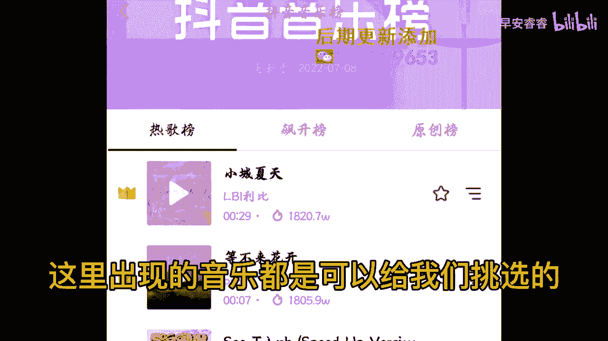

# 045 服装行业流量爆发营，从0-1抖音快速起号解决实体流量问题！ - P46：46 - 46.服装人如何筛选适合的爆款音乐.5 .mp4- - 早安睿睿 - BV1Kf421R7NA

音乐呢是抖音，短视频里面最最能够点燃情绪的一个工具，所以大家要去做短视频，一定要能够去切到那些让你蹭上流量的音乐，那么今天呢我们来给大家去分析一下，服装人的短视频到底要怎么去配乐，首先第一个啊。

大家一定要回想一下，我们当时在讲定位的时候，让大家去看到一个非常重要的东西，就是你的客户年龄阶段，你有没有发现不同的客户年龄阶段，他喜欢听的音乐是完全不一样的，举一个例子啊，年轻的可能他喜欢听英文类的。

喜欢听嘻哈类的，说唱类的，对不对好，那么像这种类型的音乐的话，放在一些比如说做小姐姐的风格，韩系的风格对吗，这种风格里面她就会非常适合你的年龄阶段，但如果你说你今天是做这种中老年装的。

你搞一个rapper和英文对吗，那这个他不管有没有流量，他跟你的受众是绝对没有关系的呀，那你就会发现，如果说是一些偏年龄层往中上层级走的，他可能喜欢听到的是一些经典老歌啊，粤语老歌啊。

或者说是当下比较流行的一些网络歌曲对吧，所以大家第一个在我们去挑音乐的时候，自己要去思考一下，我们客户的年龄层到底是多少，然后第二个的话就是要看一下曲风的一个快慢，和它的一个跟你服装风格的一个匹配度。

你比如说哎你今天的这身服装风格，她是一个非常妩媚，非常妖艳的对吧，结果你给他配一个很文艺的啊，什么致青春呐，那他就完全不匹配了对吗，那所以的话我们在这里面就要去看，我们挑选的音乐的风格类型。

跟我们自己服装的风格类型能不能匹配起来，然后第三个呢就是要去看我们的场景，比如说我这个场景它是在室外拍的，它是在一个大自然的环境当中拍的，那我去用的这个音乐的节奏，可能就可以更文艺一点点或者缓慢一点。

那我肯定不会用DJ打碟呀，对不对好，所以我们也是可以把它匹配到一个场景里面的，如果说你是咖啡厅的话，那你就可能非常适用于用一些法文呐，英文呐，甚至是意大利文，就他有那种非常浪漫的感觉，对吗好。

那么最后我们想跟大家提示一个非常好用的点，就是你经常去关注一些同行的账号嘛，对不对，那你就会发现有一些音乐啊，在某个同行或者说某一群同行里去用，他都能够保它都有流量，像这种音乐，你听到了以后。

你要马上给它收藏起来，那等到下一次你再去用视频的时候，你可以去看一下你的收藏夹哦，当然你这个收藏一定是要及时更新的，你不能说哎，这个音乐已经是三个月前的热门音乐了，你这个时候才来用。

那你肯定就蹭不上这波热度了，好，所以去看一下同行去用的那些能够爆掉的音乐，也是我们去找热门音乐非常好的一个方法，而且很讨巧，那么接下来呢我们有一些可能新手小白，他不知道该怎么去在抖音里面去。

找到有流量的音乐的，那我们接下来会让我们的剪辑师来，通过我们的一个手把手的入口的教学，帮助大家来找到爆款音乐到底在哪，首先打开抖音，点击右上角的搜索，滑到下面有一个音乐榜，点击音乐榜。

然后滑到最下面有一个查看完整音乐榜，点击查看完整音乐榜。

