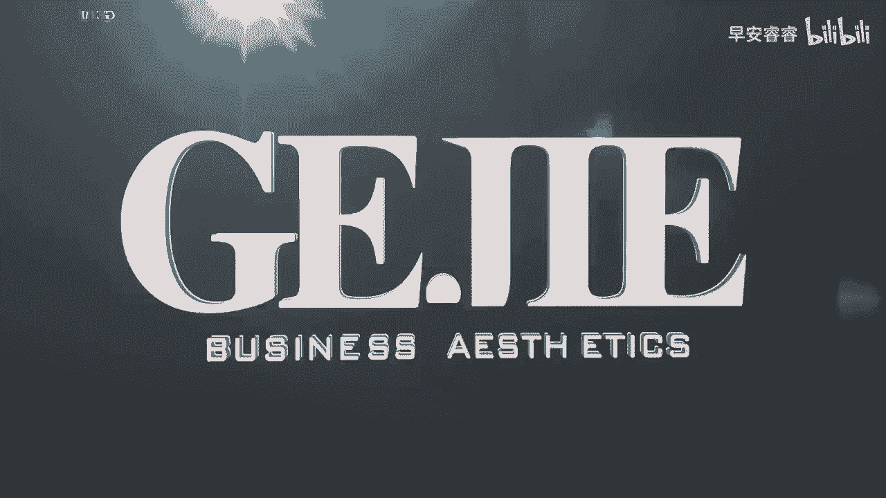

# 045 服装行业流量爆发营，从0-1抖音快速起号解决实体流量问题！ - P48：48 - 48.服装人的口播应该怎么拍一 .mp4- - 早安睿睿 - BV1Kf421R7NA

口播呢其实是我们服装人真人出镜里面，做个人IP非常常用到的一种拍摄模式，所以呢今天我也将要分为三节课，来教会大家怎么样去拍一个服装人的口播好，首先第一个啊做口播这个事情呢。

它看起来是一个好像很简单的内容，就是诶我坐在这，然后吧嗒吧嗒吧嗒跟你讲，是不是，但实际上啊由于口播，首先第一个它的竞争是非常非常激烈的，然后第二个口播的呈现模式相对是比较单一的。

它其实就是一个说话内容的事，因为它有没有剧情对吧，他也没有特效，他也没有表演，这就导致了如果一个人你讲的这个口播，想要把对面看的这个人给他留下来，其实这个事情看起来简单，实际上是一个非常非常难的事情。

所以的话我们服装人啊，你要去做个人IP，如果你想要通过这种真人出镜，在这种镜头面前直接通过口播的方式去讲的话，那么第一个你要确定的就是你的内容方向，到底要讲什么，因为在口播这个里面啊。

内容的价值就是第一位，你到底在讲什么，比你环境啊怎么去讲啊，可能都还要重要一些，就说你的这个内容它到底有没有价值，是我们第一个要去衡量的事情，所以的话我们要自身针对于自己的一个经历，学识擅长的点。

你先要去确认一下，你这个人身上有什么东西是可以去跟别人讲的，你讲什么东西别人是愿意听的啊，来我们给大家看一个这个案例啊，这个是我们给大家在很开始就举了一个，我说值得大家去关注的服装人的案例。

叫做时髦精昆尼，你看一下它的这个内容里面有几个内容，我来跟大家一起拆解一下啊，首先第一个啊他的第一个内容是保持体重呃，那么因为这个坤怡，他自己自身是可以在十几年的时间。

一直把他的体重保持在85斤到90斤之间，不会特别低，也不会特别高，那你就会发现哇，在这个里面他有很多话题可以去跟你讲，他可以去分享他吃什么怎么吃，他为什么要这么注意体重的一个保持，她的价值观是什么。

她认为体重对于女性来说是一个什么样的事情，那是因为她自己在这个事情上，她长期去做坚持，你说咱们常年保持在120，130斤的，咱也去跟别人聊体重，这就不太合适了吧，对不对，所以你就会发现。

每个人他擅长的话题是不一样的，那么第二个的话他聊的是时尚，因为你看他是首先第一个，他是一个意大利品牌的创始人，然后第二个的话他是去巴黎去专门学习时尚的，所以在他身上有很多对时尚的见解。

比如说一些品牌呀他很懂，然后一些艺术流派呀他很知道，然后像法国巴黎这个城市，它本身是长期居住在这个城市里面的，所以他也很知道这个城市的这种关于时尚的，很多的故事，很多的这种时尚的起源。

那如果说你也拥有这方面的一个特长和经历，那你也可以拿来去聊，但如果你说，像咱们就可能法国都没有去过的对吧，然后时尚呢也说不上很懂，就是在档口拿了个衣服回来给他挂上，那可能你没有这个方面的一个擅长点的话。

那这可能不是你要去聊的，你还不如去聊你是如何创业的，对不对，你是如何把一家小店从30平给他开到80平，100平，200平，300平，第一家店，第二家店，第三家店，你经历了什么样的困难。

在这中间有没有人背叛你，有没有人伤害你，有没有人帮助你，有没有人温暖你，对所以每个人他选的题目是不一样的，然后的话我们就会发现就是在时髦精坤影里面，他的一个内容方向，完全是匹配于他的自己的一个人生经历。

和他所擅长的，所以如果你也要去做IP的话，你可能要去写一下什么东西是你可以去分享的，比如说有一些人他擅长做烘培，那你也可以去分享这个部分，那有一些人呢，他擅长在比如说对亲子的一个教育。

那比如说你的女儿特别的优秀，那你也可以去聊一下，你是如何培养出一个这么优秀的女儿，所以我们第一个就是要确认我们的内容，对别人来说是有价值的，且这个内容它不是你勉勉强强的去讲。

而是真正你自己非常游刃有余的一个方向，当你去讲那些自己经历过的，有感受的，有触动的，有情绪的，你就会讲得非常的好，但如果说我让你硬凹的话，其实你这个东西是讲不好的，当他那个情绪不到位的时候。

你这个口播它是留不住人的，所以我们第一个要做口播，先确定我有哪几个大方向可以讲，比如说女性创业，我相信大部分的服装人其实都是可以讲的，然后的话呃如果你有比较好的一个家庭关系，你也可以去讲。

比如说跟你老公的一个亲密关系啊，也可以去讲一些亲子教育啊，也可以去讲一些，如果说你是对时尚有一些研究的，讲一些时尚，那如果说你是对专业有研究的，你可以去讲一些专业，比如说风格啊，色彩的运用啊等等这一些。

所以第一步做口播。