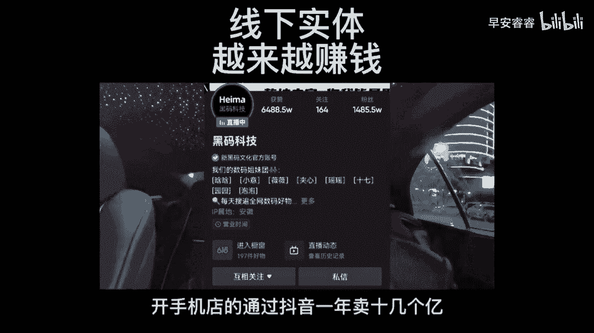

# 045 服装行业流量爆发营，从0-1抖音快速起号解决实体流量问题！ - P49：49 - 49.服装人的口播应该怎么拍二 .mp4- - 早安睿睿 - BV1Kf421R7NA

服装人做口播啊，有一个非常需要去刻意练习的核心能力，就是我们的镜头表达力，那镜头表达力呢核心又分为两个部分，一个呢是你的语言表达力，一个呢是你的肢体和动作的表达力，其实在口播这个事情上。

最好最高级的表达就是没有表演成分的表达，就是如果我们一个人能够面对着镜头，把自己最正常的一面，最自然的一面，就像是线下，我跟你面对面的聊天，你跟你的朋友，你的闺蜜非常放松的去说事情。

那么这个时候你在镜头面前，就很容易能够达成一个自然的状态，但是大部分人在他没有经历过比较长时间的，专业的训练的话，都是很难达到这个程度的，那我给大家一些小技巧，首先第一个呢就是发挥你的想象力。

就是当你去面对镜头的时候，你要去想某一个人的脸，最好呢这个人他是你某一个特别信任的好朋友，就是在你的生活中，你去想一下谁是你最愿意去跟他倾诉的那个人，谁是你跟他说话最自然的那个人。

你可以把他想象成为在镜头面前，你不要把这个相机也好，手机也好，当成是一个机器，你也不要想着说哦，我好紧张，我要怎么去摆，就你不要去思考这些，你想的就是我最喜欢的那个人，我最愿意倾诉的那个人。

他就在我的眼前，我就想象着这个镜头呢就是他的脸，我是对着他在讲话的，等你慢慢的去找到那种，你在现实生活中去讲话的状态的时候，这个时候呢你就能够去进入到一个，非常好的表达的方式里面。

那第二个呢就是在口播里面，最好大家要增加一些肢体语言，比如说点头啊，比如说向下看一下呀，手动一动呀，然后比如说当你去说一些事情有总结性的时候，第一点，第二点，第三点加上一些肢体的一个手部动作。

那么在接下来呢我即将给大家两个案例视频，这两个案例视频呢，两位博主可以说是在这个口播的风格里面，非常顶级的表达力了，那么第一位呢叫做沈一之，来我们来看一下沈灵芝的这个视频，我特别喜欢傅首尔说的一句话。

他说如果有一天你不喜欢我了，那就真诚点的告诉我，我一定支持你追求幸福，但是很可惜，现在的人太把自己当回事了，谈恋爱谈不明白，分手也整不明白，非要搞什么冷暴力让你自觉退场，请问你是觉得我会纠缠你吗。

还是让我自己退场，显得你没有那么渣呢，不好意思啊，大可不必把自己想的那么难以忘怀，我没你想的那么不堪一击，直接告诉我，你不喜欢我了，比你不回的信息，不接的电话，冷漠的态度，烂掉的借口，善良与百分亲。

亲，赞我心好的，我们来看哦，沈一之，其实他的这个口播啊是有脚本的，但是他可以做的非常非常的自然，你就会觉得他的那种停顿对吧，然后歪头，然后左右看一下，或者用手撩一撩头发这一类的动作。

就好像你真的正常在跟一个朋友聊天，你自己会去有的一些小动作，所以我建议如果是女性的话，大家想要去做好口播的话，可以多看沈一之的他的一些动作，他的一些停顿点，他的一些小情绪。

沈一之这个情绪其实是非常受到大众喜欢的，他讲话里面有一个很平和的感觉，所以他能够很快的去共情到你啊，沈一只是属于我觉得在女性口播里面，应该属于比较天花板级别的表现力了，那么我们再来给大家看第二种口播。

这个是非常带情绪点，而且情绪的张力非常强的，来我们看一下大蓝的一个口播呈现，想赚钱一定要做实业，线下实体真的太赚钱了，传统生意的钱是越来越好赚，原来一个月赚10万的，现在轻松月入百万。

我身边这些做实体的朋友，不管是开实体店还是开工厂的，这几年真的赚翻了，想知道具体怎么做的，先点赞再看，看完以后如果觉得没收获，再骂我不值，很多抱怨实体店难做的，赚不到钱，真的是因为你们不会做生意。

不管你是做什么企业，不管你是卖产品，卖服务还是卖技术，不管你是卖给个人还是卖给企业，最重要的就是一个字卖，想赚钱就得卖，想大卖就得宣传，你们是通过什么渠道宣传的呢，发传单吗，发朋友圈吗，你不亏钱。

谁亏钱，你每天除了工作就是刷抖音，你身边的朋友每天都在刷抖音，你为什么不来抖音宣传，谁告诉你，线下实体只能通过传统渠道宣传的，乞丐都知道要找个人多的地方去要饭，现在的人都在抖音上呢，来抖音宣传啊。

很多创业者以为需要有才艺才能做抖音，真的大错特错，有才艺只能做个网红，10万粉丝的小网红，如果打打pk卖卖货，一个月赚的钱很难超过10万，但是如果你有自己的产业，通过抖音来宣传，10万粉丝月入百万。

轻轻松松，不需要任何才艺，有才艺的是个戏子，你的才艺就是赚钱，现实生活中最赚钱的不是电影明星，而是企业家，同意吗，同样的道理，在网络上最赚钱的也不是网红，而是生意人，开米线店的。

通过抖音一年开了500家店，开理发店的，通过抖音月入几百万，做煤炭的，通过抖音成为行业大姐，大，开手机店的通过抖音一年卖十几个亿。

做线下实体真的太赚钱了，比网红赚钱太多了，如果你的行业需要宣传，有什么理由不做抖音，做抖音对一个上班族来说非常难，因为需要动脑子，但是对于一个创业者来说，极其容易，比创业容易100倍。

但凡有能力在线下实体上赚到钱的人，如果愿意全力死磕的话，不可能失败，做起来以后收入至少翻十倍，具体怎么做，给我点上关注，晚上九点来我直播间，我教你好的，你有没有发现。

大蓝的这个呈现跟沈易之完全完全不一样，但是他们都同样有一个特点，就是他非常的能够抓人，他的那个张力非常的足够，那其实大蓝这种呢是带表演性质的口播，那沈医师那种呢，其实是属于比较自然派的一个口播。

那我觉得对于服装的实体店主，如果说你想做口播的话，你可以自己考虑一下，如果你天生就是那种表演型人格，戏精型人格，你也可以在镜头面前有很夸张的声音，而且让人觉得很自然，那么你也可以考虑用第二种。

就是他更多的带一些表演性质，但如果你觉得你自己不是很有这种，很张力的性格的话，我还是建议大家可以更多的去寻找，那种自然而然的感觉，就像我说的，你去把镜头想象成为一个你觉得最亲近的朋友。

你现在就要当感觉是跟他在说话，然后去看沈一之啊，他的整个拍摄的机位也好，场景啊，字幕啊，这些都是非常值得我们去学习的，OK那这个就是我们说口播的核心的一个，需要训练的能力。

