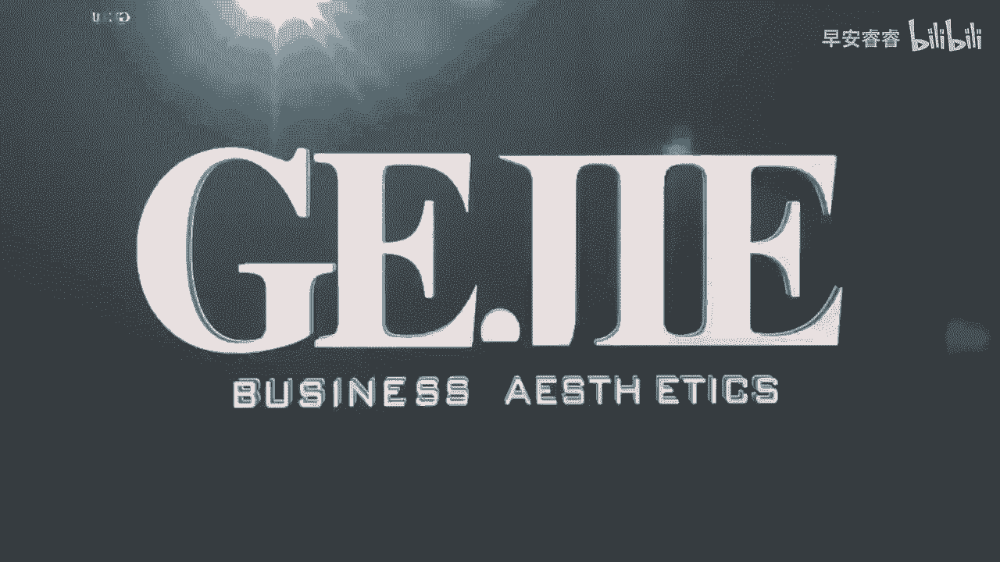

# 045 服装行业流量爆发营，从0-1抖音快速起号解决实体流量问题！ - P50：50 - 50 .mp4- - 早安睿睿 - BV1Kf421R7NA

服装人做口播的第三节课，是要找到一个非常强的心法，这个心法就是舒适度，呃其实做口播的话，它是非常需要你在一种很放松的情况下，去做输出的，那么每一个人，他放松的这种状态可能会不太一样。

那会有一些人他有一个固定的思维，说是不是我口播一定要这样子做着，然后坐的特别的直，整个人特别的挺，其实不一定啊，嗯在现在来说，大部分的光作者没有任何其他的差异化的口播，其实都很难出来。

因为现在其实已经是一个口播的红海时代了，所以如果你想去做口播，我建议大家去找一些，让自己非常舒适的一些方法，比如说啊，有一些人他可能不喜欢这样正正的坐着，他可能会靠着，甚至他有可能把腿抬上来。

就比如说像这样子，哎我用一个呃手这样抓着我的腿，我去跟你聊，如果说你能够在这个状态下达到一个，你觉得很放松，很很舒适，很自然没有关系的，那之前的话，我在我们线下就是教我们的IP课的同学去实操。

去录视频的时候呃，有一位同学他就是有一天晚上，他是在那个酒店里面，然后他是这样趴着来聊的，就很像什么，很像是两个闺蜜，就我俩可能都躺在床上，我俩在聊天的那种感觉，就是我这边有一个枕头，我待着他在聊天。

那个时候，我就会发现，他的整个语言的表达力非常非常的自然，比我们叫他坐着，然后给他架一个相机或架一个手机在那边录，要自然非常的多，所以大家去做口播的时候，一定不要非常的拧巴，也不要很刻意的去强求呃。

很像一个你在那种电视里面看到的，一个主播一样，感觉做的一本正经的，如果这个时候你是不舒服的话，其实你说话的话，别人是听不进去的，所以你坐着舒服，你就坐着站着舒服，你就站着躺着舒服，你就躺着。

那有些人他可能是一边走一边拍，他舒服，那也没关系，你就可以一边走一边拍，所以在做口播的第三个点，就是，大家一定要找到一种，能够让出境人非常舒服的方式，而不需要说我刻意的去强制性的去模仿出来。

因为如果让你变扭的话，那你其实是没有办法表达出，你真正想表达的东西，你会很在意这个镜头，你会很在意你的背有没有挺直，你会很在意你的姿势好，所以我们在内容的一个迭代上，其实并没有说口播一定是要这样做着。

一本正经的拍，而是说你可以去通过让你舒服的方式来拍，最后我再提醒大家一个点，如果说大家要做口播的话，尤其是你希望你的这个账号的变现能力，是高于影响力和流量力的话，我建议大家可以在自己的店铺里面去做口播。

因为当你在店铺里做口播的时候，比如说我后面他就是一个服装店的背景嘛，然后我来聊啊，女性的时尚啊，成长啊，穿搭呀，感情啊，那么她是可以跟我们的一个变现场景，直接关联起来的。

但如果你说我希望把我的维度做得更高，把我的人设做得更高，那你可能就可以去在服装店外面，找一个比较好的一个场景，布了一个比较好的场景，再去做口播，关于场景的选择上啊，第一优先考虑变现的话。

就选择在店铺里面录啊，如果说优先考虑你的IP，你的人设的话，我们可以去专门搭景或者找景去录好的，以上呢就是我们对于服装人做口播。

