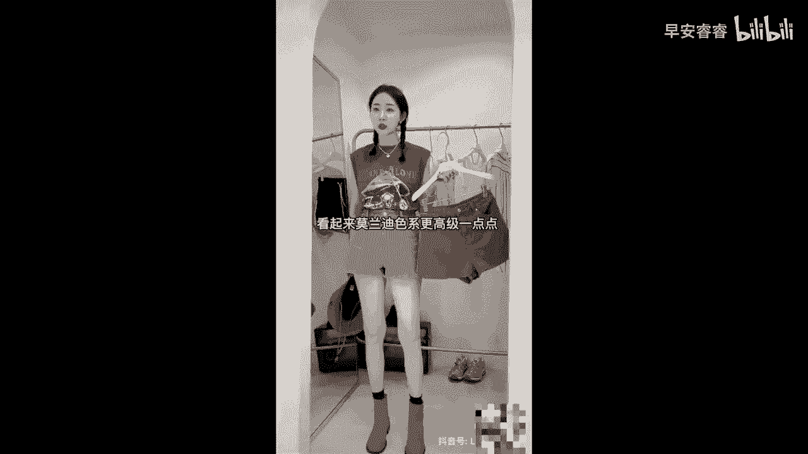

# 045 服装行业流量爆发营，从0-1抖音快速起号解决实体流量问题！ - P51：51 - 51 .mp4- - 早安睿睿 - BV1Kf421R7NA

短视频带货呢已经变成了抖音上，非常主流的一个变现方式，那如果说你也有一定的这种产品，是具有大的一个发货体量的，也是有一些好的价格优势的，我建议大家呢也是可以去尝试一下，做短视频带货的。

那短视频带货呢我给大家来看两个案例，这两个案例呢，我认为就是非常典型的，短视频带货的一个录制模型了，看完以后呢，我们再来一步步去拆解，怎么样也能够去露出一条比较好的短视频。

怎么样也能够去露出一条比较好的，可以去带货的短视频，98米，这是我们家的，我真的好想你们每个人都去买一条这个裤子，又凉爽又百搭又好看，你们看下垂感，这是免烫的，又不打皱的，这边是松紧腰的，这里面又俏皮。

很有活力的，好的，这是我们看到的第一条带货视频，来，我们再来看一下第二条，这裤子我是极力推荐，我称它为短板的粉裤，会比你穿别的短裤会来的舒服，会来的浅色更有质感，往外延伸的就是我们大腿的腿型。

白色黑色和浅蓝色是我们的主色调，这两个小众颜色，看起来木兰迪色系更高级一点点。

OK来看完这两条短视频以后，你有没有发现我们其实有非常多的服装实体人，都可以去做这个类型的带货，对不对，好，那我接下来就给大家拆解一下，如果你也想去录一条带货视频的话，我们要怎么去做，首先第一步啊。

选品一定要够好，选品首先一定是大众化款式，你不能搞一个那种非常具有个性化的，这边露一个肩呐，那边抠一个洞啊啊然后景深呢对吧，挑身材，挑人，挑风格，挑肤色，那你这种肯定是没有办法去做短视频带货的。

短视频带货的品一定是要不挑人，一定是要够大众化，基础款优先，基础色优先好，第二个的话就是，我们一定要去使用真人出镜的方式，因为短视频带货，其实核心就是看这个人能不能够，去说服对面看到的这个观众。

让他对你身上所展示出来的这个产品产生心动，且要下单去购买，对不对，所以的话真人出镜做短视频带货，基本是跑不掉的好，所以大家一定本身在出镜的这个人身上，你就要去选择一些亲和力比较强的。

然后说话不会让别人反感的，给人感觉比较真诚的，然后他自身穿衣服非常能够撑得起来，搭配各方面很好看的好，那么第三个维度呢，我们就要去提炼这个产品的差异化卖点，比如说你们看在这两条裤子里面。

他都去提炼出了不同的裤子的卖点，第一条是黑色的裤子对吗，那它提炼出来的是免烫，对不对啊，不会皱，很清凉，有垂感，对不对，所以你看他能够在他的这个产品上去抓取一些，有差异化的一个卖点。

当我们要针对一个品去做带货视频的时候，你就要先去思考一下这个衣服，这个裙子，这个裤子的话，相对于其他的这种同品类的，它有什么核心差异化的一个卖点，当你把这个核心差异化的卖点，给提炼出来的时候。

才能快速的去打动，去看这个短视频的这些受众好，那么第三个的话一定一定要去注意你的价格，价格是短视频带货里面，没有办法去跨过的一个点，你看像她那个第一条裤子，他就直接说出来哇，这条98块钱的裤子。

我真的希望你们每一个人都有一条，一般来说短视频带货选的品，性价比一定要非常的高，如果你说你这个裤子卖298，你大概率是没有办法，通过短很短的一个简单的短视频，就能够把它带货出去的短视频。

它的属性就是什么，必须要别人不假思索就想买的东西，才能通过短视频的方式来进行带货，如果说你本身是一个非常需要去说服别人，别人才会去买的东西，那这种品更适合放在直播间里好，那么最后一个呢就是时长的问题呃。

我们去做短视频带货啊，我发现啊，最好的一个时长，大概是在15秒到25秒之间，如果说你的视频太短，比如说只有六秒八秒，别人甚至还来不及去看他对吧，但如果说你的视频太长，超过了一分钟。

那么他对你的耐心已经不够了啊，除非你的人设非常的强啊，而且他还得是你的粉丝才行好，所以在时长上大家要去把控一下，比如说刚才我们看到的两个短视频，都是空在20秒以内的，我是觉得可以比刚才我们看到的那个。

稍微再长一点点好，但是呢呃比我们要去想象中的，拿它个2分钟去讲一个产品，你要知道客户是远远没有这个耐心的，嗯如果你把短视频配合上直播的话，应该效果会，如果你把短视频带货配合上直播间的话。

你的效果可能会更好好了，如果你有适合的品的话，尝试着去录一下这条。