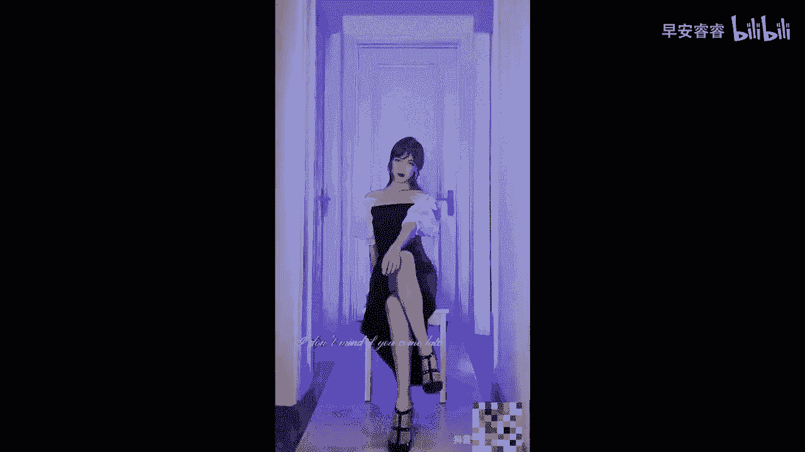

# 045 服装行业流量爆发营，从0-1抖音快速起号解决实体流量问题！ - P53：53 - 53课 .mp4- - 早安睿睿 - BV1Kf421R7NA

服装人拍视频的第二个核心流量密码，我相信你可能也用过，如果没有用过的话，你一定要用上一次，这个密码呢就是反转变装，因为其实服装嘛核心呈现的就是一个人，穿它之前和穿它之后的一个对比，对不对。

所以的话反转呐，它本身就是一个自带流量密码的剪辑设计，我们一定要充分的把它运用在，我们的服装的类目上，这对于服装人来说是再合适不过了，那反转变装其实我相信有很多人都做过，但是我给大家两个案例啊。

来看一下怎么样能够去把反转变装做得更好，来我们先进案例。

好的这是我们看到的第一个案例，是一个女孩本来穿着一个睡衣对吧，然后哇，一下子特别换到一个青春活力的一个，场景里面啊，换穿了一身非常感觉很时尚的衣服对吗，来我们再来看一下第二个视频，什么是御姐风。

第二个视频，我们看到的是一个本来扎马尾的女孩，她的主题是什么叫做御姐风，然后哇一下子就变装，变到了一个非常有女人味的御姐对吧，那么再去拍这种烦转的变装里面呢，可以有几个比较好的点让大家去见见啊。

你既然要去突出反转的话，那么一个就是最好咱们的场景是一样的，就像后面我们看到的这个小姐姐一样对吧，她是坐在本来就是坐在这个凳子上的，但她之前穿的是一身感觉青春活力，少女型的衣服，但是她啪一转了之后。

就变成了那种非常成熟的有魅力女人的御姐风，但是她视频的那个场景啊，还是之前少女风一模一样的那个场景，这就会给我们快速的在同一个场景之下，看到了两个完全不同的人，形成强烈的一个反差感。

好这个是我们去做变装一个非常好用的，就是用同场景来做不同穿搭的呈现，那么第二个呢，就是去用同动作或者是连贯性的动作，去做不同变装的一个差异，比如说像我们看到刚才第一个视频，他是这样先挥手，对不对。

挥到一半的时候，他还是睡衣，但是把手接下来挥的时候，那一瞬间他已经换成另外一个衣服了，那也我之前也看到有易梦玲的一个变装，让我印象也非常的深刻啊，他是走走走走到一个窗前，然后转过身去，就背着转过身去。

然后等他再转拐，然后等他再转过来的时候，他已经再换了一身衣服了，就是这种连贯性的一个动作啊，用同样的一个动作，或者用延续性的一个动作，去呈现两套不同的衣服，OK那么这个呢也是我们服装人非常好用的。

