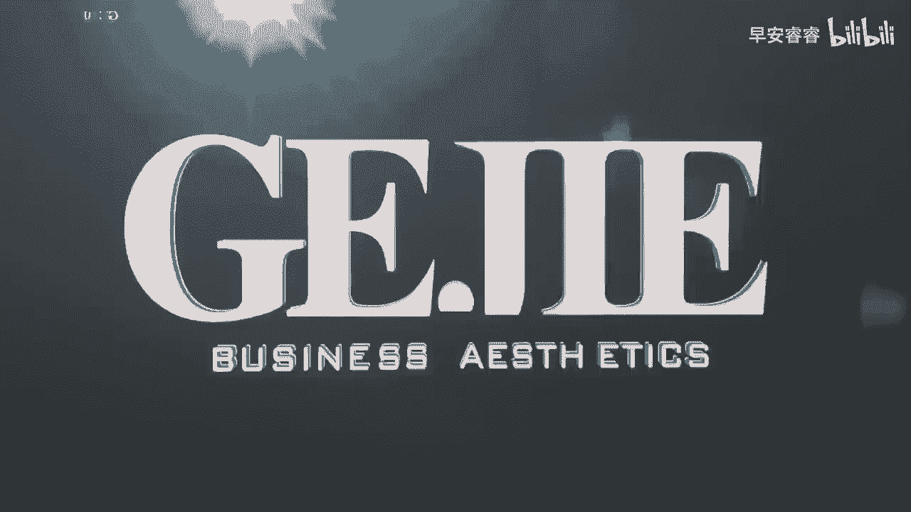
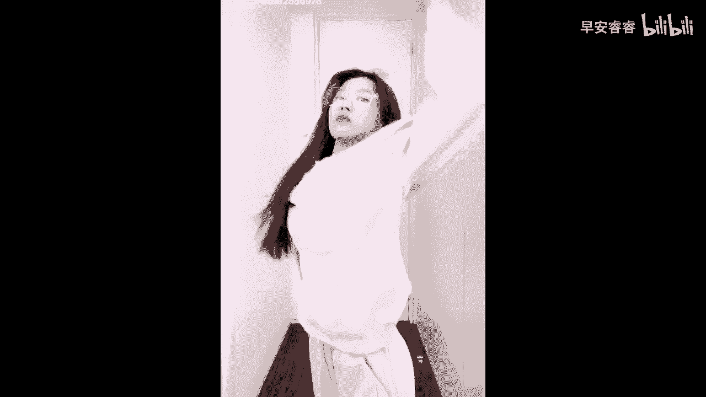
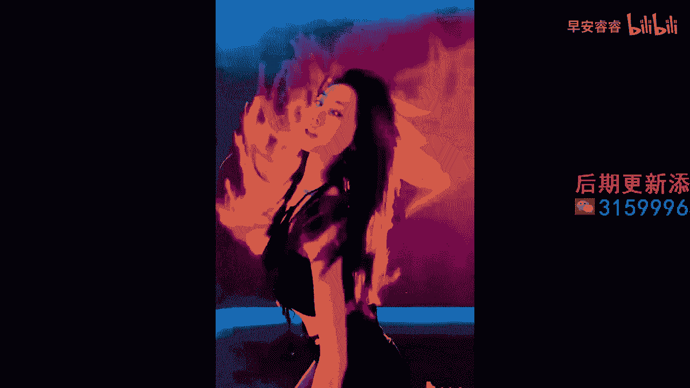

# 045 服装行业流量爆发营，从0-1抖音快速起号解决实体流量问题！ - P54：54 - 54.服装人短视频破播放量模板三 .mp4- - 早安睿睿 - BV1Kf421R7NA

服装人破播放高流量的，第三个可以照抄的模板就是卡点诶，你看啊，其实在抖音上面，节奏啊是一个非常有流量的东西，你会发现之前有一类非常火的叫沉浸式的那种，什么沉浸式美食啊，沉浸式化妆呀，沉浸式穿搭呀对吧。

其实他做的都是一个关于节奏上的东西，那么在我们的抖音里面有一个最好用的东西，而且一直持续不断会有新的流量出来的，就是那些卡点的BGM，你就会发现在抖音上，每隔一段时间就会热门一手卡点的BGM。

如果说你能够把这些卡点的BGM，跟你的服装风格的呈现，准确的给连接上每一个卡点，其实你都可以去做一个穿搭的展示，对吧啊，他的每一个节奏，你都可以去做一个完整的穿搭展示，那么在你一个短短的。

比如说15秒的一个卡点视频里面，你很有可能就呈现出了三道四套，这种非常好看的一个穿搭，进而在一个短的时间里面，用快的节奏，通过这种高密度的画面来表达，你想要去表达的这个快速的流量抓取力，而且这种视频。

它的完播率一定是非常非常高的好，那么接下来我们来看一个，通过一手BGM，就拿到了250万的一个女装账号，我相信这个账号你肯定还有刷到过来，我们看一下这条素材。

Once was a ship that put to sea，And the name of the ship was the billy ote the winds，Blew。

Harder bowed it down below，My bully boys blow。

Oh so may the wammen come to bring us，Sugar and tea and rum，好的，这个小姐姐一定刷到过，对不对，因为她的流量真的是太恐怖了，你就会发现。

其实他没有去做太多的一个故事的设计啊，剧情的设计啊，也没有太多的运营思路，它就是非常单纯的卡在了人类视觉，听觉的那个融合度上，你看在他那个音乐里面，在他那个听觉里面，你不自觉的就很容易被这个节奏给抓住。

所以你一定会听下去，你听下去会觉得非常的容易，那我们也可以去多找这种听上去非常容易的，比较短的这种BGM来去做一个卡点，然后你就会发现，它同步还利用了一个视觉的优势，它的一个视觉背景。

由于我们已经很久没有出去，在这种非常广阔的山河里面去旅行了对吧，所以我们会发现当她在一个大自然的环境里面，再配上一个非常呃气质非常相符的小姐姐，去做那一身的一个穿搭，再配上一个非常好听的有节奏感的音乐。

你不自然的就会被他的这条视频给他抓取住好，那么当然还有一些卡点的话，它会带一点这种表演的节奏，我们来看一下下一条视频，这条视频的话，他的卡点可能是比上一条视频的这种节奏感，要再进阶一下BB。

I got bros in the lana。

She took the lean，The f pretty coin scout，我们看到了第二条视频，他的这个卡点前端它其实是有一个表演成分的，对吧，是一个穿睡衣的小姐姐，拿着一把枪。

在跟那个哒哒哒哒那个枪的那个声音，进而突然一下子就转变成了一个非常酷，非常飒的一个女孩子的穿搭，对不对好，所以这种的话她可能是在表演的可观性上面，比上一种要更加的丰富一点，就他前面会通过一些肢体的动作。

来配合一个卡点，那么上一个的话，其实他没有太多的肢体上的一个配合，就是单纯的跟着那个音乐节奏去做展示好，这两种方式呢，都是非常值得我们服装人去学习的，卡点的方式，也是我说的第三种。

