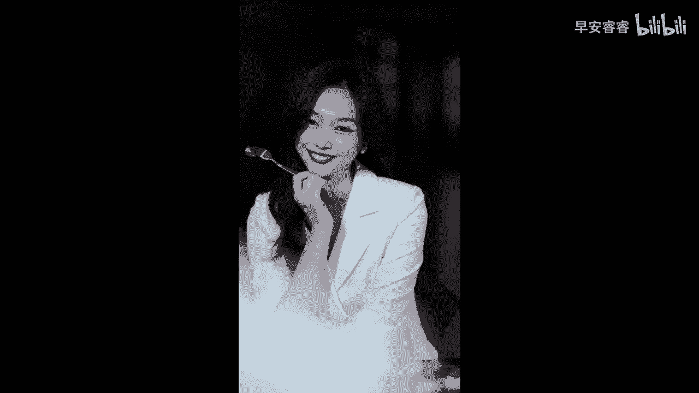

# 045 服装行业流量爆发营，从0-1抖音快速起号解决实体流量问题！ - P55：55 - 55.服装人短视频破播放量模板四 .mp4- - 早安睿睿 - BV1Kf421R7NA

第四个非常有杀伤力的服装人，可以去抓住的流量密码就是鸡汤型呈现，其实女性呢天然是一个比较感性的动物啊，之前我在跟我的学员沟通的时候，我非常不建议大家去拍那种剧情号，尤其是搞笑号啊，搞笑女，我跟你说。

天然第一个跟爱情没关系，她跟赚钱也没有什么太大关系，所以的话我不建议大家去拍剧情好，但是我却挺建议大家去拍一些，跟情绪类相关的呈现，那么鸡汤文案，其实就是跟情绪非常好挂钩的一个模型。

可能现在我这样跟大家说，大家不是很懂，到底我说的这个内容模板长什么样子，那么我来给大家看一个非常厉害的女装账号，他就是很快的，很精准的能够去抓到女性的那种情绪，而且他不是在用一种让人感到反感的。

讲道理的模式，它的形式不是通过口播，而是进行对话的，那这种对话呢潜移默化的他告诉给你一个道理，但是核心他最想呈现的依旧是他服装，依旧是她的衣服，这是一种非常好的方法，来我们共同去学习一下。

把我们的素材先让给大家看一看，你说那些忽冷忽热，喜欢打太极的男人到底是怎么想的，如果一个30多岁的男人还让你猜他爱不爱你，那一定是不爱唉，一整天什么事都做不了，整个脑子都在手机上。

每一条信息都误以为是他，你们的关系已经脆弱到关了手机，断了网就会失联，是啊，再这样下去，要把自己弄得人不像人鬼不像鬼，好的感情是遇见你，我更喜欢自己，而不是质疑自己，可是每次他带着热情出现。

我又充满了力量，想让他重新开始，你应该从喜欢里获得力量和快乐，而不是花光力气和快乐去喜欢，可是我在他心中真的不重要吗，没有那么多，可是你若不是可有可无，他又怎么会忽冷忽热，我们看到了这个素材以后。

我相信大家就懂得我在讲什么了，对不对，她有两个女生，然后就某一个话题进行探讨，诶他们去聊，如果一个男人对你忽冷忽热，那她是什么意思呢，那另外一个女生就说，那她其实就是不爱你呀。

实际上你看他们就是在用一些京剧型的，这种鸡汤，快速简洁的给你传达一些价值观和观点，进而他去展示他身上非常笔挺的衣服，你就会发现这两个人，其实他们身上穿的衣服的风格是非常相近的，他是从造型，从她的头发。

从她的配饰，从他的每一个动作，甚至他站的那个姿势你会发现都是特别直的，他其实核心还是去呈现衣服，所以这样子的视频呢，他就是一个可以去带货的视频，但如果说我们把所有的注意力都放在了，他的讲话上。

放在了他的一个剧情上，那么其实你这个视频它就偏离了，他，就不能够去做到产品的一个展示，所以像这种类型的视频，我们第一个要去注重我们的文案能够抓人，能够有情绪，然后第二个的话。

我们要去注重说我们的整个服装的呈现，依旧是视频里面的一个重点好，那么同类型的我再给大家来看一个账号，我没有权利让你身边没有谁，但是我有权利让你身边没有我，既然你拒绝不了别人，那我就拒绝你。

好的看完第二个账号，大家就会发现哎，这两个账号其实他的底层逻辑是一样的，都是两个女性啊，而且两个女性的这种风格是不一样的，一个短头发的，一个长头发的，对不对，一个给人感觉更加的知性。

另外一个给人感觉更加的温柔，但是你会发现，基本上他们两个在对话的时候，大部分要么穿的是同款，要么他穿的就是相似的，同样风格的款式，其实都是为了去呈现服装，它只是在呈现服装的过程当中。

去用一些能够抓人的京剧把你给留下来，那么如果我们要去拍这种类型的话，一定要去拍到简洁，然后它会对你的整个画面的质感，要求可能会更高一点，如果要拍这个类型的话，我建议大家最好还是用相机来拍。

他如果有一个高清的一个呈现的话，整个服装的质感才能够出来好，这是我们给到大家的第四个流量密码。