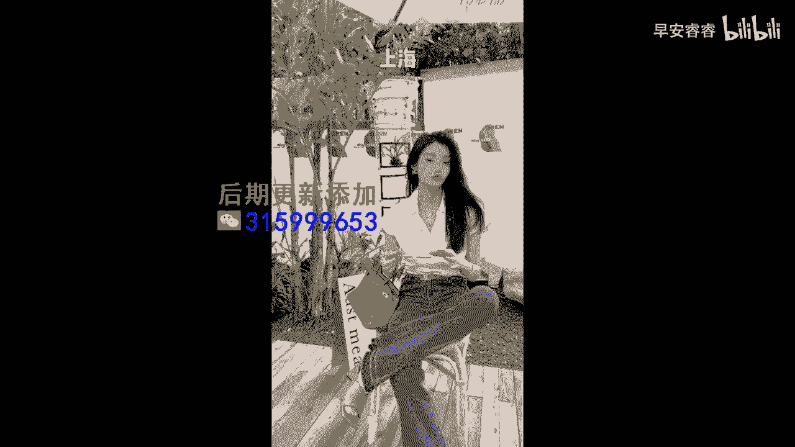

# 045 服装行业流量爆发营，从0-1抖音快速起号解决实体流量问题！ - P56：56 - 56.服装人短视频破播放量模板五.1 .mp4- - 早安睿睿 - BV1Kf421R7NA

服装人去录短视频的第五个流量密码，就是去做那种高密度的主题的合集，举一个例子啊，比如说30岁的妈妈去接小孩的时候这么穿，去跟老公约会的时候，这么穿，去见闺蜜的时候这么穿怎么样怎么样怎么样。

就是我们可以去设定一个主题，然后在这个主题之下去设定不同的场景也好，跟不同的人也好，或者说不同的心情也好，把它通过一个主题下面不同的呈现集合起来，高密度的给大家去展示多种的一个穿搭模式好。

那么针对于这种模型呢，我们给大家来看一个非常典型的案例来看素材，12星座未来开什么车，♪ 我不能收起的焦虑都撒在你面前 ♪，♪ 我神魂颠倒 ♪，♪ 躁动的心在放鞭炮 ♪，♪ 我的丘比特在尖叫 ♪。

♪ 荷尔蒙的爆发 ♪，♪ 因为你的到来 ♪，神魂是什么星座，OK好的，那你看到了刚刚我们看到的这个案例呢，他是博主把一个12星座的主题设定下来，然后呢他用12星座结合12星座要开什么车。

进而在这车里面穿什么衣服，对不对，比如说他说哎水瓶座开的是法拉利，然后的话女孩子在法拉利里面，她应该要穿成什么样子，那处女座开的是什么车，在什么车里面，她又要穿成什么样子，那你想一下，在他这个主题之下。

他至少就有12种穿搭，但是你会发现他的整个视频的时长是很短的，它的切换是非常快速的，这就会导致我们的完播率，第一个很容易完成下来对吧，第二个很能够抓人心，你想一下，如果你是一个狮子座的。

你是不是要去等一下看一看狮子座的女孩，她又是怎么穿的对吧，所以这种主题设定比较讨巧的一种方式，就是我们更多的去涵盖到，我们客户真正去关心的一些点好，那么我们再来给大家看一下第二个素材。

夏天去各个地方旅游怎么穿，放假咯，♪ 我想去长沙 ♪，♪ 武汉重庆北京玩几天 ♪，♪ 就算没钱 ♪，♪ 也想浪到洱海边 ♪，♪ 丽江新疆长江是我的天地 ♪，香港迪士尼好的。

第二个素材，我们看到的是，他是利用说放假了以后，去到不同的城市要穿成什么样子，比如说他有去长沙的样子对吗，去杭州的样子，去成都的样子等等，你就会发现，其实他是去把国内一些比较热门的旅行城市。

给它集合起来，尤其是如果这个视频他放在一些暑假期间出，他就正好能够跟那些要去出行的人怎么样啊，紧密的穿搭起来，那这个博主呢他叫做龙喜儿，大家可以去关注一下他，基本上他的所有的视频都是主题集合型的视频。

你们可以去看一下它的主题集合，如果有匹配到你的一个客户特征的话，你完全就可以照抄他这个主题，然后去呈现你自己的店铺里面，不同的穿搭就可以了，配上好的音乐，好的卡点好的场景，然后节奏非常紧密的去做呈现。

这个就是我们给大家介绍的服装人。