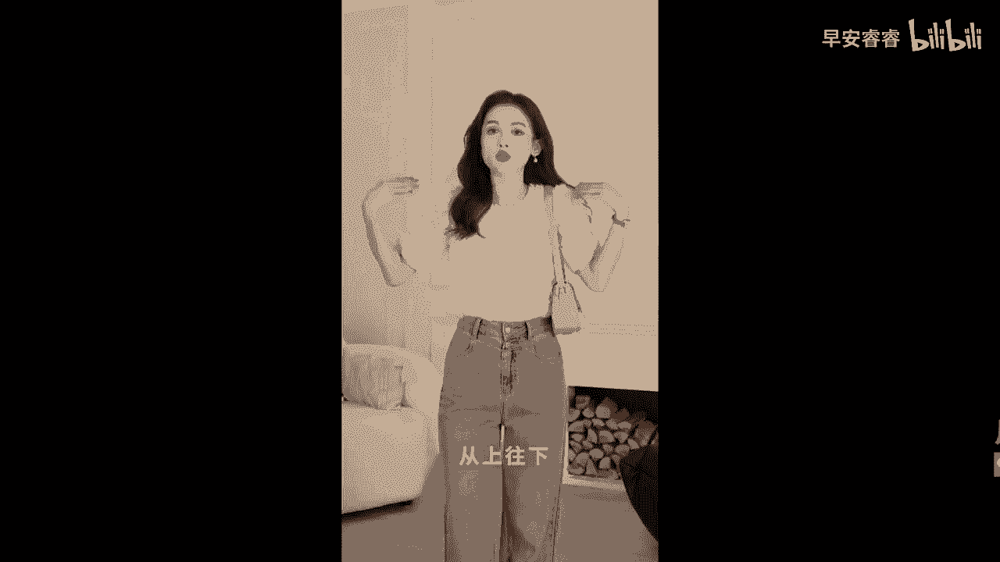

# 045 服装行业流量爆发营，从0-1抖音快速起号解决实体流量问题！ - P57：57 - 57.服装人短视频破播放量模板六 .mp4- - 早安睿睿 - BV1Kf421R7NA

这节课呢给大家服装人的第六个流量密码，那就是利他解决问题，你去试想一下嘛，我为什么要去关注一个穿搭博主呢，我为什么要去关注一个服装店主呢，只有一个理由，就是他能够给我带来一些穿搭上的帮助，对不对。

那么一系列的这种教程型的视频，我们是完全可以去做的好的，那么再去做教程类的视频，我其实看到有非常多的服装人都去做过，但是大家做出来的那个教程呢，哦根本就看不下去，太长太长了，而且极其的啰嗦。

所以的话呢今天我来给大家两个模板，第一个呢是非常简洁的，它基本上不用说话，他只是去通过画面和文字的呈现，就能够去把方法讲得非常的清楚，来我们来看一下这个案例，Hers are coming。

And the walking frain，好的，你看哦，这个案例只有短短的12秒，但是呢他却做出了四个穿搭的示范，而且的话他从头到尾没有说一句话，并且呢他在做每一个示范的时候，他都把错误和正确。

放在同一个屏幕里面去做对比，我个人觉得他这个视频的思路是非常好的，但他对比的那个时间啊，我觉得稍微再短了一点点，如果说它每一个对比的时间，可以再延长个一秒钟，让我们能够看得更加的清晰一点。

这个视频其实会更棒，但是各位你就要去思考，这种非常简洁，非常清晰，不要去让别人在你听你那边啰里吧嗦，唧唧歪歪的去讲话的这种模式，不要让别人去那边听你唠唠叨叨，啰啰嗦嗦的模式，因为有很多的服装人。

他可能不太习惯跟镜头去表达，所以他一直很想要拼命的解释清楚，当你拼命去解释清楚的时候，客户早就没有那个耐心给你给划走了，所以如果你不是那么擅长去做语言，表达型的视频，你就可以去做刚刚我说的这种这种视频。

其实它就是非常快速的，能够去通过一个简洁的视频的画面，就直接呈现出来，不用你多说，但实际上它也同样达到了一个教程的结果，好的，那么第二种示范呢是有口播的，是有一个人在说的。

但大家可以去看一下他是怎么样去做到，让我们给他留下来的，你穿衣服显壮，你有没有想过是为什么呀，通常女生身高在150~165之间，肩宽应该是33~38，如果超过这个范围，就属于肩膀比较宽的了啊。

那怎么就宽呢，哎别急，你看批发是不是比扎发更适合肩宽，显得比例都更协调，像这样的泡泡袖和落肩的袖子都会比较明显，肩穿方领和正肩的T恤可以弱化肩宽，显得比例更加没有对比，是不是还不知道，如果是窄肩的姐妹。

可以反向选择下半身，可以尽可能避免一些裹住脚踝的紧绷错，就让我显得你整个人头重脚轻，这个我会三个锤子，纯棉裤，我们可以选择阔腿裤或者是黑马的感觉，增加下半身的存在感，在视觉上达到一个肩胯同宽。

别人自然不会注意到你的肩宽问题，再换一双袖身稍微大一点的鞋子，户外发现肩宽这个问题，从上往下微妙的被平衡掉了。

好的你看到这个视频开头的吧，首先第一个还记得我说的选题即是流量吗，你看他的这个选题其实做得非常好，他的选题就是如何穿衣服不显肩宽，他这个选题直接就抓住了，那一部分有肩宽困扰的人。

所以的话一个好的选题真的是非常重要的，那么他很直接的就说哎，是不是很多人穿衣服，肩膀宽带后就特别不好看啊，诶旁边，你看这个时候他找了一个人跟他来进行问答，然后那个人说那肩宽怎么办呀，别急嘛，我给你示范。

然后他的那个示范又是通过了刚才我们说的，左右两格拼在一起的这种剪辑模式，把正确和错误示范放在同一帧画面里面，也没有过多的一个语言上啰里啰嗦的解释，进而给到你快速的几个解决办法。

怎么样才能够穿衣服不显肩宽，所以如果说我们要去用作口播的话，在开头可以稍微的设计一些情节，设计一些问答，在这种方式上把人给他留下来，然后在我们展现的那个过程中，还是以简洁。

然后快速能够对比出它的一个结果，作为我们教程的一个拍摄的底层逻辑，这两个方式其实都是比较能够快速的达到，给别人解决问题，但不会过于啰嗦的一种方式好，那么利他型的教程就是我们服装人可以去做的。

