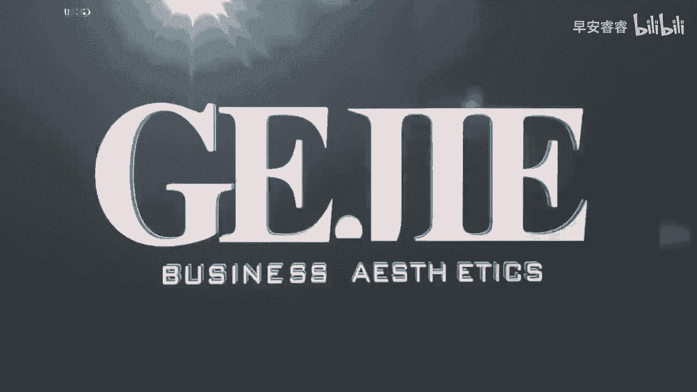
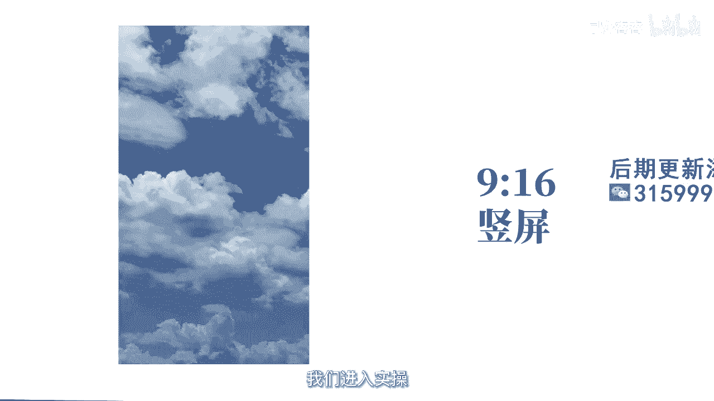
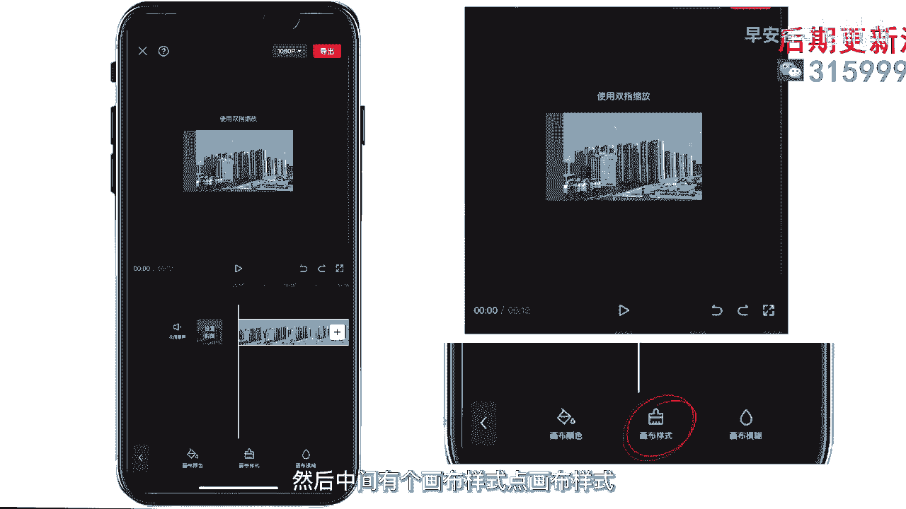
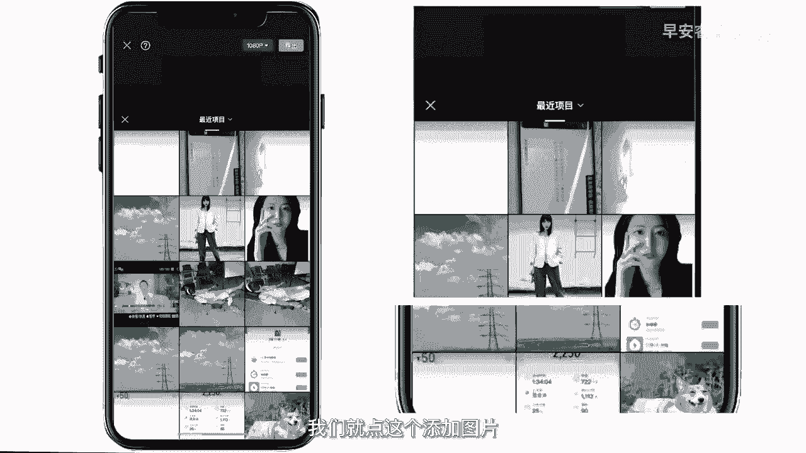
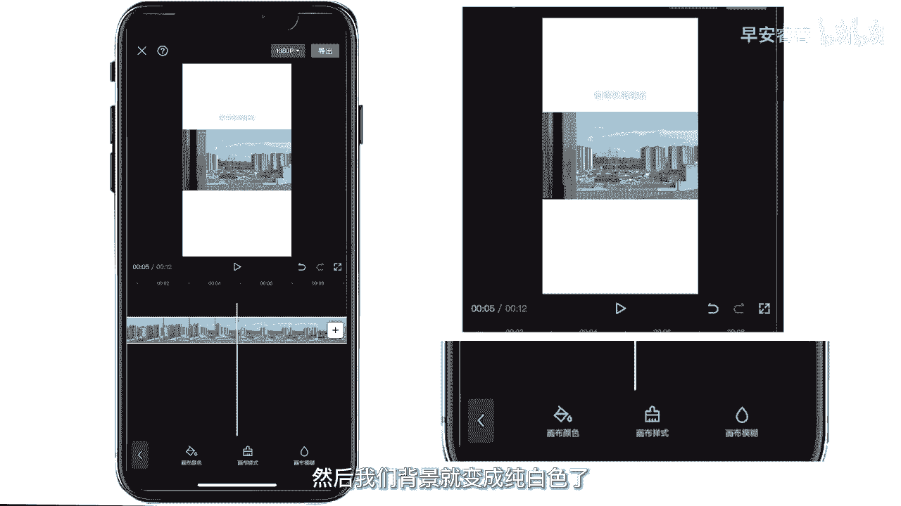

# 045 服装行业流量爆发营，从0-1抖音快速起号解决实体流量问题！ - P58：58 - 58视频比例 .mp4- - 早安睿睿 - BV1Kf421R7NA

好我们今天来讲一下短视频，能电拍摄视频的比例调整，首先我们先了解一下什么是视频比例，视频比例就是指画面的长和宽的比例，在短视频出现之前，我们看的基本都是四比三或者是16比九的，横屏的一些视频的比例。

就比如说我们在电视上或者是一些什么呃，视频平台上看到的一个比例，在抖音和快手出现之后，就有了竖屏，视频的普及，基本比例就是九比16，那怎么设置呢，我们进入实操。

我们要用到的app就是剪映，打开剪映点，开始创作，导入一段我们之前拍摄好的素材，添加你前期拍摄的素材是竖屏还是横屏，导入后的比例就是五格，拍摄的时候是相同的比例，导入之后呢。

我们把最下面的功能栏拉到最右边，点倒数第三个比例就可以选择，你需要上传平台的比例，抖音快手这种短视频就是九比16的竖屏，像西瓜头条就是16比九的横屏，淘宝就是三比四的竖屏，你如果想要去上传哪个平台。

你就用那个平台比较普及的一个比例，去做这个视频就可以了，如果你像我一样拍摄的视频是横屏呢，但想上传到抖音里怎么办呢，我来演示一下，还是一样，我们用这段素材，然后点九比16。

它自动就会把这个视频放在画面的中间，但是我们这样的视频上下就会感觉很空，对不对，今天就教大家三个方法，然后去避免这个问题，第一种呢就是添加一张图片，返回到我们的功能栏里面，拉到最右边。

倒数第二个有个背景点背景，然后中间有个画布样式，点画布样式。

然后这边有一个图片标志，我们就点这个添加图片。

然后选择一张之前拍摄好的图片，点确定是不是它的后面的背景，就变成了拍摄的这张图片呢，然后画布预设，这边呢，我们也能看到很多app自带的一些背景素材，你们也可以使用，也是蛮好看的。

然后我们第二种方法呢就是点这个画布模糊，然后这边有四个选项，从左至右越来越模糊，它就会自动把这个视频放大作为背景，我们来看一下效果，是不是感觉更协调了呢，这个视频OK还有种种方法也很简单。

你不想要任何一些复杂的背景，然后也不想要黑色，那我们就把这个画布的颜色更改一下，改成一个白色，然后我们背景就变成纯白色了。

是不是很简单。