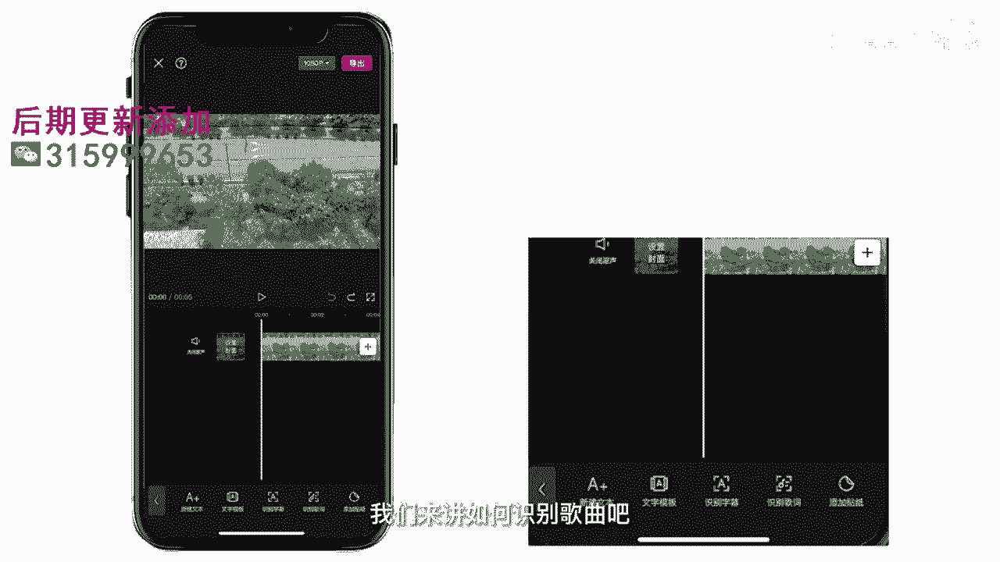
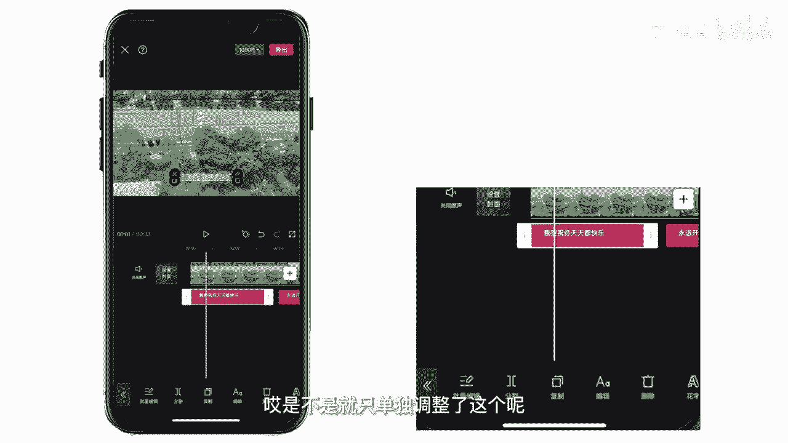

# 045 服装行业流量爆发营，从0-1抖音快速起号解决实体流量问题！ - P59：59 - 59视频字幕 .mp4- - 早安睿睿 - BV1Kf421R7NA

今天我来教大家如何添加人物字幕和效果，花字还是一样，我们使用的app还是剪映，这边我想跟大家说一下，一般我们识别字幕用到的素材，都是一些带有人声口播或者是中文背景音乐的，一些视频，可以用到识别字幕。

这个功能好，我们开始实操好，首先我们导入一段素材，点击文本文本里面有五个功能，新建文本文字模板，识别字幕，识别歌曲和添加贴纸，我们先讲第一个新建文本，点确定，我们可以点编辑，就可以对这个字幕进行设置。

点字体，我们就可以对这个字幕的字体做一些修改，这边就有很多app自带的字体都可以选择，根据你这个视频的风格去选择你的字体，然后去对应就可以了，看第二个样式，第一行就是app自带的文字样式模板。

大家可以直接点击，然后就可以直接用，他们这个是app自自动已经设置好的，第二行第一个就是文字的颜色，第二个是描边，就是文字的一个描边，然后背景就是给文字加一个小的背景，阴影就是给文字增加一些阴影。

不还有不同颜色的阴影，这边有一些对阴影的设置，也就可以看一下，然后排列就是对文字的一个排版，是看一下每个大小，粗斜体就是加粗和斜体，点花字可以将文字设置为综艺花字剪映，提供了很多花字的字样。

你可以看一下，OK文字模板，就是app自带的一个对文字的一个模板，大家点击一下很有综艺感，是不是好，最后一个动画对这个文字只让它动效，因为本身的文字是静态的，然后app自带的一个效果可以让它动起来。

然后更加的生动，对应我们的视频风格和里面的一些情节啊，比如说呃剧情类的视频的时候就特别能用上，然后或者是你想要表达某种情绪的时候，也可以用这个啊动画去表达，对不对，它还有一个文本朗诵的功能。

当然这个功能是需要联网的，这边有各种各样的一些音色的选择，然后点确定，然后它会自动生成一段音频，大家加油啊，接下来介绍识别字幕和识别歌词，从本质上来说都是一个可以识别语音，去转换字幕的一个功能啊。

我们来讲如何识别歌曲吧。

首先我们先导入一段音频，我要祝你天天。

然后导入音频之后呢，我们点文本，点识别歌词，点开始识别，等待一段时间，注意哦，这个功能也是需要联网才可以使用的，好它识别好了，看一下，我要祝你天天都快乐，嘿用开心，不是你。

然后这些字幕可以批量的更改它的位，置和文字样式，也可以单独的调整它的位置，然后我们点编辑，然后点花子，如果要批量更改他们的文字样式的话，点到这个应用到所有歌词，然后点点样式发光字好，让我们来看一下。

诶是不是应用到了每一个字母了，如果你只想单独的编辑的话，就把这个点掉，然后我们换一个字，诶是不是就只单独调整了这个呢。

