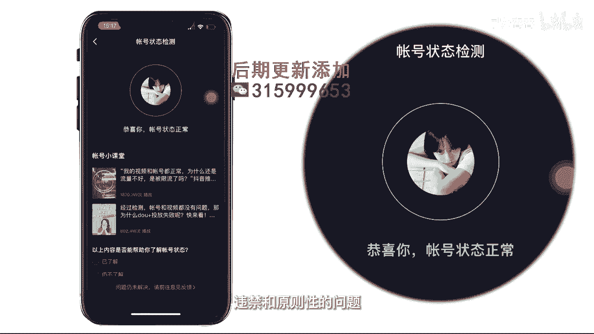

# 045 服装行业流量爆发营，从0-1抖音快速起号解决实体流量问题！ - P5：5 - 5、以前的账号还能用吗 .mp4- - 早安睿睿 - BV1Kf421R7NA

这堂课呢我们就来到了启浩，你第一个会想的那个问题，老师我以前那些乱七八糟的号，我到底还能不能用啊，我那些号老是播放量就在个两三百，到底是我号的问题呢，还是我内容的问题呢。

OK关于老账号能不能够用这件事情，其实从抖音官方的一个口径上来说，抖音官方是不存在说我有限流这个事情的，当然违禁了除外啊，但是我们依旧可以去通过一些官方的工具，去检测一下你这个账号他到底能不能用。

那么今天呢我给大家两种账号的一个检测方式，大家跟着我的镜头来看一下，首先第一个检测方式呢就是先打开，找到我们的创作者中心，然后进入到全部分类，然后在全部分类里面找到这个账号检测，点击开始检测好。

我们可以看到。

如果说像这个样子啊，它呈现出来正常说你的账号是正常的。

那你这个号就绝对没有一些，违禁和原则性的问题。

当然也会有一些人会检测出来说视频存在优化，那这种视频存在优化的大概率是有可能，因为里面涉及到一些敏感词汇，或者是一些限流的词汇，那么在这个下面，官方其实是会告诉你具体的一个调整的方式的。

你可以根据这个调整方式去进行一个调整，或者是一个新的一轮的审核申诉，当然如果大家有这种，已经被判定为是违规的视频，我就不建议大家留了，完全就可以把它隐藏和直接删除掉啊，好，以上呢，其实就是第一种。

教给大家的一个检测账号的官方的一个方式，这个其实主要是看你有没有被官方，拉到小黑屋里，那有一些账号他之前真的是去做了这种大量的，比如说违规引流啊，他那个号可能已经被拉到小黑屋里了。

那这个号可能就没有用了，但只要像刚刚我说的，你检测出来的是一个正常可以使用的，就没有问题啊，那么再接下来我们还需要去检测一个东西，就是你的粉丝，那为什么要去检测粉丝呢，其实在我们的课程里面也会去教大家。

怎么样找到精准的一个推送人群，但是我们有很多的服装人啊，他在之前做账号的时候太急于去被关注了，可能搞了一大堆饭粉，比如说到别人的那个评论下面说，你粉我我必回呀，对不对，或者叫一些什么三大姑七大姨的这些。

给他去进行一些无意义的关注，这就导致了当你想去输出一个精准内容的时候，他们一看到，因为他是你的饭粉呀，他不是你的精准人群，直接给你划走了，导致你的各项数据下降，抖音可能会判断。

你不是一个优质的内容的创作者，所以呢我再教大家第二个方式，来跟着我们的镜头来看一下我们的操作方法，具体的方法呢，就是先找到在我们右上角的这个我点设置，然后找到账号与安全，再进入到里面的安全中心。

有一个更多功能，这边点一下自助清理粉丝好的。

那么通过这个方法呢，你就可以在里面第一个系统也会去帮你去做，然后你还可以手动的去看哪一些账号，他已经死掉了，他已经可能被封了，或者你看他当时可能就是你这些无意义，比如说像男性啊。

根本就不是你去做女装的这种金粉，你要她也没有用，只是你觉得说好像多100个粉丝，你心里看的舒服一点，但它并不会给你的喜好带来任何的帮助，所以这个部分呢我们也要去注意一下。

看一下我们当下的一个粉丝的精准度，OK那么就有人说了，哎呀老师，那我之前那个账号发的乱七八糟的，可能有个三五十条，这种生活日常啊，鸡零狗碎的东西，这些它影响到我们整个账号吗，这个是会有影响的。

因为当你这些标签放在这里的时候，因为当你这些视频放在这里的时候，整个官方对你这个账号的内容属性的判断，其实是有一点点偏区的，所以的话这些之前不符合我们现在告诉你的，要去拍摄内容的，你要用什么一个办法呢。

你可以一天隐藏两到三条，注意了，一定不要一次性把它全部给删光，这个其实对于官方来说是一个异常动作，那他可能就会对你这个账号的属性，进行一个违规的一个判断啊，所以的话大家一天隐藏个两三条。

慢慢的把它给藏起来就可以了，那么如果说你想要更快速的去起号，比如说我现在要藏个50条，我怎么的也得藏他个一个月对吗，如果你想快速起号，干脆就拿一个新的账号来做好这个部分，就是我们去回答。

