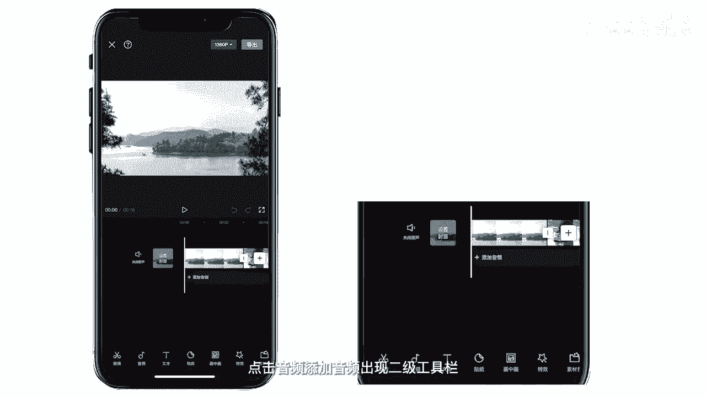
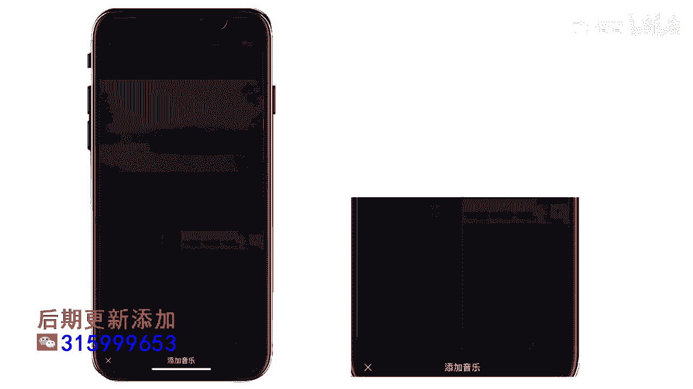
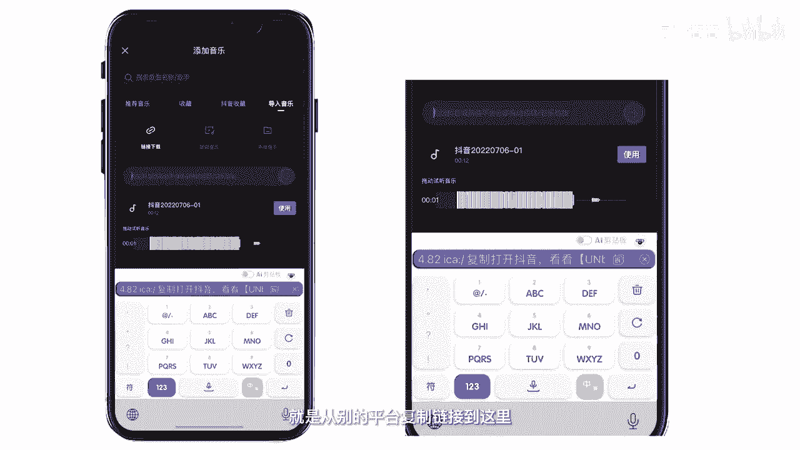
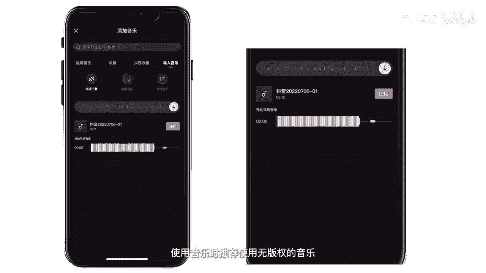
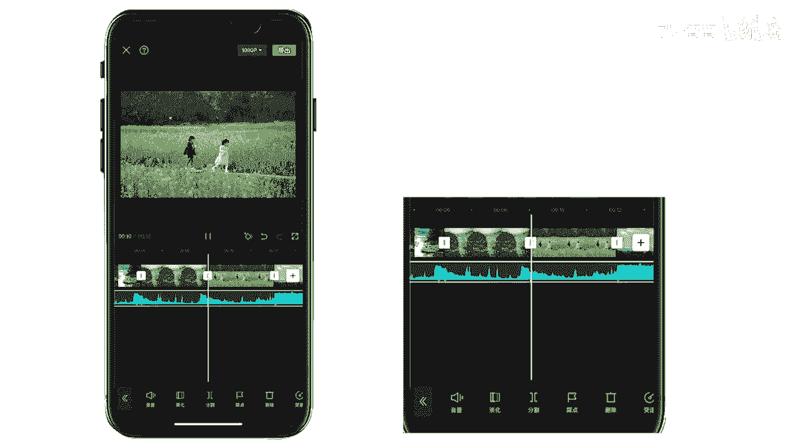

# 045 服装行业流量爆发营，从0-1抖音快速起号解决实体流量问题！ - P60：60 - 60音乐 .mp4- - 早安睿睿 - BV1Kf421R7NA

本讲我来教大家如何插入音频，还会给大家演示如何用音乐做抖音，很火的卡点视频，先演示如何添加音乐，首先将我们想要用到的素材，添加到我们的视频当中。

将素材导入时间线后，点击音频添加音频。

出现二级工具栏，点击音乐。

出现音乐库里面有很多app自带的音乐，使用前先点击下载，下载完成后就可以使用了，然后你看音乐里面的第二个有一个收藏，收藏里是剪映音乐库中的收藏音乐，抖音收藏中是登录账号后同步过来的，抖音音乐库的音乐。

我建议大家收藏一些自己熟悉的音乐，然后方便后期的剪辑。

提高我们的效率，导入音乐就是从别的平台复制链接到这里。

然后进行下载就可以使用了，其他音乐平台的音乐地址，比如说网易云音音乐或者抖音的地址，粘贴下载到这里就可以使用啦，注意使用外部音乐，需要注意音乐版权，使用音乐时推荐使用无版权的音乐。

然后这边有一个提取音乐，可以将视频里的音乐直接提取出来，做我们的背景音乐。

下面我们学习如何添加音效，我们点击音效，这边有很多很多的一个app，自带的音效基本就够用了，合适的音效能够提升你视频的效果，添加方法和添加音乐差不多，先下载，然后就可以使用了，现在就介绍最后一个录音。

点击录音，按住红色的按钮即可录音，松手的话录音就结束了，点击确认，录音就出现在了视频的下方，学习完了，如何添加音频，现在学习如何对音频进行剪辑，点击我们之前导入的音乐，点击音频，点击音量。

默认的音量为100，最高可支持十倍的音量，淡化式音频剪辑中常用的功能，通过添加淡入淡出的效果，可以让你的音频开始和结束的不再突兀，大家感受一下，是不是有一个渐入的效果好，我们再点击分割。

就可以直接把一段音频分割成两段，然后点踩点就可以添加点，这个我们一会儿会仔细的讲，OK点删除就可以直接把这段音频给删除掉，变速可以对音频进行加减速的处理，复制功能可以复制一个当前的音频。

音频操作大概就这么多，下面带大家做一个简单的卡点视频，然后点击添加音频，第一次推荐大家用一些舒缓的音乐节拍，点明显的音乐去做这个卡点视频，因为我们这样更好去找到我们要卡的那个点，点击音乐。

我们使用一个之前我已经选好的一个音乐，放入导入音乐之后，我们可以手动对音频进行标记，点位多位于音频波形图的波峰位置，比如这个地方添加点，如果你标点点错了的话，可以将光标移动到点位置，然后点删除点。

新手呢我推荐大家使用自动踩点点，自动踩点app给了大家两个踩点方式，大家可以都听一遍，这是棋牌一，OK看下结拜二，这个节拍这个节拍的点就比较多了，如果说有很多很多的素材的话，我们可以使用这个。

然后我觉得节拍衣就挺不错的，就用节拍衣吧，选一个最适合你的，踩点结束后，现在我们来调节素材的长度，简单来说，卡点，就是让你的素材刚好在点的位置上进行切换，拖动视频的尾部，素材会自动吸附到点位，很方便。

同理对后面的所有素材进行一个长度的剪辑，然后素材差不多到这个位置停止了，然后我们就把这后面的一段音频就去掉分割，把后面的音频删删除，在这段音频的结尾做一个淡出，可以让我们的视频更舒缓，稍微听一下。

啧我们剪辑完成之后预览一下。

