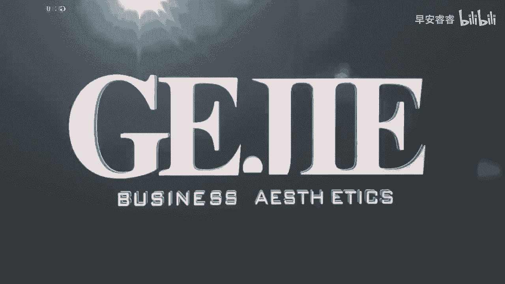

# 045 服装行业流量爆发营，从0-1抖音快速起号解决实体流量问题！ - P61：61 - 61光线优化 .mp4- - 早安睿睿 - BV1Kf421R7NA

光线优化其实就是主光，辅光和背景光，这是可以优化的，三个清晰的点烛光，大家可以理解为给你的人脸单独打亮，是可以能把你打亮的光，可以是自然光，也可以是一个环形灯啊，也可以是个台灯。

这个光可以大幅度的在视觉上做一个提升，假如你在店铺里，灯光一般都不会太明亮，或者是比较杂乱，加一个光放在你和顾客之间，会呈现出完全不一样的感觉，就在你主光布好之后，接下来就是辅光浮光。

顾名思义就是辅助光源，可以帮助打量你的另一侧阴影面，或者打量你的发丝来提升画面质感，然后就是背景光，就是能让人物和背景分离开来的一个光，如果你想保证画面的清晰度，画面颜色的统一，光线当然越简单越好。

学会控制光线也不是越亮越好，简单有层次的光线。